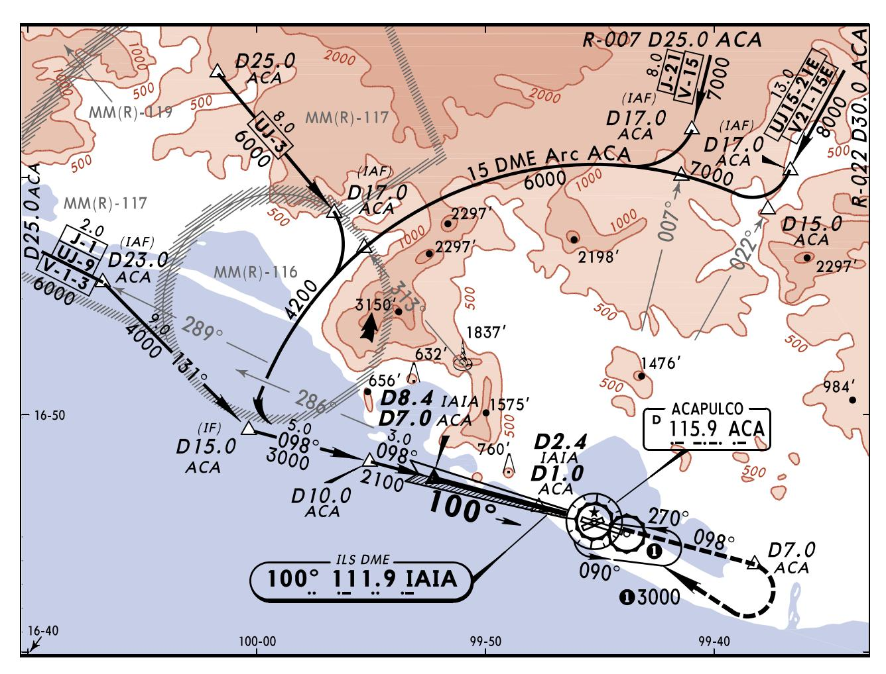

# **INTRODUCTION TO JEPPESEN NAVIGATION CHARTS**

These charts are for training purposes only and are not to be used for flight.

The chart training guide is published as a service for pilots training with Jeppesen charts. It is intended for reference only and includes some of the most commonly used symbology. Not all symbology is included with this guide. This guide is revised regularly; however, some variance may exist between this guide and current chart services. These may be the result of one or more of the following: chart issuance dates, timely application of changes received from governing agencies and / or the method of representing such information. Some of the charts used in this guide are based onafictitious location. The chart training guide has been designed as supplementary training material and is not intended for navigation.

)or complete product information regarding coverages, services, and pricing, please contact:

Jeppesen Sanderson, Inc. Jeppesen \*mbH

55 Inverness 'rive (ast )rankfurter Str. 233

(nglewood, &O 80112-5498 63263 Neu-Isenburg

US\$ \*ermany

Tel: 303.799.9090 Neu-Isenburg Tel:

+49 6102 5070

www.jeppesen.com

# **Jeppesen Alerts, Notices, and Bulletins; Dissemination of Product Related-Information**

Jeppesen is committed to delivering the highest quality and most advanced products and services in the industry. Our ongoing commitment to quality includes using various communication channels to disseminate the latest information that affects the Jeppesen products and services you rely upon.

Updates are posted online at jeppesen.com under "Notices & Alerts." Here you will also find RSS feeds, which are an efficient way to monitor the latest information from Jeppesen. All Notices and Alerts mentioned in this service bulletin can be subscribed to using RSS feed technology. Issues related to our products or services are communicated using one or more standard notification methods. The method we use depends on the product or service as well as the criticality of the communication. The following is a brief description of our notification types:

#### **NavData Alert** 1

NavData Alerts are used to inform commercial NavData subscribers, including airlines, avionics equipment companies, and aviation service providers, of changes and issues related to databases distributed by Jeppesen. Alerts are intended to supplement the NavData Change Notices by disseminating time-critical information that could have a significant affect on flight operations. Alerts contain safety-of-flight or operationally significant information including but not limited to incorrect turn directions, altitudes, bearing changes, etc. This information typically affects Jeppesen's master database; however, each change or issue can be isolated to specific avionics equipment. To determine whether the change or issue affects your database, you should check with your individual avionics equipment manufacturer.

#### **Chart Alert** 1

Chart Alerts are used to quickly disseminate flight critical information that affects Jeppesen's Standard paper or electronic (JeppView) Airway Manual products. Occasionally, changes cannot be issued to customers through our normal paper or electronic production schedules prior to effectivity. Chart Alerts allow Jeppesen to immediately address these changes through either RSS or our website as soon as they come to our attention.

**Retain This Bulletin Until Advised To Destroy**

1 Beginning November 2012, Alerts will only be distributed to our customers through RSS Feeds. To learn more about this subject, please see our 03 Aug 2012 Customer Service Bulletin.

#### **Airport Moving Map (AMM) Alert** 1

Airport Moving Map Alerts are published to advise users of significant issues in Jeppesen Airport Moving Map data that may affect aircraft ground operations. AMM Alerts allow Jeppesen to immediately address these changes through either RSS or our website as soon as they come to our attention.

#### **Obstacle and Terrain Alerts** 1

Obstacle and Terrain Alerts are published to advise users of significant issues in Jeppesen Obstacle or Terrain datasets. Obstacle and Terrain Alerts allow Jeppesen to immediately address these issues through either RSS or our website as soon as they come to our attention.

Issues with obstacles and/or terrain that are displayed in individual products will be distributed in a product-specific alert. For example, an issue with obstacle or terrain data on an approach chart will be distributed in a Chart Alert and may not be distributed in an Obstacle and/or Terrain Alert.

#### **NavData Change Notice** 2

NavData Change Notices are directed at customers who receive Jeppesen NavData for use in avionics equipment and flight planning systems, airline operations, and other systems that provide aviation information. They are published weekly on jeppesen.com under "Notices & Alerts" and in RSS feeds. They include updates and corrections to data and procedures that are not yet reflected in Jeppesen's navigation databases. NavData Change Notices contain narrative explanations of the changes that affect the data coded in Jeppesen's current NavData cycle. Customers who receive an Internet update service from Jeppesen will also receive NavData Change Notices as part of their service.

#### **Chart Change Notice** 2

Chart Change Notices are directed at customers who receive Jeppesen Terminal and Enroute charts. They are included in the revision updates that are mailed to customers and are also posted on jeppesen.com under "Notices & Alerts" and RSS feed. Each notice contains a narrative explanation of changes affecting the current Jeppesen chart. Jeppesen Chart Change Notices highlight only significant changes affecting Jeppesen Charts. A Graphic Chart Change Notice may be issued to depict a more significant change to a Jeppesen Enroute or Area chart. A Chart Change Notice will remain in effect until the chart is to be reissued.

#### **On-Demand Change Notice** 2

On-Demand Change Notices are available on Jeppesen.com in the Main page and under the Notices and Alerts page. They contain the same content that both NavData and Chart Change Notices contain. However, unlike NavData and Chart Change notices, On-Demand Change Notices are updated when our Change Notices Database is updated (near real-time). On-Demand Change Notices also allows the user the ability to search Change Notices for a single Airport or FIR.

1 Beginning November 2012, Alerts will only be distributed to our customers through RSS Feeds. To learn more about this subject, please see our 03 Aug 2012 Customer Service Bulletin.

2 When Charts and/or NavData are intentionally omitted from Jeppesen Airway Manual or NavData respectively, Change Notices will include that information along with the respective revision/cycle that the information will be included.

#### **NavData Notice**

NavData Notices are issued to airframe and avionics equipment manufacturers to announce additional database capabilities or new datasets that will affect the output of navigational data. NavData Notices are intended for Jeppesen's Original Equipment Manufacturer (OEM) partners only. Jeppesen's Product Management department may also issue notices highlighting any changes made to Jeppesen Internet update services, such as data content, modifications to data card sizing, or system-specific information issued by an avionics equipment manufacturer. End users of the data may contact their avionics equipment providers with questions regarding the availability of data in their specific units.

#### **Briefing Bulletin**

Briefing Bulletins provide you with explanations of modifications to Jeppesen products that are being implemented in response to changes suggested by customers or required by governing authorities. In particular, Briefing Bulletins explain how changes will affect Jeppesen's products.

#### **Customer Service Bulletin**

Customer Service Bulletins contain information that educates you on the content of our products and services. Additionally, Customer Service Bulletins may be issued to inform customers about major events where significant short-term changes or restrictions to flight operations will be in effect.

Please note that the Customer Notification Services defined above only refer to Jeppesen products and do not replace State-published NOTAMs.

All communication channels listed above are posted on jeppesen.com under the "Notices & Alerts" section.

We hope this bulletin clarifies the various product and service updates you may receive from Jeppesen. If you have any questions please contact your account representative or customer service at:

| The Americas                         | Europe & Asia                     |  |
|--------------------------------------|-----------------------------------|--|
| 800.621.5377                         | +49 6102 5070                     |  |
| E-mail: captain@jeppesen.com         | E-mail: fra-services@jeppesen.com |  |
| United Kingdom, Middle East & Africa | Australia                         |  |
| +44 1293 842404                      | +61 2 6120 2999                   |  |
| 0800 085 5377 (UK & Ireland)         | E-mail:                           |  |
| E-mail: uk-services@jeppesen.com     | customerservice@jeppesen.com.au   |  |

Sincerely,

Jeppesen Corporate Technical Standards and Product Management

# **BRIEFING BULLETIN** 18 NOV 16 **JEP 16-A** q\$i

## **CHART DESIGN ENHANCEMENTS FOR SIDS, STARS, DEPARTURES, AND ARRIVALS**

#### **PURPOSE**

The purpose of this Bulletin is to announce significant enhancements to the graphical depiction of Jeppesen SID, STAR, Departure, and Arrival charts. In the past, Jeppesen has usedaNot-To-Scale depiction for the graphical section of SID, STAR, Departure, and Arrival charts. Moving forward, the graphic portion of Jeppesen SID, STAR, Departure, and Arrival charts will now be shown either completely or partially To-Scale. In addition, several other major enhancements will be applied which are geared toward continually improving the overall usability of Jeppesen charts. These enhancements are a direct result of feedback received from you, the customer, which Jeppesen greatly appreciates.

#### **PHILOSOPHY**

To enhance terrain/situational awareness during low level operations, the area in and around the departure/ arrival airport will be depicted To-Scale. At times a complete To-Scale depiction will not be practical, in which case Enroute transition segments will be shown Not-to-Scale and will be clearly indicated as such. By using a To-Scale depiction around the departure/arrival airport, Jeppesen SID, STAR, Departure, and Arrival charts will provide enhanced terrain, airspace, and relative distance information.

#### **ENHANCEMENTS**

The sample procedure graphic below depicts the major enhancements being applied to Jeppesen SID, STAR, Departure, and Arrival procedure charts. A brief description of each major improvement is shown after the graphic.

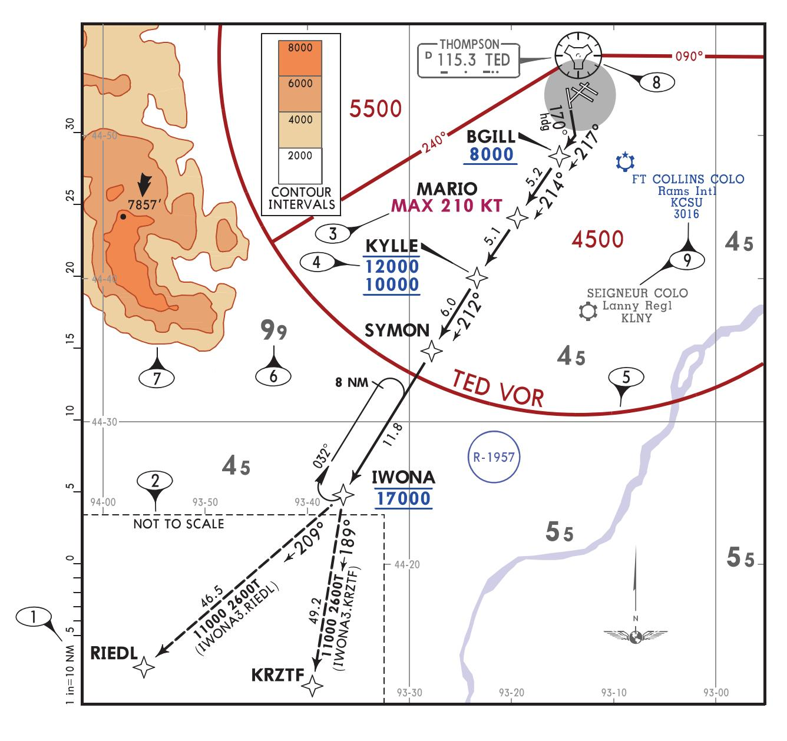

# **JEP 16-A1** 18 NOV 16 **BRIEFING BULLETIN**

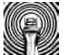

## **CHART DESIGN ENHANCEMENTS FOR SIDS, STARS, DEPARTURES, AND ARRIVALS** q\$i

- 1. Charting scales are applied, similar to what are used for approach charts, which allow a To-Scale depiction of the immediate area around the departure/arrival airport. The scale used is indicated along the lower left side of the procedure graphic. The normal orientation will be north towards the top of the chart, but other orientations will be used when chart readability can be enhanced. All procedure text will be oriented the same as the procedure graphic.
- 2. Normally all departure/arrival tracks will be shown within the To-Scale portion of the procedure graphic. At times, transitions to and from the enroute structure will be shown within Not-To-Scale areas. These Not-To-Scale areas will be indicated by a dashed line and clearly marked. It will be fairly common for transition tracks to crossover between To-Scale and Not-To-Scale areas and vice versa.
- 3. All speed restrictions will now be shown using bold text and a magenta color so as to be easily located. General speed restrictions that apply to the entire procedure will continue to be shown directly below the procedure identifier. Speed restrictions that apply to a specific navaid, intersection/waypoint, or track segment, will be placed next to, or tied to the element as appropriate.
- 4. The depiction of altitude restrictions has been enhanced two ways. All altitude restrictions will be shown in bold text and will be blue in color to make them easy to locate. In addition, a "Line Above" and "Line Below" depiction will be used to indicate the type of restriction using the ICAO recommendation for the depiction of altitude restrictions.
- 5. An MSA will be shown in graphical form within the Plan View of the chart indicating the outer limits, all associated sectors, and applicable sector altitudes. The radius of the MSA will be indicated when other than the standard 25 NM. The MSA information will be brown in color for easy identification.
- 6. Grid MORAs will be charted for the To-Scale areas of the procedure graphic. Values will be shown using a grey color.
- 7. Generalized terrain contours will be depicted within the To-Scale sections of the procedure graphic to portray areas of higher or rising terrain.
- 8. The navaid symbols used will be those that are consistent with Jeppesen enroute charts.
- 9. Airports that are served by the procedure, known as "Also Serves" airports, are depicted using a blue color to distinguish them from other secondary airports. All secondary airports, those not served by the procedure, are depicted using a grey color.

#### **IMPLEMENTATION PLAN**

Jeppesen SID, STAR, Departure, and Arrival charts will be converted using the enhanced charting specifications beginning in December 2016.

Conversion will take place airport-by-airport with all procedures for a given airport released at the same time.

Pilot Training Material is available at www.jeppesen.com/chart-enhancements. This website also provides an Operational Risk Assessment (ORA) for your information.

Inquiries related to this Bulletin may be submitted through established customer support channels or your account representative.

## **ENROUTE/AREA CHARTS - SPECIFICATION CHANGES**

#### **PURPOSE**

The purpose of this Bulletin is to announce changes to the graphical depiction of certain features on Jeppesen Enroute and Area Charts. As Industry Standards evolve and utilization of digital navigation systems progresses, the functional usage of aeronautical paper charts change. Jeppesen strives to keep pace with the usability of Enroute charts. The changes listed below reflect updates to our charts which have been evaluated through customer surveys and are intended to improve the look and usability of Enroute and Area charts.

#### **DEPICTION CHANGES**

The list below provides a brief explanation of each of the major changes being applied to the Enroute and Area charts.

- Chart Panel numbers
  - Current Enroute charts provide panel numbers and letters along the neatline of the chart. In addition, panel numbers and letters are included in Chart Change Notice entries and Airport Communication tabulations.
  - Future Panel information will be removed from the Enroute chart and tabulations. Chart Change Notice entries will instead provide reference coordinates within the text.
- Clearance Approval Agency Special Use Airspace
  - Current Clearance Approval Agencies are provided as part of the Special Use Airspace tabulated information.
  - Future Clearance Approval Agencies will be removed from the tabulated information.
- Route Restrictions
  - Current Depending on the region, Route Restrictions are either provided inalisting in the Jeppesen Airway Manual text pages or they are shown as a Ball Flag Note on the Enroute or Area chart.
  - Future All Route Restrictions will be placed in the Jeppesen Airway Manual Text pages and will be removed from the Enroute or Area chart. The one exception will be non-standard RVSM Flight Levels that will continue to be depicted underneath the charted Airway Designator.
- RVSM Boundaries
  - Current RVSM Boundaries are shown on all Enroute and Area charts indicating the lateral most limits of RVSM Airspace.

• Future–The RVSM boundary itself will be removed from Enroute and Area charts. All RVSM labels will continue to be charted along the respective FIR boundaries indicating where RVSM airspace exists.

- Tabulated Airport Communications sectorization
  - Current In some cases Airport communications may be sectorized within the tabulations. Examples of sectorization include by altitude, runway use or airspace divisions.
  - Future–Sectorization of Airport communications will be provided on the respective Airport charts. That same sectorization information will be removed from all Airport Communication tabulations on Enroute and Area charts.
- Terminal Airspace boundary Japan
  - Current Terminal Control Areas (TMAs) are only shown on Japan 10-1 Area charts.
  - Future–All TMAs will be charted on both Enroute and Area charts using existing specifications for TMA boundaries.
- Terminal Airspace Class label
  - Current Terminal Airspace Class labels are provided in a box within close proximity to the Terminal Airspace boundary.

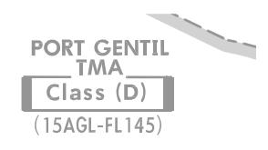

## **ENROUTE/AREA CHARTS - SPECIFICATION CHANGES** q\$i

• Future – Terminal Airspace Class will be removed from the label and will instead be inset within and part of the boundary line.

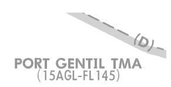

- Time of Operation Tabulations
  - Current Both UTC times and Local times are shown within all charted Special Use Airspace tabulations and the Part Time Terminal Airspace tabulations on US (LO) Enroute and Area Charts. Local Times are charted if specifically provided in source.
  - Future All times shown within the Special Use Airspace tabulations and Part Time Terminal Airspace tabulations will be UTC.
- VOLMET Broadcast frequencies and times
  - Current Select VOLMET broadcast information is shown on some Enroute and Oceanic charts.

| STATION                     | IDENT  | FREQ                  | TRANS PERIOD | TIMES H+             | FORM                   | CONTENTS                                                                           |
|-----------------------------|--------|-----------------------|-----------------|----------------------|------------------------|------------------------------------------------------------------------------------|
| Anchorage, Alaska        | Volmet | 2863 6679          | H24             | 25-30 & 55-00     | Forecast MET Report | Anchorage, Fairbanks, Cold Bay, Vancouver                                       |
|                             |        | 8828 13282         |                 |                      | MET Report             | Elmendorf AFB, King Salmon                                                         |
| Andersen, USA            | Volmet | 8967 11176         | H24             | 15 & 45              | MET Report             | Andersen, Kadena, Yokota                                                           |
| İ                           |        | 4721                  | 0900-2000       | ]                    |                        |                                                                                    |
|                             |        | 6738                  | 0700-2200       |                      |                        |                                                                                    |
|                             |        | 13201                 | 2000-0900       | 1                    |                        |                                                                                    |
|                             |        | 18002                 | 2200-0700       |                      |                        |                                                                                    |
| Auckland, New Zealand | Volmet | 6679 8828 13282 | H24             | 20 (-)25 50 (-)55 | Forecast MET Report | Auckland, Christchurch, Wellington, Nadi, Faleolo, Noumea, Pago Pago, Tahiti |

• Future–All VOLMET broadcast information will be removed from the chart and instead be provided in the Jeppesen Airway Manual text pages.

## **IMPLEMENTATION PLAN**

Jeppesen Enroute and Area charts will begin to be updated with these specification changes starting in the second quarter of 2017.

The conversion of the Enroute and Area Chart library will take place over time considering normal process criteria.

Inquiries related to this Bulletin may be submitted through established customer support channels or your account representative.

### **INTRODUCTION**

## **TABLE OF CONTENTS**

Below is a complete list of the standard contents of Airway Manual. *Limited or special coverages may not contain all items*, but that material which is included should be arranged in the order outlined.

| NAVDATA Table of Contents (NavData)I Aeronautical Information Compatibility (NavData)1 NavData Identifiers on Jeppesen Charts 3 NavData Name Conventions5 NavData Change Notices Service 99 NavData Change Notices – Worldwide Geographic Coverage 101                                                                                                                                                                                                                        |
|-------------------------------------------------------------------------------------------------------------------------------------------------------------------------------------------------------------------------------------------------------------------------------------------------------------------------------------------------------------------------------------------------------------------------------------------------------------------------------------------------|
| AIRPORT QUALIFICATION/FAMILIARIZATION AQ-1                                                                                                                                                                                                                                                                                                                                                                                                                                                      |
| TABLE OF CONTENTSI                                                                                                                                                                                                                                                                                                                                                                                                                                                                              |
| GLOSSARY 1                                                                                                                                                                                                                                                                                                                                                                                                                                                                                      |
| JEPPESEN AIRWAY MANUAL VERSUS EASA AIR OPS ANNEX III PART-ORO EASA AIR OPS-1                                                                                                                                                                                                                                                                                                                                                                                                                    |
| ABBREVIATIONS 41                                                                                                                                                                                                                                                                                                                                                                                                                                                                                |
| APPROACH CHART LEGEND AIRLINE FORMAT AIRLINE FORMAT-1                                                                                                                                                                                                                                                                                                                                                                                                                                           |
| CHARTING SYMBOLS LEGEND SYMBOLS-1 Navaids SYMBOLS-1 Airspace & Boundaries SYMBOLS-3 Airport SYMBOLS-4 Routes & Airways SYMBOLS-7 Airspace Fixes SYMBOLS-8 Lighting Box & Missed Approach SYMBOLS-8 Terrain SYMBOLS-9 Miscellaneous SYMBOLS-10                                                                                                                                                                                                                           |
| ENROUTE CHART LEGEND ENROUTE-1 Enroute Chart Format ENROUTE-1 Heading ENROUTE-1 Coverage Diagram ENROUTE-2 Changes ENROUTE-3 Airspace Limits and Classification ENROUTE-3 Communications ENROUTE-3 Special Use Airspace ENROUTE-4 Reference Notes ENROUTE-4 Cruising Levels ENROUTE-5 Range Scale ENROUTE-5 End Panel ENROUTE-5 Chart Graphic ENROUTE-5 10–1B Chart Legend ENROUTE-8                                                                     |
| SID/DP AND STAR CHART LEGEND SID/STAR-1 Format SID/STAR-1 Heading SID/STAR-1 Briefing Information SID/STAR-2 Minimum Safe or Sector Altitude (MSA) SID/STAR-2 Climb and Routing Instructions Tabulated Text Box SID/STAR-2 Graphic – Information Boxes SID/STAR-3 Graphic – Lost Communications Procedure SID/STAR-3 Graphic – Speed Restrictions SID/STAR-3 Graphic – Starting Point and End Point of STAR, DP, and SID Procedures SID/STAR-3 Graphic SID/STAR-4 |
| AIRPORT CHART LEGEND AIRPORT-1 Format AIRPORT-1 Heading AIRPORT-1 Communications AIRPORT-2 Airport PlanviewAIRPORT-2 Additional Runway Information Band AIRPORT-3 Take-off Minimums AIRPORT-4 Alternate Minimums AIRPORT-5 Chart Boundary Line InformationAIRPORT-5                                                                                                                                                                                                     |

#### **TABLE OF CONTENTS**

| APPROACH CHART LEGENDAPPROACH-1                                                  |  |
|----------------------------------------------------------------------------------|--|
| FormatAPPROACH-1                                                                 |  |
| HeadingAPPROACH-1                                                                |  |
| CommunicationsAPPROACH-2                                                         |  |
| Approach Briefing InformationAPPROACH-2                                          |  |
| Minimum Safe or Sector Altitude (MSA)APPROACH-2                                  |  |
| Approach PlanviewAPPROACH-3                                                      |  |
| Approach Planview – RNAV Procedure DifferencesAPPROACH-4                         |  |
| Approach Planview – Not To Scale InsetsAPPROACH-5                                |  |
| Non-Precision Recommended Altitude Descent TableAPPROACH-5                       |  |
| Approach Profile ViewAPPROACH-6                                                  |  |
| Descent/Timing Conversion Table – Lighting Box – Missed Approach IconsAPPROACH-7 |  |
| Landing MinimumsAPPROACH-8                                                       |  |
| Chart Boundary Line InformationAPPROACH-11                                       |  |
|                                                                                  |  |
| UNITED STATES AIRPORT SIGN SYSTEMS 151                                           |  |
| Mandatory Signs 151                                                              |  |
| Location Signs 151                                                               |  |
| Direction Signs 152                                                              |  |
| Destination Signs 152                                                            |  |
| Information Signs 152                                                            |  |
| Runway Distance Remaining Signs 152                                              |  |
| Examples 153                                                                     |  |
| UNITED STATES INSTRUMENT RUNWAY MARKINGS 156                                     |  |
| Enhanced Taxiway Centerline and Runway Holding Position Markings 158             |  |
|                                                                                  |  |
| ICAO RECOMMENDED AIRPORT SIGNS, RUNWAY AND TAXIWAY MARKINGS 161                  |  |
| Mandatory Instruction Signs 161                                                  |  |
| Information Signs 162                                                            |  |
| Mandatory Instruction Markings 163                                               |  |
| Runway & Intermediate Holding Position Markings 164                              |  |
| Stop Bars/Runway Guard Lights/Runway Markings 165                                |  |
| Threshold/Runway Designation/Runway Centerline Markings/High Speed Taxiway       |  |
| Turn-off Indicator Lights (HSTIL) 166                                            |  |
| Runway Touchdown Zone/Runway Aiming Point Markings 167                           |  |
| Runway Side Stripe Markings 169                                                  |  |
| Displaced Threshold Markings 169                                                 |  |
| Closed Runways, Taxiways or Parts Thereof 169                                    |  |
| Non Load-Bearing Surfaces 169                                                    |  |
| Pre-Threshold Area Marking (Chevron Marking) 170                                 |  |
| CHART LEGEND — EASA AIR OPS AERODROME MINIMUMS (AOM) 171                         |  |
|                                                                                  |  |
| General 171                                                                      |  |
| Take-off Minimums 171                                                            |  |
| Circling Minimums 171                                                            |  |
| Non-Precision Approach Minimums and Chart Profile View 172                       |  |
| CAT I Precision and APV Approach Minimums 173                                    |  |
| Lower than Standard CAT I Minimums 175                                           |  |
| CAT II Precision Approach Minimums 175                                           |  |
| Other than Standard CAT II Precision Approach Minimums 176                       |  |
| CAT III Precision Approach Minimums 176                                          |  |
| Aerodrome Minimums Listing 176                                                   |  |
| Depiction of EASA Air Ops AOM in Case of Existing State Minimums 177             |  |
| VISUAL DOCKING GUIDANCE SYSTEMS (VDGS) 179                                       |  |
|                                                                                  |  |
| NAV2001, AERONAUTICAL INFORMATION NAVDATA DATABASE AND CHARTS 201                |  |
| Preface 201                                                                      |  |
| Effective Dates 202                                                              |  |
| General Differences 202                                                          |  |
| Navaids 203                                                                      |  |
| Waypoints 204                                                                    |  |
| Airways 206                                                                      |  |
| Arrivals and Departures 207                                                      |  |

**INTRODUCTION III** 26 FEB 16

#### **TABLE OF CONTENTS**

| Approach Procedure (Titles and Omitted Procedures) 209 |  |
|--------------------------------------------------------|--|
| Approach Procedures (Plan View) 210                    |  |
| Approach Procedures (Profile) 212                      |  |
| Approach Procedures (Missed Approach) 215              |  |
| Routes on Charts but Not on Databases 216              |  |
| Glossary/Abbreviations 217                             |  |

#### **GLOSSARY**

**This glossary provides definitions that are unique and abbreviations commonly used in Jeppesen publications. No attempt has been made to list all the terms of basic aeronautical nomenclature.**

**Because of the international nature of flying, terms used by the FAA (USA) are included when they differ from International Civil Aviation Organization (ICAO) definitions. A vertical bar, that is omitted on all new pages, tables of contents, tabular listings and graphics, indicates changes.**

#### **DEFINITIONS**

**ACCELERATE STOP DISTANCE AVAILABLE (ASDA) —** The length of the take-off run available plus the length of the stopway, if provided.

**ACROBATIC FLIGHT —** Manoeuvres intentionally performed by an aircraft involving an abrupt change in its attitude, an abnormal attitude, or an abnormal variation in speed.

**ADEQUATE VIS REF (Adequate Visual Reference) —** Runway markings or runway lighting that provides the pilot with adequate visual reference to continuously identify the take-off surface and maintain directional control throughout the take-off run.

**ADS AGREEMENT —** An ADS reporting plan which establishes the conditions of ADS data reporting (i.e., data required by the air traffic services unit and frequency of ADS reports which have to be agreed to prior to the provision of the ADS services).

NOTE: The terms of the agreement will be exchanged between the ground system and the aircraft by means of a contract, or a series of contracts.

**ADS-B —** A surveillance system in which an aircraft or vehicle to be detected is fitted with cooperative equipment in the form of a data link transmitter. The aircraft or vehicle periodically broadcasts its GPS-derived position and other information such as velocity over the data link, which is received by a ground-based transmitter/receiver (transceiver) for processing and display at an air traffic control facility.

**ADS-C AGREEMENT —** A reporting plan which establishes the conditions of ADS-C data reporting (i.e. data required by the air traffic services unit and frequency of ADS-C reports which have to be agreed to prior to using ADS-C in the provision of air traffic services).

NOTE: The terms of the agreement will be exchanged between the ground system and the aircraft by means of a contract, or a series of contracts.

**ADS CONTRACT —** A means by which the terms of an ADS agreement will be exchanged between the ground system and the aircraft, specifying under what conditions ADS reports would be initiated, and what data would be contained in the reports.

NOTE: The term "ADS contract" is a generic term meaning variously, ADS event contract, ADS demand contract, ADS periodic contract or an emergency mode. Ground forwarding of ADS reports may be implemented between ground systems.

**ADVISORY AIRSPACE —** An airspace of defined dimensions, or designated route, within which air traffic advisory service is available.

**ADVISORY ROUTE (ADR) —** A designated route along which air traffic advisory service is available.

NOTE: Air traffic control service provides a much more complete service than air traffic advisory service; advisory areas and routes are therefore not established within controlled airspace, but air traffic advisory service may be provided below and above control areas.

**ADVISORY SERVICE —** Advice and information provided by a facility to assist pilots in the safe conduct of flight and aircraft movement.

**AERODROME —** A defined area on land or water (including any buildings, installations and equipment) intended to be used either wholly or in part for the arrival, departure and surface movement of aircraft.

NOTE: The term "aerodrome" where used in the provisions relating to flight plans and ATS messages is intended to cover also sites other than aerodromes which may be used by certain types of aircraft; e.g., helicopters or balloons.

**AERODROME CLIMATOLOGICAL SUMMARY —** Concise summary of specified meteorological elements at an aerodrome, based on statistical data.

**AERODROME CLIMATOLOGICAL TABLE —** Table providing statistical data on the observed occurrence of one or more meteorological elements at an aerodrome.

**AERODROME CONTROL SERVICE —** Air traffic control service for aerodrome traffic.

**AERODROME CONTROL TOWER —** A unit established to provide air traffic control service to aerodrome traffic.

**AERODROME ELEVATION —** The elevation of the highest point of the landing area.

**AERODROME FLIGHT INFORMATION SERVICE (AFIS) —** A directed traffic information and operational information service provided within an aerodrome flight information zone, to all radio equipped aircraft, to assist in the safe and efficient conduct of flight.

**AERODROME METEOROLOGICAL OFFICE —** An office, located at an aerodrome, designated to provide meteorological service for international air navigation.

**AERODROME REFERENCE CODE —** A simple method for interrelating the numerous specifications concerning the characteristics of aerodromes so as to provideaseries of aerodromes facilities that are suitable for the aeroplanes that are intended to operate at the aerodrome. The aerodrome reference code — code number and letter, which are selected for aerodrome planning purposes, have the meanings assigned to them as indicated in the table below:

| Code Element 1                                                 |                                        | Code Element 2 |                                 |                                 |
|----------------------------------------------------------------|----------------------------------------|----------------|---------------------------------|---------------------------------|
| Code Number                                                 | Aeroplane Reference Field Length | Code Letter | Wing Span                       | Outer Main Gear Wheel Span a)   |
| (1)                                                            | (2)                                    | (3)            | (4)                             | (5)                             |
| 1                                                              | Less than 800m                         | A              | Up to but not including 15m     | Up to but not including 4.5m    |
| 2                                                              | 800m up to but not including 1200m  | B              | 15m up to but not including 24m | 4.5m up to but not including 6m |
| 3                                                              | 1200m up to but not including 1800m | C              | 24m up to but not including 36m | 6m up to but not including 9m   |
| 4                                                              | 1800m and over                         | D              | 36m up to but not including 52m | 9m up to but not including 14m  |
|                                                                |                                        | E              | 52m up to but not including 65m | 9m up to but not including 14m  |
|                                                                |                                        | F              | 65m up to but not including 80m | 14m up to but not including 16m |
| a) Distance between the outside edges of the main gear wheels. |                                        |                |                                 |                                 |

NOTE: Guidance on planning for aeroplanes with wing spans greater than 80m is given in the ICAO Doc. 9157 "Aerodrome Design Manual," Parts 1 and 2.

**AERODROME TRAFFIC —** All traffic on the manoeuvring area of an aerodrome and all aircraft flying in the vicinity of an aerodrome.

NOTE: An aircraft is in the vicinity of an aerodrome when it is in, entering or leaving an aerodrome traffic circuit.

**AERODROME TRAFFIC CIRCUIT —** The specified path to be flown by aircraft operating in the vicinity of an aerodrome.

**AERODROME TRAFFIC FREQUENCY (ATF) —** A frequency designated at an uncontrolled airport. An ATF is used to ensure all radio equipped aircraft operating within the area, normally within a 5NM radius of the airport, are listening on a common frequency. The ATF is normally the ground station frequency. Where a ground station does not exist, a common frequency is designated. Radio call sign is that of the ground station, or where no ground station exists, a broadcast is made with the call sign "Traffic Advisory." Jeppesen charts list the frequency and the area of use when other than the standard 5NM.

**AERODROME TRAFFIC ZONE (ATZ) —** An airspace of detailed dimensions established around an aerodrome for the protection of aerodrome traffic.

**AERONAUTICAL FIXED SERVICE (AFS) —** A telecommunication service between specified fixed points provided primarily for the safety of air navigation and for the regular, efficient and economical operation of air services.

**AERONAUTICAL FIXED STATION —** A station in the aeronautical fixed service.

**AERONAUTICAL FIXED TELECOMMUNICATION NETWORK (AFTN) —** A world-wide system of aeronautical fixed circuits provided, as part of the aeronautical fixed service, for the exchange of messages and/or digital data between aeronautical fixed stations having the same or compatible communications characteristics.

**AERONAUTICAL GROUND LIGHT —** Any light specially provided as an aid to air navigation, other than a light displayed on an aircraft.

**AERONAUTICAL INFORMATION PUBLICATION (AIP) —** A publication issued by or with the authority of a State and containing aeronautical information of a lasting character essential to air navigation.

**AERONAUTICAL METEOROLOGICAL STA-TION —** A station designated to make observations and meteorological reports for use in international air navigation.

**AERONAUTICAL MOBILE SERVICE —** A mobile service between aeronautical stations and aircraft stations, or between aircraft stations, in which survival craft stations may participate; emergency position-indicating radio beacon stations may also participate in this service on designated distress and emergency frequencies.

**AERONAUTICAL RADIO, INCORPORATED (ARINC) —** An international radio network providing air-to-ground communications available on a subscription (fee) basis.

**AERONAUTICAL STATION —** A land station in the aeronautical mobile service. In certain instances, an aeronautical station may be located, for example, on board ship or on a platform at sea.

**AERONAUTICAL TELECOMMUNICATION SER-VICE —** A telecommunication service provided for any aeronautical purpose.

**AERONAUTICAL TELECOMMUNICATION STA-TION —** A station in the aeronautical telecommunication service.

**AIRBORNE COLLISION AVOIDANCE SYSTEM (ACAS) —** An aircraft system based on secondary surveillance radar (SSR) transponder signals which operates independently of ground-based equipment to provide advice to the pilot on potential conflicting aircraft that are equipped with SSR transponders.

**AIRCRAFT —** Any machine that can derive support in the atmosphere from the reactions of the air other than the reactions of the air against the earth's surface.

**AIRCRAFT ADDRESS —** A unique combination of 24 bits available for assignment to an aircraft for the purpose of air-ground communications, navigation and surveillance.

**AIRCRAFT APPROACH CATEGORY (USA TERPS) —** A grouping of aircraft based on a speed of Vref, if specified, or if Vref is not specified, 1.3 VS0 at the maximum certificated landing weight. Vref,

VS0, and the maximum certificated landing weight are those values as established for the aircraft by the certification authority of the country of registry. An aircraft shall fit in only one category. If it is necessary to maneuver at speeds in excess of the upper limit of a speed range for a category, the minimums for the next higher category must be used. For example, an aircraft which falls in Category A, but is circling to land at a speed in excess of 91 knots, should use the approach Category B minimums when circling to land. The categories are as follows:

Category A Speed less than 91KT.

Category B Speed 91KT or more but less than

121KT.

Category C Speed 121KT or more but less

than 141KT.

Category D Speed 141KT or more but less

than 166KT.

Category E Speed 166KT or more.

**AIRCRAFT APPROACH CATEGORY (ICAO) —**

The ICAO table, depicted in the ATC section "Flight Procedures (DOC 8168) Arrival and Approach Procedures", indicates the specified range of handling speeds (IAS in Knots) for each category of aircraft to perform the maneuvers specified. These speed ranges have been assumed for use in calculating airspace and obstacle clearance for each procedure.

**AIRCRAFT IDENTIFICATION —** A group of letters, figures or combination thereof which is either identical to, or the coded equivalent of, the aircraft call sign to be used in air-ground communications, and which is used to identify the aircraft in ground-ground air traffic services communications.

**AIRCRAFT – LARGE AIRCRAFT (LACFT) —** Term used when referring to ICAO aircraft category DL standard dimensions:

- wing span more than 65m/213ft (max 80m/262ft); and/or
- vertical distance between the flight paths of the wheels and the glide path antenna – more than 7m/23ft (max 8m/26ft).

For precision approach procedures, the dimensions of the aircraft are also a factor for the calculation of the OCH.

For category DL aircraft, additional OCA/H is provided, when necessary.

**AIRCRAFT OBSERVATION —** The evaluation of one or more meteorological elements made from an aircraft in flight.

**AIRCRAFT PROXIMITY —** A situation in which, in the opinion of a pilot or air traffic services personnel, the distance between aircraft as well as their relative positions and speed have been such that the safety of the aircraft involved may have been compromised. An aircraft proximity is classified as follows:

**Risk of Collision** — The risk classification of an aircraft proximity in which serious risk of collision has existed.

**Safety not Assured** — The risk classification of an aircraft proximity in which the safety of the aircraft may have been compromised.

**No Risk of Collision** — The risk classification of an aircraft proximity in which no risk of collision has existed.

**Risk not Determined** — The risk classification of an aircraft proximity in which insufficient information was available to determine the risk involved, or inconclusive or conflicting evidence precluded such determination.

**AIRCRAFT STATION —** A mobile station in the aeronautical mobile service, other than a survival craft station, located on board an aircraft.

**AIR DEFENSE IDENTIFICATION ZONE (ADIZ) —** The area of airspace over land or water, extending upward from the surface, within which the ready identification, the location, and the control of aircraft are required in the interest of national security.

**AIR-GROUND COMMUNICATION —** Two-way communication between aircraft and stations or locations on the surface of the earth.

**AIR-GROUND CONTROL RADIO STATION —** An aeronautical telecommunication station having primary responsibility for handling communications pertaining to the operation and control of aircraft in a given area.

**AIRMET INFORMATION —** Information issued by a meteorological watch office concerning the occurrence or expected occurrence of specified en route weather phenomena which may affect the safety of low-level aircraft operations and which was not already included in the forecast issued for low-level flights in the flight information region concerned or sub-area thereof.

**AIRPORT —** An area on land or water that is used or intended to be used for the landing and take-off of aircraft and includes its buildings and facilities, if any.

**AIRPORT ELEVATION/FIELD ELEVATION —** The highest point of an airports usable runways measured in feet from mean sea level. In a few countries, the airport elevation is determined at the airport reference point.

**AIRPORT REFERENCE POINT (ARP) —** A point on the airport designated as the official airport location.

**AIRPORT SURFACE DETECTION EQUIPMENT - MODEL X (ASDE-X) —** A surveillance system using radar, aircraft transponders, satellites, and multilateration to track surface movements of aircraft and vehicles.

**AIRCRAFT SURFACE SURVEILLANCE CAPABIL-ITY (ASSC) —** A surveillance system using multilateration and ADS-B aircraft information to track surface movements of aircraft and vehicles.

**AIRPORT SURVEILLANCE RADAR (ASR) —** Approach control radar used to detect and display an aircraft's position in the terminal area. ASR provides range and azimuth information but does not provide elevation data. Coverage of the ASR can extend up to 60 miles.

**AIRPROX —** The code word used in an air traffic incident report to designate aircraft proximity.

**AIR-REPORT —** A report from an aircraft in flight prepared in conformity with requirements for position and operational and/or meteorological reporting.

NOTE: Details of the AIREP form are given in PANSATM (Doc 4444) and ATC section.

**AIR-TAXIING —** Movement of a helicopter/VTOL above the surface of an aerodrome, normally in ground effect and at a ground speed normally less than 20KT (37kmh).

NOTE: The actual height may vary, and some helicopters may require air-taxiing above 25ft (8m) AGL to reduce ground effect turbulence or provide clearance for cargo slingloads.

**AIR-TO-GROUND COMMUNICATION —** One-way communication from aircraft to stations or locations on the surface of the earth.

**AIR TRAFFIC —** All aircraft in flight or operating on the manoeuvring area of an aerodrome.

**AIR TRAFFIC ADVISORY SERVICE —** A service provided within advisory airspace to ensure separation, in so far as practical, between aircraft which are operating on IFR flight plans.

**AIR TRAFFIC CONTROL ASSIGNED AIRSPACE (ATCAA) —** Airspace of defined vertical/lateral limits, assigned by ATC, for the purpose of providing air traffic segregation between the specified activities being conducted within the assigned airspace and other IFR air traffic.

**AIR TRAFFIC CONTROL CLEARANCE —** Authorization for an aircraft to proceed under conditions specified by an air traffic control unit.

NOTE 1: For convenience, the term "air traffic control clearance" is frequently abbreviated to "clearance" when used in appropriate contexts.

NOTE 2: The abbreviated term "clearance" may be prefixed by the words "taxi," "take-off," "departure," "en route," "approach" or "landing" to indicate the particular portion of flight to which the air traffic control clearance relates.

**AIR TRAFFIC CONTROL INSTRUCTION —** Directives issued by air traffic control for the purpose of requiring a pilot to take a specific action.

**AIR TRAFFIC CONTROL SERVICE —** A service provided for the purpose of:

- a. preventing collisions:
  - 1. between aircraft; and
  - 2. on the manoeuvring area between aircraft and obstructions; and
- b. expediting and maintaining an orderly flow of air traffic.

**AIR TRAFFIC CONTROL UNIT —** A generic term meaning variously, area control centre, approach control office or aerodrome control tower.

**AIR TRAFFIC SERVICE (ATS) —** A generic term meaning variously, flight information service, alerting service, air traffic advisory service, air traffic control service (area control service, approach control service or aerodrome control service).

**AIR TRAFFIC SERVICES AIRSPACES —** Airspaces of defined dimensions, alphabetically designated, within which specific types of flights may operate and for which air traffic services and rules of operation are specified.

NOTE: ATS airspaces are classified as Class "A" to "G."

**AIR TRAFFIC SERVICES REPORTING OFFICE —** A unit established for the purpose of receiving reports concerning air traffic services and flight plans submitted before departure.

NOTE: An air traffic services reporting office may be established as a separate unit or combined with an existing unit, such as another air traffic services unit, or a unit of the aeronautical information service.

**AIR TRAFFIC SERVICES (ATS) ROUTE —** A specified route designated for channeling the flow of traffic as necessary for provision of air traffic services.

NOTE: The term "ATS Route" is used to mean variously, airway, advisory route, controlled or uncontrolled route, arrival or departure route, etc.

**AIR TRAFFIC SERVICES (ATS) ROUTE (USA) —** A generic term that includes 'VOR Federal airways', 'colored Federal airways', 'jet routes', 'Military Training Routes', 'named routes', and 'RNAV routes.'

**AIR TRAFFIC SERVICES UNIT —** A generic term meaning variously, air traffic control unit, flight information centre or air traffic services reporting office.

**AIRWAY (ICAO) —** A control area or portion thereof established in the form of a corridor equipped with radio navigation aids.

**AIRWAY (USA) —** A Class "E" airspace area established in the form of a corridor, the centerline of which is defined by radio navigational aids.

**ALERFA —** The code word used to designate an alert phase.

**ALERT AREA (USA) —** [see SPECIAL USE AIRSPACE (SUA)].

**ALERTING SERVICE —** A service provided to notify appropriate organizations regarding aircraft in need of search and rescue aid, and assist such organizations as required.

**ALERT PHASE —** A situation wherein apprehension exists as to the safety of an aircraft and its occupants.

**ALLOCATION, ALLOCATE —** Distribution of frequencies, SSR Codes, etc. to a State, unit or service, Distribution of 24-bit aircraft addresses to a State or common mark registering authority.

**ALONG TRACK DISTANCE —** The distance measured from a point-in-space by systems using area navigation reference capabilities that are not subject to slant range errors.

**ALPHANUMERIC CHARACTERS (Alphanumerics) —** A collective term for letters and figures (digits). **ALTERNATE AERODROME (ICAO) —** An aerodrome to which an aircraft may proceed when it becomes either impossible or inadvisable to proceed to or to land at the aerodrome of intended landing. Alternate aerodromes include the following:

**Take-Off Alternate** — An alternate aerodrome at which an aircraft can land should this become necessary shortly after take-off and it is not possible to use the aerodrome of departure.

**En Route Alternate** — An aerodrome at which an aircraft would be able to land after experiencing an abnormal or emergency condition while en route.

**Destination Alternate** — An alternate aerodrome to which an aircraft may proceed should it become impossible or inadvisable to land at the aerodrome of intended landing.

NOTE: The aerodrome from which a flight departs may also be an en route or a destination alternate aerodrome for that flight.

**ETOPS En Route Alternate** —Asuitable and appropriate alternate aerodrome at which an aeroplane would be able to land after experiencing an engine shutdown or other abnormal or emergency condition while en route in an ETOPS operation.

**ALTERNATE AIRPORT (USA) —** An airport at which an aircraft may land if a landing at the intended airport becomes inadvisable.

**ALTIMETER SETTING —** The barometric pressure reading used to adjust a pressure altimeter for variations in existing atmospheric pressure or to the standard altimeter setting (29.92 inches of mercury, 1013.2 hectopascals or 1013.2 millibars).

**QFE** — The atmospheric pressure setting which, when set in the aircraft's altimeter, will cause the altimeter to read zero when at the reference datum of the airfield.

**QNE** — The constant atmospheric pressure related to a reference datum of 29.92 inches of mercury or 1013.25 hectopascals or 1013.25 millibars, used for expressing flight levels.

**QNH** — The atmospheric pressure setting which, when set in the aircraft's altimeter, will cause the altimeter to read altitudes referenced to mean sea level.

**ALTITUDE (ICAO) —** The vertical distance of a level, a point, or an object considered as a point, measured from Mean Sea Level (MSL).

**ALTITUDE (USA) —** The height of a level, point or object measured in feet Above Ground Level (AGL) or from Mean Sea Level (MSL).

- a. AGL Altitude Altitude expressed in feet measured above ground level (QFE).
- b. MSL Altitude Altitude expressed in feet measured from mean sea level (QNH).
- c. Indicated Altitude The Altitude as shown by an altimeter. On a pressure barometric altimeter it is altitude as shown uncorrected for instrument error and uncompensated for variation from standard atmospheric conditions.

**APPROACH BAN —** An approach procedure, for which continuation is prohibited beyond a specific point, and or specified height, if the reported visibility or RVR is below the minimum specified for that approach.

**APPROACH CONTROL OFFICE —** A unit established to provide air traffic control service to controlled flights arriving at, or departing from, one or more aerodromes.

**APPROACH CONTROL SERVICE —** Air traffic control service for arriving or departing controlled flights.

**APPROACH CONTROL UNIT —** A unit established to provide air traffic control service to controlled flights arriving at, or departing from, one or more aerodromes.

**APPROACH FUNNEL —** A specified airspace around a nominal approach path within which an aircraft approaching to land is considered to be making a normal approach.

**APPROACH PROCEDURE WITH VERTICAL GUID-ANCE (APV) —** [see INSTRUMENT APPROACH PROCEDURE (IAP)].

**APPROACH SEQUENCE —** The order in which two or more aircraft are cleared to approach to land at the aerodrome.

**APPROPRIATE ATS AUTHORITY —** The relevant authority designated by the State responsible for providing air traffic services in the airspace concerned.

#### **APPROPRIATE AUTHORITY —**

- a. **Regarding flight over the high seas:** The relevant authority of the State of Registry.
- b. **Regarding flight other than over the high seas:** The relevant authority of the State having sovereignty over the territory being overflown.

**APRON —** A defined area, on a land aerodrome, intended to accommodate aircraft for purposes of loading or unloading passengers, mail or cargo, fueling, parking or maintenance.

**AREA CONTROL CENTRE —** A unit established to provide air traffic control service to controlled flights in control areas under its jurisdiction.

**AREA CONTROL SERVICE —** Air traffic control service for controlled flights in control areas.

**AREA MINIMUM ALTITUDE (AMA) —** The minimum altitude to be used under instrument meteorological conditions (IMC), that provides a minimum obstacle clearance within a specified area, normally formed by parallels and meridians.

**AREA NAVIGATION/RNAV —** A method of navigation which permits aircraft operation on any desired flight path within the coverage of the station-referenced navigation aids or within the limits of the capability of self-contained aids, or a combination of these.

**AREA NAVIGATION ROUTE —** An ATS route established for the use of aircraft capable of employing area navigation.

**ARRIVAL ROUTES —** Routes on an instrument approach procedure by which aircraft may proceed from the enroute phase of flight to the initial approach fix.

**ASSIGNMENT, ASSIGN —** Distribution of frequencies to stations. Distribution of SSR Codes or 24-bit addresses to aircraft.

**ATIS — ASOS INTERFACE —** A switch that allows ASOS weather observations to be appended to the ATIS broadcast, making weather information

available on the same (ATIS) frequency H24. When the tower is open, ATIS information and the hourly weather will be broadcast. When the tower is closed, one-minute weather information updates are broadcast, and the controller can add overnight ATIS information to the ASOS automated voice weather message.

**ATS ROUTE —** A specified route designed for channeling the flow of traffic as necessary for the provision of air traffic services.

NOTE 1: The term "ATS route" is used to mean variously, airway, advisory route, controlled or uncontrolled route, arrival or departure route, etc.

NOTE 2: An ATS route is defined by route specifications which include an ATS route designator, the track to or from significant points (way-points), distance between significant points, reporting requirements and, as determined by the appropriate ATS authority, the lowest safe altitude.

**ATS SURVEILLANCE SERVICE —** A term used to indicate a service provided directly by means of an ATS surveillance system.

**ATS SURVEILLANCE SYSTEM —** A generic term meaning variously, ADS-B, PSR, SSR or any comparable ground-based system that enables the identification of aircraft.

NOTE: A comparable ground-based system is one that has been demonstrated, by comparative assessment or other methodology, to have a level of safety and performance equal to or better than monopulse SSR.

**AUTOMATIC DEPENDENT SURVEILLANCE (ADS) —** A surveillance technique, in which aircraft automatically provide, via a data link, data derived from on-board navigation and position fixing systems, including aircraft identification, four-dimensional position and additional data as appropriate.

**AUTOMATIC DEPENDENT SURVEILLANCE — BROADCAST (ADS-B) —** A means by which aircraft, aerodrome vehicles and other objects can automatically transmit and/or receive data such as identification, position and additional data, as appropriate, in a broadcast mode via a data link.

**AUTOMATIC DEPENDENT SURVEILLANCE — CONTRACT (ADS-C) —** A means by which the terms of an ADS-C agreement will be exchanged between the ground system and the aircraft, via a data link, specifying under what conditions ADS-C reports would be initiated, and what data would be contained in the reports.

NOTE: The abbreviated term "ADS" contract is commonly used to refer to ADS event contract, ADS demand contract or an emergency mode.

**AUTOMATIC TERMINAL INFORMATION SERVICE (ATIS) —** The automatic provision of current, routine information to arriving and departing aircraft throughout 24 hours or a specified portion thereof:

- Data link-automatic terminal information service (D-ATIS). The provision of ATIS via data link.
- Voice-automatic terminal information service (Voice-ATIS). The provision of ATIS by means of continuous and repetitive voice broadcasts.

**AUTOMATED SURFACE OBSERVATION SYSTEM**

**(ASOS) —** The Automated Surface Observation System, in the United States, is a surface weather observing system implemented by the National Weather Service, the Federal Aviation Administration and the Department of Defense. It is designed to support aviation operations and weather forecast activities. The ASOS provides continuous minute-by-minute observations and performs the basic observing functions necessary to generate an aviation routine weather report (METAR) and other aviation weather information. ASOS information may be transmitted over a discrete VHF radio frequency or the voice portion of a local navaid.

**AUTOMATED WEATHER OBSERVING SYSTEM (AWOS) —** An automated weather reporting system which transmits local real-time weather data directly to the pilot.

AWOS-A Only reports altimeter setting.

AWOS-A/V Reports altimeter setting plus visibility.

AWOS-1 Usually reports altimeter setting, wind data, temperature, dewpoint and density altitude.

AWOS-2 Reports same as AWOS-1 plus visibility.

AWOS-3 Reports the same as AWOS-2 plus cloud/ceiling data.

**AUTOMATED WEATHER SENSOR SYSTEM (AWSS) —** A surface weather observing system similar to AWOS and ASOS, providing all the weather information furnished by ASOS systems. The AWSS sensor suite automatically collects, measures, processes, and broadcasts surface weather data including altimeter setting, temperature and dew point, cloud height and coverage, visibility, present weather (rain, drizzle, snow), rain accumulation, freezing rain, thunderstorms, fog, mist, haze, freezing fog, as well as wind speed, direction, and gusts.

**BALKED LANDING —** A landing manoeuvre that is unexpectedly discontinued below DA(H)/MDA(H) or beyond MAP.

**BASE TURN —** A turn executed by the aircraft during the initial approach between the end of the outbound track and the beginning of the intermediate or final approach track. The tracks are not reciprocal.

NOTE: Base turns may be designated as being made either in level flight or while descending, according to the circumstances of each individual procedure.

**BLIND TRANSMISSION —** A transmission from one station to another station in circumstances where two-way communication cannot be established but where it is believed that the called station is able to receive the transmission.

**BRAKING ACTION (GOOD, FAIR, POOR, NIL) —** A report of conditions on the airport movement area providing a pilot with a degree/quality of braking that might be expected. Braking action is reported in terms of good, fair, poor, or nil.

**BRIEFING —** Oral commentary on existing and/or expected conditions.

**BROADCAST —** A transmission of information relating to air navigation that is not addressed toaspecific station or stations.

**CARDINAL ALTITUDES OR FLIGHT LEVELS —** "Odd" or "Even" thousand-foot altitudes or flight levels; e.g., 5000, 6000, 7000, FL60, FL250, FL260, FL270.

**CATCH POINT —** A fix/waypoint that serves as a transition point from the high altitude waypoint navigation structure to the low altitude structure or an arrival procedure (STAR).

**CEILING (ICAO) —** The height above the ground or water of the base of the lowest layer of cloud below 6000m (20,000ft) covering more than half the sky.

**CEILING (USA) —** The height above the earth's surface of the lowest layer of clouds or obscuring phenomena that is reported as "broken", "overcast", or "obscuration", and not classified as "thin", or "partial".

**CHANGE-OVER POINT —** The point at which an aircraft navigating on an ATS route segment defined by reference to very high frequency omnidirectional radio ranges is expected to transfer its primary navigational reference from the facility behind the aircraft to the next facility ahead of the aircraft.

NOTE: Change-over points are established to provide the optimum balance in respect of signal strength and quality between facilities at all levels to be used and to ensure a common source of azimuth guidance for all aircraft operating along the same portion of a route segment.

**CHART CHANGE NOTICES —** Jeppesen Chart Change Notices include significant information changes affecting Enroute, Area, and Terminal charts. Entries are published until the temporary condition no longer exists, or until the permanent change appears on revised charts. Enroute chart numbers/panel numbers/letters and area chart identifiers are included for each entry in the enroute portion of the Chart Change Notices. To avoid duplication of information in combined Enroute and Terminal Chart Change Notices, navaid conditions, except for ILS components, are listed only in the Enroute portion of the Chart Change Notices. All times are local unless otherwise indicated. Vertical bars indicate new or revised information. Chart Change Notices are only an abbreviated service. Always ask for pertinent NOTAMs prior to flight.

**CIRCLING APPROACH / CIRCLE-TO-LAND MANEUVER —** An extension of an instrument approach procedure which provides for visual circling of the aerodrome prior to landing.

**CLEARANCE LIMIT —** The point to which an aircraft is granted an air traffic control clearance.

**CLEARWAY —** An area beyond the take-off runway under the control of airport authorities within which terrain or fixed obstacles may not extend above specified limits. These areas may be required for certain turbine-powered operations and the size and upward slope of the clearway will differ depending on when the aircraft was certified.

**CLOUD OF OPERATIONAL SIGNIFICANCE —** A cloud with the height of cloud base below 5000ft (1500m) or below the highest minimum sector altitude, whichever is greater, or a cumulonimbus cloud or a towering cumulus cloud at any height.

**CODE (SSR CODE) —** The number assigned to a particular multiple pulse reply signal transmitted by a transponder in Mode A or Mode C.

**COMMON TRAFFIC ADVISORY FREQUENCY (CTAF) (USA) —** A frequency designed for the purpose of carrying out airport advisory practices while operating to or from an uncontrolled airport. The CTAF may be a UNICOM, Multicom, FSS, or tower frequency.

**COMMUNITY AERODROME RADIO STATION (CARS) —** An aerodrome radio that provides weather, field conditions, accepts flight plans and position reports.

**COMPULSORY REPORTING POINTS —** Reporting points which must be reported to ATC. They are designated on aeronautical charts by solid triangles or filed in a flight plan as fixes selected to define direct routes. These points are geographical locations which are defined by navigation aids/fixes. Pilots should discontinue position reporting over compulsory reporting points when informed by ATC that their aircraft is in "radar contact."

**COMPUTER —** A device which performs sequences of arithmetical and logical steps upon data without human intervention.

NOTE: When the word "computer" is used in this document it may denoteacomputer complex, which includes one or more computers and peripheral equipment.

**CONDITIONAL ROUTES (CDR) (Europe) —** Category 1,2,3.

Category 1: Permanently plannable CDR during designated times.

Category 2: Plannable only during times designated in the Conditional Route Availability Message (CRAM) published at 1500 for the 24 hour period starting at 0600 the next day.

Category 3: Not plannable. Usable only when directed by ATC.

**CONTROL AREA (ICAO) —** A controlled airspace extending upwards from a specified limit above the earth.

**CONTROLLED AERODROME —** An aerodrome at which air traffic control service is provided to aerodrome traffic.

NOTE: The term "controlled aerodrome" indicates that air traffic control service is provided to aerodrome traffic but does not necessarily imply that a control zone exists.

**CONTROLLED AIRSPACE —** An airspace of defined dimensions within which air traffic control service is provided to IFR flights and to VFR flights in accordance with the airspace classification.

NOTE: Controlled airspace is a generic term which covers ATS airspace Classes "A", "B", "C", "D", and "E".

**CONTROLLED FIRING AREA (USA) —** [see SPE-CIAL USE AIRSPACE (SUA)].

**CONTROLLED FLIGHT —** Any flight which is subject to an air traffic control clearance.

**CONTROLLER-PILOT DATA LINK COMMUNICA-TIONS (CPDLC) —** A means of communication between controller and pilot, using data link for ATC communications.

**CONTROL ZONE (CTR) (ICAO) —** A controlled airspace extending upwards from the surface of the earth to a specified upper limit.

#### **COURSE —**

- a. The intended direction of flight in the horizontal plane measured in degrees from north.
- b. The ILS localizer signal pattern usually specified as front course or back course.
- c. The intended track along a straight, curved, or segmented MLS path.

**CRITICAL HEIGHT —** Lowest height in relation to an aerodrome specified level below which an approach procedure cannot be continued in a safe manner solely by the aid of instruments.

**CRUISE CLIMB —** An aeroplane cruising technique resulting in a net increase in altitude as the aeroplane mass decreases.

**CRUISING LEVEL —** A level maintained during a significant portion of a flight.

**CURRENT FLIGHT PLAN (CPL) —** The flight plan, including changes, if any, brought about by subsequent clearances.

**DANGER AREA (ICAO) —** [see SPECIAL USE AIRSPACE (SUA)].

**DATA CONVENTION —** An agreed set of rules governing the manner or sequence in which a set of data may be combined into a meaningful communication.

**DATA LINK COMMUNICATIONS —** A form of communication intended for the exchange of messages via a data link.

**DATA LINK INITIATION CAPABILITY (DLIC) —** A data link application that provides the ability to exchange addresses, names and version numbers necessary to initiate data link applications.

**DEAD RECKONING (DR) NAVIGATION —** The estimating or determining of position by advancing an earlier known position by the application of direction, time and speed data.

**DECISION ALTITUDE (DA) or DECISION HEIGHT (DH) (ICAO) —** A specified altitude or height in the precision approach or approach with vertical guidance at which a missed approach must be initiated if the required visual reference to continue the approach has not been established.

#### NOTE:

a. Decision altitude (DA) is referenced to mean sea level (MSL) and decision height (DH) is referenced to the threshold elevation.

- b. The required visual reference means that section of the visual aids or of the approach area which should have been in view for sufficient time for the pilot to have made an assessment of the aircraft position and rate of change of position, in relation to the desired flight path. In Category III operations with a decision height the required visual reference is that specified for the particular procedure and operation.
- c. For convenience where both expressions are used they may be written in the form "decision altitude/height" and abbreviated "DA/H."

**DECISION ALTITUDE/HEIGHT (DA/H) (FAA) —** Is a specified altitude/height in an instrument approach procedure at which the pilot must decide whether to initiate an immediate missed approach if the pilot does not see the required visual reference, or to continue the approach. Decision altitude/height is expressed in feet above mean sea level/ground level.

NOTE: Jeppesen approach charts use the abbreviation DA(H). The decision altitude "DA" is referenced to mean sea level (MSL) and the parenthetical decision height (DH) is referenced to the TDZE or threshold elevation. A DA(H) of 1440ft (200ft is a Decision Altitude of 1440ft andaDecision Height of 200ft.

**DEPARTURE CLEARANCE VIA DATA LINK (DCL) —** Provides assistance for requesting and delivering information and clearance, with the objective of reducing aircrew and controller workload. The DCL service shall be initiated by the aircrew at a suitable time between Ti and Tt where:

- Ti the earliest time at whichaDCL service can be initiated;
- Tt the latest time after which an aircrew, having not completed the DCL service, is still able to receive by voice procedures and in due time, the vocal departure clearance.

The third time parameter of the DCL acknowledge procedure is T1 where:

T1 – timer implemented in the ATS ground system between the sending by ATS ground system of the DCL clearance message and the reception by it of the read-back of DCL clearance message.

**DEPENDENT PARALLEL APPROACHES —** Simultaneous approaches to parallel or near-parallel instrument runways where radar separation minima between aircraft on adjacent extended runway centre lines are prescribed.

**DETRESFA —** The code word used to designate a distress phase.

**DIRECT ROUTE -** D**1228763652000 —** A requested route published on a Jeppesen Enroute or Area chart to assist pilots who have previous knowledge of acceptance of these routes by ATC. Use of a Direct route may require prior ATC approval and may not provide ATC or Advisory services, or be acceptable in flight plans.

**DISCRETE CODE —** A four-digit SSR Code with the last two digits not being "00."

**DISPLACED THRESHOLD —** A threshold that is located at a point on the runway other than the designated beginning of the runway.

**DISTRESS —** A condition of being threatened by serious and/or imminent danger and of requiring immediate assistance.

**DISTRESS PHASE —** A situation wherein there is a reasonable certainty that an aircraft and its occupants are threatened by grave and imminent danger or require immediate assistance.

**DME DISTANCE —** The line of sight distance (slant range) from the source of a DME signal to the receiving antenna.

#### **EFFECTIVE DATE/TIME —**

**FAA and Canada:** Aeronautical information in the U.S. and its territories is generally effective on the designated effective date at 09:01 Coordinated Universal Time (UTC). The effective time applies to airspace, airways and flight procedures. It allows for implementation between 01:00 and 06:00 local standard time in the U.S. Local authorities may change the date or time of implementation due to local operational considerations. Check NOTAMs and contact local ATC for information.

**International:** The International Civil Aviation Organization (ICAO) guidance specifies that aeronautical information should be effective on the designated effective date at 00:00 Coordinated Universal Time (UTC). However national and local authorities often change the effective time to allow for implementation during the local night or at other times due to local operational considerations. When an effective time other than 00:00 UTC is used, ICAO requires that it be published in the official Aeronautical Information Publication (AIP) of the country. Check NOTAMs and contact local ATC for information.

**ELEVATION —** The vertical distance of a point or a level, on or affixed to the surface of the earth, measured from mean sea level.

**EMERGENCY PHASE —** A generic term meaning, as the case may be, uncertainty phase, alert phase or distress phase.

**ENGINEERED MATERIALS ARRESTING SYSTEM (EMAS) —** High-energy-absorbing material located in the runway overrun that is designed to crush under the weight of an aircraft as the material exerts deceleration forces on the aircraft landing gear.

**ENROUTE FLIGHT ADVISORY SERVICE (FLIGHT WATCH) —** A service specifically designed to provide, upon pilot request, timely weather information pertinent to the type of flight, intended route of flight, and altitude. The FSSs providing this service are indicated on Jeppesen Enroute and Area charts.

**ESTIMATED ELAPSED TIME —** The estimated time required to proceed from one significant point to another.

**ESTIMATED OFF-BLOCK TIME —** The estimated time at which the aircraft will commence movement associated with departure.

**ESTIMATED TIME OF ARRIVAL —** For IFR flights, the time at which it is estimated that the aircraft will arrive over that designated point, defined by reference to navigation aids, from which it is intended that an instrument approach procedure will be commenced, or if no navigation aid is associated with the aerodrome, the time at which the aircraft will arrive over the aerodrome. For VFR flights, the time at which it is estimated that the aircraft will arrive over the aerodrome.

**EXPECTED APPROACH TIME —** The time at which ATC expects that an arriving aircraft, following a delay, will leave the holding point to complete its approach for a landing.

NOTE: The actual time of leaving the holding point will depend upon the approach clearance.

**EXTENDED OPERATION (ETOPS) —** Any flight by an aeroplane with two turbine power-units where the flight time at the one power-unit inoperative cruise speed (in ISA and still air conditions), from a point on the route to an adequate alternate aerodrome, is greater than the threshold time approved by the State of the Operator.

**FAA AIR CARRIER OPERATIONS SPECIFICA-TIONS —** Document issued to users operating under Federal Aviation Administration Regulations (FAR) Parts 121, 125, 127, 129, and 135. Operations Specifications are established and formalized by FARs. The primary purpose of FAA Air Carrier Operations Specifications is to provide a legally enforceable means of prescribing an authorization, limitation and/or procedures for a specific operator. Operations Specifications are subject to expeditious changes. These changes are usually too time critical to adopt through the regulatory process.

**FEEDER FIX —** The fix depicted on instrument approach procedure charts which establishes the starting point of the feeder route.

**FEEDER ROUTE —** Routes depicted on instrument approach procedure charts to designate routes for aircraft to proceed from the enroute structure to the initial approach fix (IAF).

**FILED FLIGHT PLAN (FPL) —** The flight plan as filed with an ATS unit by the pilot or a designated representative, without any subsequent changes.

**FINAL APPROACH COURSE —** A bearing/radial/ track of an instrument approach leading to a runway or an extended runway centerline all without regard to distance.

**FINAL APPROACH (ICAO) —** That part of an instrument approach procedure which commences at the specified final approach fix or point, or where such a fix or point is not specified,

- a. at the end of the last procedure turn, base turn or inbound turn of a racetrack procedure, if specified; or
- b. at the point of interception of the last track specified in the approach procedure; and ends at a point in the vicinity of an aerodrome from which:
  - 1. a landing can be made; or
  - 2. a missed approach procedure is initiated.

**FINAL APPROACH AND TAKE-OFF AREA (FATO) —** A defined area over which the final phase of the approach manoeuvre to hover or landing is completed and from which the take-off manoeuvre is commenced. Where the FATO is to be used by performance Class 1 helicopters, the defined area includes the rejected take-off area available.

**FINAL APPROACH FIX (FAF) —** The fix from which the final approach (IFR) to an airport is executed and which identifies the beginning of the final approach segment. It is designated in the profile view of Jeppesen Terminal charts by the Maltese Cross symbol for non-precision approaches and by the glide slope/path intercept point on precision approaches. The glide slope/path symbol starts at the FAF. When ATC directs a lower-than-published Glide Slope/Path Intercept Altitude, it is the resultant actual point of the glide slope/path intercept.

**FINAL APPROACH FIX (FAF) (AUSTRALIA) —** A specified point on a non-precision approach which identifies the commencement of the final segment. The FAF is designated in the profile view of Jeppesen Terminal charts by the Maltese Cross symbol.

**FINAL APPROACH FIX (FAF) OR POINT (FAP) (ICAO) —** That fix or point of an instrument approach procedure where the final approach segment commences.

**FINAL APPROACH — IFR (USA) —** The flight path of an aircraft which is inbound to an airport on a final instrument approach course, beginning at the final approach fix or point and extending to the airport or the point where a circling approach/circle-to-land maneuver or a missed approach is executed.

**FINAL APPROACH POINT (FAP) (USA) —** The point, applicable only to a non-precision approach with no depicted FAF (such as an on-airport VOR), where the aircraft is established inbound on the final approach course from the procedure turn and where the final approach descent may be commenced. The FAP serves as the FAF and identifies the beginning of the final approach segment.

**FINAL APPROACH POINT (FAP) (AUSTRALIA) —** A specified point on the glide path of a precision instrument approach which identifies the commencement of the final segment.

NOTE: The FAP is co-incident with the FAF of a localizer-based non-precision approach.

**FINAL APPROACH SEGMENT (FAS) —** That segment of an instrument approach procedure in which alignment and descent for landing are accomplished.

**FLIGHT CREW MEMBER —** A licensed crew member charged with duties essential to the operation of an aircraft during flight time.

**FLIGHT DOCUMENTATION —** Written or printed documents, including charts or forms, containing meteorological information for a flight.

**FLIGHT INFORMATION CENTRE —** A unit established to provide flight information service and alerting service.

**FLIGHT INFORMATION REGION (FIR, UIR) —** An airspace of defined dimensions within which Flight Information Service and Alerting Service are provided.

**FLIGHT INFORMATION SERVICE (FIS) —** A service provided for the purpose of giving advice and information useful for the safe and efficient conduct of flights.

**FLIGHT LEVEL (FL) —** A surface of constant atmospheric pressure which is related to a specific pressure datum, 1013.2 hectopascals (hPa), and is separated from other such surfaces by specific pressure intervals.

NOTE 1: A pressure type altimeter calibrated in accordance with the Standard Atmosphere:

- a. when set to a QNH altimeter setting, will indicate altitude;
- b. when set to a QFE altimeter setting, will indicate height above the QFE reference datum;
- c. when set to a pressure of 1013.2 hectopascals (hPa), may be used to indicate flight levels.

NOTE 2: The terms "height" and "altitude," used in NOTE 1 above, indicate altimetric rather than geometric heights and altitudes.

**FLIGHT PATH MONITORING —** The use of ATS surveillance systems for the purpose of providing aircraft with information and advice relative to significant deviations from nominal flight path, including deviations from the terms of their air traffic control clearances.

NOTE: Some applications may require a specific technology, e.g. radar, to support the function of flight path monitoring.

**FLIGHT PLAN —** Specified information provided to air traffic services units, relative to an intended flight or portion of a flight of an aircraft.

NOTE: Specifications for flight plans are contained in ICAO Rules of the Air, Annex 2. A Model Flight Form is contained in ICAO Rules of the Air and Air Traffic Services, PANS-RAC (Doc 4444), Appendix 2 and ATC section.

**FLIGHT VISIBILITY —** The visibility forward from the cockpit of an aircraft in flight.

**FLIGHT WATCH (USA) —** A shortened term for use in air-ground contacts to identify the flight service station providing Enroute Flight Advisory Service; e.g., "Oakland Flight Watch."

**FLOW CONTROL —** Measures designed to adjust the flow of traffic into a given airspace, along a given route, or bound for a given aerodrome, so as to ensure the most effective utilization of the airspace.

**FORECAST —** A statement of expected meteorological conditions for a specified time or period, and for a specified area or portion of airspace.

**GAMET AREA FORECAST —** An area forecast in abbreviated plain language for low-level flights for a flight information region or sub-area thereof, prepared by the meteorological office designated by the meteorological authority concerned and exchanged with meteorological offices in adjacent flight information regions, as agreed between the meteorological authorities concerned.

**GBAS-LANDING SYSTEM (GLS) —** A system for Approach and Landing operations utilizing GNSS, augmented by a Ground-Based Augmentation System (GBAS), as the primary navigational reference.

**GLIDE PATH (GP) (ICAO) —** A descent profile determined for vertical guidance during a final approach.

**GLIDE SLOPE (GS) (USA) —** Provides vertical guidance for aircraft during approach and landing. The glide slope/glidepath is based on the following:

- a. Electronic components emitting signals which provide vertical guidance by reference to airborne instruments during instrument approaches such as ILS/MLS; or
- b. Visual ground aids, such as VASI, which provide vertical guidance for a VFR approach or for the visual portion of an instrument approach and landing.
- c. PAR, used by ATC to inform an aircraft making a PAR approach of its vertical position (elevation) relative to the descent profile.

**GLIDE SLOPE/GLIDE PATH INTERCEPT ALTI-TUDE —** The minimum altitude to intercept the glide slope/path on a precision approach. The intersection of the published intercept altitude with the glide slope/path, designated on Jeppesen Terminal charts by the start of the glide slope/path symbol, is the precision FAF; however, when ATC directs a lower altitude, the resultant lower intercept position is then the FAF.

**GLOBAL NAVIGATION SATELLITE SYSTEMS (GNSS) —** An "umbrella" term adopted by the International Civil Aviation Organization (ICAO) to encompass any independent satellite navigation system used by a pilot to perform onboard position determinations from the satellite data.

**GLOBAL POSITIONING SYSTEM (GPS) —** A space-based radio positioning, navigation, and time-transfer system. The system provides highly accurate position and velocity information, and precise time, on a continuous global basis, to an unlimited number of properly equipped users. The system is unaffected by weather, and provides a worldwide common grid reference system. The GPS concept is predicated upon accurate and continuous knowledge of the spatial position of each satellite in the system with respect to time and distance from a transmitting satellite to the user. The GPS receiver automatically selects appropriate signals from the satellites in view and translates these into a three-dimensional position, velocity, and time. System accuracy for civil users is normally 100 meters horizontally.

**GRID MINIMUM OFF-ROUTE ALTITUDE (Grid MORA) —** An altitude derived by Jeppesen or provided by State Authorities. The Grid MORA altitude provides terrain and man-made structure clearance within the section outlined by latitude and longitude lines. MORA does not provide for navaid signal coverage or communication coverage.

a. Grid MORA values derived by Jeppesen clear all terrain and man-made structures by 1000ft in areas where the highest elevations are 5000ft MSL or lower. MORA values clear all terrain and man-made structures by 2000ft in areas where the highest elevations are 5001ft MSL or higher. When a Grid MORA is shown as "Unsurveyed" it is due to incomplete or insufficient informa-

- tion. Grid MORA values followed by a +/- denote doubtful accuracy, but are believed to provide sufficient reference point clearance.
- b. Grid MORA (State) altitude supplied by the State Authority provides 2000ft clearance in mountainous areas and 1000ft in non-mountainous areas.

**GRID POINT DATA IN DIGITAL FORM —** Computer processed meteorological data for a set of regularly spaced points on a chart, for transmission from a meteorological computer to another computer in a code form suitable for automated use.

NOTE: In most cases such data are transmitted on medium or high speed telecommunications channels.

**GRIP-FLEX MICRO-SURFACING —** A thermoplastic compound that uses highly refined, environmentally safe coal tar derivative for anti-oxidation and fuelresistance qualities to create a stable wearing surface for pavements.

**GROUND COMMUNICATIONS OUTLET (GCO) (USA) —** An unstaffed, remotely controlled ground / ground communications facility. Pilots at uncontrolled airports may contact ATC and FSS via VHF to a telephone connection to obtain an instrument clearance or closeaVFR or IFR flight plan. They may also get an updated weather briefing prior to take-off. Pilots will use four "key clicks" on the VHF radio to contact the appropriate ATC facility, or six "key clicks" to contact FSS. The GCO system is intended to be used only on the ground.

**GROUND EFFECT —** A condition of improved performance (lift) due to the interference of the surface with the airflow pattern of the rotor system when a helicopter or other VTOL aircraft is operating near the ground.

NOTE: Rotor efficiency is increased by ground effect to a height of about one rotor diameter for most helicopters.

**GROUND VISIBILITY —** The visibility at an aerodrome, as reported by an accredited observer.

**HEADING —** The direction in which the longitudinal axis of an aircraft is pointed, usually expressed in degrees from North (true, magnetic, compass or grid).

**HEIGHT —** The vertical distance of a level, a point or an object considered as a point, measured from a specified datum.

**HEIGHT ABOVE AIRPORT (HAA) —** The height of the Minimum Descent Altitude (MDA) above the published airport elevation. This is published in conjunction with circling minimums.

**HEIGHT ABOVE TOUCHDOWN (HAT) —** The height of the Decision Height or Minimum Descent Altitude above the highest runway elevation in the touchdown zone of the runway. HAT is published on instrument approach charts in conjunction with all straight-in minimums.

**HIGH FREQUENCY COMMUNICATIONS —** High radio frequencies (HF) between 3 and 30MHz used for air-to-ground voice communication in overseas operations.

**HIGH SPEED TAXIWAY / TURNOFF (HST) —** A long radius taxiway designed and provided with lighting or marking to define the path of an aircraft, traveling at high speed (up to 60KT), from the runway center to a point on the center of a taxiway. Also referred to as long radius exit or turnoff taxiway. The high speed taxiway is designed to expedite aircraft turning off the runway after landing, thus reducing runway occupancy time.

**HOLDING FIX, HOLDING POINT —** A specified location, identified by visual or other means, in the vicinity of which the position of an aircraft in flight is maintained in accordance with air traffic control clearances.

**HOLD / HOLDING PROCEDURE —** A predetermined maneuver which keeps aircraft within a specified airspace while awaiting further clearance from air traffic control. Also used during ground operations to keep aircraft within a specified area or at a specified point while awaiting further clearance from air traffic control.

**HOT SPOT —** A location on an aerodrome movement area with a history or potential risk of collision or runway incursion, and where heightened attention by pilots/drivers is necessary.

**HUMAN FACTORS PRINCIPLES —** Principles which apply to aeronautical design, certification, training, operations and maintenance and which seek safe interface between the human and other system components by proper consideration to human performance.

**HUMAN PERFORMANCE —** Human capabilities and limitations which have an impact on the safety and efficiency of aeronautical operations.

**IFR FLIGHT —** A flight conducted in accordance with the instrument flight rules.

#### **ILS CATEGORIES (ICAO) —**

- a. ILS Category I An ILS approach procedure which provides for an approach to a decision height not lower than 60m (200ft) and a visibility not less than 800m (2400ft) or a runway visual range not less than 550m (1800ft).
- b. ILS Category II (Special authorization required) — An ILS approach procedure which provides for an approach to a decision height lower than 60m (200ft) but not lower than 30m (100ft) and a runway visual range not less than 300m (1000ft) for aircraft categories A, B, C (D with auto landing), and not less than 350m (1200ft) for aircraft category D without auto landing.
- c. ILS Category III (Special authorization required) —
  - 1. IIIA An ILS approach procedure which provides for approach with either a decision height lower than 30m (100ft) or with no decision height and with a runway visual range of not less than 175m (574ft).
  - 2. IIIB An ILS approach procedure which provides for approach with either a decision height lower than 15m (50ft) or with no decision height and with a runway visual range of less than 175m (574ft) but not less than 50m (150ft).

- 3. IIIC An ILS approach procedure which provides for approach with no decision height and no runway visual range limitations.
- d. Some areas require special authorization for ILS Category I approaches. In these areas, an additional category of approach called ILS is available without special authorization. These ILS approaches have minimums higher than a decision height of 200ft and a runway visual range value of 2600ft. Jeppesen approach charts, at these locations, will have a notation in the chart heading or in the minimum box titles.

#### **ILS CATEGORIES (USA) —**

- a. ILS Category I An ILS approach procedure which provides for approach to a height above touchdown of not less than 200ft and with runway visual range of not less than 1800ft.
- b. ILS Category II An ILS approach procedure which provides for approach to a height above touchdown of not less than 100ft and with runway visual range of not less than 1200ft.
- c. ILS Category III
  - 1. IIIA An ILS approach procedure which provides for approach without a decision height minimum and with runway visual range of not less than 700ft.
  - 2. IIIB An ILS approach procedure which provides for approach without a decision height minimum and with runway visual range of not less than 150ft.
  - 3. IIIC An ILS approach procedure which provides for approach without a decision height minimum and without runway visual range minimum.

**INCERFA —** The code word used to designate an uncertainty phase.

**INDEPENDENT PARALLEL APPROACHES —** Simultaneous approaches to parallel or near-parallel instrument runways where radar separation minima between aircraft on adjacent extended runway centre lines are not prescribed.

**INDEPENDENT PARALLEL DEPARTURES —** Simultaneous departures from parallel or near-parallel instrument runways.

**INITIAL APPROACH FIX (IAF) —** A fix that marks the beginning of the initial segment and the end of the arrival segment, if applicable. In RNAV applications this fix is normally defined by a fly-by waypoint.

**INITIAL APPROACH SEGMENT —** That segment of an instrument approach procedure between the initial approach fix and the intermediate approach fix or, where applicable, the final approach fix or point.

**INSTRUMENT APPROACH PROCEDURE (IAP) —** A series of predetermined manoeuvres by reference to flight instruments with specified protection from obstacles from the initial approach fix, or where applicable, from the beginning of a defined arrival route to a point from which a landing can be completed and thereafter, if a landing is not completed, to a position

at which holding or en-route obstacle clearance criteria apply. Instrument approach procedures are classified as follows:

- Non-precision approach (NPA) procedure. An instrument approach procedure which utilizes lateral guidance but does not utilize vertical guidance.
- Approach procedure with vertical guidance (APV). An instrument approach based on a navigation system that is not required to meet the precision approach standards of ICAO Annex 10 but provides course and glide path deviation information (sometimes referred to as "semi-precision"). Baro-VNAV, LDA with glide path, LNAV/VNAV and LPV are examples of APV approaches.
- Precision approach (PA) procedure. An instrument approach procedure using precision lateral and vertical guidance with minima as determined by the category of operation.

NOTE: Lateral and vertical guidance refers to the guidance provided either by:

- a. a ground-based navigation aid; or
- b. computer-generated navigation data.

**INSTRUMENT DEPARTURE PROCEDURE (DP) (USA) —** A preplanned instrument flight rule (IFR) air traffic control departure procedure printed for pilot use in graphic and/or textual form. DPs provide transition from the terminal to the appropriate enroute structure.

**INSTRUMENT METEOROLOGICAL CONDITIONS (IMC) —** Meteorological conditions expressed in terms of visibility, distance from cloud, and ceiling, less than the minima specified for visual meteorological conditions.

NOTE 1: The specified minima for visual meteorological conditions are contained in ICAO Rules of the Air, Annex 2, Chapter 4.

NOTE 2: In a control zone, a VFR flight may proceed under instrument meteorological conditions if and as authorized by air traffic control.

**INTERMEDIATE APPROACH SEGMENT —** That segment of an instrument approach procedure between either the intermediate approach fix and the final approach fix or point, or between the end of a reversal, racetrack or dead reckoning track procedure and the final approach fix or point, as appropriate.

**INTERMEDIATE FIX (IF) —** A fix that marks the end of an initial segment and the beginning of the intermediate segment. In RNAV applications this fix is normally defined by a fly-by waypoint.

**INTERNATIONAL AIRPORT (ICAO) —** Any airport designated by the Contracting State in whose territory it is situated as an airport of entry and departure for international air traffic, where the formalities incident to customs, immigration, public health, animal and plant quarantine and similar procedures are carried out.

**INTERNATIONAL AIRPORT (USA) —** Relating to international flight, it means:

- a. An airport of entry which has been designated by the Secretary of Treasury or Commissioner of Customs as an international airport for customs service.
- b. A landing rights airport at which specific permission to land must be obtained from customs authorities in advance of contemplated use.
- c. Airports designated under the Convention on International Civil Aviation as an airport for use by international air transport and/or international general aviation.

**INTERNATIONAL AIRWAYS VOLCANO WATCH (IAVW) —** International arrangements for monitoring and providing warnings to aircraft of volcanic ash in the atmosphere.

NOTE: The IAVW is based on the co-operation of aviation and non-aviation operational units using information derived from observing sources and networks that are provided by States. The watch is coordinated by ICAO with the co-operation of other concerned international organizations.

**INTERNATIONAL CIVIL AVIATION ORGANIZA-TION (ICAO) —** A specialized agency of the United Nations whose objective is to develop the principles and techniques of international air navigation and to foster planning and development of international civil air transport.

**LAND AND HOLD SHORT OPERATIONS (LAHSO) —** Operations which include simultaneous take-offs and landings and/or simultaneous landings when a landing aircraft is able and is instructed by the controller to hold short of the intersecting runway / taxiway or designated hold short point. Pilots are expected to promptly inform the controller if the hold short clearance cannot be accepted.

**LANDING AREA —** That part of a movement area intended for the landing or take-off of aircraft.

**LANDING DISTANCE AVAILABLE (LDA) (ICAO) —** The length of runway which is declared available and suitable for the ground run of an airplane landing.

**LATERAL NAVIGATION (LNAV) —** Provides the same level of service as the present GPS stand-alone approaches. LNAV minimums support the following navigation systems: WAAS, when the navigation solution will not support vertical navigation; and, GPS navigation systems which are presently authorized to conduct GPS/GNSS approaches.

**LATERAL NAVIGATION / VERTICAL NAVIGATION (LNAV/VNAV) —** Identifies APV minimums developed to accommodate an RNAV IAP with vertical guidance, usually provided by approach certified Baro-VNAV, but with lateral and vertical integrity limits larger than a precision approach or LPV. LNAV stands for Lateral Navigation; VNAV stands for Vertical Navigation. These minimums can be flown by aircraft with a statement in the Aircraft Flight Manual (AFM) that the installed equipment supports GPS approaches and has an approach-approved barometric VNAV, or if the aircraft has been demonstrated to support LNAV/VNAV approaches. This includes Class 2, 3 and 4 TSO-C146 WAAS equipment. Aircraft using LNAV/VNAV minimums will descend to landing via an internally generated descent path

based on satellite or other approach approved VNAV systems. WAAS equipment may revert to this mode of operation when the signal does not support "precision" or LPV integrity.

**LEVEL —** A generic term relating to the vertical position of an aircraft in flight and meaning variously, height, altitude or flight level.

**LOCAL AIRPORT ADVISORY (LAA) —** A service provided by flight service stations or the military at airports not serviced by an operating control tower. This service consists of providing information to arriving and departing aircraft concerning wind direction and speed, favored runway, altimeter setting, pertinent known traffic, pertinent known field conditions, airport taxi routes and traffic patterns, and authorized instrument approach procedures. This information is advisory in nature and does not constitute an ATC clearance.

**LOCALIZER PERFORMANCE WITH VERTICAL GUIDANCE (LPV) —** Identifies the APV minimums that incorporate electronic lateral and vertical guidance. The lateral guidance is equivalent to localizer, and the protected area is considerably smaller than the protected area for the present LNAV and LNAV/VNAV lateral protection. Aircraft can fly these minimums with a statement in the Aircraft Flight Manual (AFM) that the installed equipment supports LPV approaches. This includes Class 3 and 4 TSO-C146 WAAS equipment, and future LAAS equipment. The label LPV denotes minima lines associated with APV-I or APV-II performance on approach charts.

**LOCATION INDICATOR —** A four-letter code group formulated in accordance with rules prescribed by ICAO and assigned to the location of an aeronautical fixed station.

**LOW ALTITUDE AIRWAY STRUCTURE / FEDERAL AIRWAYS (USA) —** The network of airways serving aircraft operations up to but not including 18,000ft MSL.

**LOW FREQUENCY (LF) —** The frequency band between 30 and 300kHz.

**MAGNETIC VARIATION (VAR) —** The orientation of a horizontal magnetic compass with respect to true north. Because there is a continuous small change of direction of lines of magnetic force over the surface of the earth, magnetic variation at most locations is not constant over long periods of time.

**MANDATORY ALTITUDE —** An altitude depicted on an instrument approach procedure chart requiring the aircraft to maintain altitude at the depicted value.

**MANDATORY FREQUENCY (MF) —** A frequency designated at selected airports that are uncontrolled during certain hours only. Aircraft operating within the designated MF Area, normally 5NM radius of the airport, must be equipped with a functioning radio capable of maintaining two-way communications. Jeppesen charts list the MF frequency and the area when other than the standard 5NM.

**MANOEUVRING AREA —** That part of an aerodrome to be used for the take-off, landing and taxiing of aircraft, excluding aprons.

**MAXIMUM AUTHORIZED ALTITUDE (MAA) —** A published altitude representing the maximum usable altitude or flight level for an airspace structure or route segment.

**MEDIUM FREQUENCY (MF) —** The frequencies between 300kHz and 3MHz.

**METEOROLOGICAL AUTHORITY —** The authority providing or arranging for the provision of meteorological service for international air navigation on behalf of a Contracting State.

**METEOROLOGICAL BULLETIN —** A text comprising meteorological information preceded by an appropriate heading.

**METEOROLOGICAL INFORMATION —** Meteorological report, analysis, forecast, and any other statement relating to existing or expected meteorological conditions.

**METEOROLOGICAL OFFICE —** An office designated to provide meteorological service for international air navigation.

**METEOROLOGICAL REPORT —** A statement of observed meteorological conditions related to a specified time and location.

**METEOROLOGICAL SATELLITE —** An artificial earth satellite making meteorological observations and transmitting these observations to earth.

**MILITARY OPERATIONS AREA (MOA) (USA) —** [see SPECIAL USE AIRSPACE (SUA)].

**MINIMUM CROSSING ALTITUDE (MCA) —** The lowest altitude at certain fixes at which an aircraft must cross when proceeding in the direction of a higher minimum enroute IFR altitude (MEA).

**MINIMUM DESCENT ALTITUDE (MDA) (FAA) —** Is the lowest altitude specified in an instrument approach procedure, expressed in feet above mean sea level, to which descent is authorized on final approach or during circle-to-land maneuvering until the pilot sees the required visual references for the heliport or runway of intended landing.

**MINIMUM DESCENT ALTITUDE (MDA) OR MINI-MUM DESCENT HEIGHT (MDH) (ICAO) —** A specified altitude or height in a non-precision approach or circling approach below which descent must not be made without the required visual reference.

NOTE 1: Minimum descent altitude (MDA) is referenced to mean sea level and minimum descent height (MDH) is referenced to the aerodrome elevation or to the threshold elevation if that is more than 2m (7ft) below the aerodrome elevation. A minimum descent height for a circling approach is referenced to the aerodrome elevation.

NOTE 2: The required visual reference means that section of the visual aids or of the approach area which should have been in view for sufficient time for the pilot to have made an assessment of the aircraft position and rate of change of position, in relation to the desired flight path. In the case of a circling approach the required visual reference is the runway environment.

NOTE 3: For convenience when both expressions are used they may be written in the form "minimum descent altitude/height" abbreviated "MDA/H."

**MINIMUM ENROUTE IFR ALTITUDE (MEA) —** The lowest published altitude between radio fixes that meets obstacle clearance requirements between those fixes and in many countries assures acceptable navigational signal coverage. The MEA applies to the entire width of the airway, segment, or route between the radio fixes defining the airway, segment, or route.

**MINIMUM FUEL —** The term used to describe a situation in which an aircraft's fuel supply has reached a state where little or no delay can be accepted.

NOTE: This is not an emergency situation but merely indicates that an emergency situation is possible, should any undue delay occur.

**MINIMUM IFR ALTITUDES (USA) —** Minimum altitudes for IFR operations are published on aeronautical charts for airways, routes, and for standard instrument approach procedures. Within the USA, if no applicable minimum altitude is prescribed the following minimum IFR altitudes apply.

- a. In designated mountainous areas, 2000ft above the highest obstacle within a horizontal distance of 4NM from the course to be flown; or
- b. Other than mountainous areas, 1000ft above the highest obstacle within a horizontal distance of 4NM from the course to be flown; or
- c. As otherwise authorized by the Administrator or assigned by ATC.

**MINIMUM OBSTRUCTION CLEARANCE ALTI-TUDE (MOCA) —** The lowest published altitude in effect between radio fixes on VOR airways, off airway routes, or route segments which meets obstacle clearance requirements for the entire route segment and in the USA assures acceptable navigational signal coverage only within 22NM of a VOR.

**MINIMUM OFF-ROUTE ALTITUDE (MORA) —** This is an altitude derived by Jeppesen. The MORA provides known obstruction clearance 10NM either side of the route centerline including a 10NM radius beyond the radio fix reporting or mileage break defining the route segment. For terrain and man-made structure clearance refer to Grid MORA.

**MINIMUM RECEPTION ALTITUDE (MRA) —** The lowest altitude at which an intersection can be determined.

**MINIMUM SAFE/SECTOR ALTITUDE (MSA) (FAA) —** Altitude depicted on an instrument chart and identified as the minimum safe altitude which provides 1000ft of obstacle clearance within a 25NM radius from the navigational facility upon which the MSA is predicated. If the radius limit is other than 25NM, it is stated. This altitude is for EMERGENCY USE ONLY and does not necessarily guarantee navaid reception. When the MSA is divided into sectors, with each sector a different altitude, the altitudes in these sectors are referred to as "minimum sector altitudes".

**MINIMUM SECTOR ALTITUDE (MSA) (ICAO) —** The lowest altitude which may be used which will provide a minimum clearance of 300m (1000ft) above all objects located in an area contained within a sector of a circle of 46km (25NM) radius centered on a radio aid to navigation.

**MINIMUM STABILIZATION DISTANCE (MSD) —** The minimum distance to complete a turn manoeuvre and after which a new manoeuvre can be initiated. The minimum stabilization distance is used to compute the minimum distance between waypoints.

**MINIMUM VECTORING ALTITUDE (MVA) —** The lowest MSL altitude at which an IFR aircraft will be vectored by a radar controller, except as otherwise authorized for radar approaches, departures and missed approaches. The altitude meets IFR obstacle clearance criteria. It may be lower than the published MEA along an airway of J-route segment. It may be utilized for radar vectoring only upon the controller's determination that an adequate radar return is being received from the aircraft being controlled.

#### **MISSED APPROACH —**

- a. A maneuver conducted by a pilot when an instrument approach cannot be completed to a landing. The route of flight and altitude are shown on instrument approach procedure charts. A pilot executing a missed approach prior to the Missed Approach Point (MAP) must continue along the final approach to the MAP. The pilot may climb immediately to the altitude specified in the missed approach procedure.
- b. A term used by the pilot to inform ATC that he/she is executing the missed approach.
- c. At locations where ATC radar service is provided the pilot should conform to radar vectors, when provided by ATC, in lieu of the published missed approach procedure.

**MISSED APPROACH HOLDING FIX (MAHF) —** A fix used in RNAV applications that marks the end of the missed approach segment and the centre point for the missed approach holding.

**MISSED APPROACH POINT (MAP) (ICAO) —** That point in an instrument approach procedure at or before which the prescribed missed approach procedure must be initiated in order to ensure that the minimum obstacle clearance is not infringed.

**MISSED APPROACH POINT (MAP) (USA) —** A point prescribed in each instrument approach procedure at which a missed approach procedure shall be executed if the required visual reference does not exist.

**MISSED APPROACH PROCEDURE —** The procedure to be followed if the approach cannot be continued.

**MODE (SSR) —** The conventional identifier related to specific functions of the interrogation signals transmitted by an SSR interrogator. There are four modes specified in ICAO Annex 10 (not published herein): A, C, S and intermode.

**MOUNTAINOUS AREA (ICAO) —** An area of changing terrain profile where the changes of terrain elevation exceed 900m (3000ft) within a distance of 10NM.

**MOVEMENT AREA —** That part of an aerodrome to be used for the take-off, landing and taxiing of aircraft, consisting of the manoeuvring area and the apron(s).

**NEAR-PARALLEL RUNWAYS —** Non-intersecting runways whose extended centre lines have an angle of convergence/divergence of 15 degrees or less.

**NON PRECISION APPROACH (NPA) PROCE-DURE —** [see INSTRUMENT APPROACH PROCE-DURE (IAP)]

**NO PROCEDURE TURN (NoPT) —** No procedure turn is required nor authorized.

**NORMAL OPERATING ZONE (NOZ) —** Airspace of defined dimensions extending to either side of an ILS localizer course and/or MLS final approach track. Only the inner half of the normal operating zone is taken into account in independent parallel approaches.

**NOTAM (ICAO) —** A notice distributed by means of telecommunication containing information concerning the establishment, condition or change in any aeronautical facility, service, procedure or hazard, the timely knowledge of which is essential to personnel concerned with flight operations.

**NO-TRANSGRESSION ZONE (NTZ) —** In the context of independent parallel approaches, a corridor of airspace of defined dimensions located centrally between the two extended runway centre lines, where a penetration by an aircraft requires a controller intervention to manoeuvre any threatened aircraft on the adjacent approach.

**OBSERVATION (METEOROLOGICAL) —** The evaluation of one or more meteorological elements.

**OBSTACLE ASSESSMENT SURFACE (OAS) —** A defined surface intended for the purpose of determining those obstacles to be considered in the calculation of obstacle clearance altitude/height for a specific APV or precision approach procedure.

**OBSTACLE CLEARANCE ALTITUDE (OCA) OR OBSTACLE CLEARANCE HEIGHT (OCH) —** The lowest altitude or the lowest height above the elevation of the relevant runway threshold or the aerodrome elevation as applicable, used in establishing compliance with appropriate obstacle clearance criteria.

NOTE 1: Obstacle clearance altitude is referenced to mean sea level and obstacle clearance height is referenced to the threshold elevation or in the case of non-precision approaches to the aerodrome elevation or the threshold elevation if that is more than 7ft (2m) below the aerodrome elevation. An obstacle clearance height for a circling approach is referenced to the aerodrome elevation.

NOTE 2: For convenience when both expressions are used they may be written in the form "obstacle clearance altitude/height" and abbreviated "OCA/H."

**OBSTACLE FREE ZONE (OFZ) (ICAO) —** The airspace above the inner approach surface, inner transitional surfaces, and balked landing surface and that portion of the strip bounded by these surfaces, which is not penetrated by any fixed obstacle other than a low-mass and frangibly mounted one required for air navigation purposes.

**OBSTRUCTION CLEARANCE LIMIT (OCL) —** The height above aerodrome elevation below which the minimum prescribed vertical clearance cannot be maintained either on approach or in the event of a missed approach.

**OPERATIONAL CONTROL —** The exercise of authority over the initiation, continuation, diversion or termination of a flight in the interest of the safety of the aircraft and the regularity and efficiency of the flight.

**OPERATOR —** A person, organization or enterprise engaged in or offering to engage in an aircraft operation.

**PILOT CONTROLLED LIGHTING (PCL) (USA) —** (For other states see Air Traffic Control Rules and Procedures.)

Radio control of lighting is available at selected airports to provide airborne control of lights by keying the aircraft's microphone. The control system consists of a 3-step control responsive to 7, 5, and/or 3 microphone clicks. The 3-step and 2-step lighting facilities can be altered in intensity. All lighting is illuminated for a period of 15min (except for 1-step and 2-step REILs which may be turned off by keying the mike 5 or 3 times, respectively).

Suggested use is to always initially key the mike 7 times; this assures that all controlled lights are turned on to the maximum available intensity. If desired, adjustment can then be made, where the capability is provided, to a lower intensity (or the REIL turned off) by keying the mike5and/or three times. Approved lighting systems may be activated by keying the mike as indicated below:

| KEY MIKE                    | FUNCTION                    |
|-----------------------------|-----------------------------|
| 7 times within 5 seconds | Highest intensity available |
| 5 times within 5            | Medium or lower intensity   |
| seconds                     | (Lower REIL or REIL Off)    |
| 3 times within 5            | Lowest intensity available  |
| seconds                     | (Lower REIL or REIL Off)    |

Due to the close proximity of airports using the same frequency, radio controlled lighting receivers may be set at a low sensitivity requiring the aircraft to be relatively close to activate the system. Consequently, even when lights are on, always key mike as directed when overflying an airport of intended landing or just prior to entering the final segment of an approach. This will assure the aircraft is close enough to activate the system and a full 15min lighting duration is available.

**PILOT-IN-COMMAND (PIC) —** The pilot responsible for the operation and safety of the aircraft during flight time.

**PITCH POINT —** A fix/waypoint that serves as a transition point from a departure procedure or the low altitude ground-based navigation structure into the high altitude waypoint system.

**POINT-IN-SPACE APPROACH (PinS) —** The point-in-space approach is based on a basic GNSS non-precision approach procedure designed for helicopters only. It is aligned with a reference point located to permit subsequent flight manoeuvring or approach and landing using visual manoeuvring in adequate visual conditions to see and avoid obstacles.

**POINT-IN-SPACE REFERENCE POINT (PRP) —** Reference point for the point-in-space approach as identified by the latitude and longitude of the MAPt.

**PRECISION APPROACH (PA) PROCEDURE —** [see INSTRUMENT APPROACH PROCEDURE (IAP)].

**PRECISION APPROACH RADAR (PAR) —** Primary radar equipment used to determine the position of an aircraft during final approach, in terms of lateral and vertical deviations relative to a nominal approach path, and in range relative to touchdown.

NOTE: Precision approach radars are designated to enable pilots of aircraft to be given guidance by radio communication during the final stages of the approach to land.

#### **PRECISION OBJECT FREE ZONE (POFZ) (FAA)**

**—** A volume of airspace above an area beginning at the runway threshold, at the threshold elevation, and entered on the extended runway centerline. The standard POFZ is 200ft (60m) long and 800ft (240m) wide. The POFZ must be kept clear when an aircraft on a vertically guided final approach is within two nautical miles (NM) of the runway threshold and the reported ceiling is below 250ft and/or visibility less than ¾ statute miles (SM) (or runway visual range below 4000ft). The POFZ is considered clear even if the wing of the aircraft holding on a taxiway waiting for runway clearance penetrates the POFZ; however, neither the fuselage nor the tail may infringe on the POFZ. For approaching aircraft, in the event that a taxiing/parked aircraft or vehicle is not clear of the POFZ, air traffic control will provide advisories to the approaching aircraft regarding the position of the offending aircraft/vehicle. In this case the pilot of the approaching aircraft must decide to continue or abort the approach. When the reported ceiling is below 800ft or visibility less than 2SM, departing aircraft must do the following. When there is an air traffic control tower (ATCT) in operation, plan to hold at the ILS hold line and hold as directed by air traffic control. When there is no operating ATCT, honor the ILS hold line and do not taxi into position and take-off if there is an approaching aircraft within 2NM of the runway threshold.

**PRE-DEPARTURE CLEARANCE (PDC) —** An automated Clearance Delivery system relaying ATC departure clearances from the FAA to the user network computer for subsequent delivery to the cockpit via ACARS (Airline/Aviation VHF data link) where aircraft are appropriately equipped, or to gate printers for pilot pickup.

**PRESSURE ALTITUDE —** An atmospheric pressure expressed in terms of altitude which corresponds to that pressure in the Standard Atmosphere.

**PREVAILING VISIBILITY —** The greatest visibility value, observed in accordance with the definition "visibility", which is reached within at least half the horizon circle or within at least half of the surface of the aerodrome. These areas could comprise contiguous or non-contiguous sectors.

NOTE: This value may be assessed by human observation and/or instrumented systems. When instruments are installed, they are used to obtain the best estimate of the prevailing visibility.

**PRIMARY AREA —** A defined area symmetrically disposed about the nominal flight track in which full obstacle clearance is provided. (See also **SEC-ONDARY AREA**.)

**PRIMARY RADAR —** A radar system which uses reflected radio signals.

**PRIMARY SURVEILLANCE RADAR (PSR) —** A surveillance radar system which uses reflected radio signals.

**PROCEDURE ALTITUDE/HEIGHT —** Are recommended altitudes/heights developed in coordination with Air Traffic Control requirements flown operationally at or above the minimum altitude/height and established to accommodate a stabilized descent at a prescribed descent gradient/angle in the intermediate/final approach segment. Procedure altitudes/heights are never below the Segment Minimum Altitude (SMA) or Segment Minimum Safe Altitude (SMSA).

**PROCEDURE TURN (PT) (ICAO) —** A maneuver in which a turn is made away from a designated track followed by a turn in the opposite direction to permit the aircraft to intercept and proceed along the reciprocal of the designated track.

NOTE 1: Procedure turns are designated "left" or "right" according to the direction of the initial turn.

NOTE 2: Procedure turns may be designated as being made either in level flight or while descending, according to the circumstances of each individual procedure.

**PROCEDURE TURN (PT) (USA) —** The maneuver prescribed when it is necessary to reverse direction to establish an aircraft on the intermediate approach segment or final approach course. The outbound course, direction of turn, distance within which the turn must be completed, and minimum altitude are specified in the procedure. However, unless otherwise restricted, the point at which the turn may be commenced and the type and rate of turn are at the discretion of the pilot.

**PROCEDURE TURN INBOUND —** That point of a procedure turn maneuver where course reversal has been completed and an aircraft is established inbound on the intermediate approach segment or final approach course. A report of "procedure turn inbound" is normally used by ATC as a position report for separation purposes.

**PROFILE —** The orthogonal projection of a flight path or portion thereof on the vertical surface containing the nominal track.

**PROGNOSTIC CHART —** A forecast of a specified meteorological element(s) for a specified time or period and a specified surface or portion of airspace, depicted graphically on a chart.

**PROHIBITED AREA (ICAO) (USA) —** [see SPECIAL USE AIRSPACE (SUA)].

**QFE —** [see ALTIMETER SETTING]

**QNE —** [see ALTIMETER SETTING]

**QNH —** [see ALTIMETER SETTING]

**RACETRACK PROCEDURE (ICAO) —** A procedure designed to enable the aircraft to reduce altitude during the initial approach segment and/or establish the aircraft inbound when the entry into a reversal procedure is not practical.

**RADAR —** A radio detection device which provides information on range, azimuth and/or elevation of objects.

**RADAR APPROACH —** An approach, executed by an aircraft, under the direction of a radar controller.

**RADAR CONTACT —** The situation which exists when the radar position of a particular aircraft is seen and identified on a radar display.

**RADAR SEPARATION —** The separation used when aircraft position information is derived from radar sources.

**RADAR WEATHER ECHO INTENSITY LEVELS —** Existing radar systems cannot detect turbulence. However, there is a direct correlation between the degree of turbulence and other weather features associated with thunderstorms and the radar weather echo intensity. The National Weather Service has categorized radar weather echo intensity for precipitation into six levels. These levels are sometimes expressed during communications as "VIP LEVEL" 1 through 6 (derived from the component of the radar that produces the information — Video Integrator and Processor). The following list gives the "VIP LEVELS" in relation to the precipitation intensity within a thunderstorm:

Level 1. Level 2. Level 3. Level 4. Level 5. Level 6. WEAK MODERATE STRONG VERY STRONG INTENSE EXTREME

**RADIO ALTIMETER / RADAR ALTIMETER —** Aircraft equipment which makes use of the reflection of radio waves from the ground to determine the height of the aircraft above the surface.

**RADIOTELEPHONY —** A form of radio communication primarily intended for the exchange of information in the form of speech.

**RADIOTELEPHONY NETWORK —** A group of radiotelephony aeronautical stations which operate on and guard frequencies from the same family and which support each other in a defined manner to ensure maximum dependability of air-ground communications and dissemination of air-ground traffic.

**REDUCED VERTICAL SEPARATION MINIMUMS (RVSM) —** A reduction in the vertical separation between FL290 – FL410 from 2000ft to 1000ft.

**REGIONAL AIR NAVIGATION AGREEMENT —** Agreement approved by the Council of ICAO normally on the advice of a regional air navigation meeting.

**REPETITIVE FLIGHT PLAN (RPL) —** A flight plan related to a series of frequently recurring, regularly operated individual flights with identical basic features, submitted by an operator for retention and repetitive use by ATS units.

**REPORTING POINT —** A specified geographical location in relation to which the position of an aircraft can be reported.

**REQUIRED NAVIGATION PERFORMANCE (RNP) —** A statement of navigation position accuracy necessary for operation within a defined airspace. RNP is performance-based and not dependent on a specific piece of equipment. RNP includes a descriptive number, the value being an indicator of the size of the containment area (e.g., RNP-0.3, RNP-1, RNP-3, etc.). The different values are assigned to terminal, departure, and enroute operations. Some aircraft have RNP approval in their AFM without a GPS sensor. The lowest level of sensors that the FAA will support for RNP service is DME/DME. However, necessary DME signal may not be available at the airport of intended operations. For those locations having an RNAV chart published with LNAV/VNAV minimums, a procedure note may be provided such as "DME/DME RNP-0.3 NA." This means that RNP aircraft dependent on DME/DME to achieve RNP-0.3 are not authorized to conduct this approach. Where DME facility availability is a factor, the note may read "DME/DME RNP-0.3 authorized; ABC and XYZ required." This means that ABC and XYZ facilities have been determined by flight inspection to be required in the navigation solution to assure RNP-0.3. VOR/DME updating must not be used for approach procedures.

**RESCUE COORDINATION CENTER —** A unit responsible for promoting efficient organization of search and rescue service and for coordinating the conduct of search and rescue operations within a search and rescue region.

**RESCUE UNIT —** A unit composed of trained personnel and provided with equipment suitable for the expeditious conduct of search and rescue.

**RESTRICTED AREA (ICAO) (USA) —** [see SPE-CIAL USE AIRSPACE (SUA)].

**REVERSAL PROCEDURE —** A procedure designed to enable aircraft to reverse direction during the initial approach segment of an instrument approach procedure. The sequence may include procedure turns or base turns.

**REVISION DATE —** Charts revisions are issued on Fridays. Charts are considered effective (usable) upon receipt. With regard to the coverages, charts are issued weekly or bi-weekly.

**RNAV APPROACH —** An instrument approach procedure which relies on aircraft area navigation equipment for navigation guidance.

**RNP TYPE —** A containment value expressed as a distance in nautical miles from the intended position within which flights would be for at least 95 percent of the total flying time.

EXAMPLE: RNP 4 represents a navigation accuracy of plus or minus 7.4km (4NM) on a 95 percent containment basis.

#### **ROUTE MINIMUM OFF-ROUTE ALTITUDE (Route**

**MORA) —** This is an altitude derived by Jeppesen. The Route MORA altitude provides reference point clearance within 10NM of the route centerline (regardless of the route width) and end fixes. Route MORA values clear all reference points by 1000ft in areas where the highest reference points are 5000ft MSL or lower. Route MORA values clear all reference points by 2000ft in areas where the highest reference points are 5001ft MSL or higher. When a Route MORA is shown alongaroute as "unknown" it is due to incomplete or insufficient information.

**RUNWAY —** A defined rectangular area on a land aerodrome prepared for the landing and take-off of aircraft.

**RUNWAY EDGE LIGHTS (ICAO) —** Are provided for a runway intended for use at night or for a precision approach runway intended for use by day or night. Runway edge lights shall be fixed lights showing variable white, except that:

- a. in the case of a displaced threshold, the lights between the beginning of the runway and the displaced threshold shall show red in the approach direction; and
- b. a section of the lights 600m or one-third of the runway length, whichever is the less, at the remote end of the runway from the end at which the take-off run is started, may show yellow.

**RUNWAY EDGE LIGHTS (USA) —** Lights used to outline the edges of runways during periods of darkness or restricted visibility conditions. The light systems are classified according to the intensity or brightness they are capable of producing: they are the High Intensity Runway Lights (HIRL), Medium Intensity Runway Lights (MIRL), and the Low Intensity Runway Lights (RL). The HIRL and MIRL systems have variable intensity controls, where the RLs normally have one intensity setting.

- a. The runway edge lights are white, except on instrument runways amber replaces white on the last 2000ft or half of the runway length, whichever is less, to form a caution zone for landings.
- b. The lights marking the ends of the runway emit red light toward the runway to indicate the end of runway to a departing aircraft and emit green outward from the runway end to indicate the threshold to landing aircraft.

**RUNWAY HOLDING POSITION —** A designated position intended to protect a runway, an obstacle limitation surface, or an ILS/MLS critical/sensitive area at which taxiing aircraft and vehicles shall stop and hold, unless otherwise authorized by the aerodrome control tower.

NOTE: In radiotelephony phraseologies, the expression "holding point" is used to designate the runway holding position.

**RUNWAY INCURSION —** Any occurrence at an aerodrome involving the incorrect presence of an aircraft, vehicle or person on the protected area of a surface designated for the landing and take-off of aircraft.

#### **RUNWAY MARKINGS —**

- a. Basic marking Markings on runways used for operations under visual flight rules consisting of centerline markings and runway direction numbers and, if required, letters.
- b. Instrument marking Markings on runways served by nonvisual navigation aids and intended for landings under instrument weather conditions, consisting of basic marking plus threshold markings.
- c. All-weather (precision instrument) marking Marking on runways served by nonvisual precision approach aids and on runways having special operational requirements, consisting of instrument markings plus landing zone markings and side strips.

**RUNWAY STRIP —** A defined area including the runway and stopway, if provided, intended:

- a. to reduce the risk of damage to aircraft running offarunway; and
- b. to protect aircraft flying over it during take-off or landing operations.

**RUNWAY VISUAL RANGE (RVR) —** The range over which the pilot of an aircraft on the centre line of a runway can see the runway surface markings or the lights delineating the runway or identifying its centre line.

**SAFETY-SENSITIVE PERSONNEL —** Persons who might endanger aviation safety if they perform their duties and functions improperly including, but not limited to, crew members, aircraft maintenance personnel and air traffic controllers.

**SEARCH AND RESCUE SERVICES UNIT —** A generic term meaning, as the case may be, rescue coordination center, rescue subcenter or alerting post.

**SECONDARY AREA —** A defined area on each side of the primary area located along the nominal flight track in which decreasing obstacle clearance is provided. (See also **PRIMARY AREA**).

**SECONDARY RADAR —** A radar system wherein a radio signal transmitted from a radar station initiates the transmission of a radio signal from another station.

**SECONDARY SURVEILLANCE RADAR (SSR) —** A surveillance radar system which uses transmitters/ receivers (interrogators) and transponders.

**SEGMENT MINIMUM ALTITUDE (SMA), or SEG-MENT MINIMUM SAFE ALTITUDE (SMSA) —** An altitude that provides minimum obstacle clearance in each segment of a non-precision approach. Segment minimum (safe) altitudes can be considered "do not descend below" altitudes and can be lower than procedure altitudes which are specifically developed to facilitateaconstant rate or stabilized descent.

**SEGMENTS OF AN INSTRUMENT APPROACH PROCEDURE —** An instrument approach procedure may have as many as four separate segments depending on how the approach procedure is structured.

**ICAO —**

- a. Initial Approach That segment of an instrument approach procedure between the initial approach fix and the intermediate approach fix or, where applicable, the final approach fix or point.
- b. Intermediate Approach That segment of an instrument approach procedure between either the intermediate approach fix and the final approach fix or point, or between the end of a reversal, race track or dead reckoning track procedure and the final approach fix or point, as appropriate.
- c. Final Approach That segment of an instrument approach procedure in which alignment and descent for landing are accomplished.
- d. Missed Approach Procedure The procedure to be followed if the approach cannot be continued.

#### **USA —**

- a. Initial Approach The segment between the initial approach fix and the intermediate fix or the point where the aircraft is established on the intermediate course or final course.
- b. Intermediate Approach The segment between the intermediate fix or point and the final approach fix.
- c. Final Approach The segment between the final approach fix or point and the runway, airport or missed approach point.
- d. Missed Approach The segment between the missed approach point, or point of arrival at decision height, and the missed approach fix at the prescribed altitude.

**SEGREGATED PARALLEL OPERATIONS —** Simultaneous operations on parallel or near-parallel instrument runways in which one runway is used exclusively for approaches and the other runway is used exclusively for departures.

**SELECTIVE CALL SYSTEM (SELCAL) —** A system which permits the selective calling of individual aircraft over radiotelephone channels linkingaground station with the aircraft.

**SHORELINE —** A line following the general contour of the shore, except that in cases of inlets or bays less than 30NM in width, the line shall pass directly across the inlet or bay to intersect the general contour on the opposite side.

**SIDESTEP MANEUVER —** A visual maneuver accomplished by a pilot at the completion of an instrument approach to permit a straight-in landing on a parallel runway not more than 1200ft to either side of the runway to which the instrument approach was conducted.

**SIGMET INFORMATION —** Information issued by a meteorological watch office concerning the occurrence or expected occurrence of specified en route weather phenomena which may affect the safety of aircraft operations.

**SIGNAL AREA —** An area on an aerodrome used for the display of ground signals.

**SIGNIFICANT POINT —** A specified geographical location used in defining an ATS route or the flight path of an aircraft and for other navigation and ATS purposes.

NOTE: There are three categories of significant points: ground-based navigation aid, intersection and waypoint. In the context of this definition, intersection is a significant point expressed as radials, bearings and/or distances from ground-based navigation aids.

**SLUSH —** Water-saturated snow which withaheeland-toe slap-down motion against the ground will be displaced with a splatter; specific gravity: 0.5 up to 0.8.

NOTE: Combinations of ice, snow and/or standing water may, especially when rain, rain and snow, or snow is falling, produce substances with specific gravities in excess of 0.8. These substances, due to their high water/ice content, will have a transparent rather than a cloudy appearance and, at the higher specific gravities, will be readily distinguishable from slush.

#### **SNOW (on the ground) —**

- a. Dry snow. Snow which can be blown if loose or, if compacted by hand, will fall apart upon release; specific gravity: up to but not including 0.35.
- b. Wet snow. Snow which, if compacted by hand, will stick together and tend to or form a snowball; specific gravity: 0.35 up to but not including 0.5.
- c. Compacted snow. Snow which has been compressed intoasolid mass that resists further compression and will hold together or break up into lumps if picked up; specific gravity: 0.5 and over.

**SPECIAL USE AIRSPACE —** Airspace of defined dimensions identified by an area on the surface of the earth wherein activities must be confined because of their nature and/or wherein limitations may be imposed upon aircraft operations that are not a part of those activities. Types of special use airspace are:

- a. Alert Area (USA) Airspace which may contain a high volume of pilot training activities or an unusual type of aerial activity, neither of which is hazardous to aircraft. Alert Areas are depicted on aeronautical charts for the information of nonparticipating pilots. All activities within an Alert Area are conducted in accordance with Federal Aviation Regulations, and pilots of participating aircraft as well as pilots transiting the area are equally responsible for collision avoidance.
- b. Controlled Firing Area (USA) Airspace wherein activities are conducted under conditions so controlled as to eliminate hazards to non participating aircraft and to ensure the safety of persons and property on the ground.
- c. Danger Area (ICAO) An airspace of defined dimensions within which activities dangerous to the flight of aircraft may exist at specified times.
- d. Military Operations Area (MOA) (USA) A MOA is airspace established outside of a Class "A" airspace area to separate or segregate cer-

- tain nonhazardous military activities from IFR traffic and to identify for VFR traffic where these activities are conducted.
- e. Prohibited Area (ICAO) An airspace of defined dimensions, above the land areas or territorial waters of a State, within which the flight of aircraft is prohibited.
  - Prohibited Area (USA)—Airspace designated under FAR Part 73 within which no person may operate an aircraft without the permission of the using agency.
- f. Restricted Area (ICAO) An airspace of defined dimensions, above the land areas or territorial waters of a State, within which the flight of aircraft is restricted in accordance with certain specified conditions.
  - Restricted Area (USA) Airspace designated under Part 73, within which the flight of aircraft, while not wholly prohibited, is subject to restriction. Most restricted areas are designated joint use and IFR/VFR operations in the area may be authorized by the controlling ATC facility when it is not being utilized by the using agency. Restricted areas are depicted on enroute charts. Where joint use is authorized, the name of the ATC controlling facility is also shown.
- g. Warning Area (USA) A warning area is airspace of defined dimensions from 3NM outward from the coast of the United States, that contains activity that may be hazardous to nonparticipating aircraft. The purpose of such warning areas is to warn nonparticipating pilots of the potential danger. A warning area may be located over domestic or international waters or both.

**SPECIAL VFR FLIGHT —** A VFR flight cleared by air traffic control to operate within a control zone in meteorological conditions below VMC.

**STANDARD INSTRUMENT ARRIVAL (STAR) (ICAO) —** A designated instrument flight rule (IFR) arrival route linkingasignificant point, normally on an ATS route, with a point from which a published instrument approach procedure can be commenced.

**STANDARD INSTRUMENT DEPARTURE (SID) (ICAO) —** A designated instrument flight rule (IFR) departure route linking the aerodrome or a specified runway of the aerodrome with a specified point, normally on a designated ATS route, at which the enroute phase of a flight commences.

**STANDARD INSTRUMENT DEPARTURE (SID) (USA) —** A preplanned instrument flight rule (IFR) air traffic control departure procedure printed for pilot use in graphic and/or textual form. SIDs provide transition from the terminal to the appropriate enroute structure.

**STANDARD ISOBARIC SURFACE —** An isobaric surface used on a world-wide basis for representing and analyzing the conditions in the atmosphere.

**STANDARD TERMINAL ARRIVAL ROUTE (STAR) (USA) —** A preplanned instrument flight rule (IFR) air traffic control arrival procedure published for pilot use in graphic and/or textual form. STARs provide transition from the enroute structure to an outer fix or an instrument approach fix/arrival waypoint in the terminal area.

**STATION DECLINATION —** The orientation with respect to true north of VHF transmitted signals. The orientation is originally made to agree with the magnetic variation (an uncontrollable global phenomenon) at the site. Hence station declination (fixed by man) may differ from changed magnetic variation until the station is reoriented.

**STOPWAY —** A defined rectangular area on the ground at the end of take-off run available prepared as a suitable area in which an aircraft can be stopped in the case of an abandoned take-off.

**SUBSTITUTE ROUTE —** A route assigned to pilots when any part of an airway or route is unusable because of navaid status.

**SUNSET AND SUNRISE —** The mean solar times of sunset and sunrise as published in the Nautical Almanac, converted to local standard time for the locality concerned. Within Alaska, the end of evening civil twilight and the beginning of morning civil twilight, as defined for each locality.

**SURFACE MOVEMENT GUIDANCE AND CON-TROL SYSTEM (SMGCS) (USA) —** Provisions for guidance and control or regulation for facilities, information, and advice necessary for pilots of aircraft and drivers of ground vehicles to find their way on the airport during low visibility operations and to keep the aircraft or vehicles on the surfaces or within the areas intended for their use. Low visibility operations for this system means reported conditions of RVR 1200 or less.

**SURVEILLANCE APPROACH (ASR) —** An instrument approach wherein the air traffic controller issues instructions, for pilot compliance, based on aircraft position in relation to the final approach course (azimuth), and the distance (range) from the end of the runway as displayed on the controller's radar scope. The controller will provide recommended altitudes on final approach if requested by the pilot.

**SURVEILLANCE RADAR —** Radar equipment used to determine the position of an aircraft in range and azimuth.

**TAKE-OFF DISTANCE AVAILABLE (TODA) (ICAO) —** The length of the take-off run available plus the length of the clearway, if provided.

**TAKE-OFF RUN AVAILABLE (TORA) (ICAO) —** The length of runway declared available and suitable for the ground run of an airplane taking off.

**TAXIING —** Movement of an aircraft on the surface of an aerodrome under its own power, excluding take-off and landing.

**TAXIWAY —** A defined path on a land aerodrome established for the taxiing of aircraft and intended to providealink between one part of the aerodrome and another, including:

**Aircraft Stand Taxilane** — A portion of an apron designated as a taxiway and intended to provide access to aircraft stands only.

**Apron Taxiway** — A portion of a taxiway system located on an apron and intended to provide a through taxi route across the apron.

**Rapid Exit Taxiway** — A taxiway connected to a runway at an acute angle and designed to allow landing aeroplanes to turn off at higher speeds than are achieved on other exit taxi-ways and thereby minimizing runway occupancy times.

**TERMINAL CONTROL AREA (ICAO) —** A control area normally established at the confluence of ATS routes in the vicinity of one or more major aerodromes.

**TERMINAL ARRIVAL AREA (FAA) / TERMINAL AREA ALTITUDE (TAA) (ICAO) —** Provides a seamless and efficient transition from the enroute structure to the terminal environment to an underlying RNAV instrument approach procedure for FMS and/or GPS equipped aircraft. Minimum altitudes depict standard obstacle clearances compatible with the associated instrument approach procedure. TAAs will not be found on all RNAV procedures, particularly in areas with a heavy concentration of air traffic. When the TAA is published, it replaces the MSA for that approach procedure. A standard racetrack holding pattern may be provided at the center IAF, and if present may be necessary for course reversal and for altitude adjustment for entry into the procedure. In the latter case, the pattern provides an extended distance for the descent as required by the procedure. The published procedure will be annotated to indicate when the course reversal is not necessary when flying within a particular TAA (e.g., "NoPT"). Otherwise, the pilot is expected to execute the course reversal under the provisions of 14 CFR Section 91.175 (USA). The pilot may elect to use the course reversal pattern when it is not required by the procedure, but must inform air traffic control and receive clearance to do so.

**TERMINAL VFR RADAR SERVICE (USA) —** A national program instituted to extend the terminal radar services provided instrument flight rules (IFR) aircraft to visual flight rules (VFR) aircraft. The program is divided into four types of service referred to as basic radar service, terminal radar service area (TRSA) service, Class "B" service and Class "C" service.

- a. Basic Radar Service These services are provided for VFR aircraft by all commissioned terminal radar facilities. Basic radar service includes safety alerts, traffic advisories, limited radar vectoring when requested by the pilot, and sequencing at locations where procedures have been established for this purpose and/or when covered by a letter of agreement. The purpose of this service is to adjust the flow of arriving IFR and VFR aircraft into the traffic pattern in a safe and orderly manner and to provide traffic advisories to departing VFR aircraft.
- b. TRSA Service This service provides, in addition to basic radar service, sequencing of all IFR and participating VFR aircraft to the primary airport and separation between all participating VFR aircraft. The purpose of this service

- is to provide separation between all participating VFR aircraft and all IFR aircraft operating within the area defined as a TRSA.
- c. Class "B" Service This service provides, in addition to basic radar service, approved separation of aircraft based on IFR, VFR, and/or weight, and sequencing of VFR arrivals to the primary airport(s).
- d. Class "C" Service This service provides, in addition to basic radar service, approved separation between IFR and VFR aircraft, and sequencing of VFR aircraft, and sequencing of VFR arrivals to the primary airport.

**TERMINAL RADAR SERVICE AREA (TRSA) (USA) —** Airspace surrounding designated airports wherein ATC provides radar vectoring, sequencing and separation on a full-time basis for all IFR and participating VFR aircraft. Service provided in a TRSA is called Stage III Service. Pilots' participation is urged but is not mandatory.

**THRESHOLD (THR) —** The beginning of that portion of the runway usable for landing.

**THRESHOLD CROSSING HEIGHT (TCH) —** The theoretical height above the runway threshold at which the aircraft's glide slope antenna (or equivalent position) would be if the aircraft maintains the trajectory of the ILS glide slope, MLS glide path or charted descent angle.

**TOTAL ESTIMATED ELAPSED TIME —** For IFR flights, the estimated time required from take-off to arrive over that designated point, defined by reference to navigation aids, from which it is intended that an instrument approach procedure will be commenced, or, if no navigation aid is associated with the destination aerodrome, to arrive over the destination aerodrome. For VFR flights, the estimated time required from take-off to arrive over the destination aerodrome.

**TOUCHDOWN —** The point where the nominal glide path intercepts the runway.

NOTE: "Touchdown" as defined above is only a datum and is not necessarily the actual point at which the aircraft will touch the runway.

**TOUCHDOWN ZONE ELEVATION (TDZE) —** The highest elevation in the first 3000ft of the landing surface.

**TRACK —** The projection on the earth's surface of the path of an aircraft, the direction of which path at any point is usually expressed in degrees from North (true, magnetic or grid).

**TRAFFIC ALERT AND COLLISION AVOIDANCE SYSTEM (TCAS) —** An airborne collision avoidance system based on radar beacon signals which operates independent of ground-based equipment.

TCAS-I generates traffic advisory only;

TCAS-II generates traffic advisories, and resolution (collision avoidance) advisories in the vertical plane.

**TRAFFIC AVOIDANCE ADVICE —** Advice provided by an air traffic services unit specifying manoeuvres to assist a pilot to avoidacollision.

**TRAFFIC INFORMATION —** Information issued by an air traffic services unit to alert a pilot to other known or observed air traffic which may be in proximity to the position or intended route of flight and to help the pilot avoidacollision.

**TRANSITION ALTITUDE (TA) —** The altitude in the vicinity of an airport at or below which the vertical position of an aircraft is controlled by reference to altitudes (MSL).

**TRANSITION HEIGHT —** The height in the vicinity of an airport at or below which the vertical position of an aircraft is expressed in height above the airport reference datum.

**TRANSITION LAYER —** The airspace between the transition altitude and the transition level. Aircraft descending through the transition layer will use altimeters set to local station pressure, while departing aircraft climbing through the layer will be using standard altimeter setting (QNE) of 29.92 inches of Mercury, 1013.2 millibars, or 1013.2 hectopascals.

**TRANSITION LEVEL (TL) —** The lowest flight level available for use above the transition altitude.

**TROPICAL CYCLONE —** Generic term for a non-frontal synoptic-scale cyclone originating over tropical or sub-tropical waters with organized convection and definite cyclonic surface wind circulation.

**TROPICAL CYCLONE ADVISORY CENTRE (TCAC) —** A meteorological centre designated by regional air navigation agreement to provide advisory information to meteorological watch offices, world area forecast centres and international OPMET databanks regarding the position, forecast direction and speed of movement, central pressure and maximum surface wind of tropical cyclones.

**TURN ANTICIPATION —** Turning maneuver initiated prior to reaching the actual airspace fix or turn point that is intended to keep the aircraft within established airway or route boundaries.

**UNCERTAINTY PHASE —** A situation wherein uncertainty exists as to the safety of an aircraft and its occupants.

**UNMANNED FREE BALLOON —** A non-powerdriven, unmanned, lighter-than-air aircraft in free flight.

NOTE: Unmanned free balloons are classified as heavy, medium or light in accordance with specifications contained in ICAO Rules of the Air, Annex 2, Appendix 4.

**UPPER-AIR CHART —** A meteorological chart relating to a specified upper-air surface or layer of the atmosphere.

**URGENCY —** A condition concerning the safety of an aircraft or other vehicle, or of some person on board or within sight, but which does not require immediate assistance.

**VECTORING —** Provision of navigational guidance to aircraft in the form of specific headings, based on the use of an ATS surveillance system.

**VERTICAL NAVIGATION (VNAV) —** That function of RNAV equipment which provides guidance in the vertical plane.

**VERTICAL PATH ANGLE (VPA) (ICAO) —** Angle of the published final approach descent in Baro-VNAV procedures.

**VERTICAL PATH ANGLE (VPA) (USA) —** The descent angle shown on some non-precision approaches describing the geometric descent path from the Final approach fix (FAF), or on occasion from an intervening stepdown fix, to the Threshold Crossing Height (TCH). This angle may or may not coincide with the angle projected by a Visual Glide Slope Indicator (VASI, PAPI, PLASI, etc.)

**VERY HIGH FREQUENCY (VHF) —** The frequencies between 30MHz and 300MHz (200MHz – 3GHz is considered as UHF in the Aviation).

**VFR FLIGHT —** A flight conducted in accordance with the visual flight rules.

**VIBAL —** (Visibilité Balise) Is the method whereby a human observer (or pilot in take-off position) determines the RVR by counting specific markers adjacent to the runway or by counting runway edge lights.

**VISIBILITY (ICAO) —** The ability, as determined by atmospheric conditions and expressed in units of distance, to see and identify prominent unlighted objects by day and prominent lighted objects by night.

- a. Flight Visibility The visibility forward from the cockpit of an aircraft in flight.
- b. Ground Visibility The visibility at an aerodrome as reported by an accredited observer.
- c. Runway Visual Range (RVR) The range over which the pilot of an aircraft on the centerline of a runway can see the runway surface markings or the lights delineating the runway or identifying its centerline.

**VISIBILITY (USA) —** The ability, as determined by atmospheric conditions and expressed in units of distance, to see and identify prominent unlighted objects by day and prominent lighted objects by night. Visibility is reported as statute or nautical miles, hundreds of feet or meters.

- a. Flight Visibility The average forward horizontal distance, from the cockpit of an aircraft in flight, at which prominent unlighted objects may be seen and identified by day and prominent lighted objects may be seen and identified by night.
- b. Ground Visibility Prevailing horizontal visibility near the earth's surface as reported by the United States National Weather Service or an accredited observer.
- c. Prevailing Visibility The greatest horizontal visibility equaled or exceeded throughout at least half the horizon circle which need not necessarily be continuous.
- d. Runway Visibility Value (RVV) The visibility determined for a particular runway by a transmissometer. A meter provides a continuous indication of the visibility (reported in miles or fractions of miles) for the runway. RVV is used in lieu of prevailing visibility in determining minimums foraparticular runway.

- e. Runway Visual Range (RVR) An instrumentally derived value, based on standard calibrations, that represents the horizontal distance a pilot will see down the runway from the approach end; it is based on the sighting of either high intensity runway lights or on the visual contrast of other targets whichever yields the greater visual range. RVR, in contrast to prevailing or runway visibility, is based on what a pilot in a moving aircraft should see looking down the runway. RVR is horizontal visual range, not slant visual range. It is based on the measurement of a transmissometer made near the touchdown point of the instrument runway and is reported in hundreds of feet. RVR is used in lieu of RVV and/or prevailing visibility in determining minimums for a particular runway.
  - 1. Touchdown RVR The RVR visibility readout values obtained from RVR equipment serving the runway touchdown zone.
  - 2. Mid-RVR The RVR readout values obtained from RVR equipment located midfield of the runway.
  - 3. Rollout RVR The RVR readout values obtained from RVR equipment located nearest the rollout end of the runway.

**VISUAL APPROACH (ICAO) —** An approach by an IFR flight when either part or all of an instrument approach procedure is not completed and the approach is executed in visual reference to terrain.

**VISUAL APPROACH (USA) —** An approach conducted on an instrument flight rules (IFR) flight plan which authorizes the pilot to proceed visually and clear of clouds to the airport. The pilot must, at all times, have either the airport or the preceding aircraft in sight. This approach must be authorized and under the control of the appropriate air traffic control facility. Reported weather at the airport must be ceiling at or above 1000ft and visibility of 3 miles or greater.

**VISUAL DESCENT POINT (VDP) —** A defined point on the final approach course of a non-precision straight-in approach procedure from which normal descent from the MDA to the runway touchdown point may be commenced, provided the approach threshold of that runway, or approach lights, or other markings identifiable with the approach end of that runway are clearly visible to the pilot.

**VISUAL MANOEUVRING (CIRCLING) AREA —** The area in which obstacle clearance should be taken into consideration for aircraft carrying out a circling approach.

**VISUAL METEOROLOGICAL CONDITIONS (VMC) —** Meteorological conditions expressed in terms of visibility, distance from cloud, and ceiling equal to or better than specified minima.

NOTE: The specified minima are contained in ICAO Rules of the Air, Annex 2, Chapter 4.

**VOLMET BROADCAST —** Routine broadcast of meteorological information for aircraft in flight.

**VOLCANIC ASH ADVISORY CENTRE (VAAC) —** A meteorological centre designated by regional air navigation agreement to provide advisory information to meteorological watch offices, area control centres, flight information centres, world area forecast centres, relevant regional area forecast centres and international OPMET data banks regarding the lateral and vertical extent and forecast movement of volcanic ash in the atmosphere following volcanic eruptions.

**VOLMET BROADCAST —** Provision of current aerodrome meteorological reports (METAR) and special meteorological reports (SPECI), aerodrome forecasts (TAF), SIGMET by means of continuous and repetitive voice broadcasts for aircraft in flight.

**VOLMET DATA LINK SERVICE (D-VOLMET) —** Provision of current METAR, SPECI, TAF, SIGMET, special air-reports not covered by SIGMET and, where available, AIRMET via data link.

**WARNING AREA (USA) —** [see SPECIAL USE AIRSPACE (SUA)].

**WAYPOINT —** A specified geographical location used to define an area navigation route or the flight path of an aircraft employing area navigation. Waypoints are identified as either:

**Fly-by waypoint** — A fly-by waypoint requires the use of turn anticipation to avoid overshoot of the next flight segment; or

**Fly-over waypoint** —Afly-over waypoint precludes any turn until the waypoint is overflown and is followed by an intercept maneuver of the next flight segment.

**WEATHER SYSTEMS PROCESSOR (WSP) —** An add-on weather processor to selected Airport Surveillance Radar (ASR)-9 facilities that adds Doppler weather radar capability and provides wind shear and microburst warnings. The system gives controllers timely and accurate warnings for relaying to pilots via radio communications. The WSP also provides controllers with thunderstorm cell locations and movement as well as the predicted future position and intensity of wind shifts that may affect airport operations. The system can also process precipitation data to reduce false severe weather reports caused by anomalous propagation.

**WIDE AREA AUGMENTATION SYSTEM (WAAS) —** WAAS is a navigation system developed for civil aviation that provides extremely accurate horizontal and vertical navigation for all classes of aircraft in all phases of flight - including enroute navigation, airport departures, and airport arrivals. This includes vertically-guided landing approaches in instrument meteorological conditions at all qualified locations.

**WORLD AREA FORECAST CENTRE (WAFC) —** A meteorological centre designated to prepare and issue significant weather forecasts and upper-air forecasts in digital and/or pictorial form on a global basis direct States by appropriate means as part of the aeronautical fixed service.

**WORLD AREA FORECAST SYSTEM (WAFS) —** A world-wide system by which world area forecast centres provide aeronautical meteorological en-route forecasts in uniform standardized formats.

| DEFINITIONS    |                                                        | AH       | Alert Height                                     |
|----------------|--------------------------------------------------------|----------|--------------------------------------------------|
|                |                                                        | AHP      | Army Heliport                                    |
| A/A            | Air to Air                                             | AIRAC    | Aeronautical Information                         |
| AAF            | Army Air Field                                         |          | Regulation and Control                           |
| AAIM           | Aircraft Autonomous Integrity                          | AIREP    | Air-Report                                       |
|                | Monitoring                                             | AIS      | Aeronautical Information Services                |
| AAIS           | Automated Aerodrome Information Service             | ALA      | Aircraft Landing Area                            |
| AAL            | Above Aerodrome Level                                  | ALF      | Auxiliary Landing Field                          |
| AAS            | Airport Advisory Service                               | ALS      | Approach Light System                            |
| AAU            | Authorized Approach UNICOM                             | ALS      | Low Intensity Approach Lights                    |
| AB             | Air Base                                               | ALT      | Altitude                                         |
| ABM            | Abeam                                                  | ALTN     | Alternate                                        |
| ABN            | Aerodrome Beacon                                       | AMA      | Area Minimum Altitude                            |
| AC             | Air Carrier                                            | AMSL     | Above Mean Sea Level                             |
| ACA            | Arctic Control Area                                    | ANGB     | Air National Guard Base                          |
| ACA            | Approach Control Area                                  | AOC      | Aircraft Operator Certificate                    |
| ACAS           | Airborne Collision Avoidance                           | AOE      | Airport/Aerodrome of Entry                       |
|                | System                                                 | AOM      | Airport Operating Minimums                       |
| ACARS          | Airborne Communications                                | AOR      | Area of Responsibility                           |
| ACC            | Addressing and Reporting System Area Control Center | APAPI    | Abbreviated Precision Approach Path Indicator |
| ACFT           | Aircraft                                               | APC      | Area Positive Control                            |
| ACN            | Aircraft Classification Number                         | APCH     | Approach                                         |
| AD             | Aerodrome                                              | APP      | Approach Control                                 |
| ADA            | Advisory Area                                          | APT      | Airport                                          |
| ADF            | Automatic Direction Finding                            | APV      | Approach Procedure with Vertical                 |
| ADIZ           | Air Defense Identification Zone                        |          | Guidance                                         |
| ADNL           | Additional                                             | AR       | Authorization Required                           |
| ADR            | Advisory Route                                         | ARB      | Air Reserve Base                                 |
| ADS            | Automatic Dependent Surveillance                       | ARINC    | Aeronautical Radio, Inc.                         |
| ADS-B          | Automatic Dependent                                    | ARO      | Aerodrome Reporting Officer                      |
|                | Surveillance-Broadcast                                 | ARP      | Airport Reference Point                          |
| ADV            | Advisory Area                                          | ARR      | Arrival                                          |
| AEIS           | Aeronautical Enroute Information                       | ARTCC    | Air Route Traffic Control Center                 |
|                | Service                                                | ASDA     | Accelerate Stop Distance Available               |
| AER AERADIO | Approach End of Runway Air Radio                    | ASDE-X   | Airport Surface Detection Equipment - Model X |
| AERO           | Aerodrome                                              | ASMGCS   | Advanced Surface Movement                        |
| AF Aux         | Air Force Auxiliary Field                              |          | Guidance and Control System                      |
| AFB            | Air Force Base                                         | ASOS     | Automated Surface Observing System            |
| AFIS           | Aerodrome Flight Information                           | ASR      | Airport Surveillance Radar                       |
| AFIS           | Service Automatic Flight Information                | ASSC     | Airport Surface Surveillance Capability       |
|                | Services (FAA)                                         | ATA      | Actual Time of Arrival                           |
| AFLD           | Airfield                                               | ATCAA    | Air Traffic Control Assigned                     |
| AFN            | American Forces Network                                |          | Airspace                                         |
| AFRS           | Armed Forces Radio Stations                            | ATCC     | Air Traffic Control Center                       |
| AFRU           | Aerodrome Frequency Response Unit                   | ATCT     | Air Traffic Control Tower                        |
| AFS            | Air Force Station                                      | ATD      | Actual Time of Departure                         |
| AFSS           | Automated Flight Service Station                       | ATF      | Aerodrome Traffic Frequency                      |
| A/G            | Air-to-Ground                                          | ATFM     | Air Traffic Flow Management                      |
| AGL            | Above Ground Level                                     | ATIS     | Automatic Terminal Information                   |
| AGNIS          | Azimuth Guidance Nose-in-Stand                         | ATND SKD | Service Attended Scheduled Hours              |
|                |                                                        |          |                                                  |

**42 INTRODUCTION** 28 AUG 15

| ATS       | Air Traffic Service                         | CH      | Channel                                               |
|-----------|---------------------------------------------|---------|-------------------------------------------------------|
| ATZ       | Aerodrome Traffic Zone                      | CH      | Critical Height                                       |
| AU        | Approach UNICOM                             | CHGD    | Changed                                               |
| AUP       | Airspace Utilization Plane                  | CL      | Centerline Lights                                     |
| AUTH      | Authorized                                  | CMNPS   | Canadian Minimum Navigation                           |
| AUW       | All-Up Weight                               | CMV     | Performance Specification Converted Met Visibility |
| AUX       | Auxiliary                                   | CNF     | Computer Navigation Fix                               |
| AVBL      | Available                                   | CO      | County                                                |
| AWIB      | Aerodrome Weather Information Broadcast  | COMLO   | Compass Locator                                       |
| AWIS      | Aerodrome Weather Information               | COMMS   | Communications                                        |
|           | Service                                     | CONT    | Continuous                                            |
| AWOS      | Automated Weather Observing                 | CONTD   | Continued                                             |
|           | System                                      | COORDS  | Coordinates                                           |
| AWSS      | Aviation Weather Sensor System              | COP     | Change Over Point                                     |
| AWY       | Airway                                      | CORR    | Corridor                                              |
| AZM       | Azimuth                                     | CP      | Command Post                                          |
| Baro VNAV | Barometric Vertical Navigation              | CPDLC   | Controller Pilot Data Link                            |
| BC        | Back Course                                 |         | Communications                                        |
| BCM       | Back Course Marker                          | Cpt     | Clearance (Pre-Taxi Procedure)                        |
| BCN       | Beacon                                      | CRC     | Cyclical Redundancy Check                             |
| BCOB      | Broken Clouds or Better                     | CRP     | Compulsory Reporting Point                            |
| BCST      | Broadcast                                   | CRS     | Course                                                |
| BDRY      | Boundary                                    | CST     | Central Standard Time                                 |
| BLDG      | Building                                    | CTA     | Control Area                                          |
| BM        | Back Marker                                 | CTAF    | Common Traffic Advisory                               |
| BRG       | Bearing                                     |         | Frequency                                             |
| B-RNAV    | Basic RNAV                                  | CTL     | Control                                               |
| BS        | Broadcast Station (Commercial)              | CTOT    | Calculated Take-off Time                              |
| C         | ATC IFR Flight Plan Clearance               | CTR     | Control Zone                                          |
|           | Delivery Frequency                          | CVFP    | Charted Visual Flight Procedure                       |
| C         | Converted Met Visibility                    | CVFR    | Controlled VFR                                        |
| CADIZ     | Canadian Air Defense Identification Zone | D       | Day                                                   |
| CAE       | Control Area Extension                      | DA      | Decision Altitude                                     |
| CA/GRS    | Certified Air/Ground Radio Service          | DA (H)  | Decision Altitude (Height)                            |
| CANPA     | Constant Angle Non-Precision                | D-ATIS  | Digital ATIS                                          |
|           | Approach                                    | DCL     | Data Link Departure Clearance Service              |
| CARS      | Community Aerodrome Radio Station        | DCT     | Direct                                                |
| CAT       | Category                                    | DECMSND | Decommissioned                                        |
| CBA       | Cross Border Area                           | DEG     | Degree                                                |
| CCN       | Chart Change Notices                        | DEP     | Departure Control/Departure                           |
| CDFA      | Continuous Descent Final                    |         | Procedures                                            |
|           | Approach                                    | DER     | Departure End of Runway                               |
| CDI       | Course Deviation Indicator                  | DEWIZ   | Distance Early Warning Identification Zone         |
| CDR       | Conditional Route                           | DF      | Direction Finder                                      |
| CDT       | Central Daylight Time                       | DISPL   | Displaced Threshold                                   |
| CEIL      | Ceiling                                     | THRESH  |                                                       |
| CERAP     | Combined Center/Radar Approach              | DIST    | Distance                                              |
|           | Control                                     | DME     | Distance-Measuring Equipment                          |
| CFIT      | Controlled Flight Into Terrain              | DOD     | Department of Defense                                 |
| CGAS      | Coast Guard Air Station                     | DOM     | Domestic                                              |
| CGL       | Circling Guidance Lights                    |         |                                                       |

| DP     | Obstacle Departure Procedure             | FMC     | Flight Management Computer                                |
|--------|------------------------------------------|---------|-----------------------------------------------------------|
| DRCO   | Dial-up Remote Communications            | FMS     | Flight Management System                                  |
|        | Outlet                                   | FOD     | Foreign Object Damage                                     |
| E      | East or Eastern                          | FOM     | Flight Operation Manual                                   |
| EAT    | Expected Approach Time                   | FPM     | Feet Per Minute                                           |
| ECOMS  | Jeppesen Explanation of Common           | FPR     | Flight Planning Requirements                              |
|        | Minimum Specifications                   | FRA     | Free Route Airspace                                       |
| EDT    | Eastern Daylight Time                    | FREQ    | Frequency                                                 |
| EET    | Estimated Elapsed Time                   | FSS     | Flight Service Station                                    |
| EFAS   | Enroute Flight Advisory Service          | FT      | Feet                                                      |
| EFF    | Effective                                | FTS     | Flexible Track System                                     |
| EFVS   | Enhanced Flight Vision System            | G       | Guards only (radio frequencies)                           |
| EGNOS  | European Geostationary                   | GA      | General Aviation                                          |
|        | Navigation Overlay Services              | GBAS    | Ground-Based Augmentation                                 |
| EH     | Eastern Hemisphere                       |         | System                                                    |
| ELEV   | Elevation                                | GCA     | Ground Controlled Approach                                |
| EMAS   | Engineered Materials Arresting System |         | (radar)                                                   |
| EMERG  | Emergency                                | GCO     | Ground Communication Outlet                               |
| ENG    | Engine                                   | GEN     | General                                                   |
| EOBT   | Estimated Off Block Time                 | GLONASS | Global Orbiting Navigation Satellite                      |
| EST    | Eastern Standard Time                    |         | System                                                    |
| EST    | Estimated                                | GLS     | Ground Based Augmentation System [GBAS] Landing System |
| ETA    | Estimated Time of Arrival                | GMT     | Greenwich Mean Time                                       |
| ETD    | Estimated Time of Departure              | GND     | Ground Control                                            |
| ETE    | Estimated Time Enroute                   | GND     | Surface of the Earth (either land                         |
| ETOPS  | Extended Range Operation with            |         | or water)                                                 |
|        | two-engine airplanes                     | GNSS    | Global Navigation Satellite System                        |
| EVS    | Enhanced Vision System                   | GP      | Glidepath                                                 |
| FAA    | Federal Aviation Administration          | GPA     | Glidepath Angle                                           |
| FACF   | Final Approach Course Fix                | GPS     | Global Positioning System                                 |
| FAF    | Final Approach Fix                       | GPWS    | Ground Proximity Warning System                           |
| FAIL   | Failure                                  | GS      | Glide Slope                                               |
| FANS   | Future Air Navigation System             | G/S     | Ground Speed                                              |
| FAP    | Final Approach Point                     | GWT     | Gross Weight                                              |
| FAR    | Federal Aviation Regulation              | H       | Non-Directional Radio Beacon or                           |
| FAS DB | Final Approach Segment Datablock         |         | High Altitude                                             |
| FAT    | Final Approach Track                     | H24     | 24 Hour Service                                           |
| FATO   | Final Approach and Take-off Area         | HAA     | Height Above Airport                                      |
| FBL    | Light (to qualify icing, turbulence,     | HALS    | High Approach Landing System                              |
|        | etc.)                                    | HAS     | Height Above Site                                         |
| FBO    | Fixed Based Operator                     | HAT     | Height Above Touchdown                                    |
| FCP    | Final Control Point                      | HC      | Critical Height                                           |
| FIA    | Flight Information Area                  | HDG     | Heading                                                   |
| FIC    | Flight Information Center                | HF      | High Frequency (3-30 MHz)                                 |
| FIR    | Flight Information Region                | HGS     | Head-up Guidance System                                   |
| FIS    | Flight Information Service               | HI      | High (altitude)                                           |
| FL     | Flight Level (Altitude)                  | HI      | High Intensity (lights)                                   |
| FLARES | Flare Pots or Goosenecks                 | HIALS   | High Intensity Approach Light                             |
| FLD    | Field                                    |         | System                                                    |
| FLG    | Flashing                                 | HIRL    | High Intensity Runway Edge Lights                         |
| FLT    | Flight                                   | HIRO    | High Intensity Runway Operations                          |
| FM     | Fan Marker                               |         |                                                           |
|        |                                          |         |                                                           |

**44 INTRODUCTION** 26 FEB 16

| HIWAS     | Hazardous Inflight Weather Advisory Service  | I/V     | Instrument/Visual Controlled Airspace |
|-----------|-------------------------------------------------|---------|------------------------------------------|
| HJ        | Sunrise to Sunset                               | JAA     | Joint Aviation Authorities               |
| HN        | Sunset to Sunrise                               | JAR-OPS | Joint Aviation Requirements–Oper         |
| HO        | By Operational Requirements                     |         | ations                                   |
| hPa       | Hectopascal (one hectopascal =                  | KGS     | Kilograms                                |
|           | one millibar)                                   | kHz     | Kilohertz                                |
| HR        | Hours (period of time)                          | KIAS    | Knots Indicated Airspeed                 |
| HS        | During Hours of Scheduled                       | KM      | Kilometers                               |
|           | Operations                                      | Kmh     | Kilometer(s) per Hour                    |
| HST       | High Speed Taxiway Turn-off                     | KT      | Knots                                    |
| HSTIL     | High Speed Taxiway Turn-off Indicator Lights | KTAS    | Knots True Airspeed                      |
| HUD       | Head-Up Display                                 | L       | Locator (Compass)                        |
| HUDLS     | Head-Up Display Landing System                  | LAA     | Local Airport Advisory                   |
| HX        | No Specific Working Hours                       | LAAS    | Local Area Augmentation System           |
| Hz        | Hertz (cycles per second)                       | LACFT   | Large Aircraft                           |
| I         | Island                                          | LAHSO   | Land and Hold Short Operations           |
| IAC       | Instrument Approach Chart                       | LAT     | Latitude                                 |
| IAF       | Initial Approach Fix                            | LBCM    | Locator Back Course Marker               |
| IAML      | Integrity Monitor Alarm                         | LBM     | Locator Back Marker                      |
| IAP       | Instrument Approach Procedure                   | LBS     | Pounds (Weight)                          |
|           | Indicated Airspeed                              | LCG     | Load Classification Group                |
| IAS       |                                                 | LCN     | Load Classification Number               |
| IATA      | International Air Transport Association      | Lctr    | Locator (Compass)                        |
| IAWP      | Initial Approach Waypoint                       | LDA     | Landing Distance Available               |
| IBN       | Identification Beacon                           | LDA     | Localizer-type Directional Aid           |
| ICAO      | International Civil Aviation                    | LDI     | Landing Direction Indicator              |
|           | Organization                                    | LDIN    | Lead-in Light System                     |
| IDENT     | Identification                                  | LGTH    | Length                                   |
| IF        | Intermediate Fix                                | LIM     | Locator Inner Marker                     |
| IFBP      | Inflight Broadcast Procedure                    | LIRL    | Low Intensity Runway Lights              |
| IFR       | Instrument Flight Rules                         | LLWAS   | Low Level Wind Shear Alert               |
| IGS       | Instrument Guidance System                      |         | System                                   |
| ILS       | Instrument Landing System                       | LMM     | Locator Middle Marker                    |
| IM        | Inner Marker                                    | LNAV    | Lateral Navigation                       |
| IMAL      | Integrity Monitor Alarm                         | LNDG    | Landing                                  |
| IMC       | Instrument Meteorological                       | LO      | Locator at Outer Marker Site             |
|           | Conditions                                      | LOC     | Localizer                                |
| IMTA      | Intensive Military Training Area                | LOM     | Locator Outer Marker                     |
| INDEFLY   | Indefinitely                                    | LONG    | Longitude                                |
| IN or INS | Inches                                          | LP      | Localizer Performance                    |
| INFO      | Information                                     | LPV     | Localizer Performance with Vertical      |
| INOP      | Inoperative                                     |         | Guidance                                 |
| INS       | Inertial Navigation System                      | LSALT   | Lowest Safe Altitude                     |
| INT       | Intersection                                    | LT      | Local Time                               |
| INTL      | International                                   | LTP     | Landing Threshold Point                  |
| IORRA     | Indian Ocean Random RNAV Area                   | LTS     | Lights                                   |
| IR        | Instrument Restricted Controlled                | LTS     | Lower Than Standard                      |
|           | Airspace                                        | LVP     | Low Visibility Procedures                |
| IS        | Islands                                         | LWIS    | Limited Weather Information              |
| ITWS      | Integrated Terminal Weather                     |         | System                                   |
|           | System                                          | M       | Meters                                   |
|           |                                                 | MAA     | Maximum Authorized Altitude              |

| MACG MAG | Missed Approach Climb Gradient Magnetic                      | MROT           | Minimum Runway Occupancy Time                    |
|-------------|-----------------------------------------------------------------|----------------|-----------------------------------------------------|
| MAHF        | Missed Approach Holding Fix                                     | MSA            | Minimum Safe/Sector Altitude                        |
| MALS        | Medium Intensity Approach Light                                 | MSL            | Mean Sea Level                                      |
|             | System                                                          | MST            | Mountain Standard Time                              |
| MALSF       | Medium Intensity Approach Light                                 | MTA            | Military Training Area                              |
|             | System with Sequenced Flashing Lights                        | MTAF           | Mandatory Traffic Advisory Frequency             |
| MALSR       | Medium Intensity Approach Light System with Runway Alignment | MTCA           | Minimum Terrain Clearance Altitude               |
|             | Indicator Lights                                                | MTMA           | Military Terminal Control Area                      |
| MAP         | Missed Approach Point                                           | MTOM           | Maximum Take-off Mass                               |
| MAX         | Maximum                                                         | MTOW           | Maximum Take-off Weight                             |
| MB          | Millibars                                                       | MUN            | Municipal                                           |
| MCA         | Minimum Crossing Altitude                                       | MVA            | Minimum Vectoring Altitude                          |
| MCAF        | Marine Corps Air Facility                                       | N              | Night, North or Northern                            |
| MCAS        | Marine Corps Air Station                                        | NA             | Not Authorized                                      |
| MCTA        | Military Controlled Airspace                                    | NAAS           | Naval Auxiliary Air Station                         |
| MDA         | Minimum Descent Altitude                                        | NADC           | Naval Air Development Center                        |
| MDA(H)      | Minimum Descent Altitude (Height)                               | NAEC           | Naval Air Engineering Center                        |
| MDT         | Mountain Daylight Time                                          | NAF            | Naval Air Facility                                  |
| MEA         | Minimum Enroute Altitude                                        | NALF           | Naval Auxiliary Landing Field                       |
| MEHT        | Minimum Eye Height Over                                         | NAP            | Noise Abatement Procedure                           |
|             | Threshold                                                       | NAR            | North American Routes                               |
| MEML        | Memorial                                                        | NAS            | Naval Air Station                                   |
| MET         | Meteorological                                                  | NAT            | North Atlantic Traffic                              |
| MF          | Mandatory Frequency                                             | NAT/OTS        | North Atlantic Traffic/Organized                    |
| MFA         | Minimum Flight Altitude                                         |                | Track System                                        |
| MHA         | Minimum Holding Altitude                                        | NATIONAL       | National Specific Criteria                          |
| MHz         | Megahertz                                                       | XXX            |                                                     |
| MI          | Medium Intensity (lights)                                       | NATL           | National                                            |
| MIALS       | Medium Intensity Approach Light System                       | NAVAID         | Navigational Aid                                    |
| MIL         | Military                                                        | NCA            | Northern Control Area                               |
| MIM         | Minimum                                                         | NCN            | NavData Change Notices                              |
| MIN         | Minute                                                          | NCRP           | Non-Compulsory Reporting Point                      |
| MIPS        | Military Instrument Procedure                                   | NDB            | Non-Directional Beacon/Radio Beacon              |
| MIRL        | Standardization Medium Intensity Runway Edge                 | NE             | Northeast                                           |
|             | Lights                                                          | NM             | Nautical Mile(s)                                    |
| MKR         | Marker Radio Beacon                                             | No             | Number                                              |
| MLS         | Microwave Landing System                                        | NoPT           | No Procedure Turn                                   |
| MM          | Millimeter                                                      | NOTAM          | Notices to Airmen                                   |
| MM          | Middle Marker                                                   | NOTSP          | Not Specified                                       |
| MNM         | Minimum                                                         | NPA            | Non-Precision Approach                              |
| MNPS        | Minimum Navigation Performance                                  | NW             | Northwest                                           |
|             | Specifications                                                  | NWC            | Naval Weapons Center                                |
|             |                                                                 | OAC            | Oceanic Area Control                                |
| MOA         | Military Operation Area                                         |                |                                                     |
|             |                                                                 |                |                                                     |
| MOC         | Minimum Obstacle/Obstruction Clearance                       | OAS            | Obstacle Assessment Surface                         |
| MOCA        | Minimum Obstruction Clearance Altitude                       | OCA OCA (H) | Oceanic Control Area Obstacle Clearance Altitude |
| MORA        | Minimum Off-Route Altitude (Grid or Route)                   | OCL OCNL    | (Height) Obstacle Clearance Limit Occasional  |

**46 INTRODUCTION** 26 FEB 16

| OCTA     | Oceanic Control Area                         | QNH    | Altitude above sea level based on local station pressure |
|----------|----------------------------------------------|--------|-------------------------------------------------------------|
| ODALS    | Omni-Directional Approach Light System    | R      | R-063 or 063R                                               |
| ODP      | Obstacle Departure Procedure                 |        | Magnetic Course (radial) measured                           |
| OFZ      | Obstacle Free Zone                           |        | as 063 from a VOR station. Flight                           |
| OM       | Outer Marker                                 |        | can be inbound or outbound on                               |
| OPS      | Operations or Operates                       |        | this line.                                                  |
| O/R      | On Request                                   | R      | Runway Visual Range                                         |
| O/T      | Other Times                                  | RA     | Radio Altimeter                                             |
| OTR      | Oceanic Transition Route                     | RAI    | Runway Alignment Indicator                                  |
| OTS      | Other Than Standard                          | RAIL   | Runway Alignment Indicator Lights                           |
| OTS      | Out-of-Service                               | RAIM   | Receiver Autonomous Integrity Monitoring                 |
| PA       | Precision Approach                           | RAPCON | Radar Approach Control                                      |
| PAL      | Pilot Activated Lighting                     | RASS   | Remote Altimeter Source                                     |
| PANS-OPS | Procedures for Air Navigation                | RCAG   | Remote Communications Air                                   |
|          | Services - Aircraft Operations               |        | Ground                                                      |
| PAPI     | Precision Approach Path Indicator            | RCC    | Rescue Coordination Center                                  |
| PAR      | Precision Approach Radar                     | RCL    | Runway Centerline                                           |
| PARK     | Parking                                      | RCLM   | Runway Center Line Markings                                 |
| PBN      | Performance Based Navigation                 | RCO    | Remote Communications Outlet                                |
| PCL      | Pilot Controlled Lighting                    | REF    | Reference                                                   |
| PCN      | Pavement Classification Number               | REIL   | Runway End Identifier Lights                                |
| PCZ      | Positive Control Zone                        | REP    | Reporting Point                                             |
| PDC      | Pre-Departure Clearance                      | RESA   | Runway End Safety Area                                      |
| PDG      | Procedure Design Gradient                    | REV    | Reverse                                                     |
| PDT      | Pacific Daylight Time                        | REP    | Ramp Entrance Point                                         |
| PERF     | Performance                                  | RF     | Radius to Fix                                               |
| PERM     | Permanent                                    | RFL    | Requested Flight Level                                      |
| PinS     | Point In Space                               | RL     | Runway (edge) Lights                                        |
| PISTON   | Piston Aircraft                              | RLLS   | Runway Lead-in Light System                                 |
| PJE      | Parachute Jumping Exercise                   | RMZ    | Radio Mandatory Zone                                        |
| PLASI    | Pulsating Visual Approach Slope              | RNAV   | Area Navigation                                             |
|          | Indicator                                    | RNP    | Required Navigation Performance                             |
| PNR      | Prior Notice Required                        | RNP AR | Required Navigation Performance                             |
| POFZ     | Precision Obstacle Free Zone                 |        | Authorization Required                                      |
| PPO      | Prior Permission Only                        | RNPC   | Required Navigation Performance                             |
| PPR      | Prior Permission Required                    |        | Capability                                                  |
| PRA      | Precision Radar Approach                     | ROC    | Rate of Climb                                               |
| PRM      | Precision Radar Monitor                      | RON    | Remain Overnight                                            |
| P-RNAV   | Precision RNAV                               | RPT    | Regular Public Transport                                    |
| PROC     | Procedure                                    | RSA    | Runway Safety Area                                          |
| PROP     | Propeller Aircraft                           | RTE    | Route                                                       |
| PSP      | Pierced Steel Planking                       | RTF    | Radiotelephony                                              |
| PST      | Pacific Standard Time                        | RTS    | Return to Service                                           |
| PTO      | Part Time Operation                          | RVR    | Runway Visual Range                                         |
| PVT      | Private Operator                             | RVSM   | Reduced Vertical Separation                                 |
| QDM      | Magnetic bearing to facility                 |        | Minimum                                                     |
| QDR      | Magnetic bearing from facility               | RVV    | Runway Visibility Values                                    |
| QFE      | Height above airport elevation (or           | RW     | Runway                                                      |
|          | runway threshold elevation) based            | RWSL   | Runway Status Lights                                        |
|          | on local station pressure                    | RWY    | Runway                                                      |
| QNE      | Altimeter setting 29.92" Hg or 1013.2 Mb. | S      | South or Southern                                           |
|          |                                              |        |                                                             |

| SAAAR  | Special Aircraft and Aircrew Authorization Required          | STAP   | Parameter Automatic Transmission System                     |
|--------|-----------------------------------------------------------------|--------|----------------------------------------------------------------|
| SALS   | Short Approach Light System                                     | STAR   | Standard Terminal Arrival Route                                |
| SALSF  | Short Approach Light System with                                |        | (USA)                                                          |
|        | Sequenced Flashing Lights                                       |        | Standard Instrument Arrival (ICAO)                             |
| SAP    | Stabilized Approach                                             | STD    | Indication of an altimeter set to                              |
| SAR    | Search and Rescue                                               |        | 29.92" Hg or 1013.2 hPa (Mb) without temperature correction |
| SATCOM | Satellite voice air-ground calling                              | Std    | Standard                                                       |
| SAWRS  | Supplementary Aviation Weather                                  | ST-IN  | Straight-in                                                    |
|        | Reporting Station                                               | STOL   | Short Take-off and Landing                                     |
| SBAS   | Satellite-Based Augmentation System                          | SUPP   | Supplemental/Supplementary                                     |
| SCA    | Southern Control Area                                           | SW     | Single Wheel Landing Gear                                      |
| SCOB   | Scattered Clouds or Better                                      | SW     | Southwest                                                      |
| SDF    | Simplified Directional Facility                                 | SYS    | System                                                         |
| SDF    | Step-Down Fix                                                   | °T     | True (degrees)                                                 |
| SE     | Southeast                                                       | T      | Terrain clearance altitude (MOCA)                              |
| SEC    | Seconds                                                         | T      | Transmits only (radio frequencies)                             |
| SELCAL | Selective Call System                                           | T-VASI | Tee Visual Approach Slope                                      |
| SFC    | Surface of the earth (either land or                            |        | Indicator                                                      |
|        | water)                                                          | TA     | Transition Altitude                                            |
| SFL    | Sequenced Flashing Lights                                       | TAA    | Terminal Arrival Area (FAA)                                    |
| SFL-V  | Sequenced Flashing Lights -                                     | TAA    | Terminal Arrival Altitude (ICAO)                               |
| SID    | Variable Light Intensity Standard Instrument Departure       | TACAN  | Tactical Air Navigation (bearing and distance station)      |
| SIWL   | Single Isolated Wheel Load                                      | TAR    | Terminal Area Surveillance Radar                               |
| SKD    | Scheduled                                                       | TAS    | True Air Speed                                                 |
| SLD    | Sealed Runway                                                   | TCA    | Terminal Control Area                                          |
| SLP    | Speed Limiting Point                                            | TCAS   | Traffic Alert and Collision                                    |
| SM     | Statute Miles                                                   |        | Avoidance System                                               |
| SMA    | Segment Minimum Altitude                                        | TCH    | Threshold Crossing Height                                      |
| SMGCS  | Surface Movement Guidance and                                   | TCTA   | Transcontinental Control Area                                  |
|        | Control System                                                  | TDWR   | Terminal Doppler Weather Radar                                 |
| SMSA   | Segment Minimum Safe Altitude                                   | TDZ    | Touchdown Zone                                                 |
| SOC    | Start of Climb                                                  | TDZE   | Touchdown Zone Elevation                                       |
| SODALS | Simplified Omnidirectional                                      | TEMP   | Temporary                                                      |
| SPAR   | Approach Lighting System French Light Precision Approach     | TERPS  | United States Standard for Terminal Instrument Procedure    |
|        | Radar                                                           | THR    | Threshold                                                      |
| SRA    | Special Rules Area                                              | TIBA   | Traffic Information Broadcast by                               |
| SRA    | Surveillance Radar Approach                                     |        | Aircraft                                                       |
| SRE    | Surveillance Radar Element                                      | TIZ    | Traffic Information Zone                                       |
| SR-SS  | Sunrise-Sunset                                                  | TL     | Transition Level                                               |
| SSALF  | Simplified Short Approach Light                                 | TMA    | Terminal Control Area                                          |
|        | System with Sequenced Flashing                                  | TML    | Terminal                                                       |
|        | Lights                                                          | TMN    | Terminates                                                     |
| SSALR  | Simplified Short Approach Light System with Runway Alignment | TMZ    | Transponder Mandatory Zone                                     |
|        | Indicator Lights                                                | TNA    | Transition Area                                                |
| SSALS  | Simplified Short Approach Light                                 | TODA   | Take-off Distance Available                                    |
|        | System                                                          | TORA   | Take-off Run Available                                         |
| SSB    | Single Sideband                                                 | TP     | Turning Point                                                  |
| SSR    | Secondary Surveillance Radar (in                                | TRA    | Temporary Reserved Airspace                                    |
|        | U.S.A. ATCRBS)                                                  | TRACON | Terminal Radar Approach Control                                |
|        |                                                                 | TRANS  | Transition(s)                                                  |

**48 INTRODUCTION** 26 FEB 16

#### **ABBREVIATIONS USED IN AIRWAY MANUAL** q\$i

| TRANS ALT      | Transition Altitude                        | VPA   | Vertical Path Angle                           |
|----------------|--------------------------------------------|-------|-----------------------------------------------|
| TRANS LEVEL | Transition Level                           | VPT   | Visual Maneuvering with Prescribed Tracks  |
| TRCV           | Tri-Color Visual Approach Slope            | VSS   | Visual Segment Surface                        |
|                | Indicator                                  | VV    | Vertical Visibility                           |
| TSA            | Temporary Segregated Area                  | V/V   | Vertical Velocity or speed                    |
| TVOR           | Terminal VOR                               | W     | West or Western                               |
| TWEB           | Transcribed Weather Broadcast              | WAAS  | Wide Area Augmentation System                 |
| TWIP           | Terminal Weather Information for Pilots | WATIR | Weather and Terminal Information Reciter   |
| TWR            | Tower (Aerodrome Control)                  | WH    | Western Hemisphere                            |
| TWY            | Taxiway                                    | W/O   | Without                                       |
| U              | Unknown/Unrestricted/Unspecified           | WP    | Area Navigation (RNAV) Waypoint               |
| U              | UNICOM                                     | WSP   | Weather Systems Processor                     |
| UAS            | Unmanned Aerial System                     | WX    | Weather                                       |
| UAV            | Unmanned Aerial Vehicle                    | X     | Communication Frequency On                    |
| UFN            | Until Further Notice                       |       | Request                                       |
| UHF            | Ultra High Frequency (300-3000 MHz)     | Z     | Zulu Time/Coordinated Universal Time (UTC) |
|                |                                            |       |                                               |

UIR Upper Flight Information Region

UNCT'L Uncontrolled

UNICOM Aeronautical Advisory Service

UNICOM (A) Automated UNICOM

UNL Unlimited

UPR User Preferred Route

U/S Unserviceable USAF US Air Force USB Upper Sideband

USN US Navy

UTA Upper Control Area

UTC Coordinated Universal Time

V Visibility

VAL Vertical Alert Limit VAR Magnetic Variation

VASI Visual Approach Slope Indicator

VDA Vertical Descent Angle VDP Visual Descent Point VE Visual Exempted VFR Visual Flight Rules

VGSI Visual Glide Slope Indicator

VHA Volcanic Hazard Area

VHF Very High Frequency (30-300

MHz)

VIS Visibility

VMC Visual Meteorological Conditions

VNAP Vertical Noise Abatement

Procedures

VNAV Vertical Navigation

VOLMET Meteorological Information for

Aircraft in Flight

VOR VHF Omnidirectional Range VORTAC VOR and TACAN co-located VOT Radiated Test Signal VOR

#### **SYMBOLS**

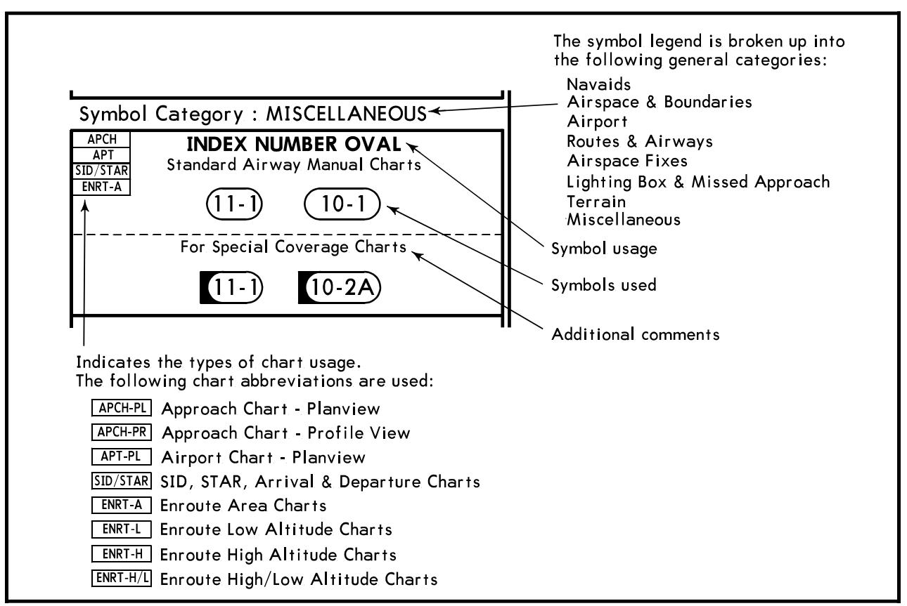

Symbol Category: NAVAIDS

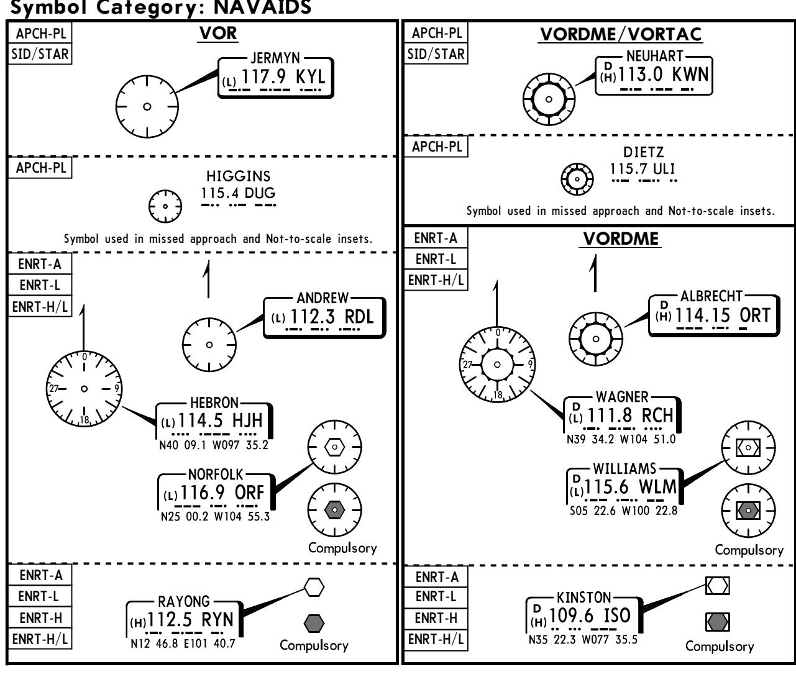

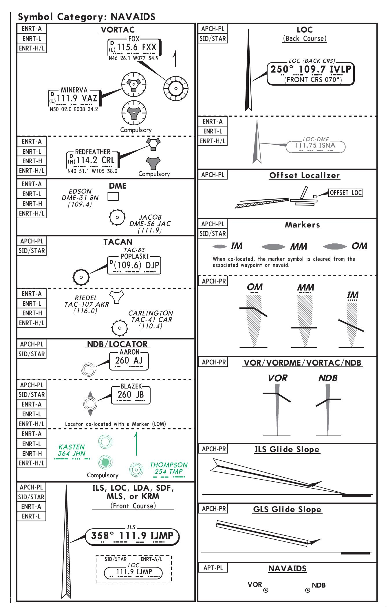

# Symbol Category: AIRSPACE & BOUNDARIES

| BOUNDARIES                                                                                                                                                                                                                                                                                                                                                                                                                                                                                                                                                                                                                                                                                                                                                                                                                                                                                                                                                                                                                                                                                                                                                                                                                                                                                                                                                                                                                                                                                                                                                                                                                                                                                                                                                                                                                                                                                                                                                                                                                                                                                                                     |                                                        |
|--------------------------------------------------------------------------------------------------------------------------------------------------------------------------------------------------------------------------------------------------------------------------------------------------------------------------------------------------------------------------------------------------------------------------------------------------------------------------------------------------------------------------------------------------------------------------------------------------------------------------------------------------------------------------------------------------------------------------------------------------------------------------------------------------------------------------------------------------------------------------------------------------------------------------------------------------------------------------------------------------------------------------------------------------------------------------------------------------------------------------------------------------------------------------------------------------------------------------------------------------------------------------------------------------------------------------------------------------------------------------------------------------------------------------------------------------------------------------------------------------------------------------------------------------------------------------------------------------------------------------------------------------------------------------------------------------------------------------------------------------------------------------------------------------------------------------------------------------------------------------------------------------------------------------------------------------------------------------------------------------------------------------------------------------------------------------------------------------------------------------------|--------------------------------------------------------|
| Special Use Airspace                                                                                                                                                                                                                                                                                                                                                                                                                                                                                                                                                                                                                                                                                                                                                                                                                                                                                                                                                                                                                                                                                                                                                                                                                                                                                                                                                                                                                                                                                                                                                                                                                                                                                                                                                                                                                                                                                                                                                                                                                                                                                                           | ENRT-H Control Area, Military Terminal                 |
| ENRT-L Advisory Area (Canada), Alert Area,                                                                                                                                                                                                                                                                                                                                                                                                                                                                                                                                                                                                                                                                                                                                                                                                                                                                                                                                                                                                                                                                                                                                                                                                                                                                                                                                                                                                                                                                                                                                                                                                                                                                                                                                                                                                                                                                                                                                                                                                                                                                                     | Control Area, Terminal Control Area                    |
| ENRT-H Caution Area, JDA Areas (Japan),                                                                                                                                                                                                                                                                                                                                                                                                                                                                                                                                                                                                                                                                                                                                                                                                                                                                                                                                                                                                                                                                                                                                                                                                                                                                                                                                                                                                                                                                                                                                                                                                                                                                                                                                                                                                                                                                                                                                                                                                                                                                                        |                                                        |
| Military Operations Area, Temporary Reserved                                                                                                                                                                                                                                                                                                                                                                                                                                                                                                                                                                                                                                                                                                                                                                                                                                                                                                                                                                                                                                                                                                                                                                                                                                                                                                                                                                                                                                                                                                                                                                                                                                                                                                                                                                                                                                                                                                                                                                                                                                                                                   |                                                        |
| Airspace, Training Area, Warning Area                                                                                                                                                                                                                                                                                                                                                                                                                                                                                                                                                                                                                                                                                                                                                                                                                                                                                                                                                                                                                                                                                                                                                                                                                                                                                                                                                                                                                                                                                                                                                                                                                                                                                                                                                                                                                                                                                                                                                                                                                                                                                          |                                                        |
|                                                                                                                                                                                                                                                                                                                                                                                                                                                                                                                                                                                                                                                                                                                                                                                                                                                                                                                                                                                                                                                                                                                                                                                                                                                                                                                                                                                                                                                                                                                                                                                                                                                                                                                                                                                                                                                                                                                                                                                                                                                                                                                                | ENRT-A Air Traffic Services                            |
|                                                                                                                                                                                                                                                                                                                                                                                                                                                                                                                                                                                                                                                                                                                                                                                                                                                                                                                                                                                                                                                                                                                                                                                                                                                                                                                                                                                                                                                                                                                                                                                                                                                                                                                                                                                                                                                                                                                                                                                                                                                                                                                                | 7111 11 4111 10 001 11 1000                            |
| 111111111111111111111111111111111111111                                                                                                                                                                                                                                                                                                                                                                                                                                                                                                                                                                                                                                                                                                                                                                                                                                                                                                                                                                                                                                                                                                                                                                                                                                                                                                                                                                                                                                                                                                                                                                                                                                                                                                                                                                                                                                                                                                                                                                                                                                                                                        | ENRT-L Class D (FAA), Class E (FAA), Control Zone,     |
|                                                                                                                                                                                                                                                                                                                                                                                                                                                                                                                                                                                                                                                                                                                                                                                                                                                                                                                                                                                                                                                                                                                                                                                                                                                                                                                                                                                                                                                                                                                                                                                                                                                                                                                                                                                                                                                                                                                                                                                                                                                                                                                                | ENRT-H/L Military Control Zone, Tower Control Area     |
| APCH-PL                                                                                                                                                                                                                                                                                                                                                                                                                                                                                                                                                                                                                                                                                                                                                                                                                                                                                                                                                                                                                                                                                                                                                                                                                                                                                                                                                                                                                                                                                                                                                                                                                                                                                                                                                                                                                                                                                                                                                                                                                                                                                                                        |                                                        |
| <del>                                   </del>                                                                                                                                                                                                                                                                                                                                                                                                                                                                                                                                                                                                                                                                                                                                                                                                                                                                                                                                                                                                                                                                                                                                                                                                                                                                                                                                                                                                                                                                                                                                                                                                                                                                                                                                                                                                                                                                                                                                                                                                                                                                                 |                                                        |
| AFT-FL                                                                                                                                                                                                                                                                                                                                                                                                                                                                                                                                                                                                                                                                                                                                                                                                                                                                                                                                                                                                                                                                                                                                                                                                                                                                                                                                                                                                                                                                                                                                                                                                                                                                                                                                                                                                                                                                                                                                                                                                                                                                                                                         |                                                        |
| SID/STAR                                                                                                                                                                                                                                                                                                                                                                                                                                                                                                                                                                                                                                                                                                                                                                                                                                                                                                                                                                                                                                                                                                                                                                                                                                                                                                                                                                                                                                                                                                                                                                                                                                                                                                                                                                                                                                                                                                                                                                                                                                                                                                                       | <b> </b>                                               |
|                                                                                                                                                                                                                                                                                                                                                                                                                                                                                                                                                                                                                                                                                                                                                                                                                                                                                                                                                                                                                                                                                                                                                                                                                                                                                                                                                                                                                                                                                                                                                                                                                                                                                                                                                                                                                                                                                                                                                                                                                                                                                                                                |                                                        |
| Special Ose All space                                                                                                                                                                                                                                                                                                                                                                                                                                                                                                                                                                                                                                                                                                                                                                                                                                                                                                                                                                                                                                                                                                                                                                                                                                                                                                                                                                                                                                                                                                                                                                                                                                                                                                                                                                                                                                                                                                                                                                                                                                                                                                          | ENDT A TOPE OF T                                       |
| ENRT-L Areas of Intense Air Activity, Danger Area,                                                                                                                                                                                                                                                                                                                                                                                                                                                                                                                                                                                                                                                                                                                                                                                                                                                                                                                                                                                                                                                                                                                                                                                                                                                                                                                                                                                                                                                                                                                                                                                                                                                                                                                                                                                                                                                                                                                                                                                                                                                                             | Air Traffic Services                                   |
| ENRT-H Flight Restricted Zones(FAA), Fuel Dumping                                                                                                                                                                                                                                                                                                                                                                                                                                                                                                                                                                                                                                                                                                                                                                                                                                                                                                                                                                                                                                                                                                                                                                                                                                                                                                                                                                                                                                                                                                                                                                                                                                                                                                                                                                                                                                                                                                                                                                                                                                                                              | ENRT-L Air Traffic Zone, Helicopter Protected Zone,    |
| ENRT-H/L Brobiblied Area, Booksisted Area                                                                                                                                                                                                                                                                                                                                                                                                                                                                                                                                                                                                                                                                                                                                                                                                                                                                                                                                                                                                                                                                                                                                                                                                                                                                                                                                                                                                                                                                                                                                                                                                                                                                                                                                                                                                                                                                                                                                                                                                                                                                                      | ENRT-H/L Helicopter Traffic Zone, Military Air Traffic |
| Prohibited Area, Restricted Area                                                                                                                                                                                                                                                                                                                                                                                                                                                                                                                                                                                                                                                                                                                                                                                                                                                                                                                                                                                                                                                                                                                                                                                                                                                                                                                                                                                                                                                                                                                                                                                                                                                                                                                                                                                                                                                                                                                                                                                                                                                                                               | Zone, Positive Control Area, Special Rules             |
|                                                                                                                                                                                                                                                                                                                                                                                                                                                                                                                                                                                                                                                                                                                                                                                                                                                                                                                                                                                                                                                                                                                                                                                                                                                                                                                                                                                                                                                                                                                                                                                                                                                                                                                                                                                                                                                                                                                                                                                                                                                                                                                                | Area/Zone, Traffic Information Area/Zone               |
|                                                                                                                                                                                                                                                                                                                                                                                                                                                                                                                                                                                                                                                                                                                                                                                                                                                                                                                                                                                                                                                                                                                                                                                                                                                                                                                                                                                                                                                                                                                                                                                                                                                                                                                                                                                                                                                                                                                                                                                                                                                                                                                                |                                                        |
|                                                                                                                                                                                                                                                                                                                                                                                                                                                                                                                                                                                                                                                                                                                                                                                                                                                                                                                                                                                                                                                                                                                                                                                                                                                                                                                                                                                                                                                                                                                                                                                                                                                                                                                                                                                                                                                                                                                                                                                                                                                                                                                                |                                                        |
|                                                                                                                                                                                                                                                                                                                                                                                                                                                                                                                                                                                                                                                                                                                                                                                                                                                                                                                                                                                                                                                                                                                                                                                                                                                                                                                                                                                                                                                                                                                                                                                                                                                                                                                                                                                                                                                                                                                                                                                                                                                                                                                                | ( )                                                    |
| APCH-PL                                                                                                                                                                                                                                                                                                                                                                                                                                                                                                                                                                                                                                                                                                                                                                                                                                                                                                                                                                                                                                                                                                                                                                                                                                                                                                                                                                                                                                                                                                                                                                                                                                                                                                                                                                                                                                                                                                                                                                                                                                                                                                                        |                                                        |
|                                                                                                                                                                                                                                                                                                                                                                                                                                                                                                                                                                                                                                                                                                                                                                                                                                                                                                                                                                                                                                                                                                                                                                                                                                                                                                                                                                                                                                                                                                                                                                                                                                                                                                                                                                                                                                                                                                                                                                                                                                                                                                                                |                                                        |
| APT-PL ////////////////////////////////////                                                                                                                                                                                                                                                                                                                                                                                                                                                                                                                                                                                                                                                                                                                                                                                                                                                                                                                                                                                                                                                                                                                                                                                                                                                                                                                                                                                                                                                                                                                                                                                                                                                                                                                                                                                                                                                                                                                                                                                                                                                                                    | FAIDT A                                                |
| SID/STAR                                                                                                                                                                                                                                                                                                                                                                                                                                                                                                                                                                                                                                                                                                                                                                                                                                                                                                                                                                                                                                                                                                                                                                                                                                                                                                                                                                                                                                                                                                                                                                                                                                                                                                                                                                                                                                                                                                                                                                                                                                                                                                                       | ENRT-A Oceanic Control Area,                           |
|                                                                                                                                                                                                                                                                                                                                                                                                                                                                                                                                                                                                                                                                                                                                                                                                                                                                                                                                                                                                                                                                                                                                                                                                                                                                                                                                                                                                                                                                                                                                                                                                                                                                                                                                                                                                                                                                                                                                                                                                                                                                                                                                | ENRT-L FAA Control Areas                               |
| Special High Roles Alea (FAA)                                                                                                                                                                                                                                                                                                                                                                                                                                                                                                                                                                                                                                                                                                                                                                                                                                                                                                                                                                                                                                                                                                                                                                                                                                                                                                                                                                                                                                                                                                                                                                                                                                                                                                                                                                                                                                                                                                                                                                                                                                                                                                  | ENRT-H                                                 |
| ENRT-L                                                                                                                                                                                                                                                                                                                                                                                                                                                                                                                                                                                                                                                                                                                                                                                                                                                                                                                                                                                                                                                                                                                                                                                                                                                                                                                                                                                                                                                                                                                                                                                                                                                                                                                                                                                                                                                                                                                                                                                                                                                                                                                         |                                                        |
| ENRT-H                                                                                                                                                                                                                                                                                                                                                                                                                                                                                                                                                                                                                                                                                                                                                                                                                                                                                                                                                                                                                                                                                                                                                                                                                                                                                                                                                                                                                                                                                                                                                                                                                                                                                                                                                                                                                                                                                                                                                                                                                                                                                                                         |                                                        |
| ENRT-H/L                                                                                                                                                                                                                                                                                                                                                                                                                                                                                                                                                                                                                                                                                                                                                                                                                                                                                                                                                                                                                                                                                                                                                                                                                                                                                                                                                                                                                                                                                                                                                                                                                                                                                                                                                                                                                                                                                                                                                                                                                                                                                                                       |                                                        |
|                                                                                                                                                                                                                                                                                                                                                                                                                                                                                                                                                                                                                                                                                                                                                                                                                                                                                                                                                                                                                                                                                                                                                                                                                                                                                                                                                                                                                                                                                                                                                                                                                                                                                                                                                                                                                                                                                                                                                                                                                                                                                                                                | ENRT-A Air Defense Identification Zone                 |
| ENRT-A Class A Airspace                                                                                                                                                                                                                                                                                                                                                                                                                                                                                                                                                                                                                                                                                                                                                                                                                                                                                                                                                                                                                                                                                                                                                                                                                                                                                                                                                                                                                                                                                                                                                                                                                                                                                                                                                                                                                                                                                                                                                                                                                                                                                                        | ENRT-L                                                 |
| ENRT-L Control Area Extensions (Canada), Control Areas,                                                                                                                                                                                                                                                                                                                                                                                                                                                                                                                                                                                                                                                                                                                                                                                                                                                                                                                                                                                                                                                                                                                                                                                                                                                                                                                                                                                                                                                                                                                                                                                                                                                                                                                                                                                                                                                                                                                                                                                                                                                                        |                                                        |
| ENRT-H Military Terminal Control Areas, Transition                                                                                                                                                                                                                                                                                                                                                                                                                                                                                                                                                                                                                                                                                                                                                                                                                                                                                                                                                                                                                                                                                                                                                                                                                                                                                                                                                                                                                                                                                                                                                                                                                                                                                                                                                                                                                                                                                                                                                                                                                                                                             | ENRT-H                                                 |
| Areas (Canada), Terminal Control Areas, Upper                                                                                                                                                                                                                                                                                                                                                                                                                                                                                                                                                                                                                                                                                                                                                                                                                                                                                                                                                                                                                                                                                                                                                                                                                                                                                                                                                                                                                                                                                                                                                                                                                                                                                                                                                                                                                                                                                                                                                                                                                                                                                  | ENRT-H/L                                               |
| ENRT-H/L Control Areas                                                                                                                                                                                                                                                                                                                                                                                                                                                                                                                                                                                                                                                                                                                                                                                                                                                                                                                                                                                                                                                                                                                                                                                                                                                                                                                                                                                                                                                                                                                                                                                                                                                                                                                                                                                                                                                                                                                                                                                                                                                                                                         |                                                        |
|                                                                                                                                                                                                                                                                                                                                                                                                                                                                                                                                                                                                                                                                                                                                                                                                                                                                                                                                                                                                                                                                                                                                                                                                                                                                                                                                                                                                                                                                                                                                                                                                                                                                                                                                                                                                                                                                                                                                                                                                                                                                                                                                |                                                        |
| A                                                                                                                                                                                                                                                                                                                                                                                                                                                                                                                                                                                                                                                                                                                                                                                                                                                                                                                                                                                                                                                                                                                                                                                                                                                                                                                                                                                                                                                                                                                                                                                                                                                                                                                                                                                                                                                                                                                                                                                                                                                                                                                              | ENRT-A Flight Information Region /                     |
|                                                                                                                                                                                                                                                                                                                                                                                                                                                                                                                                                                                                                                                                                                                                                                                                                                                                                                                                                                                                                                                                                                                                                                                                                                                                                                                                                                                                                                                                                                                                                                                                                                                                                                                                                                                                                                                                                                                                                                                                                                                                                                                                | ENRT-L Upper Flight Information Region                 |
|                                                                                                                                                                                                                                                                                                                                                                                                                                                                                                                                                                                                                                                                                                                                                                                                                                                                                                                                                                                                                                                                                                                                                                                                                                                                                                                                                                                                                                                                                                                                                                                                                                                                                                                                                                                                                                                                                                                                                                                                                                                                                                                                |                                                        |
| ENRT-A Class B Airspace                                                                                                                                                                                                                                                                                                                                                                                                                                                                                                                                                                                                                                                                                                                                                                                                                                                                                                                                                                                                                                                                                                                                                                                                                                                                                                                                                                                                                                                                                                                                                                                                                                                                                                                                                                                                                                                                                                                                                                                                                                                                                                        | ENRT-H                                                 |
| <u> </u>                                                                                                                                                                                                                                                                                                                                                                                                                                                                                                                                                                                                                                                                                                                                                                                                                                                                                                                                                                                                                                                                                                                                                                                                                                                                                                                                                                                                                                                                                                                                                                                                                                                                                                                                                                                                                                                                                                                                                                                                                                                                                                                       | ENRT-H/L                                               |
| ENRT-L Class B (FAA), Control Area Extensions (Canada),                                                                                                                                                                                                                                                                                                                                                                                                                                                                                                                                                                                                                                                                                                                                                                                                                                                                                                                                                                                                                                                                                                                                                                                                                                                                                                                                                                                                                                                                                                                                                                                                                                                                                                                                                                                                                                                                                                                                                                                                                                                                        | SID/STAR                                               |
| ENRT-H/L Control Areas, Military Terminal Control Areas,                                                                                                                                                                                                                                                                                                                                                                                                                                                                                                                                                                                                                                                                                                                                                                                                                                                                                                                                                                                                                                                                                                                                                                                                                                                                                                                                                                                                                                                                                                                                                                                                                                                                                                                                                                                                                                                                                                                                                                                                                                                                       |                                                        |
| Iransition Areas (Canada), Terminal Control                                                                                                                                                                                                                                                                                                                                                                                                                                                                                                                                                                                                                                                                                                                                                                                                                                                                                                                                                                                                                                                                                                                                                                                                                                                                                                                                                                                                                                                                                                                                                                                                                                                                                                                                                                                                                                                                                                                                                                                                                                                                                    | i i                                                    |
| Areas, Upper Control Areas                                                                                                                                                                                                                                                                                                                                                                                                                                                                                                                                                                                                                                                                                                                                                                                                                                                                                                                                                                                                                                                                                                                                                                                                                                                                                                                                                                                                                                                                                                                                                                                                                                                                                                                                                                                                                                                                                                                                                                                                                                                                                                     |                                                        |
|                                                                                                                                                                                                                                                                                                                                                                                                                                                                                                                                                                                                                                                                                                                                                                                                                                                                                                                                                                                                                                                                                                                                                                                                                                                                                                                                                                                                                                                                                                                                                                                                                                                                                                                                                                                                                                                                                                                                                                                                                                                                                                                                | ENRT-A   Air Route Traffic Control Center, Area        |
| В В В В В В В В В В В В В В В В В В В                                                                                                                                                                                                                                                                                                                                                                                                                                                                                                                                                                                                                                                                                                                                                                                                                                                                                                                                                                                                                                                                                                                                                                                                                                                                                                                                                                                                                                                                                                                                                                                                                                                                                                                                                                                                                                                                                                                                                                                                                                                                                          | <del>-                                   </del>        |
|                                                                                                                                                                                                                                                                                                                                                                                                                                                                                                                                                                                                                                                                                                                                                                                                                                                                                                                                                                                                                                                                                                                                                                                                                                                                                                                                                                                                                                                                                                                                                                                                                                                                                                                                                                                                                                                                                                                                                                                                                                                                                                                                | ENRT-L Control Center, Area of Responsibility,         |
| INDIA CI CA:                                                                                                                                                                                                                                                                                                                                                                                                                                                                                                                                                                                                                                                                                                                                                                                                                                                                                                                                                                                                                                                                                                                                                                                                                                                                                                                                                                                                                                                                                                                                                                                                                                                                                                                                                                                                                                                                                                                                                                                                                                                                                                                   | ENRT-H Delegated Airspace, Upper Area                  |
| ENRT-A Class C Airspace                                                                                                                                                                                                                                                                                                                                                                                                                                                                                                                                                                                                                                                                                                                                                                                                                                                                                                                                                                                                                                                                                                                                                                                                                                                                                                                                                                                                                                                                                                                                                                                                                                                                                                                                                                                                                                                                                                                                                                                                                                                                                                        | ENRT-H/L Control Center                                |
| ENRT-L Class C (FAA), Control Area Extensions (Canada),                                                                                                                                                                                                                                                                                                                                                                                                                                                                                                                                                                                                                                                                                                                                                                                                                                                                                                                                                                                                                                                                                                                                                                                                                                                                                                                                                                                                                                                                                                                                                                                                                                                                                                                                                                                                                                                                                                                                                                                                                                                                        | E(4(1 11/ E                                            |
| ENRT-H/L Control Areas, Military Terminal Control Areas,                                                                                                                                                                                                                                                                                                                                                                                                                                                                                                                                                                                                                                                                                                                                                                                                                                                                                                                                                                                                                                                                                                                                                                                                                                                                                                                                                                                                                                                                                                                                                                                                                                                                                                                                                                                                                                                                                                                                                                                                                                                                       |                                                        |
| Transition Areas (Canada), Terminal Control                                                                                                                                                                                                                                                                                                                                                                                                                                                                                                                                                                                                                                                                                                                                                                                                                                                                                                                                                                                                                                                                                                                                                                                                                                                                                                                                                                                                                                                                                                                                                                                                                                                                                                                                                                                                                                                                                                                                                                                                                                                                                    |                                                        |
| Areas, Upper Control Areas                                                                                                                                                                                                                                                                                                                                                                                                                                                                                                                                                                                                                                                                                                                                                                                                                                                                                                                                                                                                                                                                                                                                                                                                                                                                                                                                                                                                                                                                                                                                                                                                                                                                                                                                                                                                                                                                                                                                                                                                                                                                                                     |                                                        |
|                                                                                                                                                                                                                                                                                                                                                                                                                                                                                                                                                                                                                                                                                                                                                                                                                                                                                                                                                                                                                                                                                                                                                                                                                                                                                                                                                                                                                                                                                                                                                                                                                                                                                                                                                                                                                                                                                                                                                                                                                                                                                                                                | <b>*</b>                                               |
|                                                                                                                                                                                                                                                                                                                                                                                                                                                                                                                                                                                                                                                                                                                                                                                                                                                                                                                                                                                                                                                                                                                                                                                                                                                                                                                                                                                                                                                                                                                                                                                                                                                                                                                                                                                                                                                                                                                                                                                                                                                                                                                                | 1                                                      |
|                                                                                                                                                                                                                                                                                                                                                                                                                                                                                                                                                                                                                                                                                                                                                                                                                                                                                                                                                                                                                                                                                                                                                                                                                                                                                                                                                                                                                                                                                                                                                                                                                                                                                                                                                                                                                                                                                                                                                                                                                                                                                                                                | TUDT 4 COLO / A TUD T                                  |
|                                                                                                                                                                                                                                                                                                                                                                                                                                                                                                                                                                                                                                                                                                                                                                                                                                                                                                                                                                                                                                                                                                                                                                                                                                                                                                                                                                                                                                                                                                                                                                                                                                                                                                                                                                                                                                                                                                                                                                                                                                                                                                                                | ENRT-A CNS/ATM Equipment Boundary                      |
|                                                                                                                                                                                                                                                                                                                                                                                                                                                                                                                                                                                                                                                                                                                                                                                                                                                                                                                                                                                                                                                                                                                                                                                                                                                                                                                                                                                                                                                                                                                                                                                                                                                                                                                                                                                                                                                                                                                                                                                                                                                                                                                                | 9110,711111 = 9016111111 = 001111111 ,                 |
| ENRT-A Class D Airspace                                                                                                                                                                                                                                                                                                                                                                                                                                                                                                                                                                                                                                                                                                                                                                                                                                                                                                                                                                                                                                                                                                                                                                                                                                                                                                                                                                                                                                                                                                                                                                                                                                                                                                                                                                                                                                                                                                                                                                                                                                                                                                        | ENRT-L (MNPS, RNP, RVSM)                               |
| <u> </u>                                                                                                                                                                                                                                                                                                                                                                                                                                                                                                                                                                                                                                                                                                                                                                                                                                                                                                                                                                                                                                                                                                                                                                                                                                                                                                                                                                                                                                                                                                                                                                                                                                                                                                                                                                                                                                                                                                                                                                                                                                                                                                                       | ENRT-L (MNPS, RNP, RVSM)                               |
| ENRT-L Control Area Extensions (Canada), Control Areas,                                                                                                                                                                                                                                                                                                                                                                                                                                                                                                                                                                                                                                                                                                                                                                                                                                                                                                                                                                                                                                                                                                                                                                                                                                                                                                                                                                                                                                                                                                                                                                                                                                                                                                                                                                                                                                                                                                                                                                                                                                                                        | ENRT-L (MNPS, RNP, RVSM) ENRT-H                        |
| <u> </u>                                                                                                                                                                                                                                                                                                                                                                                                                                                                                                                                                                                                                                                                                                                                                                                                                                                                                                                                                                                                                                                                                                                                                                                                                                                                                                                                                                                                                                                                                                                                                                                                                                                                                                                                                                                                                                                                                                                                                                                                                                                                                                                       | ENRT-L (MNPS, RNP, RVSM)                               |
| ENRT-L Control Area Extensions (Canada), Control Areas, ENRT-H/L Military Terminal Control Areas, Transition                                                                                                                                                                                                                                                                                                                                                                                                                                                                                                                                                                                                                                                                                                                                                                                                                                                                                                                                                                                                                                                                                                                                                                                                                                                                                                                                                                                                                                                                                                                                                                                                                                                                                                                                                                                                                                                                                                                                                                                                                   | ENRT-L ENRT-H ENRT-H/L                           |
| ENRT-L Control Area Extensions (Canada), Control Areas, Military Terminal Control Areas, Transition Areas (Canada), Terminal Control Areas, Upper                                                                                                                                                                                                                                                                                                                                                                                                                                                                                                                                                                                                                                                                                                                                                                                                                                                                                                                                                                                                                                                                                                                                                                                                                                                                                                                                                                                                                                                                                                                                                                                                                                                                                                                                                                                                                                                                                                                                                                              | ENRT-L ENRT-H ENRT-H/L                           |
| ENRT-L Control Area Extensions (Canada), Control Areas, Military Terminal Control Areas, Transition Areas (Canada), Terminal Control Areas, Upper                                                                                                                                                                                                                                                                                                                                                                                                                                                                                                                                                                                                                                                                                                                                                                                                                                                                                                                                                                                                                                                                                                                                                                                                                                                                                                                                                                                                                                                                                                                                                                                                                                                                                                                                                                                                                                                                                                                                                                              | ENRT-L ENRT-H ENRT-H/L                           |
| ENRT-L Control Area Extensions (Canada), Control Areas, Military Terminal Control Areas, Transition Areas (Canada), Terminal Control Areas, Upper                                                                                                                                                                                                                                                                                                                                                                                                                                                                                                                                                                                                                                                                                                                                                                                                                                                                                                                                                                                                                                                                                                                                                                                                                                                                                                                                                                                                                                                                                                                                                                                                                                                                                                                                                                                                                                                                                                                                                                              | ENRT-L ENRT-H ENRT-H/L                           |
| ENRT-L Control Area Extensions (Canada), Control Areas, Military Terminal Control Areas, Transition Areas (Canada), Terminal Control Areas, Upper Control Areas                                                                                                                                                                                                                                                                                                                                                                                                                                                                                                                                                                                                                                                                                                                                                                                                                                                                                                                                                                                                                                                                                                                                                                                                                                                                                                                                                                                                                                                                                                                                                                                                                                                                                                                                                                                                                                                                                                                                                                | ENRT-L ENRT-H ENRT-H/L  ENRT-A  Random RNAV Area       |
| ENRT-L  Control Area Extensions (Canada), Control Areas, Military Terminal Control Areas, Transition Areas (Canada), Terminal Control Areas, Upper Control Areas  ENRT-A  Class G Airspace                                                                                                                                                                                                                                                                                                                                                                                                                                                                                                                                                                                                                                                                                                                                                                                                                                                                                                                                                                                                                                                                                                                                                                                                                                                                                                                                                                                                                                                                                                                                                                                                                                                                                                                                                                                                                                                                                                                                     | ENRT-L ENRT-H ENRT-H/L                           |
| ENRT-L ENRT-H/L ENRT-H/L ENRT-H/L  ENRT-A ENRT-L ENRT-A ENRT-L                                                                                                                                                                                                                                                                                                                                                                                                                                                                                                                                                                                                                                                                                                                                                                                                                                                                                                                                                                                                                                                                                                                                                                                                                                                                                                                                                                                                                                                                                                                                                                                                                                                                                                                                                                                                                                                                                                                                                                                                                                                                 | ENRT-L ENRT-H ENRT-H/L  ENRT-A ENRT-L FNRT-H ENRT-H    |
| ENRT-L  Control Area Extensions (Canada), Control Areas, Military Terminal Control Areas, Transition Areas (Canada), Terminal Control Areas, Upper Control Areas  ENRT-A  Class G Airspace                                                                                                                                                                                                                                                                                                                                                                                                                                                                                                                                                                                                                                                                                                                                                                                                                                                                                                                                                                                                                                                                                                                                                                                                                                                                                                                                                                                                                                                                                                                                                                                                                                                                                                                                                                                                                                                                                                                                     | ENRT-L ENRT-H ENRT-H/L  ENRT-A ENRT-L ENRT-L ENRT-H    |
| ENRT-L ENRT-H/L ENRT-H/L ENRT-H/L  ENRT-A ENRT-L ENRT-A ENRT-L                                                                                                                                                                                                                                                                                                                                                                                                                                                                                                                                                                                                                                                                                                                                                                                                                                                                                                                                                                                                                                                                                                                                                                                                                                                                                                                                                                                                                                                                                                                                                                                                                                                                                                                                                                                                                                                                                                                                                                                                                                                                 | ENRT-L ENRT-H ENRT-H/L  ENRT-A ENRT-L FNRT-H ENRT-H    |
| ENRT-L ENRT-H/L  ENRT-H/L  ENRT-A ENRT-L ENRT-H ENRT-H ENRT-A ENRT-L ENRT-H ENRT-H ENRT-H ENRT-H ENRT-H ENRT-H ENRT-H ENRT-H ENRT-H ENRT-H ENRT-H ENRT-H ENRT-H ENRT-H ENRT-H ENRT-H ENRT-H ENRT-H ENRT-H ENRT-H ENRT-H ENRT-H ENRT-H ENRT-H ENRT-H ENRT-H ENRT-H ENRT-H ENRT-H ENRT-H ENRT-H ENRT-H ENRT-H ENRT-H ENRT-H ENRT-H ENRT-H ENRT-H ENRT-H ENRT-H ENRT-H ENRT-H ENRT-H ENRT-H ENRT-H ENRT-H ENRT-H ENRT-H ENRT-H ENRT-H ENRT-H ENRT-H ENRT-H ENRT-H ENRT-H ENRT-H ENRT-H ENRT-H ENRT-H ENRT-H ENRT-H ENRT-H ENRT-H ENRT-H ENRT-H ENRT-H ENRT-H ENRT-H ENRT-H ENRT-H ENRT-H ENRT-H ENRT-H ENRT-H ENRT-H ENRT-H ENRT-H ENRT-H ENRT-H ENRT-H ENRT-H ENRT-H ENRT-H ENRT-H ENRT-H ENRT-H ENRT-H ENRT-H ENRT-H ENRT-H ENRT-H ENRT-H ENRT-H ENRT-H ENRT-H ENRT-H ENRT-H ENRT-H ENRT-H ENRT-H ENRT-H ENRT-H ENRT-H ENRT-H ENRT-H ENRT-H ENRT-H ENRT-H ENRT-H ENRT-H ENRT-H ENRT-H ENRT-H ENRT-H ENRT-H ENRT-H ENRT-H ENRT-H ENRT-H ENRT-H ENRT-H ENRT-H ENRT-H ENRT-H ENRT-H ENRT-H ENRT-H ENRT-H ENRT-H ENRT-H ENRT-H ENRT-H ENRT-H ENRT-H ENRT-H ENRT-H ENRT-H ENRT-H ENRT-H ENRT-H ENRT-H ENRT-H ENRT-H ENRT-H ENRT-H ENRT-H ENRT-H ENRT-H ENRT-H ENRT-H ENRT-H ENRT-H ENRT-H ENRT-H ENRT-H ENRT-H ENRT-H ENRT-H ENRT-H ENRT-H ENRT-H ENRT-H ENRT-H ENRT-H ENRT-H ENRT-H ENRT-H ENRT-H ENRT-H ENRT-H ENRT-H ENRT-H ENRT-H ENRT-H ENRT-H ENRT-H ENRT-H ENRT-H ENRT-H ENRT-H ENRT-H ENRT-H ENRT-H ENRT-H ENRT-H ENRT-H ENRT-H ENRT-H ENRT-H ENRT-H ENRT-H ENRT-H ENRT-H ENRT-H ENRT-H ENRT-H ENRT-H ENRT-H ENRT-H ENRT-H ENRT-H ENRT-H ENRT-H ENRT-H ENRT-H ENRT-H ENRT-H ENRT-H ENRT-H ENRT-H ENRT-H ENRT-H ENRT-H ENRT-H ENRT-H ENRT-H ENRT-H ENRT-H ENRT-H ENRT-H ENRT-H ENRT-H ENRT-H ENRT-H ENRT-H ENRT-H ENRT-H ENRT-H ENRT-H ENRT-H ENRT-H ENRT-H ENRT-H ENRT-H ENRT-H ENRT-H ENRT-H ENRT-H ENRT-H ENRT-H ENRT-H ENRT-H ENRT-H ENRT-H ENRT-H ENRT-H ENRT-H ENRT-H ENRT-H ENRT-H ENRT-H ENRT-H ENRT-H ENRT-H ENRT-H ENRT-H ENRT-H ENRT-H ENRT-H ENRT-H ENRT-H ENRT-H ENRT-H ENRT-H ENRT-H ENRT-H ENRT-H ENRT-H ENRT-H ENRT-H ENRT-H ENRT-H ENRT-H ENRT-H ENRT-H ENRT-H ENRT-H ENRT-H ENRT-H ENRT-H ENRT-H ENRT-H ENR | ENRT-L ENRT-H ENRT-H/L  ENRT-A ENRT-L ENRT-L ENRT-H    |

# Symbol Category: AIRSPACE & BOUNDARIES

|                                                                                    | BOUNDAKIES                                        |                |                                                                                                                                                                                                                                                                                                                                                                                                                                                                                                                                                                                                                                                                                                                                                                                                                                                                                                                                                                                                                                                                                                                                                                                                                                                                                                                                                                                                                                                                                                                                                                                                                                                                                                                                                                                                                                                                                                                                                                                                                                                                                                                                |
|------------------------------------------------------------------------------------|---------------------------------------------------|----------------|--------------------------------------------------------------------------------------------------------------------------------------------------------------------------------------------------------------------------------------------------------------------------------------------------------------------------------------------------------------------------------------------------------------------------------------------------------------------------------------------------------------------------------------------------------------------------------------------------------------------------------------------------------------------------------------------------------------------------------------------------------------------------------------------------------------------------------------------------------------------------------------------------------------------------------------------------------------------------------------------------------------------------------------------------------------------------------------------------------------------------------------------------------------------------------------------------------------------------------------------------------------------------------------------------------------------------------------------------------------------------------------------------------------------------------------------------------------------------------------------------------------------------------------------------------------------------------------------------------------------------------------------------------------------------------------------------------------------------------------------------------------------------------------------------------------------------------------------------------------------------------------------------------------------------------------------------------------------------------------------------------------------------------------------------------------------------------------------------------------------------------|
| ENRT-A                                                                             | Enroute Communications Sector                     | ENRT-A         | Special VFR                                                                                                                                                                                                                                                                                                                                                                                                                                                                                                                                                                                                                                                                                                                                                                                                                                                                                                                                                                                                                                                                                                                                                                                                                                                                                                                                                                                                                                                                                                                                                                                                                                                                                                                                                                                                                                                                                                                                                                                                                                                                                                                    |
| ENRT-L                                                                             | Low or High Altitude Sectors                      | ENRT-L         | Not Authorized                                                                                                                                                                                                                                                                                                                                                                                                                                                                                                                                                                                                                                                                                                                                                                                                                                                                                                                                                                                                                                                                                                                                                                                                                                                                                                                                                                                                                                                                                                                                                                                                                                                                                                                                                                                                                                                                                                                                                                                                                                                                                                                 |
| ENRT-H                                                                             | -                                                 | ENRT-H/L       |                                                                                                                                                                                                                                                                                                                                                                                                                                                                                                                                                                                                                                                                                                                                                                                                                                                                                                                                                                                                                                                                                                                                                                                                                                                                                                                                                                                                                                                                                                                                                                                                                                                                                                                                                                                                                                                                                                                                                                                                                                                                                                                                |
| ENRT-H/L                                                                           |                                                   |                |                                                                                                                                                                                                                                                                                                                                                                                                                                                                                                                                                                                                                                                                                                                                                                                                                                                                                                                                                                                                                                                                                                                                                                                                                                                                                                                                                                                                                                                                                                                                                                                                                                                                                                                                                                                                                                                                                                                                                                                                                                                                                                                                |
|                                                                                    | High Altitude Sectors (if vertically sectorized)  |                |                                                                                                                                                                                                                                                                                                                                                                                                                                                                                                                                                                                                                                                                                                                                                                                                                                                                                                                                                                                                                                                                                                                                                                                                                                                                                                                                                                                                                                                                                                                                                                                                                                                                                                                                                                                                                                                                                                                                                                                                                                                                                                                                |
| ENKI-H                                                                             | ingli Allitode Sectors (II Vertically Sectorized) | ENDT A         | Consideration Description                                                                                                                                                                                                                                                                                                                                                                                                                                                                                                                                                                                                                                                                                                                                                                                                                                                                                                                                                                                                                                                                                                                                                                                                                                                                                                                                                                                                                                                                                                                                                                                                                                                                                                                                                                                                                                                                                                                                                                                                                                                                                                      |
| i                                                                                  |                                                   | ENRT-A         | Speed Restriction Boundary                                                                                                                                                                                                                                                                                                                                                                                                                                                                                                                                                                                                                                                                                                                                                                                                                                                                                                                                                                                                                                                                                                                                                                                                                                                                                                                                                                                                                                                                                                                                                                                                                                                                                                                                                                                                                                                                                                                                                                                                                                                                                                     |
| <u> </u>                                                                           |                                                   | ENRT-L         |                                                                                                                                                                                                                                                                                                                                                                                                                                                                                                                                                                                                                                                                                                                                                                                                                                                                                                                                                                                                                                                                                                                                                                                                                                                                                                                                                                                                                                                                                                                                                                                                                                                                                                                                                                                                                                                                                                                                                                                                                                                                                                                                |
| APT-PL                                                                             |                                                   | ENRT-H         |                                                                                                                                                                                                                                                                                                                                                                                                                                                                                                                                                                                                                                                                                                                                                                                                                                                                                                                                                                                                                                                                                                                                                                                                                                                                                                                                                                                                                                                                                                                                                                                                                                                                                                                                                                                                                                                                                                                                                                                                                                                                                                                                |
|                                                                                    |                                                   | ENRT-H/L       |                                                                                                                                                                                                                                                                                                                                                                                                                                                                                                                                                                                                                                                                                                                                                                                                                                                                                                                                                                                                                                                                                                                                                                                                                                                                                                                                                                                                                                                                                                                                                                                                                                                                                                                                                                                                                                                                                                                                                                                                                                                                                                                                |
|                                                                                    |                                                   |                |                                                                                                                                                                                                                                                                                                                                                                                                                                                                                                                                                                                                                                                                                                                                                                                                                                                                                                                                                                                                                                                                                                                                                                                                                                                                                                                                                                                                                                                                                                                                                                                                                                                                                                                                                                                                                                                                                                                                                                                                                                                                                                                                |
| SID/STAR                                                                           | Lost Comms                                        | ENRT-A         | Time Zone                                                                                                                                                                                                                                                                                                                                                                                                                                                                                                                                                                                                                                                                                                                                                                                                                                                                                                                                                                                                                                                                                                                                                                                                                                                                                                                                                                                                                                                                                                                                                                                                                                                                                                                                                                                                                                                                                                                                                                                                                                                                                                                      |
| i                                                                                  |                                                   | ENRT-L         |                                                                                                                                                                                                                                                                                                                                                                                                                                                                                                                                                                                                                                                                                                                                                                                                                                                                                                                                                                                                                                                                                                                                                                                                                                                                                                                                                                                                                                                                                                                                                                                                                                                                                                                                                                                                                                                                                                                                                                                                                                                                                                                                |
| i                                                                                  | LOST COMMS LOST COMMS LOST COMMS                  | ENRT-H         |                                                                                                                                                                                                                                                                                                                                                                                                                                                                                                                                                                                                                                                                                                                                                                                                                                                                                                                                                                                                                                                                                                                                                                                                                                                                                                                                                                                                                                                                                                                                                                                                                                                                                                                                                                                                                                                                                                                                                                                                                                                                                                                                |
|                                                                                    |                                                   | ENRT-H/L       | <u></u>                                                                                                                                                                                                                                                                                                                                                                                                                                                                                                                                                                                                                                                                                                                                                                                                                                                                                                                                                                                                                                                                                                                                                                                                                                                                                                                                                                                                                                                                                                                                                                                                                                                                                                                                                                                                                                                                                                                                                                                                                                                                                                                        |
| ENRT-A                                                                             | Frequency Boundary -                              | E141X 1 -11/ E | × × × × × × × × × × × × × × × × × × ×                                                                                                                                                                                                                                                                                                                                                                                                                                                                                                                                                                                                                                                                                                                                                                                                                                                                                                                                                                                                                                                                                                                                                                                                                                                                                                                                                                                                                                                                                                                                                                                                                                                                                                                                                                                                                                                                                                                                                                                                                                                                                          |
| ENRT-L                                                                             | Class E FIA (Australia)                           | II             | ·                                                                                                                                                                                                                                                                                                                                                                                                                                                                                                                                                                                                                                                                                                                                                                                                                                                                                                                                                                                                                                                                                                                                                                                                                                                                                                                                                                                                                                                                                                                                                                                                                                                                                                                                                                                                                                                                                                                                                                                                                                                                                                                              |
| ENRT-H/L                                                                           | CIUSS E LIA (AUSITALIA)                           | FAIRT !!       | CL. I /D · D · I                                                                                                                                                                                                                                                                                                                                                                                                                                                                                                                                                                                                                                                                                                                                                                                                                                                                                                                                                                                                                                                                                                                                                                                                                                                                                                                                                                                                                                                                                                                                                                                                                                                                                                                                                                                                                                                                                                                                                                                                                                                                                                               |
| E131X 1 =11/ L                                                                     | <u> </u>                                          | ENRT-H         | State/Province Boundary                                                                                                                                                                                                                                                                                                                                                                                                                                                                                                                                                                                                                                                                                                                                                                                                                                                                                                                                                                                                                                                                                                                                                                                                                                                                                                                                                                                                                                                                                                                                                                                                                                                                                                                                                                                                                                                                                                                                                                                                                                                                                                        |
|                                                                                    | _                                                 |                |                                                                                                                                                                                                                                                                                                                                                                                                                                                                                                                                                                                                                                                                                                                                                                                                                                                                                                                                                                                                                                                                                                                                                                                                                                                                                                                                                                                                                                                                                                                                                                                                                                                                                                                                                                                                                                                                                                                                                                                                                                                                                                                                |
|                                                                                    |                                                   |                |                                                                                                                                                                                                                                                                                                                                                                                                                                                                                                                                                                                                                                                                                                                                                                                                                                                                                                                                                                                                                                                                                                                                                                                                                                                                                                                                                                                                                                                                                                                                                                                                                                                                                                                                                                                                                                                                                                                                                                                                                                                                                                                                |
| ENRT-A                                                                             | Frequency Boundary -                              | ENRT-A         | Common Traffic Adultania                                                                                                                                                                                                                                                                                                                                                                                                                                                                                                                                                                                                                                                                                                                                                                                                                                                                                                                                                                                                                                                                                                                                                                                                                                                                                                                                                                                                                                                                                                                                                                                                                                                                                                                                                                                                                                                                                                                                                                                                                                                                                                       |
| ENRT-L                                                                             | Class G FIA (Australia)                           | 11             | Common Traffic Advisory                                                                                                                                                                                                                                                                                                                                                                                                                                                                                                                                                                                                                                                                                                                                                                                                                                                                                                                                                                                                                                                                                                                                                                                                                                                                                                                                                                                                                                                                                                                                                                                                                                                                                                                                                                                                                                                                                                                                                                                                                                                                                                        |
|                                                                                    | Class G FIM (MUSTFalla)                           | ENRT-L         | Frequency Boundary (Australia)                                                                                                                                                                                                                                                                                                                                                                                                                                                                                                                                                                                                                                                                                                                                                                                                                                                                                                                                                                                                                                                                                                                                                                                                                                                                                                                                                                                                                                                                                                                                                                                                                                                                                                                                                                                                                                                                                                                                                                                                                                                                                                 |
| ENRT-H/L                                                                           | ••                                                | ENRT-H         | •                                                                                                                                                                                                                                                                                                                                                                                                                                                                                                                                                                                                                                                                                                                                                                                                                                                                                                                                                                                                                                                                                                                                                                                                                                                                                                                                                                                                                                                                                                                                                                                                                                                                                                                                                                                                                                                                                                                                                                                                                                                                                                                              |
|                                                                                    |                                                   | ENRT-H/L       | N. Comments of the Comment of the Comment of the Comment of the Comment of the Comment of the Comment of the Comment of the Comment of the Comment of the Comment of the Comment of the Comment of the Comment of the Comment of the Comment of the Comment of the Comment of the Comment of the Comment of the Comment of the Comment of the Comment of the Comment of the Comment of the Comment of the Comment of the Comment of the Comment of the Comment of the Comment of the Comment of the Comment of the Comment of the Comment of the Comment of the Comment of the Comment of the Comment of the Comment of the Comment of the Comment of the Comment of the Comment of the Comment of the Comment of the Comment of the Comment of the Comment of the Comment of the Comment of the Comment of the Comment of the Comment of the Comment of the Comment of the Comment of the Comment of the Comment of the Comment of the Comment of the Comment of the Comment of the Comment of the Comment of the Comment of the Comment of the Comment of the Comment of the Comment of the Comment of the Comment of the Comment of the Comment of the Comment of the Comment of the Comment of the Comment of the Comment of the Comment of the Comment of the Comment of the Comment of the Comment of the Comment of the Comment of the Comment of the Comment of the Comment of the Comment of the Comment of the Comment of the Comment of the Comment of the Comment of the Comment of the Comment of the Comment of the Comment of the Comment of the Comment of the Comment of the Comment of the Comment of the Comment of the Comment of the Comment of the Comment of the Comment of the Comment of the Comment of the Comment of the Comment of the Comment of the Comment of the Comment of the Comment of the Comment of the Comment of the Comment of the Comment of the Comment of the Comment of the Comment of the Comment of the Comment of the Comment of the Comment of the Comment of the Comment of the Comment of the Comment of the Comment of the Comment of the Comment of the Comment of the Co |
|                                                                                    | · · · · · · · · · · · · · · · · · · ·             |                |                                                                                                                                                                                                                                                                                                                                                                                                                                                                                                                                                                                                                                                                                                                                                                                                                                                                                                                                                                                                                                                                                                                                                                                                                                                                                                                                                                                                                                                                                                                                                                                                                                                                                                                                                                                                                                                                                                                                                                                                                                                                                                                                |
|                                                                                    |                                                   |                | ***************************************                                                                                                                                                                                                                                                                                                                                                                                                                                                                                                                                                                                                                                                                                                                                                                                                                                                                                                                                                                                                                                                                                                                                                                                                                                                                                                                                                                                                                                                                                                                                                                                                                                                                                                                                                                                                                                                                                                                                                                                                                                                                                        |
| ENRT-A                                                                             | Frequency Boundary - HF                           | ENRT-A         | Advisory Radio Area,                                                                                                                                                                                                                                                                                                                                                                                                                                                                                                                                                                                                                                                                                                                                                                                                                                                                                                                                                                                                                                                                                                                                                                                                                                                                                                                                                                                                                                                                                                                                                                                                                                                                                                                                                                                                                                                                                                                                                                                                                                                                                                           |
| ENRT-L                                                                             |                                                   | ENRT-L         | Radar Area/Zone                                                                                                                                                                                                                                                                                                                                                                                                                                                                                                                                                                                                                                                                                                                                                                                                                                                                                                                                                                                                                                                                                                                                                                                                                                                                                                                                                                                                                                                                                                                                                                                                                                                                                                                                                                                                                                                                                                                                                                                                                                                                                                                |
| ENRT-H                                                                             |                                                   | ENRT-H         | Naudi Alea/ Lulle                                                                                                                                                                                                                                                                                                                                                                                                                                                                                                                                                                                                                                                                                                                                                                                                                                                                                                                                                                                                                                                                                                                                                                                                                                                                                                                                                                                                                                                                                                                                                                                                                                                                                                                                                                                                                                                                                                                                                                                                                                                                                                              |
| ENRT-H/L                                                                           |                                                   | I <del></del>  | ţ                                                                                                                                                                                                                                                                                                                                                                                                                                                                                                                                                                                                                                                                                                                                                                                                                                                                                                                                                                                                                                                                                                                                                                                                                                                                                                                                                                                                                                                                                                                                                                                                                                                                                                                                                                                                                                                                                                                                                                                                                                                                                                                              |
|                                                                                    |                                                   | ENRT-H/L       | <b>`</b> ,                                                                                                                                                                                                                                                                                                                                                                                                                                                                                                                                                                                                                                                                                                                                                                                                                                                                                                                                                                                                                                                                                                                                                                                                                                                                                                                                                                                                                                                                                                                                                                                                                                                                                                                                                                                                                                                                                                                                                                                                                                                                                                                     |
| ENRT-A                                                                             | Free Route Airspace                               |                | N. Carlotte and the control of the control of the control of the control of the control of the control of the control of the control of the control of the control of the control of the control of the control of the control of the control of the control of the control of the control of the control of the control of the control of the control of the control of the control of the control of the control of the control of the control of the control of the control of the control of the control of the control of the control of the control of the control of the control of the control of the control of the control of the control of the control of the control of the control of the control of the control of the control of the control of the control of the control of the control of the control of the control of the control of the control of the control of the control of the control of the control of the control of the control of the control of the control of the control of the control of the control of the control of the control of the control of the control of the control of the control of the control of the control of the control of the control of the control of the control of the control of the control of the control of the control of the control of the control of the control of the control of the control of the control of the control of the control of the control of the control of the control of the control of the control of the control of the control of the control of the control of the control of the control of the control of the control of the control of the control of the control of the control of the control of the control of the control of the control of the control of the control of the control of the control of the control of the control of the control of the control of the control of the control of the control of the control of the control of the control of the control of the control of the control of the control of the control of the control of the control of the control of the control of the control of the c |
| ENRT-H                                                                             |                                                   |                | ***************************************                                                                                                                                                                                                                                                                                                                                                                                                                                                                                                                                                                                                                                                                                                                                                                                                                                                                                                                                                                                                                                                                                                                                                                                                                                                                                                                                                                                                                                                                                                                                                                                                                                                                                                                                                                                                                                                                                                                                                                                                                                                                                        |
| ENRT-H/L                                                                           |                                                   | Cl.            | L Cotomonic AIDDORT                                                                                                                                                                                                                                                                                                                                                                                                                                                                                                                                                                                                                                                                                                                                                                                                                                                                                                                                                                                                                                                                                                                                                                                                                                                                                                                                                                                                                                                                                                                                                                                                                                                                                                                                                                                                                                                                                                                                                                                                                                                                                                            |
|                                                                                    |                                                   |                | ol Category: AIRPORT                                                                                                                                                                                                                                                                                                                                                                                                                                                                                                                                                                                                                                                                                                                                                                                                                                                                                                                                                                                                                                                                                                                                                                                                                                                                                                                                                                                                                                                                                                                                                                                                                                                                                                                                                                                                                                                                                                                                                                                                                                                                                                           |
| ENRT-A                                                                             | International Boundary                            | APT-PL         | Runway Number                                                                                                                                                                                                                                                                                                                                                                                                                                                                                                                                                                                                                                                                                                                                                                                                                                                                                                                                                                                                                                                                                                                                                                                                                                                                                                                                                                                                                                                                                                                                                                                                                                                                                                                                                                                                                                                                                                                                                                                                                                                                                                                  |
| ENRT-L                                                                             | milernational boolidary                           |                | Runway number is magnetic unless                                                                                                                                                                                                                                                                                                                                                                                                                                                                                                                                                                                                                                                                                                                                                                                                                                                                                                                                                                                                                                                                                                                                                                                                                                                                                                                                                                                                                                                                                                                                                                                                                                                                                                                                                                                                                                                                                                                                                                                                                                                                                               |
|                                                                                    |                                                   |                | followed by T for true in far north                                                                                                                                                                                                                                                                                                                                                                                                                                                                                                                                                                                                                                                                                                                                                                                                                                                                                                                                                                                                                                                                                                                                                                                                                                                                                                                                                                                                                                                                                                                                                                                                                                                                                                                                                                                                                                                                                                                                                                                                                                                                                            |
| ENRT-H                                                                             | -·· <del>-</del> ··-                              |                |                                                                                                                                                                                                                                                                                                                                                                                                                                                                                                                                                                                                                                                                                                                                                                                                                                                                                                                                                                                                                                                                                                                                                                                                                                                                                                                                                                                                                                                                                                                                                                                                                                                                                                                                                                                                                                                                                                                                                                                                                                                                                                                                |
| ENRT-H/L                                                                           |                                                   |                | <b>= (27)</b>                                                                                                                                                                                                                                                                                                                                                                                                                                                                                                                                                                                                                                                                                                                                                                                                                                                                                                                                                                                                                                                                                                                                                                                                                                                                                                                                                                                                                                                                                                                                                                                                                                                                                                                                                                                                                                                                                                                                                                                                                                                                                                                  |
| <u></u> .                                                                          |                                                   | L              |                                                                                                                                                                                                                                                                                                                                                                                                                                                                                                                                                                                                                                                                                                                                                                                                                                                                                                                                                                                                                                                                                                                                                                                                                                                                                                                                                                                                                                                                                                                                                                                                                                                                                                                                                                                                                                                                                                                                                                                                                                                                                                                                |
| APCH-PL                                                                            |                                                   | APT-PL         | Runway number and (when known) magnetic                                                                                                                                                                                                                                                                                                                                                                                                                                                                                                                                                                                                                                                                                                                                                                                                                                                                                                                                                                                                                                                                                                                                                                                                                                                                                                                                                                                                                                                                                                                                                                                                                                                                                                                                                                                                                                                                                                                                                                                                                                                                                        |
| APT-PL                                                                             |                                                   |                | direction, unless followed by T for true                                                                                                                                                                                                                                                                                                                                                                                                                                                                                                                                                                                                                                                                                                                                                                                                                                                                                                                                                                                                                                                                                                                                                                                                                                                                                                                                                                                                                                                                                                                                                                                                                                                                                                                                                                                                                                                                                                                                                                                                                                                                                       |
|                                                                                    |                                                   | II .           |                                                                                                                                                                                                                                                                                                                                                                                                                                                                                                                                                                                                                                                                                                                                                                                                                                                                                                                                                                                                                                                                                                                                                                                                                                                                                                                                                                                                                                                                                                                                                                                                                                                                                                                                                                                                                                                                                                                                                                                                                                                                                                                                |
| ■ OID/ OIAK                                                                        | ì                                                 | ll .           | in far north                                                                                                                                                                                                                                                                                                                                                                                                                                                                                                                                                                                                                                                                                                                                                                                                                                                                                                                                                                                                                                                                                                                                                                                                                                                                                                                                                                                                                                                                                                                                                                                                                                                                                                                                                                                                                                                                                                                                                                                                                                                                                                                   |
| SID/STAR                                                                           |                                                   |                | in far north                                                                                                                                                                                                                                                                                                                                                                                                                                                                                                                                                                                                                                                                                                                                                                                                                                                                                                                                                                                                                                                                                                                                                                                                                                                                                                                                                                                                                                                                                                                                                                                                                                                                                                                                                                                                                                                                                                                                                                                                                                                                                                                   |
|                                                                                    | Mandatani President 7:                            |                | in far north  27  267°                                                                                                                                                                                                                                                                                                                                                                                                                                                                                                                                                                                                                                                                                                                                                                                                                                                                                                                                                                                                                                                                                                                                                                                                                                                                                                                                                                                                                                                                                                                                                                                                                                                                                                                                                                                                                                                                                                                                                                                                                                                                                                         |
| ENRT-A                                                                             | Mandatory Broadcast Zone                          |                | in far north                                                                                                                                                                                                                                                                                                                                                                                                                                                                                                                                                                                                                                                                                                                                                                                                                                                                                                                                                                                                                                                                                                                                                                                                                                                                                                                                                                                                                                                                                                                                                                                                                                                                                                                                                                                                                                                                                                                                                                                                                                                                                                                   |
| ENRT-A ENRT-L                                                                   | Mandatory Broadcast Zone                          | APT-PL         | in far north  27  267°  Seaplane operating area, or water runway                                                                                                                                                                                                                                                                                                                                                                                                                                                                                                                                                                                                                                                                                                                                                                                                                                                                                                                                                                                                                                                                                                                                                                                                                                                                                                                                                                                                                                                                                                                                                                                                                                                                                                                                                                                                                                                                                                                                                                                                                                                               |
| ENRT-A                                                                             | Mandatory Broadcast Zone                          | APT-PL         | <b>27</b> 267°                                                                                                                                                                                                                                                                                                                                                                                                                                                                                                                                                                                                                                                                                                                                                                                                                                                                                                                                                                                                                                                                                                                                                                                                                                                                                                                                                                                                                                                                                                                                                                                                                                                                                                                                                                                                                                                                                                                                                                                                                                                                                                                 |
| ENRT-A ENRT-L                                                                   | Mandatory Broadcast Zone                          | APT-PL         | 27 267°                                                                                                                                                                                                                                                                                                                                                                                                                                                                                                                                                                                                                                                                                                                                                                                                                                                                                                                                                                                                                                                                                                                                                                                                                                                                                                                                                                                                                                                                                                                                                                                                                                                                                                                                                                                                                                                                                                                                                                                                                                                                                                                     |
| ENRT-A ENRT-L                                                                   | Mandatory Broadcast Zone                          | APT-PL         | <b>27</b> 267°                                                                                                                                                                                                                                                                                                                                                                                                                                                                                                                                                                                                                                                                                                                                                                                                                                                                                                                                                                                                                                                                                                                                                                                                                                                                                                                                                                                                                                                                                                                                                                                                                                                                                                                                                                                                                                                                                                                                                                                                                                                                                                                 |
| ENRT-A ENRT-L                                                                   | Mandatory Broadcast Zone                          |                | Seaplane operating area, or water runway                                                                                                                                                                                                                                                                                                                                                                                                                                                                                                                                                                                                                                                                                                                                                                                                                                                                                                                                                                                                                                                                                                                                                                                                                                                                                                                                                                                                                                                                                                                                                                                                                                                                                                                                                                                                                                                                                                                                                                                                                                                                                       |
| ENRT-A ENRT-L ENRT-H/L                                                       |                                                   | APT-PL         | <b>27</b> 267°                                                                                                                                                                                                                                                                                                                                                                                                                                                                                                                                                                                                                                                                                                                                                                                                                                                                                                                                                                                                                                                                                                                                                                                                                                                                                                                                                                                                                                                                                                                                                                                                                                                                                                                                                                                                                                                                                                                                                                                                                                                                                                                 |
| ENRT-A ENRT-L ENRT-H/L                                                       | QNE/QNH Boundary                                  |                | Seaplane operating area, or water runway                                                                                                                                                                                                                                                                                                                                                                                                                                                                                                                                                                                                                                                                                                                                                                                                                                                                                                                                                                                                                                                                                                                                                                                                                                                                                                                                                                                                                                                                                                                                                                                                                                                                                                                                                                                                                                                                                                                                                                                                                                                                                       |
| ENRT-A ENRT-H/L ENRT-H/L ENRT-A ENRT-L                                 |                                                   |                | Seaplane operating area, or water runway  == 1 27W                                                                                                                                                                                                                                                                                                                                                                                                                                                                                                                                                                                                                                                                                                                                                                                                                                                                                                                                                                                                                                                                                                                                                                                                                                                                                                                                                                                                                                                                                                                                                                                                                                                                                                                                                                                                                                                                                                                                                                                                                                                                             |
| ENRT-A ENRT-H/L ENRT-A ENRT-A ENRT-L ENRT-H                                        | QNE/QNH Boundary                                  |                | Seaplane operating area, or water runway  == 1 27W                                                                                                                                                                                                                                                                                                                                                                                                                                                                                                                                                                                                                                                                                                                                                                                                                                                                                                                                                                                                                                                                                                                                                                                                                                                                                                                                                                                                                                                                                                                                                                                                                                                                                                                                                                                                                                                                                                                                                                                                                                                                             |
| ENRT-A ENRT-H/L ENRT-H/L ENRT-A ENRT-L                                 | QNE/QNH Boundary                                  |                | Seaplane operating area, or water runway  == 1 27W                                                                                                                                                                                                                                                                                                                                                                                                                                                                                                                                                                                                                                                                                                                                                                                                                                                                                                                                                                                                                                                                                                                                                                                                                                                                                                                                                                                                                                                                                                                                                                                                                                                                                                                                                                                                                                                                                                                                                                                                                                                                             |
| ENRT-A ENRT-H/L ENRT-A ENRT-A ENRT-L ENRT-H                                        | QNE/QNH Boundary                                  | APT-PL         | Seaplane operating area, or water runway                                                                                                                                                                                                                                                                                                                                                                                                                                                                                                                                                                                                                                                                                                                                                                                                                                                                                                                                                                                                                                                                                                                                                                                                                                                                                                                                                                                                                                                                                                                                                                                                                                                                                                                                                                                                                                                                                                                                                                                                                                                                                       |
| ENRT-A ENRT-H/L ENRT-A ENRT-A ENRT-L ENRT-H ENRT-H/L                               | QNE/QNH Boundary                                  |                | Seaplane operating area, or water runway                                                                                                                                                                                                                                                                                                                                                                                                                                                                                                                                                                                                                                                                                                                                                                                                                                                                                                                                                                                                                                                                                                                                                                                                                                                                                                                                                                                                                                                                                                                                                                                                                                                                                                                                                                                                                                                                                                                                                                                                                                                                                       |
| ENRT-A ENRT-H/L ENRT-A ENRT-L ENRT-H ENRT-H/L SID/STAR ENRT-A                      | QNE/QNH Boundary                                  | APT-PL         | Seaplane operating area, or water runway  == 1 27W  Seaplane Operating Area                                                                                                                                                                                                                                                                                                                                                                                                                                                                                                                                                                                                                                                                                                                                                                                                                                                                                                                                                                                                                                                                                                                                                                                                                                                                                                                                                                                                                                                                                                                                                                                                                                                                                                                                                                                                                                                                                                                                                                                                                                                    |
| ENRT-A ENRT-H/L ENRT-H ENRT-H ENRT-H ENRT-H ENRT-H/L SID/STAR ENRT-A ENRT-A ENRT-L | QNE/QNH Boundary                                  | APT-PL         | Seaplane operating area, or water runway  == 1 27W  Seaplane Operating Area                                                                                                                                                                                                                                                                                                                                                                                                                                                                                                                                                                                                                                                                                                                                                                                                                                                                                                                                                                                                                                                                                                                                                                                                                                                                                                                                                                                                                                                                                                                                                                                                                                                                                                                                                                                                                                                                                                                                                                                                                                                    |
| ENRT-A ENRT-H/L ENRT-A ENRT-L ENRT-H ENRT-H/L SID/STAR ENRT-A                      | QNE/QNH Boundary                                  | APT-PL         | Seaplane operating area, or water runway  == 1 27W  Seaplane Operating Area                                                                                                                                                                                                                                                                                                                                                                                                                                                                                                                                                                                                                                                                                                                                                                                                                                                                                                                                                                                                                                                                                                                                                                                                                                                                                                                                                                                                                                                                                                                                                                                                                                                                                                                                                                                                                                                                                                                                                                                                                                                    |

Symbol Category: AIRPORT

| APT-PL | RAIL                             | APT-PL Wind Indicator                      |
|--------|----------------------------------|--------------------------------------------------|
|        |                                  | Cone Lighted Cone                             |
|        |                                  |                                                  |
| APT-PL | Road                             | APT-PL Tee                                    |
|        |                                  |                                                  |
|        |                                  | APT-PL                                           |
| APT-PL |                                  | Tetrahedron                                      |
|        | Trees                            |                                                  |
|        |                                  | ENRT-A Airports ENRT-L                     |
|        |                                  | ENRT-H                                           |
| APT-PL | Bluff                            | ENRT-H/L                                         |
|        |                                  |                                                  |
|        |                                  |                                                  |
| APT-PL | Pole Line                     |                                                  |
|        |                                  |                                                  |
|        |                                  | APCH-PL                                          |
|        |                                  | APT-PL SID/STAR                               |
| APT-PL | Railroad                         |                                                  |
|        |                                  |                                                  |
|        |                                  |                                                  |
| APT-PL | Ditch                            |                                                  |
|        |                                  |                                                  |
|        |                                  |                                                  |
|        |                                  | APCH-PL                                          |
|        |                                  | ENRT-A                                           |
| APT-PL | Buildings                        |                                                  |
|        |                                  | APT-PL Helicopter Landing Pad           |
| APT-PL | Lighted Pole                  |                                                  |
|        |                                  | APT-PL Magnetic Variation                  |
|        |                                  |                                                  |
| APT-PL | Unidentified Beacon           |                                                  |
|        |                                  |                                                  |
| APT-PL | Permanently Closed Taxiway |                                                  |
|        |                                  |                                                  |
| APT-PL |                                  | APT-PL Airport Reference Point (ARP) |
|        | Taxiway and Apron          |                                                  |
|        |                                  |                                                  |
|        |                                  | APT-PL                                           |
| APT-PL | LAHSO Distance Points      | Tree Line                                     |
|        |                                  |                                                  |
| APT-PL |                                  | APT-PL Building Area                       |
|        | RVR Measuring Site         |                                                  |
|        |                                  |                                                  |

# Symbol Category: ROUTES & AIRWAYS

|               | AIRWAYS                                 |                 |                                                                       |
|---------------|-----------------------------------------|-----------------|-----------------------------------------------------------------------|
| APCH-PL       | Track/Airway                            | SID/STAR        | Altitude Change "T"                                                   |
| APCH-PR       |                                         | ENRT-A          | MEA, MAA, MOCA, or MORA change.                                       |
| SID/STAR      |                                         | ENRT-L          | Does not apply to GPS MEA's or at Navaids                             |
| ENRT-A        |                                         | ENRT-H          | ⊣ !                                                                   |
| ENRT-L        |                                         | ENRT-H/L        | <u> </u>                                                              |
| ENRT-H        |                                         | ENRT-A          | Total Milage                                                          |
| ENRT-H/L      |                                         | ENRT-L          | Total Mileage between Navaids                                         |
| ENRT-L        | Overlying High Altitude Airway          | ENRT-H          | $\langle \overline{23} \rangle$                                       |
|               |                                         | ENRT-H/L        | \ <u></u>                                                             |
|               | <del></del>                             | SID/STAR        | Change Over Point                                                     |
| ENRT-L        | Diversionant Barria                     | ENRT-A          | Mileages indicate point to change Navaids                             |
| CINK I -L     | Diversionary Route                      | ENRT-L          |                                                                       |
|               |                                         | ENRT-H          | 22                                                                    |
|               |                                         | ENRT-H/L        | 65                                                                    |
| APCH-PR       | Non-precision when charted              | ENRT-A          | Even and Odd Indicators                                               |
|               | with precision approach                 | ENRT-L          | Even and Odd Indicators  Even and Odd altitudes are used              |
|               |                                         | ENRT-L          | in direction indicated                                                |
|               |                                         | ENRT-H/L        | ⟨E E⟩                                                                 |
| ENRT-A        | Arrival/Departure Route                 | FIAIV I -UI / F | ⟨○ ○⟩                                                                 |
| EIII(I A      | Allival/ Departure Route                |                 | (E&O E&O)                                                             |
|               |                                         |                 |                                                                       |
|               | <b>− − →</b>                            |                 | E&O                                                                   |
|               |                                         | ENRT-A          | Prior Permission Required                                             |
| SID/STAR      | Transition Track                        | ENRT-L          | Prior Permission Required from ATC                                    |
| ,             | Transfillon frack                       | ENRT-H          | for flight in direction of arrow.                                     |
|               |                                         | ENRT-H/L        | <b>∢</b> PPR                                                          |
|               |                                         | 11 71, 2        | SILIN                                                                 |
|               |                                         | ENRT-A          | Flight Planned Route                                                  |
|               |                                         | ENRT-L          | ingin i idinied koole                                                 |
| APT-PL        | High Level Approach Track               | ENRT-H          | FDD.                                                                  |
|               | • • • • • • • • • • • • • • • • • • • • | ENRT-H/L        | FPR►                                                                  |
|               |                                         | 21410.1 11/2    |                                                                       |
|               | <del>-</del>                            | ENRT-A          | Airway By-Pass                                                        |
|               |                                         | ENRT-L          | All way by-1 ass                                                      |
| APCH-PL       | Visual Track                            | ENRT-H          |                                                                       |
| APCH-PR       |                                         | ENRT-H/L        |                                                                       |
|               | ****                                    |                 |                                                                       |
|               |                                         | APCH-PL         | Ainueu Desimates                                                      |
| APCH-PR       | VNAV/VDA                                | SID/STAR        | Airway Designator Negative                                            |
|               | Vertical descent angle and/or path      | ENRT-A          | Medalise                                                              |
|               |                                         | ENRT-L          | V 102                                                                 |
|               |                                         |                 | V 102                                                                 |
| APCH-PR       | Vertical descent angle and/or path      | ENRT-H/L        |                                                                       |
| 7.11 \$11 111 | to DA for approved operators            |                 | B fat                                                                 |
|               |                                         | APCH-PL         | Positive                                                              |
|               |                                         |                 | U 571                                                                 |
| SID/STAR      | Radar Vectors                           |                 | <u> </u>                                                              |
|               | -                                       |                 |                                                                       |
|               | <b>&gt;&gt;&gt;&gt;&gt;&gt;&gt;</b>     | ENRT-A          | Route Suffix                                                          |
|               |                                         | ENRT-L          | Suffixes are added to indicate more restrictive segment along airway. |
| APT-PL        | Missed Approach Course                  | ENRT-H          | Each suffix has a unique meaning.                                     |
| 7             | Missed Approach Course                  | ENRT-H/L        | LOSE EN                                                               |
|               |                                         |                 | J 225 R                                                               |
|               |                                         |                 |                                                                       |
|               |                                         | ENRT-A          | One Way Airway                                                        |
| ENRT-A        | Navigational Signal Gap                 | ENRT-L          |                                                                       |
| ENRT-L        |                                         | ENRT-H          | V 76                                                                  |
| ENRT-H        |                                         | ENRT-H/L        | V / 6                                                                 |
| ENRT-H/L      |                                         |                 |                                                                       |
| -             |                                         |                 |                                                                       |

ENRT-H/L

# CHARTING SYMBOLS LEGEND

| Symbol             | l Category: ROUTES & AIRWAYS   |          |                                                                                                                                                                                                                                                                                                                                                                                                                                                                                                                                                                                                                                                                                                                                                                                                                                                                                                                                                                                                                                                                                                                                                                                                                                                                                                                                                                                                                                                                                                                                                                                                                                                                                                                                                                                                                                                                                                                                                                                                                                                                                                                                |  |  |  |
|--------------------|-----------------------------------|----------|--------------------------------------------------------------------------------------------------------------------------------------------------------------------------------------------------------------------------------------------------------------------------------------------------------------------------------------------------------------------------------------------------------------------------------------------------------------------------------------------------------------------------------------------------------------------------------------------------------------------------------------------------------------------------------------------------------------------------------------------------------------------------------------------------------------------------------------------------------------------------------------------------------------------------------------------------------------------------------------------------------------------------------------------------------------------------------------------------------------------------------------------------------------------------------------------------------------------------------------------------------------------------------------------------------------------------------------------------------------------------------------------------------------------------------------------------------------------------------------------------------------------------------------------------------------------------------------------------------------------------------------------------------------------------------------------------------------------------------------------------------------------------------------------------------------------------------------------------------------------------------------------------------------------------------------------------------------------------------------------------------------------------------------------------------------------------------------------------------------------------------|--|--|--|
| APCH-PL            | Holding Patterns                  | SID/STAR | DME and DME Radial Formation                                                                                                                                                                                                                                                                                                                                                                                                                                                                                                                                                                                                                                                                                                                                                                                                                                                                                                                                                                                                                                                                                                                                                                                                                                                                                                                                                                                                                                                                                                                                                                                                                                                                                                                                                                                                                                                                                                                                                                                                                                                                                                   |  |  |  |
| APCH-PR            |                                   | ENRT-A   |                                                                                                                                                                                                                                                                                                                                                                                                                                                                                                                                                                                                                                                                                                                                                                                                                                                                                                                                                                                                                                                                                                                                                                                                                                                                                                                                                                                                                                                                                                                                                                                                                                                                                                                                                                                                                                                                                                                                                                                                                                                                                                                                |  |  |  |
| APT-PL             |                                   | ENRT-L   | <b>→</b>                                                                                                                                                                                                                                                                                                                                                                                                                                                                                                                                                                                                                                                                                                                                                                                                                                                                                                                                                                                                                                                                                                                                                                                                                                                                                                                                                                                                                                                                                                                                                                                                                                                                                                                                                                                                                                                                                                                                                                                                                                                                                                                       |  |  |  |
| SID/STAR           |                                   | ENRT-H   | D´                                                                                                                                                                                                                                                                                                                                                                                                                                                                                                                                                                                                                                                                                                                                                                                                                                                                                                                                                                                                                                                                                                                                                                                                                                                                                                                                                                                                                                                                                                                                                                                                                                                                                                                                                                                                                                                                                                                                                                                                                                                                                                                             |  |  |  |
| ENRT-A             |                                   | ENRT-H/L |                                                                                                                                                                                                                                                                                                                                                                                                                                                                                                                                                                                                                                                                                                                                                                                                                                                                                                                                                                                                                                                                                                                                                                                                                                                                                                                                                                                                                                                                                                                                                                                                                                                                                                                                                                                                                                                                                                                                                                                                                                                                                                                                |  |  |  |
| ENRT-L             |                                   | ΔPCH-DD  | Non Precision Final Approach Fix                                                                                                                                                                                                                                                                                                                                                                                                                                                                                                                                                                                                                                                                                                                                                                                                                                                                                                                                                                                                                                                                                                                                                                                                                                                                                                                                                                                                                                                                                                                                                                                                                                                                                                                                                                                                                                                                                                                                                                                                                                                                                               |  |  |  |
| ENRT-H             |                                   | AFCII-FK | Non Precision Final Approach Fix                                                                                                                                                                                                                                                                                                                                                                                                                                                                                                                                                                                                                                                                                                                                                                                                                                                                                                                                                                                                                                                                                                                                                                                                                                                                                                                                                                                                                                                                                                                                                                                                                                                                                                                                                                                                                                                                                                                                                                                                                                                                                               |  |  |  |
| ENRT-H/L           |                                   | ll       |                                                                                                                                                                                                                                                                                                                                                                                                                                                                                                                                                                                                                                                                                                                                                                                                                                                                                                                                                                                                                                                                                                                                                                                                                                                                                                                                                                                                                                                                                                                                                                                                                                                                                                                                                                                                                                                                                                                                                                                                                                                                                                                                |  |  |  |
| SID/STAR           | Intercept Route                   | ll       | *                                                                                                                                                                                                                                                                                                                                                                                                                                                                                                                                                                                                                                                                                                                                                                                                                                                                                                                                                                                                                                                                                                                                                                                                                                                                                                                                                                                                                                                                                                                                                                                                                                                                                                                                                                                                                                                                                                                                                                                                                                                                                                                              |  |  |  |
| ENRT-A             | $ \rightarrow$                    | ll       |                                                                                                                                                                                                                                                                                                                                                                                                                                                                                                                                                                                                                                                                                                                                                                                                                                                                                                                                                                                                                                                                                                                                                                                                                                                                                                                                                                                                                                                                                                                                                                                                                                                                                                                                                                                                                                                                                                                                                                                                                                                                                                                                |  |  |  |
| ENRT-L             | BATT INTERCEPTS                   | APCH-PR  | Non Precision                                                                                                                                                                                                                                                                                                                                                                                                                                                                                                                                                                                                                                                                                                                                                                                                                                                                                                                                                                                                                                                                                                                                                                                                                                                                                                                                                                                                                                                                                                                                                                                                                                                                                                                                                                                                                                                                                                                                                                                                                                                                                                                  |  |  |  |
| ENRT-H/L           |                                   | Ч        | Missed Approach Fix                                                                                                                                                                                                                                                                                                                                                                                                                                                                                                                                                                                                                                                                                                                                                                                                                                                                                                                                                                                                                                                                                                                                                                                                                                                                                                                                                                                                                                                                                                                                                                                                                                                                                                                                                                                                                                                                                                                                                                                                                                                                                                            |  |  |  |
|                    | l Category: AIRSPACE FIXES        | .l       |                                                                                                                                                                                                                                                                                                                                                                                                                                                                                                                                                                                                                                                                                                                                                                                                                                                                                                                                                                                                                                                                                                                                                                                                                                                                                                                                                                                                                                                                                                                                                                                                                                                                                                                                                                                                                                                                                                                                                                                                                                                                                                                                |  |  |  |
| APCH-PL            | Non-Compulsory                    |          | M                                                                                                                                                                                                                                                                                                                                                                                                                                                                                                                                                                                                                                                                                                                                                                                                                                                                                                                                                                                                                                                                                                                                                                                                                                                                                                                                                                                                                                                                                                                                                                                                                                                                                                                                                                                                                                                                                                                                                                                                                                                                                                                              |  |  |  |
| SID/STAR           | ļ                                 |          |                                                                                                                                                                                                                                                                                                                                                                                                                                                                                                                                                                                                                                                                                                                                                                                                                                                                                                                                                                                                                                                                                                                                                                                                                                                                                                                                                                                                                                                                                                                                                                                                                                                                                                                                                                                                                                                                                                                                                                                                                                                                                                                                |  |  |  |
| ENRT-A             | ^ ^                               | Symbo    | ol Category: LIGHTING BOX &                                                                                                                                                                                                                                                                                                                                                                                                                                                                                                                                                                                                                                                                                                                                                                                                                                                                                                                                                                                                                                                                                                                                                                                                                                                                                                                                                                                                                                                                                                                                                                                                                                                                                                                                                                                                                                                                                                                                                                                                                                                                                                    |  |  |  |
| ENRT-L             | $\triangle$ $\triangle$           |          | MISSED APPROACH                                                                                                                                                                                                                                                                                                                                                                                                                                                                                                                                                                                                                                                                                                                                                                                                                                                                                                                                                                                                                                                                                                                                                                                                                                                                                                                                                                                                                                                                                                                                                                                                                                                                                                                                                                                                                                                                                                                                                                                                                                                                                                                |  |  |  |
| ENRT-H             |                                   | APCH-PR  | Standard ALSF-I                                                                                                                                                                                                                                                                                                                                                                                                                                                                                                                                                                                                                                                                                                                                                                                                                                                                                                                                                                                                                                                                                                                                                                                                                                                                                                                                                                                                                                                                                                                                                                                                                                                                                                                                                                                                                                                                                                                                                                                                                                                                                                                |  |  |  |
| ENRT-H/L           |                                   |          | ALSF-I                                                                                                                                                                                                                                                                                                                                                                                                                                                                                                                                                                                                                                                                                                                                                                                                                                                                                                                                                                                                                                                                                                                                                                                                                                                                                                                                                                                                                                                                                                                                                                                                                                                                                                                                                                                                                                                                                                                                                                                                                                                                                                                         |  |  |  |
| ENRT-H/L           | $\triangle$                       |          |                                                                                                                                                                                                                                                                                                                                                                                                                                                                                                                                                                                                                                                                                                                                                                                                                                                                                                                                                                                                                                                                                                                                                                                                                                                                                                                                                                                                                                                                                                                                                                                                                                                                                                                                                                                                                                                                                                                                                                                                                                                                                                                                |  |  |  |
|                    |                                   |          | ALSF-I                                                                                                                                                                                                                                                                                                                                                                                                                                                                                                                                                                                                                                                                                                                                                                                                                                                                                                                                                                                                                                                                                                                                                                                                                                                                                                                                                                                                                                                                                                                                                                                                                                                                                                                                                                                                                                                                                                                                                                                                                                                                                                                         |  |  |  |
| APCH-PL            | Compulsory                        |          |                                                                                                                                                                                                                                                                                                                                                                                                                                                                                                                                                                                                                                                                                                                                                                                                                                                                                                                                                                                                                                                                                                                                                                                                                                                                                                                                                                                                                                                                                                                                                                                                                                                                                                                                                                                                                                                                                                                                                                                                                                                                                                                                |  |  |  |
| SID/STAR           | Compensor y                       | APCH-PR  | Standard ALSF-II                                                                                                                                                                                                                                                                                                                                                                                                                                                                                                                                                                                                                                                                                                                                                                                                                                                                                                                                                                                                                                                                                                                                                                                                                                                                                                                                                                                                                                                                                                                                                                                                                                                                                                                                                                                                                                                                                                                                                                                                                                                                                                               |  |  |  |
| ENRT-A             |                                   |          | AL <u>SF</u> -II                                                                                                                                                                                                                                                                                                                                                                                                                                                                                                                                                                                                                                                                                                                                                                                                                                                                                                                                                                                                                                                                                                                                                                                                                                                                                                                                                                                                                                                                                                                                                                                                                                                                                                                                                                                                                                                                                                                                                                                                                                                                                                               |  |  |  |
| ENRT-L             | <b>A A A</b>                      |          |                                                                                                                                                                                                                                                                                                                                                                                                                                                                                                                                                                                                                                                                                                                                                                                                                                                                                                                                                                                                                                                                                                                                                                                                                                                                                                                                                                                                                                                                                                                                                                                                                                                                                                                                                                                                                                                                                                                                                                                                                                                                                                                                |  |  |  |
| ENRT-H             | ļ                                 |          | 200 0                                                                                                                                                                                                                                                                                                                                                                                                                                                                                                                                                                                                                                                                                                                                                                                                                                                                                                                                                                                                                                                                                                                                                                                                                                                                                                                                                                                                                                                                                                                                                                                                                                                                                                                                                                                                                                                                                                                                                                                                                                                                                                                       |  |  |  |
| ENRT-H/L           |                                   |          | Die Control of the Control of the Control of the Control of the Control of the Control of the Control of the Control of the Control of the Control of the Control of the Control of the Control of the Control of the Control of the Control of the Control of the Control of the Control of the Control of the Control of the Control of the Control of the Control of the Control of the Control of the Control of the Control of the Control of the Control of the Control of the Control of the Control of the Control of the Control of the Control of the Control of the Control of the Control of the Control of the Control of the Control of the Control of the Control of the Control of the Control of the Control of the Control of the Control of the Control of the Control of the Control of the Control of the Control of the Control of the Control of the Control of the Control of the Control of the Control of the Control of the Control of the Control of the Control of the Control of the Control of the Control of the Control of the Control of the Control of the Control of the Control of the Control of the Control of the Control of the Control of the Control of the Control of the Control of the Control of the Control of the Control of the Control of the Control of the Control of the Control of the Control of the Control of the Control of the Control of the Control of the Control of the Control of the Control of the Control of the Control of the Control of the Control of the Control of the Control of the Control of the Control of the Control of the Control of the Control of the Control of the Control of the Control of the Control of the Control of the Control of the Control of the Control of the Control of the Control of the Control of the Control of the Control of the Control of the Control of the Control of the Control of the Control of the Control of the Control of the Control of the Control of the Control of the Control of the Control of the Control of the Control of the Control of the Control of the Control of the Control of the Co |  |  |  |
| ENRT-H/L           |                                   | APCH-PR  | MALSR                                                                                                                                                                                                                                                                                                                                                                                                                                                                                                                                                                                                                                                                                                                                                                                                                                                                                                                                                                                                                                                                                                                                                                                                                                                                                                                                                                                                                                                                                                                                                                                                                                                                                                                                                                                                                                                                                                                                                                                                                                                                                                                          |  |  |  |
|                    |                                   |          | M <u>AL</u> SR                                                                                                                                                                                                                                                                                                                                                                                                                                                                                                                                                                                                                                                                                                                                                                                                                                                                                                                                                                                                                                                                                                                                                                                                                                                                                                                                                                                                                                                                                                                                                                                                                                                                                                                                                                                                                                                                                                                                                                                                                                                                                                                 |  |  |  |
| APCH-PL            | RNAV                              |          | <b>T</b>                                                                                                                                                                                                                                                                                                                                                                                                                                                                                                                                                                                                                                                                                                                                                                                                                                                                                                                                                                                                                                                                                                                                                                                                                                                                                                                                                                                                                                                                                                                                                                                                                                                                                                                                                                                                                                                                                                                                                                                                                                                                                                                       |  |  |  |
| SID/STAR           | Non-Compulsory                    |          | <del></del>                                                                                                                                                                                                                                                                                                                                                                                                                                                                                                                                                                                                                                                                                                                                                                                                                                                                                                                                                                                                                                                                                                                                                                                                                                                                                                                                                                                                                                                                                                                                                                                                                                                                                                                                                                                                                                                                                                                                                                                                                                                                                                                    |  |  |  |
| ENRT-A             | ^                                 |          | <b>:</b>                                                                                                                                                                                                                                                                                                                                                                                                                                                                                                                                                                                                                                                                                                                                                                                                                                                                                                                                                                                                                                                                                                                                                                                                                                                                                                                                                                                                                                                                                                                                                                                                                                                                                                                                                                                                                                                                                                                                                                                                                                                                                                                       |  |  |  |
| ENRT-L             | <b>⟨&gt;</b>                      | APCH-PR  | SSALR                                                                                                                                                                                                                                                                                                                                                                                                                                                                                                                                                                                                                                                                                                                                                                                                                                                                                                                                                                                                                                                                                                                                                                                                                                                                                                                                                                                                                                                                                                                                                                                                                                                                                                                                                                                                                                                                                                                                                                                                                                                                                                                          |  |  |  |
| ENRT-H             |                                   | <b>.</b> | ·                                                                                                                                                                                                                                                                                                                                                                                                                                                                                                                                                                                                                                                                                                                                                                                                                                                                                                                                                                                                                                                                                                                                                                                                                                                                                                                                                                                                                                                                                                                                                                                                                                                                                                                                                                                                                                                                                                                                                                                                                                                                                                                              |  |  |  |
| ENRT-H/L           |                                   |          | S <u>SA</u> LR                                                                                                                                                                                                                                                                                                                                                                                                                                                                                                                                                                                                                                                                                                                                                                                                                                                                                                                                                                                                                                                                                                                                                                                                                                                                                                                                                                                                                                                                                                                                                                                                                                                                                                                                                                                                                                                                                                                                                                                                                                                                                                                 |  |  |  |
| APCH-PL            | RNAV                              |          | <u></u> -                                                                                                                                                                                                                                                                                                                                                                                                                                                                                                                                                                                                                                                                                                                                                                                                                                                                                                                                                                                                                                                                                                                                                                                                                                                                                                                                                                                                                                                                                                                                                                                                                                                                                                                                                                                                                                                                                                                                                                                                                                                                                                                      |  |  |  |
| SID/STAR           | Compulsory                        |          |                                                                                                                                                                                                                                                                                                                                                                                                                                                                                                                                                                                                                                                                                                                                                                                                                                                                                                                                                                                                                                                                                                                                                                                                                                                                                                                                                                                                                                                                                                                                                                                                                                                                                                                                                                                                                                                                                                                                                                                                                                                                                                                                |  |  |  |
| ENRT-A             | $\blacktriangle$ $\blacktriangle$ |          |                                                                                                                                                                                                                                                                                                                                                                                                                                                                                                                                                                                                                                                                                                                                                                                                                                                                                                                                                                                                                                                                                                                                                                                                                                                                                                                                                                                                                                                                                                                                                                                                                                                                                                                                                                                                                                                                                                                                                                                                                                                                                                                                |  |  |  |
| ENRT-L             | <b>*</b> *                        | APCH-PR  | MALS                                                                                                                                                                                                                                                                                                                                                                                                                                                                                                                                                                                                                                                                                                                                                                                                                                                                                                                                                                                                                                                                                                                                                                                                                                                                                                                                                                                                                                                                                                                                                                                                                                                                                                                                                                                                                                                                                                                                                                                                                                                                                                                           |  |  |  |
| ENRT-H             | ļ                                 |          | MALS                                                                                                                                                                                                                                                                                                                                                                                                                                                                                                                                                                                                                                                                                                                                                                                                                                                                                                                                                                                                                                                                                                                                                                                                                                                                                                                                                                                                                                                                                                                                                                                                                                                                                                                                                                                                                                                                                                                                                                                                                                                                                                                           |  |  |  |
| ENRT-H/L           | AATI B -1 /CNF                    |          | <u> </u>                                                                                                                                                                                                                                                                                                                                                                                                                                                                                                                                                                                                                                                                                                                                                                                                                                                                                                                                                                                                                                                                                                                                                                                                                                                                                                                                                                                                                                                                                                                                                                                                                                                                                                                                                                                                                                                                                                                                                                                                                                                                                                                       |  |  |  |
| APCH-PL            | Mileage Break/CNF                 |          | <del>-</del>                                                                                                                                                                                                                                                                                                                                                                                                                                                                                                                                                                                                                                                                                                                                                                                                                                                                                                                                                                                                                                                                                                                                                                                                                                                                                                                                                                                                                                                                                                                                                                                                                                                                                                                                                                                                                                                                                                                                                                                                                                                                                                                   |  |  |  |
| SID/STAR ENRT-A | Non-Compulsory Fix                | APCH-PR  | MALSF                                                                                                                                                                                                                                                                                                                                                                                                                                                                                                                                                                                                                                                                                                                                                                                                                                                                                                                                                                                                                                                                                                                                                                                                                                                                                                                                                                                                                                                                                                                                                                                                                                                                                                                                                                                                                                                                                                                                                                                                                                                                                                                          |  |  |  |
| ENRT-L             | ×                                 |          | <del></del>                                                                                                                                                                                                                                                                                                                                                                                                                                                                                                                                                                                                                                                                                                                                                                                                                                                                                                                                                                                                                                                                                                                                                                                                                                                                                                                                                                                                                                                                                                                                                                                                                                                                                                                                                                                                                                                                                                                                                                                                                                                                                                                    |  |  |  |
| ENRT-H             | ^                                 |          | MALSF                                                                                                                                                                                                                                                                                                                                                                                                                                                                                                                                                                                                                                                                                                                                                                                                                                                                                                                                                                                                                                                                                                                                                                                                                                                                                                                                                                                                                                                                                                                                                                                                                                                                                                                                                                                                                                                                                                                                                                                                                                                                                                                          |  |  |  |
| ENRT-H/L           |                                   |          | <u> </u>                                                                                                                                                                                                                                                                                                                                                                                                                                                                                                                                                                                                                                                                                                                                                                                                                                                                                                                                                                                                                                                                                                                                                                                                                                                                                                                                                                                                                                                                                                                                                                                                                                                                                                                                                                                                                                                                                                                                                                                                                                                                                                                       |  |  |  |
| APCH-PL            | Fly Over Fix                      | <b> </b> | -                                                                                                                                                                                                                                                                                                                                                                                                                                                                                                                                                                                                                                                                                                                                                                                                                                                                                                                                                                                                                                                                                                                                                                                                                                                                                                                                                                                                                                                                                                                                                                                                                                                                                                                                                                                                                                                                                                                                                                                                                                                                                                                              |  |  |  |
| SID/STAR           | Indicated by circle around fix    | APCH-PR  | SALS                                                                                                                                                                                                                                                                                                                                                                                                                                                                                                                                                                                                                                                                                                                                                                                                                                                                                                                                                                                                                                                                                                                                                                                                                                                                                                                                                                                                                                                                                                                                                                                                                                                                                                                                                                                                                                                                                                                                                                                                                                                                                                                           |  |  |  |
|                    |                                   |          | S <u>AL</u> S                                                                                                                                                                                                                                                                                                                                                                                                                                                                                                                                                                                                                                                                                                                                                                                                                                                                                                                                                                                                                                                                                                                                                                                                                                                                                                                                                                                                                                                                                                                                                                                                                                                                                                                                                                                                                                                                                                                                                                                                                                                                                                                  |  |  |  |
|                    |                                   |          | SALS                                                                                                                                                                                                                                                                                                                                                                                                                                                                                                                                                                                                                                                                                                                                                                                                                                                                                                                                                                                                                                                                                                                                                                                                                                                                                                                                                                                                                                                                                                                                                                                                                                                                                                                                                                                                                                                                                                                                                                                                                                                                                                                        |  |  |  |
|                    | -                                 |          | - <del></del>                                                                                                                                                                                                                                                                                                                                                                                                                                                                                                                                                                                                                                                                                                                                                                                                                                                                                                                                                                                                                                                                                                                                                                                                                                                                                                                                                                                                                                                                                                                                                                                                                                                                                                                                                                                                                                                                                                                                                                                                                                                                                                                  |  |  |  |
| ENRT-A             | Meteorological Report Point       | APCH-PR  | SSALF                                                                                                                                                                                                                                                                                                                                                                                                                                                                                                                                                                                                                                                                                                                                                                                                                                                                                                                                                                                                                                                                                                                                                                                                                                                                                                                                                                                                                                                                                                                                                                                                                                                                                                                                                                                                                                                                                                                                                                                                                                                                                                                          |  |  |  |
| ENRT-L             |                                   |          | S <u>SA</u> LF                                                                                                                                                                                                                                                                                                                                                                                                                                                                                                                                                                                                                                                                                                                                                                                                                                                                                                                                                                                                                                                                                                                                                                                                                                                                                                                                                                                                                                                                                                                                                                                                                                                                                                                                                                                                                                                                                                                                                                                                                                                                                                                 |  |  |  |
| ENRT-H             | <b>M</b>                          |          | <u> </u>                                                                                                                                                                                                                                                                                                                                                                                                                                                                                                                                                                                                                                                                                                                                                                                                                                                                                                                                                                                                                                                                                                                                                                                                                                                                                                                                                                                                                                                                                                                                                                                                                                                                                                                                                                                                                                                                                                                                                                                                                                                                                                                       |  |  |  |
|                    | $\smile$                          |          | <del>-</del>                                                                                                                                                                                                                                                                                                                                                                                                                                                                                                                                                                                                                                                                                                                                                                                                                                                                                                                                                                                                                                                                                                                                                                                                                                                                                                                                                                                                                                                                                                                                                                                                                                                                                                                                                                                                                                                                                                                                                                                                                                                                                                                   |  |  |  |

Symbol Category: MISCELLANEOUS

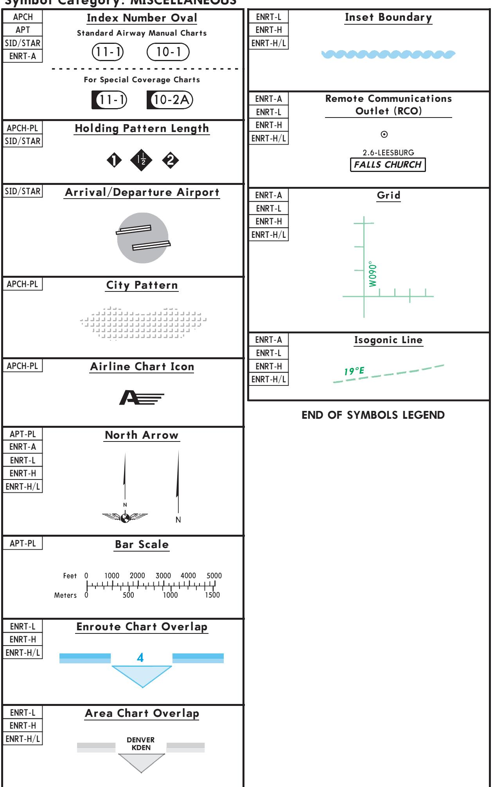

#### **ENROUTE CHART LEGEND**

#### **ENROUTE**

NOTE: This section of the Jeppesen legend pages provides a general overview regarding the layout and depiction of Enroute Charts.

Jeppesen Enroute Charts are compiled and constructed using the best available aeronautical and topographical reference charts. Most Enroute Charts use the Lambert Conformal Conic projection. The design is intended primarily for airway instrument navigation to be referenced to cockpit instruments. The following pages briefly explain the information used on Enroute charts throughout the world. Not all items explained apply to all charts. The Enroute chart is divided into specific areas of information as illustrated below.

#### **ENROUTE CHART FORMAT**

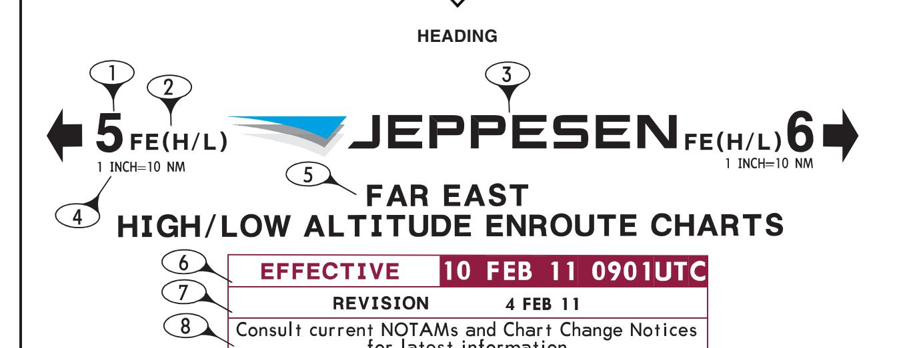

- 1 Chart number.
- 2 Chart name.
- 3 Jeppesen company logo.
- 4 Chart scale.
- 5 Chart region and type.
- 6 Chart effective date.
- 7 Chart revision date.
- 8 Chart Change Notice cross reference statement.

**ENROUTE-2 INTRODUCTION** 3 AUG 12

#### **COVERAGE DIAGRAM**

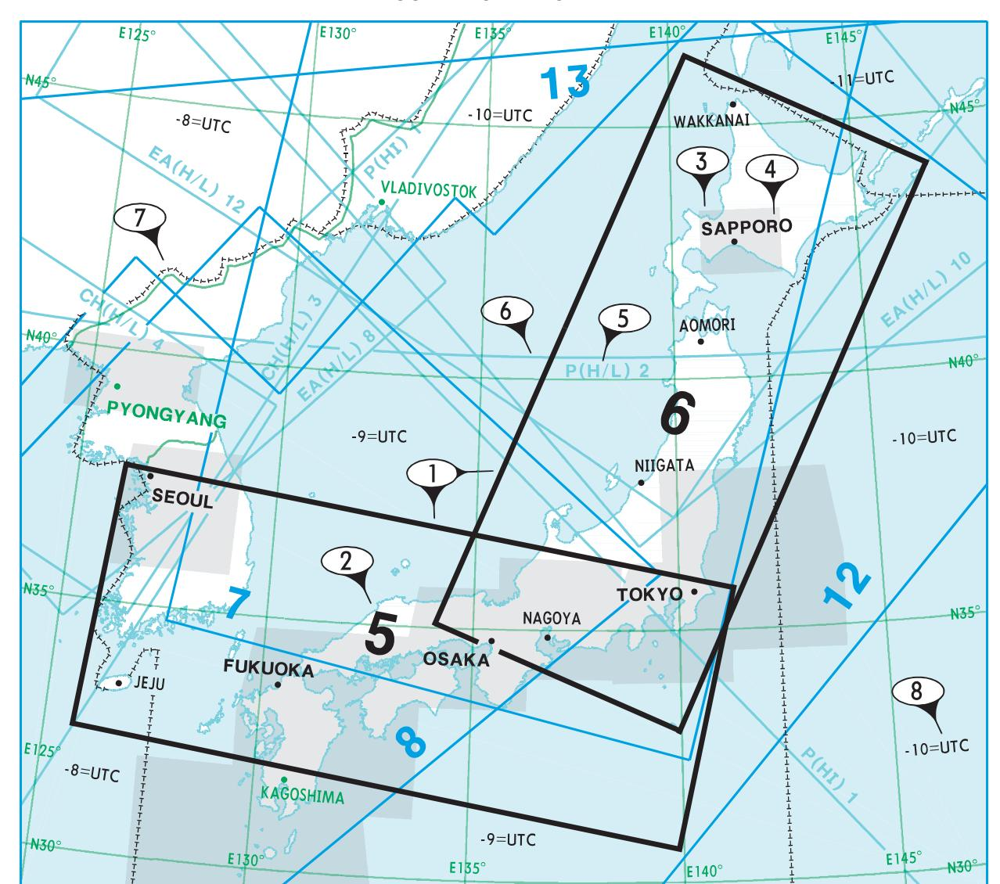

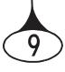

- 1 Chart coverage neatline.
- 2 Chart number.
- 3 Area Chart geographic coverage.
- 4 Area Chart location name.
- 5 Overlapping Enroute Chart name.
- 6 Overlapping Enroute Chart geographic coverage.
- 7 Time Zone Boundary
- 8 Time Zone Designator
- 9 Chart intent note.

#### **CHANGES**

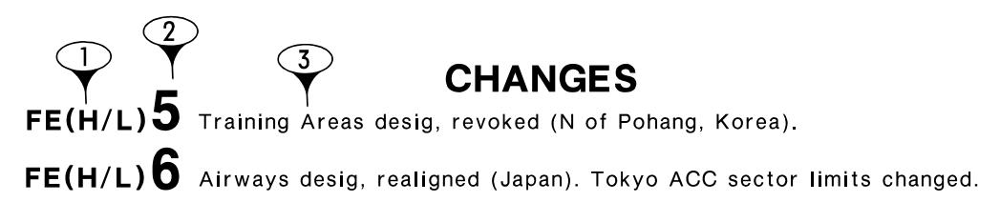

- 1 Chart name.
- 2 Chart number.

3 — Change note providing main changes made since previous revision.

#### **AIRSPACE LIMITS AND CLASSIFICATION**

| <u> </u>                                          |       |                             |                 |       | 3                  |  |  |
|---------------------------------------------------|-------|-----------------------------|-----------------|-------|--------------------|--|--|
| LIMITS AND CLASSIFICATIONS OF DESIGNATED AIRSPACE |       |                             |                 |       |                    |  |  |
|                                                   | CLASS | LOWER- RNAV -UPPER          |                 | CLASS | LOWER- RNAV -UPPER |  |  |
| INCHEON FIR                                       | (E)   | GND - <b>FL 195</b> - FL245 | FUKUOKA FIR     | (A)   | FL290 - UNL        |  |  |
| AIRWAYS                                           | (A)   | FL200 - FL600               |                 | (E)   | GND - FL290        |  |  |
|                                                   | (D)   | 8000 - FL200                | FUKUOKA OCEANIC | (A)   | FL200 - UNL        |  |  |
|                                                   |       |                             | CTA             | (E)   | GND - FL200        |  |  |

- 1 FIR/UIR, Country or Controlled airspace name. 3 Airspace vertical limits.
- 2 Airspace classification.

#### **TABULATED DATA**

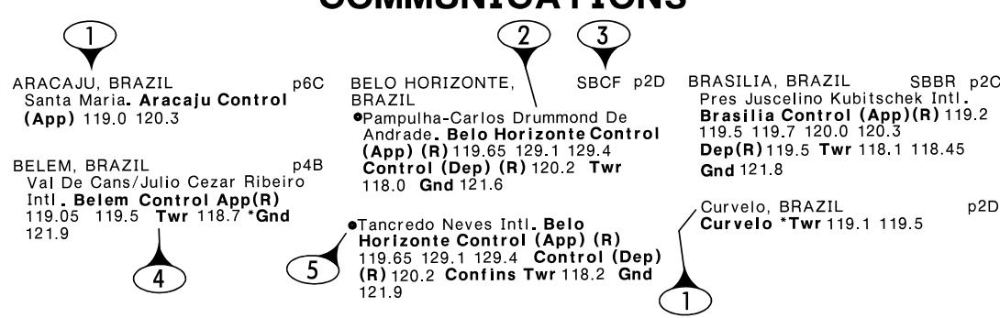

- 1 Airport Location name. IFR = Upper case. VFR = Upper/Lower case.
- 2 Airport name.
- 3 Charted location is shown by Area chart and/or panel number-letter combination.
- 4 Communication information (includes call name, App, Arr, Dep, Twr, Gnd).

#### **BOLD NAME** – Voice Call

- T–Transmit only.
- G Guard only.
- \*–Part time operation.
- X On request.
- (R) Radar capability.

Airport Broadcast Service frequencies (ATIS, ASOS, AWOS, etc.) are positioned over the airport label on face of chart.

Common EMERGENCY 121.5 – not listed

Refer to Glossary and Abbreviations in Introduction pages for further explanations.

5 — Bullet indicates multiple airports under same Location name.

**ENROUTE-4 INTRODUCTION** 2 MAR 12

#### **SPECIAL USE AIRSPACE**

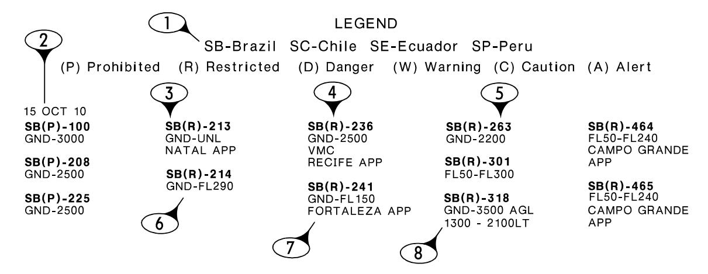

- 1 Legend which includes: Affected Country ICAO ident Charted airspace types
- 2 Tabulation change date.
- 3 Country ICAO ident.
- 4 Airspace type.
- 5 Airspace ident.
- 6 Airspace vertical limits.
- 7 Airspace clearance approval agency.
- 8 Times of Operation. H24 if not specified.

NOTE: Special use Airspace between GND/MSL and 2000' is not depicted on Enroute and Area charts in several regions.

#### **REFERENCE NOTES**

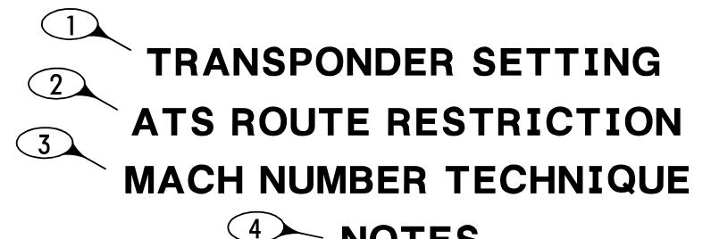

- 1 Settings and Procedures for Transponder Operations.
- 2 Restrictions associated with ATS routes within a given FIR or UIR.
- 3 Procedures for Mach Number reporting within a region or FIR/UIR.
- 4 Notes which have operational significance to charted features.
- 5 Procedures for RVSM Operations within a region or FIR/UIR.
- 6 Procedures and RNP values listed for airways within a region or FIR/UIR.

#### **CRUISING LEVELS**

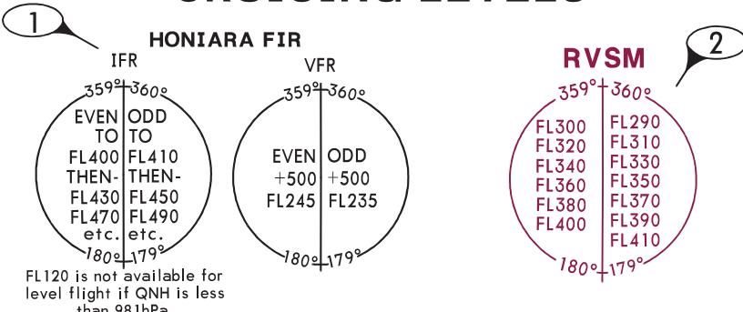

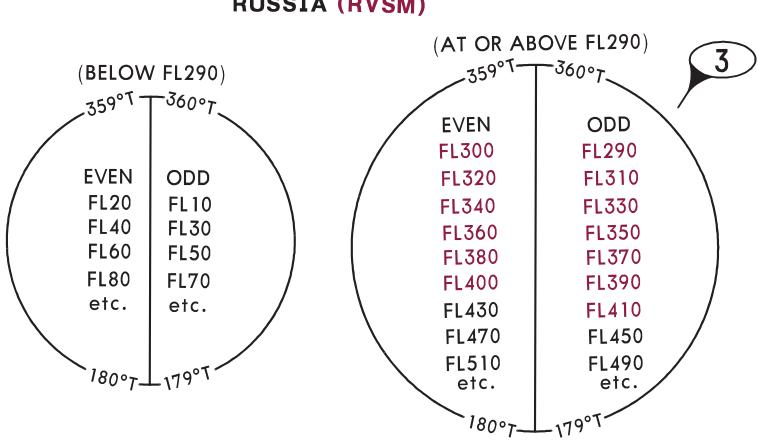

- 1 Country and/or ICAO specified cruising altitudes/levels.
- 2 Standard RVSM Cruise Table associated with charted RVSM airspace. Non standard flight levels are depicted on the chart underneath the airway designator.
- 3 Cruise Table which incorporates both Conventional and RVSM cruising altitudes/levels.

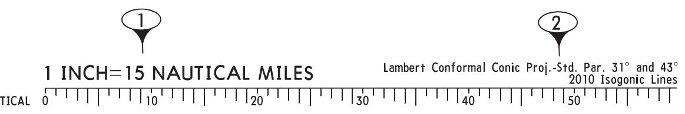

- 1 Chart scale in Nautical Miles.
- 2 Chart Projection.

#### **END PANEL**

End Panels on Jeppesen Enroute Charts are primarily used for additional tabulated and reference information which can not all fit on the Cover Panel.

#### **CHART GRAPHIC**

The contents of an IFR Enroute chart include information provided by official government source, as well as, on rare occasion Jeppesen derived data. Charts are comprised of aeronautical data, cultural data, hydrography and on some charts terrain data. 1343088774871

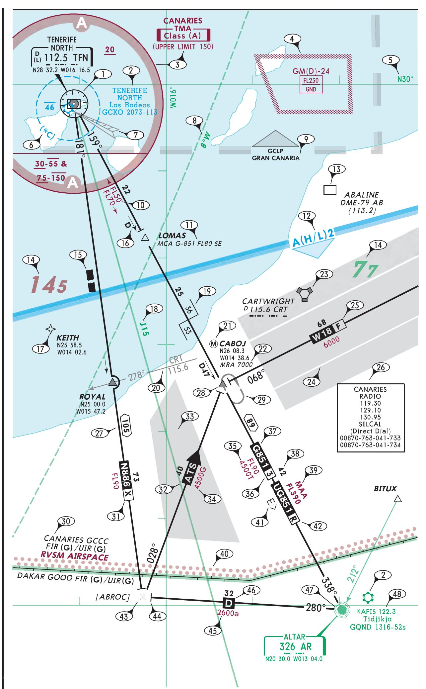

- 1 VORDME. Low and High/Low charts include a Compass Rose with VHF Navaids. Shadow box indicates navaid is airway component, with frequency, identifier, Morse code and INS coordinates. Small "D" indicates DME/TACAN. Class indicated by: (T) Terminal, (L) Low, (H) High.
- 2 Airports Location name, Airport name (if different than Location name), ICAO identifier, airport elevation and longest runway length to nearest 100 feet with 70 feet as the dividing point (add 00). "s" indicates soft surface, otherwise hard surface. IFR Airport in blue-Published procedures filed under the location name. VFR airport in green.
- 3 Controlled Airspace. Limits add 00. When sectorized vertically, lower limit indicated by under bar, upper limit indicated by over bar.
- 4 Special use airspace.
- 5 Grid Lat-Long values.
- 6 CTR. Asterisks are used in association with Class C, D and E airspace in the US only to indicate part time operations, otherwise hours are H24.
- 7 ILS available at airport.
- 8 Magnetic Variation.
- 9 Area chart coverage.
- 10 Directional MEAs.
- 11 Minimum Crossing Altitude (MCA).
- 12 Change to adjoining Enroute chart.
- 13 DME.
- 14 Grid MORA. Values 10,000 feet and greater are maroon. Values less than 10,000 feet are green. Values are depicted in hundreds of feet.
- 15 Gap in Nav Signal coverage.
- 16 "D" indicates DME/TACAN fix. Segment mileage is DME/TACAN distance from navaid. Arrow without a "D" designates a reporting point from facility.
- 17 Non Compulsory RNAV Waypoint.
- 18 High Altitude Route included on some low charts for orientation only.
- 19 Changeover Point between two navaids.
- 20 Intersection or fix formation (Bearing, frequency and ident of remote VHF or LF navaid).
- 21 Met report required.
- 22 Minimum Reception Altitude (MRA).
- 23 VORTAC High Altitude and off-route Navaids do not include a Compass Rose.
- 24 Uncontrolled airway or advisory route.
- 25 Route Suffix. D or F indicates ATC Advisory services only. F or G indicates Flight Information services only.
- 26 Enroute Communications.
- 27 Total mileage between Navaids.
- 28 Compulsory Reporting Point represented by screened fill. Non Compulsory Reporting point is open, no fill.
- 29 Holding pattern.
- 30 FIR/UIR Boundary name, identifier and Airspace Class.
- 31 Route usability by non B-RNAV equipped aircraft (within Europe only).
- 32 Unnamed, official published ATS route with direction indication.
- 33 Uncontrolled Airspace (Class F or G).
- 34 GPS MEA.
- 35 Minimum Obstruction Clea rance Altitude (MOCA).
- 36 Conditional Route Category (See Enroute Text pages Europe).
- 37 Airway Designator.
- 38 Segment mileage.
- 39 Maximum Authorized Altitude (MAA).
- 40 CNS/ATM Equipment Requirement Boundary.
- 41 Non Standard Flight Levels (Even Flight Levels in direction indicated).
- 42 RNAV ATS route when not identified by designator (used outside Europe).

- 43 Named or unnamed airspace fix or mileage break. Database identifiers are enclosed in square brackets [ABROC]. They may be designated by the State (country) as Computer Navigation Fixes (CNFs) or derived by Jeppesen. These identifiers should not be used in filing flight plans nor should they be used when communicating with ATC; however they are also included in computer planning systems. They are shown only to enable the pilot to maintain orientation when using charts in concert with database navigation systems.
- 44 Altitude Change.
- 45 Route Minimum Off-Route Altitude (Route MORA).
- 46 Direct Route (Requires ATC Approval, will not be accepted in Flight Plans).
- 47 NDB.
- 48 Communications related to Airport listed above Airport label. App/Arr, Dep, Twr and Gnd listed in Chart tabulations. Asterisk indicates part time operation.

#### **10–1B CHART LEGEND**

10-1B charts depict the horizontal and vertical limits of Terminal airspace established by official source publications and provide orientation details for flights operating within the area. Associated airport communications are also included.

10-1B charts depicting US Class B airspace also includes general IFR and VFR Flight Procedures appropriate to that particular area.

#### **SAMPLE 10–1B CONTENT**

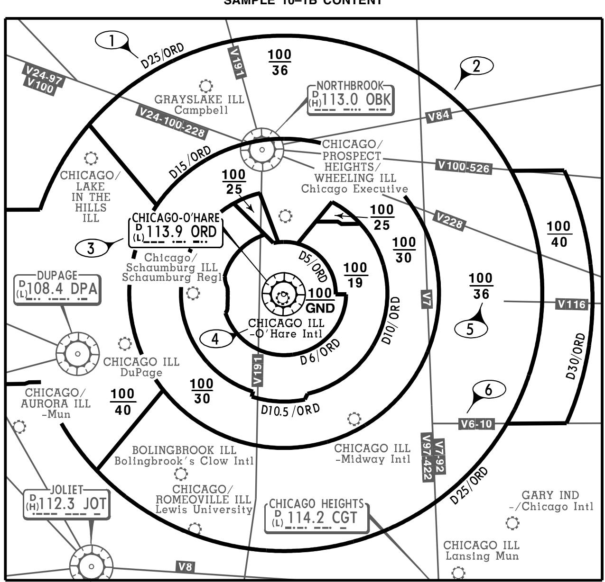

- 1 DME arc distances used to define the Terminal airspace.
- 2 Bold line represents the horizontal limits of the Terminal airspace and airspace sectors.
- 3 Primary navaid used to further define the horizontal limits of the Terminal airspace.
- 4 Primary airport is shown in bold print.
- 5 Vertical limits of the Terminal airspace within charted sector in hundreds of feet.
- 6 Screened information provided for orientation purposes. This includes airway information, airports and navaids. 1297445655000

#### **END OF ENROUTE CHART LEGEND**

#### **SID/DP AND STAR CHART LEGEND**

The SID & STAR section of the Jeppesen legend provides a general overview and depiction of Standard Instrument Departure (SID), Departure (DP), Standard Terminal Arrival Route/Standard Instrument Arrival (STAR), and Arrival charts. These charts are graphic illustrations of the procedures prescribed by the governing authority. A text description may be provided, in addition to the graphic, when it is supplied by the governing authority. All altitudes shown on SID/DP and STAR charts are MSL unless otherwise specified. All mileages are nautical, all radials and bearings are magnetic unless otherwise specified.

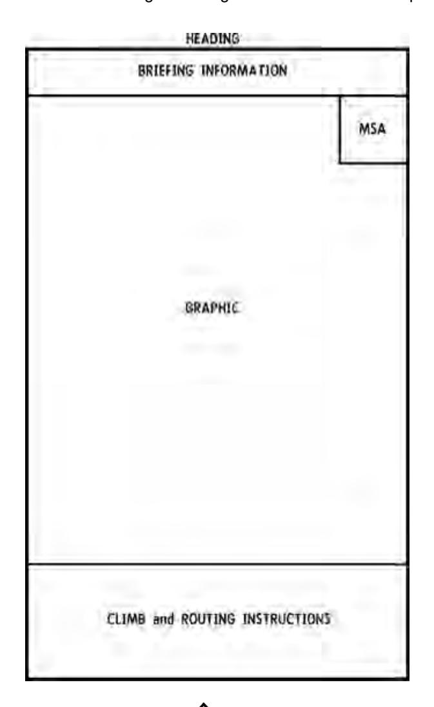

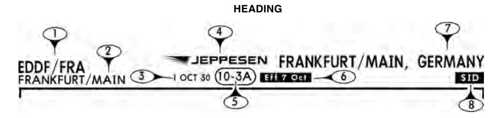

- 1 ICAO indicators and IATA identifiers. 6 Chart effective date.

- 4 Jeppesen company logo.
- 5 Index number.

Charts are sequenced alphabetical or by runway number within similar type arrivals or departures.

- 2 Airport name. 7 Geographical location name.
- 3 Chart revision date. 8 Chart type identifier.

#### **BRIEFING INFORMATION**

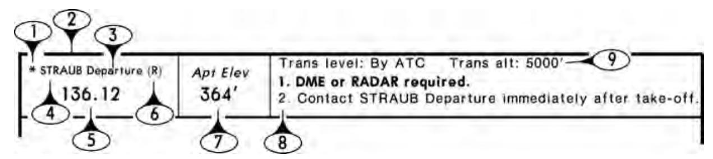

- 2 SID/DP Initial Departure Control Services 6 Indicates that radar services are available. or STAR Weather Services (e.g. ATlS) are depicted.
- 3 Function of the service is shown when applicable.
- displayed. 4 Service call sign is shown when transmit and receive, or transmit only ops are available. The call sign is omitted when the service is broadcast only or has a secondary function.
- 1 Indicates the service is part time. 5 All available primary frequencies are depicted.

  - 7 Airport elevation is provided for Arrival/Departure airport.
  - 8 Procedure restrictions and instructions. Required equipment notes are prominently
  - 9 Transition Level and Altitude.

#### **MINIMUM SAFE or SECTOR ALTITUDE (MSA)**

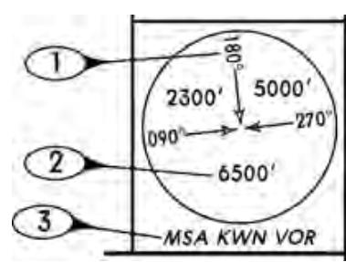

- 1 Sector defining Radial/Bearing, always depicted inbound for the Navaid, Fix or Airport Reference Point (ARP).
- 2 Minimum safe/sector altitude.
- 3 Navaid/Fix/ARP the MSA is predicated on.

NOTE: Normal coverage is a 25 NM radius from the forming facility/fix. If the protected coverage is other than 25 NM, that radius is depicted below the forming facility/fix. MSA is provided when specified by the governing authority for any procedure serving the airport.

#### **CLIMB and ROUTING INSTRUCTIONS TABULATED TEXT BOX**

Text description might be provided, in addition to the graphic, when it is supplied by the governing authority. Text should be used in conjunction with the graphic to fully understand the procedure to be flown. Neither the text nor the graphic is a stand alone representation of all instructions, speed, and altitude restrictions, but are a combined representation of the procedure.

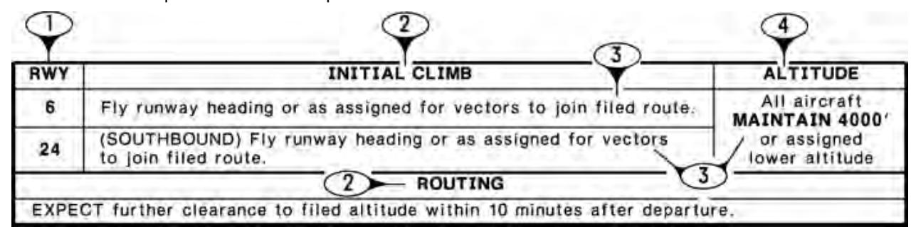

Tabulated Text boxes, which include a wide variety of actions, instructions, or restrictions for the pilot, have certain common elements of design for SID, DP and STAR procedures.

- 1 General identification applying to certain sections of the procedure, such as Runway, Arrival or SID identification.
- 2 Segment of flight, such as Initial Climb, Routing, or Landing may be identified.
- 3 Textual description, which compliments the graphic-based depictions or unique instructions, that cannot be graphically represented.
- 4 General restriction that cannot be incorporated in the graphic or that would enhance understanding of procedure.

#### **GRAPHIC—INFORMATION BOXES**

Information boxes are generally tied to the track, fix, or navaid to which the information applies. The content is associated with the graphic depiction on SID, DP, and STAR charts. Information boxes include a wide variety of actions, instructions, or restrictions.

Though information boxes vary widely based on the complexity of procedures, they do have certain common elements of design.

- 1 Heading, if included, represent the who, what, where, or why of the information box.
- 2 Instruction lines are used to separate instructions and conditions for improved clarity.
- 3 Instructions or conditional statements associated with track, fix, navaid, or procedure.

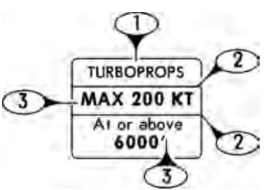

#### **GRAPHIC — LOST COMMUNICATIONS PROCEDURE**

Unique lost communication instructions, provided by the governing authority for a procedure, are placed within the graphic and are outlined by the lost communication boundary.

#### **GRAPHIC—SPEED RESTRICTIONS**

Speed restrictions that apply to the entire procedure are shown below the procedure title.

Speed restrictions vary widely within individual procedures. They can be in the tabulated text, boxed, and/or placed in information boxes at the associated track, fix or phase of flight.

#### **GRAPHIC — STARTING POINT AND END POINT OF STAR, DP, AND SID PROCEDURES**

Navaids, intersections, or waypoints identified in the procedure title are shown prominently for easy identification of the starting points on STARs, and the ending points on SID or DP procedures.

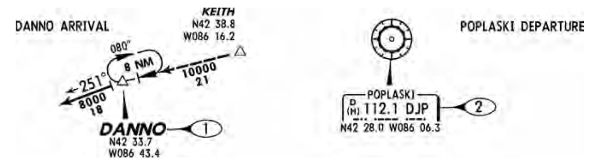

- 1 Intersection or waypoint names are shown in larger text.
- 2 Navaid boxes include a shadowed outline.

#### **GRAPHIC**

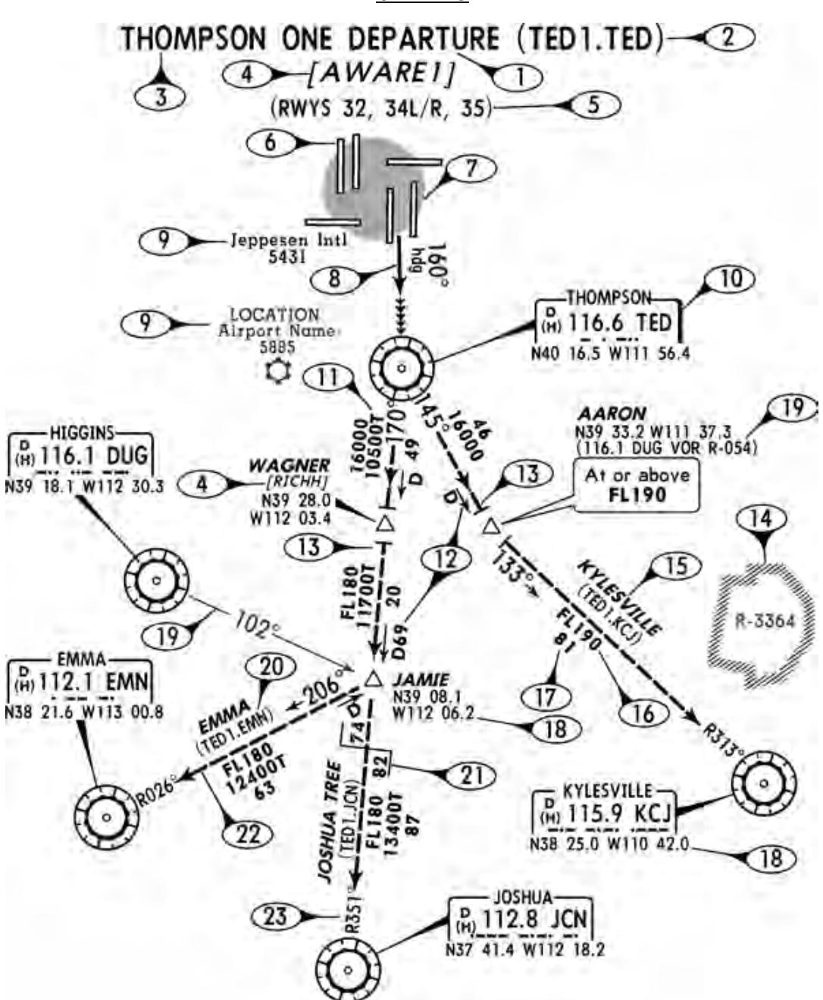

- 1 Type of procedure.
- 2 Arrival/Departure code.
- 3 Arrival/Departure name.
- 4 Database identifiers are included when different than the Arrival/Departure code or name.
- 5 Specified qualifying statements, such as runways, navigational requirements, or aircraft type.
- 6 Runway layout is provided for all hard surface runways.
- 7 Arrival/Departure airport is highlighted with circular screen.
- 8 Arrival/Departure track of procedure represents a common course used by multiple transitions.
- 9 Airport is listed only when SID, DP, or STAR also serves multiple airports, which are screened.
- 10 Starting Point of STAR and end point of SID/DP procedures are shown prominently.
- 11 T placed after altitude denotes a Minimum Obstruction Clearance Altitude (MOCA).
- 12 Radial and DME forms the fix. The DME, if not displayed is the segment distance, if shown it is the total distance from the forming Navaid.
- 13 Altitude T is placed when the altitude changes alongatrack at other than a Navaid.
- 14 Certain Special Use Airspace Areas are charted when referenced in procedure source. 1329502730348

#### **SID/DP AND STAR CHART LEGEND** q\$i

- 15 Transition name placed on the last segment of the SID/DP and the first segment of STAR procedures.
- 16 Minimum Enroute Altitude (MEA) unless otherwise designated.
- 17 Segment distance.
- 18 Coordinates of fix or Navaids.
- 19 Formation radials are presented in many ways based on Navaid position & compositional space.
- 20 Route identification code.
- 21 At the Changeover point, the pilot changes primary navigation to the next Navaid.
- 22 Transition track.
- 23 VOR radial on which aircraft is flying inbound towards the Navaid. 1409754014530

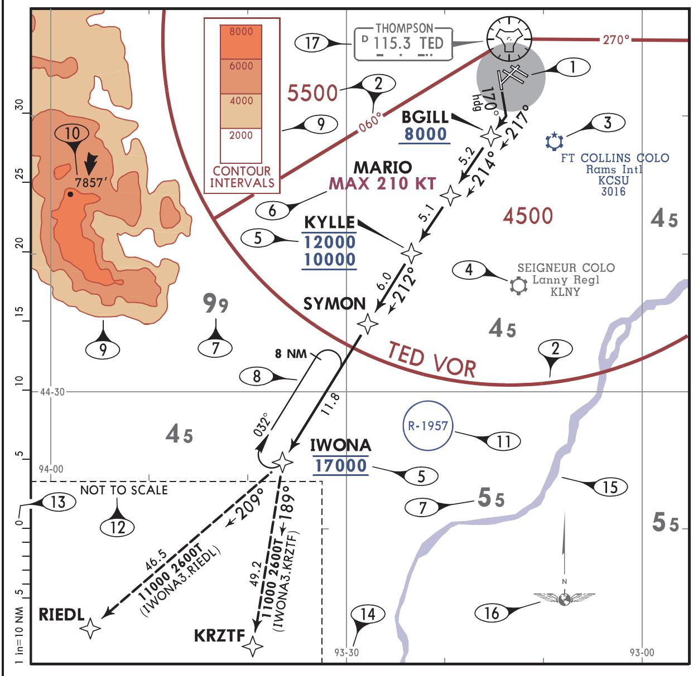

SID/STAR-6 INTRODUCTION 27 JAN 17 JEPPESEN

#### SID/DP AND STAR CHART LEGEND

- 4 All IFR airports not served by the procedure that are located within the boundaries of the To-Scale portion of the procedure graphic are shown using a subdued grey color. For procedures under the jurisdiction of the FAA, only those airports not served by the procedure and with at least one hard surface runway 6000' or greater in length will be shown using a subdued grey color.
- 5 Procedure altitude restrictions are depicted blue in color and use line-work above and or below the value to indicate usage. See the following table for the meaning of each depiction:

| Depiction      | Altitude Usage                                             |
|----------------|------------------------------------------------------------|
| 8000           | Minimum Altitude At or Above Altitude Above Altitude |
| 8000           | Maximum Altitude At or Below Altitude Below Altitude |
| 8000           | Recommended Altitude                                       |
| 8000           | Mandatory Altitude At Altitude                          |
| 12000 10000 | Minimum & Maximum Altitudes Between Altitudes        |

6 – Speed restrictions are shown in magenta. Speed restrictions are at times, combined with procedure altitudes.

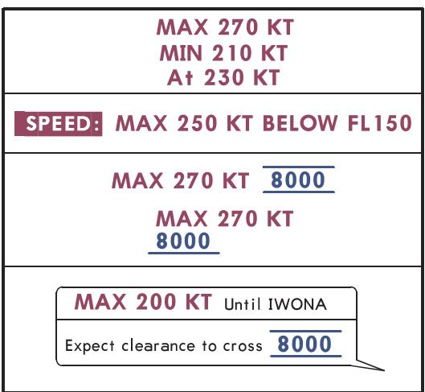

- 7 Within To-Scale areas grid MORAs will be depicted with latitude/longitude defining the applicable sector. Sectors are formed by 30 minutes or one degree of latitude and longitude. The MORA value is shown using a large and small number. The large numbers represent thousands and the small numbers represent truncated hundreds. All Grid MORA values are shown using a grey color.
- 8 Holding pattern leg lengths are depicted to scale. When a holding limit has been defined as a DME distance or NM leg length, those limits are shown along the outbound leg.
- 9 Generalized terrain contours may be depicted based on several geographic factors. The elevation values applicable to the contour lines shown are indicated within a contour legend.
- 10 The highest terrain high point or man-made structure that falls within the To-Scale portion of the graphic is shown and highlighted with an arrow.
- 11 Special use airspace that has been identified by the State Authority as having significance are shown with a blue line indicating the outer boundaries.
- 12 NOT TO SCALE insets will be used for the depiction of transition information when the chart scale used does not facilitate a to-scale depiction of the entire procedure. Information within the area indicated is depicted not to scale.
- 13 The scale used for graphic depiction is indicated.
- 14 Latitude/Longitude tics are shown in 10 minute increments along the neat line. The appropriate 30 minute or 1 degree tics are extended to form the MORA grid.
- 15 Large rivers and water bodies are shown.
- 16 Normally the graphic will be oriented with north being towards the top of the chart. At times a much better depiction can be obtained by using a different orientation. A north arrow is always shown to indicate the type of orientation used.
- 17 Secondary navaid boxes, for navaids not directly used for procedure navigation, will be depicted using a grey color to differentiate them from primary navaids.

#### **END OF SID/DP AND STAR LEGEND**

#### **AIRPORT CHART LEGEND**

#### **AIRPORT**

NOTE: This section of the Jeppesen legend provides a general overview regarding the depiction of airport diagrams and associated information.

The following briefly explains the symbology used on airport charts throughout the world. Not all items explained apply to all charts. The airport chart is divided into specific areas of information as illustrated below. To enhance the usability for larger airports, the Communications and Airport Planview sections are depicted on one side of the chart. An added Notes Section along with the Additional Runway Information, Take-off minimums, and Alternate minimums sections are depicted on the reverse side of the chart.

#### **FORMAT**

#### **HEADING**

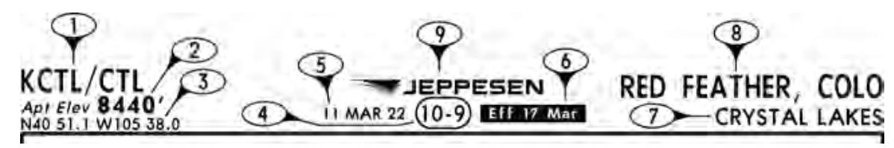

- 1 ICAO indicators and IATA airport identifiers.
- 2 Airport elevation.
- 3 Airport geographic latitude and longitude shown in degrees, minutes, and tenths of minutes.
- 4 Chart index number. Same as the first approach reverse side. chart when the airport chart is printed on the
- 5 Chart revision date.
- 6 Chart effective date.
- 7 Airport name.
- 8 Geographic location name.
- 9 Jeppesen company logo.

#### **AIRPORT CHART LEGEND** q\$i

#### **COMMUNICATIONS**

For Communications Information See Approach Chart Legend — Page APPROACH-2

# **AIRPORT PLANVIEW**

- 1 The planview is a "To Scale" graphical depiction of the airport layout, a latitude/longitude grid in degrees, minutes, and tenths of minutes is depicted along the inside of the neat line.
- 2 The airport magnetic variation is graphically and numerically depicted.
- 3 Airport operational notes are placed within the planview. Notes pertaining to a specific area are placed within the area or tied to it.
- 4 Runway designators (numbers) are magnetic unless followed by a "T" for true. Runway bearings are included when known.
- 5 Physical length of the runway which does not include stopways, overruns, or adjustments for displaced thresholds. Shown in feet with the meter equivalent included at International Airports.
- 6 The runway end elevation is depicted when known.
- 7 When applicable, the physical location of displaced thresholds along the runway are shown.
- 8 Stopping points along the runway are depicted for Land and Hold Short Operations.
- 9 "Hot Spot" areas are depicted along with a corresponding label when applicable. A textual description is included within the planview or below the additional runway information band.
- 10 When available, stopways and overruns are depicted with the applicable length.
- 11 When known, the location of RVR transmissometers are shown with any applicable identifiers.
- 12 All active taxiways and ramp areas are depicted usingagrey area fill color. All taxiway identifiers and ramp names are included when known.
- 13 All known permanently closed taxiways are shown.
- 14 One of two depictions is used for closed runways depending on the nature of the closure:
  - a. Lengths and designators (numbers) are retained when the closure is temporary.
  - b. Lengths and designators (numbers) are removed when the closure is permanent.
- 15 The configuration and length of all known approach light systems are shown. 1363984942909

#### AIRPORT CHART LEGEND

- 16 All seaplane operating areas/water runways a re shown. Runway numbers are followed by a "W", the physical length is included along with elevations.
- 17 The geographical location of the Airport Reference Point (ARP) is depicted when known.
- 18 Areas under construction are outlined using a light dashed line.

15 NOV 19

- 19 When known, the location of the airport identification beacon is shown.
- 20 Buildings on or near the airport are depicted.
- 21 Roads on or near the airport are depicted if referenced in a Caution, Alert or Be Aware note.
- 22 Location of Engineered Materials Arresting System (EMAS) pads are shown and labeled.
- 23 All known wind direction indicators are depicted.
- 24 Helicopter landing pads/areas.
- 25 The geographical location of on airport VORs and NDBs is indicated and labeled.
- 26 Pole lines that are on or near the airport are depicted.
- 27 All known terrain high points and man-made structures with an elevation 50 feet above the nearest rwy end elevation are depicted. The applicable symbol and elevation are shown.
- 28 Special use airspace, area outline and designator are depicted. A note, "Entire Chart Lies Within R-XXXX", is shown when the entire chart planview falls within a particular area.
- 29 A scale for both feet and meters that is equivalent to the chart scale is shown.
- 30 Hazard beacons within the planview are depicted along with an elevation if known.
- | 31 Railroads on or near the airport are depicted if referenced in a Caution, Alert or Be Aware note.
  - 32 Ditches in the vicinity of the airport are depicted.
  - 33 Tree lines are depicted. An open ended tree line indicates the border of a forested area.
  - 34 Bluffs are shown with the arrows of the symbol pointing down, or toward lower elevation.

#### ADDITIONAL RUNWAY INFORMATION USABLE LENGTHS LANDING BEYOND Glide LAHSO Threshold Distance Slope TAKE-OFF WIDTH 2) T (3) (4) (5 7 (8) 9 6 (10) ad

#### ADDITIONAL RUNWAY INFORMATION BAND

NOTE: For an explanation of the abbreviations used within the Additional Runway Information Band, see the Abbreviations Section. All distances depicted in the Additional Runway Information Band are in feet, the meter equivalent is also shown at International airports.

- 1 Runway designators/numbers are depicted in the upper left and lower right corners of the box. All information shown to the right within the band applies to the indicated runways. When the information differs between runways, the band is separated with a line.
- 2 All operational runway lighting and approach light systems are listed.
- 3 Runway surface treatment (grooving) is indicated.
- 4 "RVR" is depicted when one or more transmissometers are installed along the runway.
- 5 When different from the physical runway length, landing distance beyond threshold is shown.
- 6 When applicable, the distance from a point abeam the glide slope transmitter to the roll-out end of the rwy is shown. For PAR, the distance is from the GS interception with the runway.
- 7 At airports with Land And Hold Short Operations (LAHSO), the distance from the runway threshold to the designated hold short point is shown.
- 8 When take-off length is restricted, the physical rwy distance available for take-off is shown.
- 9 The physical width of the runway is shown.
- 10 This band is expanded to show information for all operational runways in numerical order.
- 11 All notes related to the runway information depicted are shown in this section.

#### AIRPORT CHART LEGEND

#### **TAKE-OFF MINIMUMS (Eff Jan 2020)**

Publication of take-off minimums does not constitute authority for their use by all operators. Each individual operator is responsible for ensuring that the proper minimums are used based on authorization specific to the type of operation.

Take-off minimums are supplied for all airports. When the Governing State Authority has not provided take-off visibilities, they will be derived by Jeppesen based on ICAO Doc 9365 Manual of All Weather Operations. For take-off minimums rules and tables refer to AIR TRAFFIC CONTROL — Aerodrome Operating Minimums JEPPESEN.

A "Std" label in the upper left corner of the minimums box indicates that the published visibilities are ICAO Doc 9365 compliant. Other labels, as described in Landing Minimums Legend, indicate compliance with other regulations.

Wide variations exist regarding take-off minimums depending on the governing agency, typically though they consist of a visibility/ceiling and associated required conditions for use.

Generally, take-off minimums are shown in order of best (lowest) to worst (highest) starting at the top left and progressing to the bottom right of the format. This applies to the overall minimums box as well as for a particular runway or set of runways. Runway numbers will only be included if the State provides specific take-off minimums for a particular runway. The charted take-off minimums depend on runway lighting/equipment but may not be applicable for all runways. Pilots have to select the correct column according to the operational runway lights/equipment.

VIS and ceiling values are shown in feet, statute miles, meters or kilometers. RVR is shown in hundreds of feet or whole meters.

A VIS is always labeled with "V", an RVR is always labeled "R" and values which could be both are labeled "R/V".

Altitudes listed within climb gradients requirements are above Mean Sea Level (MSL). Ceilings specified for take-off are heights Above Airport Level (AAL).

Typical format used for charting take-off minimums:

- Take-off minimums header indicating the contents of the minimums box.
- 2 If required, runway number/numbers, minimums below apply to the designated runway(s).
- 3 General conditions, those that affect a wide range of the depicted minimums.
- 4 If required, type of aircraft information is depicted here, typically in the form of number of aircraft engines or aircraft approach categories as published by the State.
- 5 More specific conditions, those that affect only a few of the minimums.
- 6 Very specific conditions, those that affect only the minimums directly below.
- 7 Ceilings and RVR/met VIS authorized based on the conditions and runways listed above. When ceiling and visibilities are listed, both are required. In this format example, the minimums of this column would represent the best (lowest) available take-off minimums.
- 8 Ceilings and visibilities authorized based on the conditions above, minimums typically become "higher" with less restrictions.
- 9 The use of abbreviations is prevalent within the take-off minimums band given that many of the conditions/restrictions have lengthy explanations. See Chart Glossary and Abbreviations section for a more detailed description.
- 10 The take-off minimums for a given set of conditions can differ based on aircraft type. Separate minimums are depicted for each aircraft type scenario.
- 11 Usually the term "Other" is used to describe take-off minimums having no conditions.
- 12 This being the farthest minimum box to the right, it would generally contain the highest set of take-off minimums with the least number of conditions for that particular runway.

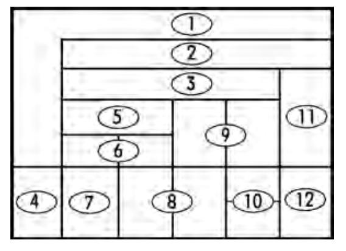

#### **AIRPORT CHART LEGEND** q\$i

|                             | (15) Rwys 07C/R, 18, 25L/C |                                         |           |          |            |            |                    |         |      |
|-----------------------------|----------------------------|-----------------------------------------|-----------|----------|------------|------------|--------------------|---------|------|
| HIRL & CL                   | DI & CI &                  | DI 0 CI                                 | RL & RCLM | RL or CL | RL or RCLM | RL or CL   | . Adequate Vis Ref |         |      |
| (spacing 15r & releva    |                            | relevant RVR                            | RL. &. CL | DAY      | NIGHT      | DAY        | NIGHT              | DAY     | NIGH |
| TDZ R Mid R Rollout R | 125m                       | TDZ R150m Mid R150m Rollout R150m | R200m     | 17 R30   | 00m        | 18 R/V4 | 00m                | R/V500m | NA   |

| Std                                                                             |                                      | TAKE    | -OFF 🛮    |          |            |                  |       |
|---------------------------------------------------------------------------------|--------------------------------------|---------|-----------|----------|------------|------------------|-------|
| HIRL & CL (spacing 15m or less)                                              | RL & CL &                            | RL & CL | RL & RCLM | RL or CL | RL or RCLM | Adequate Vis Ref |       |
| & relevant RVR                                                                  | relevant RVR                         | RL & CL | DAY       | NIGHT    | DAY        | DAY              | NIGHT |
| тр <b>z R125m</b> мід <b>R125m</b>                                           | тDZ <b>R150m</b> міd <b>R150m</b> | R200m   | DZ        | 00m      | R400m      | R/V500m          | NA    |
| Rollout R125m                                                                   | Rollout R150m                        | NZ00III | Kov       | 00111    |            |                  |       |
| ■ RWY 18, 25L, 25R: TDZ/Mid/Rollout R75m with approved lateral guidance system. |                                      |         |           |          |            |                  |       |

| Std                                                 | TAKE-OFF                       |              |               |                    |       |                  |       |  |
|-----------------------------------------------------|--------------------------------|--------------|---------------|--------------------|-------|------------------|-------|--|
| HIRL & CL (spacing 15m or less)                  | RL & CL &                      | RL & CL      | RL & RCLM     | RL & RCLM RL or CL |       | Adequate Vis Ref |       |  |
| & relevant RVR                                      | relevant RVR                   |              | DAY           | NIGHT              | DAY   | DAY              | NIGHT |  |
| TDZ <b>R4</b> Mid <b>R4</b> Rollout <b>R4</b> | TDZ R5 Mid R5 Rollout R5 | R6           | R10           |                    | R12   | R16 V1/4      | NA    |  |
| ■ RWY. 18,. 25L,. 25R:                              | TDZ/Mid/Rollout R              | 3 with appro | ved lateral c | juidance sy        | stem. |                  |       |  |

#### **AIRPORT CHART LEGEND** q\$i

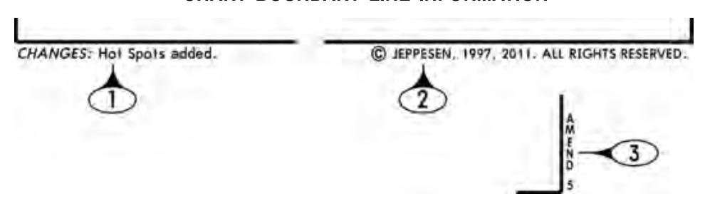

#### **END OF AIRPORT CHART LEGEND**

NOTE: This section of the Jeppesen legend provides a general overview regarding the depiction of approach procedures.

Approach charts are graphic representations of instrument approach procedures prescribed by the governing authority. The following briefly explains the symbology used on approach charts throughout the world. Not all items explained apply to all charts. The approach chart is divided into specific areas of information as illustrated below.

#### **FORMAT**

|   | -  |   | _  | • |   | $\sim$ |
|---|----|---|----|---|---|--------|
| н | ь. | л | 11 |   | N | G      |
|   |    |   |    |   |   |        |

| HEADING                   |      |     |
|---------------------------|------|-----|
| COMMUNICATIONS            | 5    |     |
| APPROACH BRIEFING INFORMA | TION | MSA |
| APPROACH PLANVI           | EW   |     |
| APPROACH PROFILE V        | IEW  |     |
| CONVERSION TABLES         | ICO  | NS  |
| LANDING MINIMU            | MS   |     |

#### **HEADING**

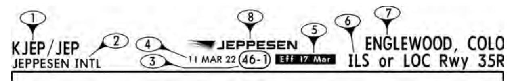

- 1 ICAO indicators and IATA airport identifiers. 5 Chart effective date.
- 3 Index number. Charts are sequenced by runway number within similar type approaches.

- 2 Airport name. 6 Procedure identification.
  - 7 Geographical location name.
- 4 Chart revision date. 8 Jeppesen company logo.

#### **COMMUNICATIONS**

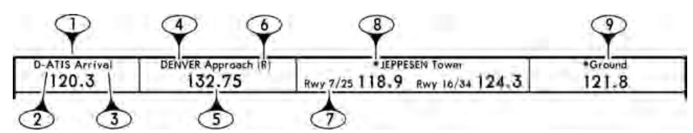

- 1 Communications are shown left to right in the order of normal use.
- 2 Communication service, call sign is omitted when the service is broadcast only.
- 3 Functionality of the service is shown when applicable.
- 4 The service call sign is shown when transmit & receive or transmit only operations are available.
- 5 All available primary frequencies are depicted.

- 6 Indicates that radar services are available.
- 7 Sectors are defined for each frequency when applicable.
- 8 Indicates the service is part time.
- 9 When the service is a secondary function, the call sign is omitted.

#### **APPROACH BRIEFING INFORMATION**

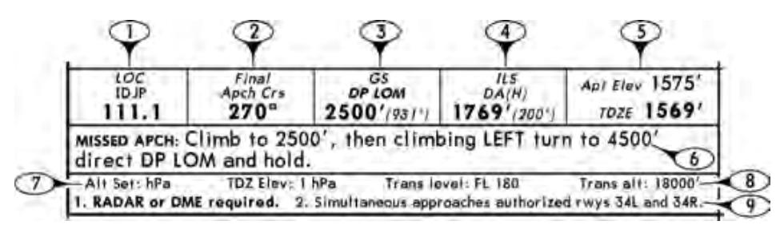

1 — Approach primary Navaid.

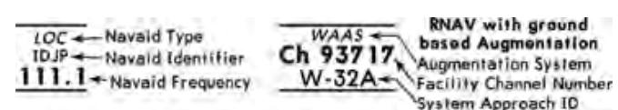

- 2 Final approach course bearing.
- 3 Crossing altitude at the FAF. Glide slope crossing altitude for precision approaches. Procedure altitude (Vertical Descent Altitude or Minimum Crossing Altitude) for non-precision approaches. 1304453542000

- 4 Lowest DA(H) or MDA(H).
- 5 Airport Elevation and Touchdown Zone/Threshold Elevation.
- 6 Textual description of the Missed Approach Procedure.
- 7 Altimeter Setting Information, Barometric Pressure Equivalents are included.
- 8 Airport/Procedure Transition Level and Altitude.
- 9 Notes applicable to the Approach Procedure.

#### **MINIMUM SAFE or SECTOR ALTITUDE (MSA)**

- 1 Sector defining Radial/Bearing, always depicted to the Navaid/Fix or Airport Reference Point (ARP).
- 2 Minimum safe/sector altitude.
- 3 Navaid/Fix/ARP the MSA is predicated on.

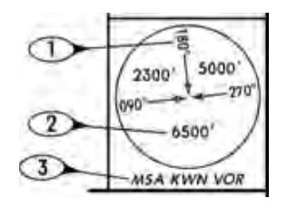

NOTE: Normal coverage is a 25 NM radius from the forming facility/fix. If the protected coverage is other than 25 NM, that radius is depicted below the forming facility/fix.

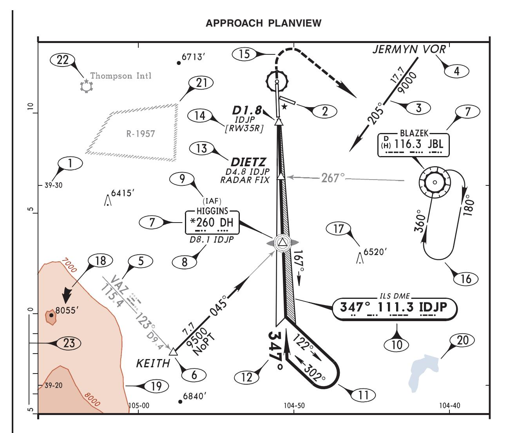

- 1 The planview is a graphical "To Scale" depiction of the approach procedure. Latitude and longitude tics are shown in 10 minute increments along the neatline.
- 2 Complete runway layout is depicted for the primary airport.
- 3 Approach transitions are depicted with a medium weight line. The bearing is normally inset within the track with the mileage and associated altitude placed along the track.
- 4 Off-chart origination navaid/waypoint name. Navaid frequency, ident, and Morse code is shown when required for fix formation.
- 5 VOR cross radials and NDB bearings used in forming a fix. DME formation distances are shown when applicable. Navaid frequency, ident, and Morse code shown as required.
- 6 Airspace fixes depicted using several different symbols according to usage.
- 7 Navaid boxes include the navaid name, identifier, Morse code, and frequency. A letter "D" indicates DME capability with an asterisk indicating part time.
- 8 Substitute fix identification information located below facility box when applicable.
- 9 Initial Approach Fixes and Intermediate Fixes are labeled as (IAF) and (IF) respectively.
- 10 A shadowed navaid box indicates the primary navaid upon which lateral course guidance for the final approach segment is predicated.
- 11 The final/intermediate approach course is indicated with a heavy weight line.
- 12 The final approach course bearing shown in bold text, with a directional arrow as needed.
- 13 Airspace fix names are shown near or tied to the fix, formational info is placed below name.
- 14 Jeppesen-derived database identifiers are depicted when different from State-supplied name.
- 15 The missed approach segment is shown with heavy weight dashed line work.
- 16 Holding/Racetrack patterns are shown with both inbound and outbound bearings. Restrictions are charted when applicable, heavy weight tracks indicate the holding/racetrack is required.
- 17 Some, but not all, terrain high points and man-made structures are depicted along with their elevations. Generally only high points 400' or more above the airport elevation are shown. 1341935460082

- 18 Arrow indicates the highest of the portrayed high points within the planview area only.
- 19 Generalized terrain contours may be depicted based on several geographic factors.
- 20 Rivers/large water bodies are shown. Smaller and seasonal water areas are not depicted.
- 21 Some, but not all, Special Use Airspace boundaries and identifiers are depicted.
- 22 All secondary IFR airports, and VFR airports that lie under the final approach, are depicted.
- 23 Charting scale used is indicated along the left side of the planview.

#### **APPROACH PLANVIEW—RNAV PROCEDURE DIFFERENCES**

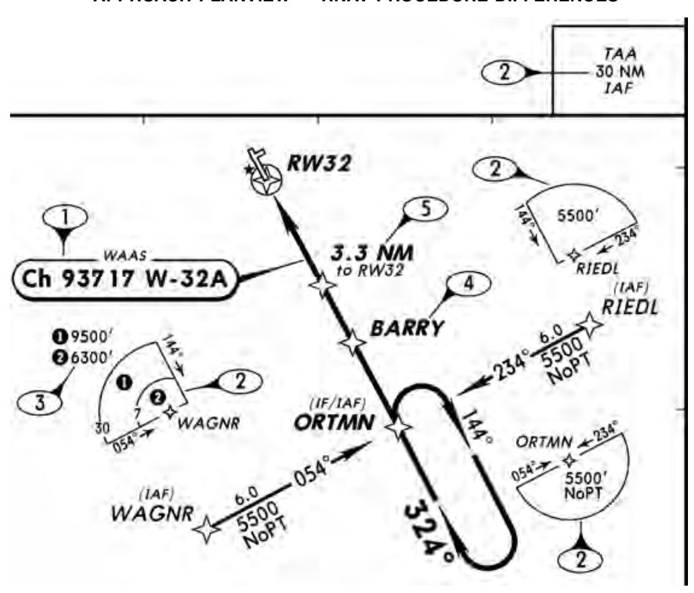

- 1 A primary navaid box is shown for RNAV approach procedures augmented by ground based facilities. The system type, channel, and system approach ID are shown.
- 2 Some RNAV procedures utilize Terminal Arrival Area/Terminal Area Altitude (TAA). A graphical depiction of each TAA sector is placed within the planview in the corresponding area. The TAA's foundational waypoint is depicted along with the forming bearings, arrival altitudes, and applicable NoPT labels. Generally the TAA replaces the MSA as indicated in the MSA box.
- 3 When the normal TAA coverage of 30 NM (25 NM ICAO) from the base waypoint is modified, the segmented areas are depicted with the applicable altitudes indicated.
- 4 Due to the required use of a database, only waypoint names are shown. Formations and coordinates are omitted.
- 5 Along track distances, normally to the next named waypoint, are shown per source for un-named waypoints.

#### **APPROACH PLANVIEW — NOT TO SCALE INSETS**

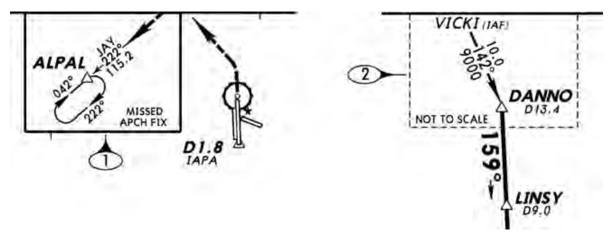

Insets are used to portray essential procedural information that falls outside of the planview boundary. The use of insets facilitates larger scales for depicting core segments of the procedure.

- 1 A solid line is used to outline the inset when the information has been remoted from the associated "To Scale" tracks. Labels inside the inset indicate the usage of the contained procedural information.
- 2 A dashed line is used to outline the inset when the information remains in line with the associated "To Scale" tracks. A NOT TO SCALE label is included inside the inset.

#### **NON·PRECISION RECOMMENDED ALTITUDE DESCENT TABLE**

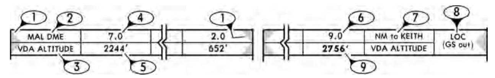

General Description: The Recommended Altitude Descent table, shown to facilitate the CDFA technique, contains "check" altitudes that correlate directly to the Vertical Descent Angle (VDA) used in conjunction with the final approach segment of the procedure. When the State Authority has not supplied this information, Jeppesen will derive the altitudes based on the procedure VDA.

- 1 The direction of the Recommended Altitude Descent table, top of descent down, is sequenced in the same direction as the flight tracks in the profile. A grey arrow indicates this left-to-right or right-to-Ieft direction.
- 2 The source for the DME "checkpoints" is indicated by the navaid ident. When the table is Jeppesen-derived, DME is used whenever possible for the establishment of the checkpoints.
- 3 The row of recommended altitudes is labeled to indicate their associated use with the VDA.
- 4 The DME distance that defines each checkpoint is depicted in whole and tenths of a NM.
- 5 A recommended altitude, (which is defined by a position along the VDA at a given point) is supplied corresponding to each checkpoint in the table.
- 6 When DME is not available, each checkpoint will be defined by a distance to a fix along the final approach course. This distance is shown in whole and tenths of a NM.
- 7 The "to" waypoint is indicated when checkpoints are defined by a distance toafix.
- 8 When a Non-Precision approach is combined with a Precision approach,aqualifier is added to indicate that the depicted recommended altitudes relate to the non-precision approach only.
- 9 Bold text indicates the altitude is charted in the FAF altitude box within the Briefing Strip.

#### **APPROACH PROFILE VIEW**

The Profile View graphically portrays the Final/Intermediate segments of the approach.ANot To Scale horizontal and vertical cross section is used.

- 1 All procedure bearings are shown. Bold text is used to emphasize the Final Approach Course. Arrowheads are added as needed to indicate direction of flight.
- 2 Bearings are placed either above, below, or inset in the track.
- 3 Both inbound and outbound bearings are depicted for procedure holding/racetrack patterns.
- 4 All altitudes depicted in the profile view are MINIMUM altitudes unless specifically labeled otherwise. All altitudes are above mean sea level in feet (AMSL).
- 5 Maximum altitudes: may be abbreviated "MAX".
- 6 Mandatory altitudes: abbreviations are not used.
- 7 Recommended altitudes: abbreviations are not used.
- 8 Bold text is used to emphasize the procedure altitude at the FAF or the GS intercept altitude at the FAP/FAF. This is also the altitude shown in the Briefing Strip.
- 9 The type of navaid is indicated. Identifying Morse code is shown for all markers. When known, glide slope crossing altitudes are included.
- 10 The navaid ident or name is included where confusion may occur. The crossing altitude of the Vertical Descent Angle (VDA) is included whenever applicable.
- 11 All fix names are shown along with any DME formations. The ident of the source DME is included when multiple DME sources are charted.
- 12 Stand-alone DME fixes are depicted similar to named waypoints.

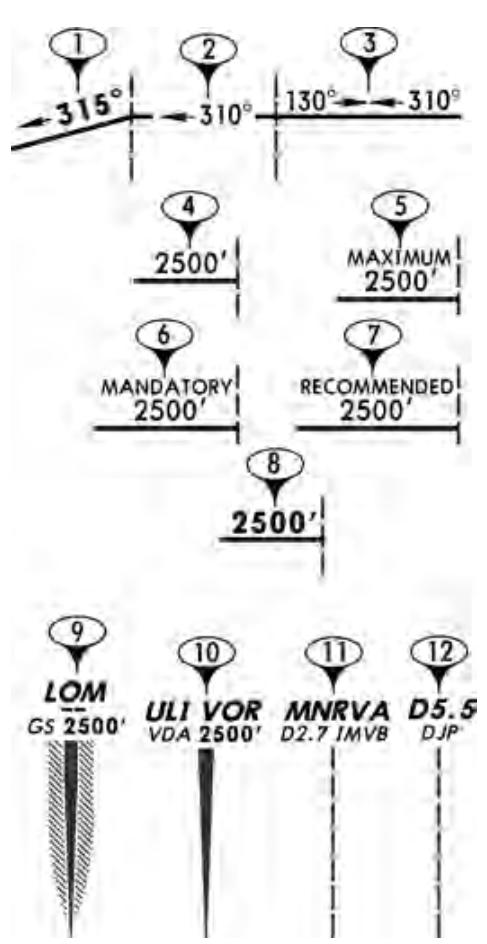

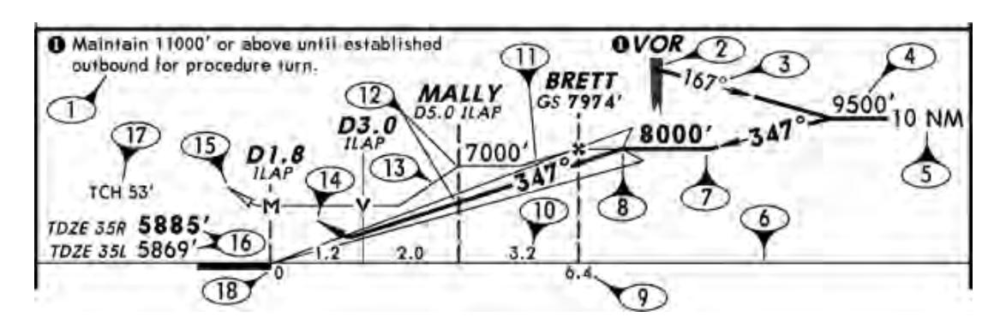

- 1 Procedure notes that relate directly to information portrayed in the profile view are charted within the profile view, normally placed in the upper right or left corners.
- 2 A "broken" navaid or fix symbol indicates that it does not fall directly in line with the final approach track.
- 3 Outbound bearings associated with procedure turns are included for situational awareness.
- 4 Minimum altitude while executing the procedure turn.
- 5 The distance to remain within while executing the procedure turn. Distance is measured from the initiating navaid/fix unless otherwise indicated.
- 6 Profile view "ground line". Represents an imaginary straight line originating from the runway threshold. No terrain high points or man-made structures are represented in the profile view.
- 7 Procedure flight tracks are portrayed using a thick solid line. Multiple separate procedures using the same altitudes are represented by a single line.
- 8 Final Approach Point (FAP). Beginning of the final approach segment for precision approaches.
- 9 Nautical Mile (NM) distance to the "0" point. Not included at DME fixes.
- 10 Nautical Mile (NM) distance between two navaids and or fixes. 1329509389463

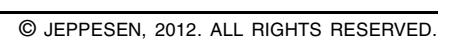

- 11 Final Approach Course bearing. Only repeated if a change in course occurs.
- 12 Tracks are placed relative to each other based on the corresponding crossing altitudes.
- 13 Non-precision procedure flight tracks that deviate from the Glide Slope and or the Vertical Descent Angle are depicted as a light solid line.
- 14 Pull-up representing the DA/MDA or when reaching the descent limit along the GS/VDA.
- 15 Pull-up arrow associated to a non-precision approach not using a CDFA technique.
- 16 Touchdown zone, runway end, or threshold elevation labeled accordingly.
- 17 Threshold crossing height associated to the charted glide slope or vertical descent angle.
- 18 Runway block symbolizing the runway. The approach end represents the runway threshold.

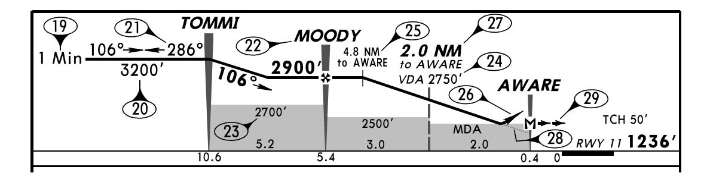

- 19 Time limit applicable to the outbound leg of the procedure holding/racetrack.
- 20 Minimum altitude while executing the procedure holding/racetrack.
- 21 Outbound and inbound bearings associated to the procedure holding/racetrack.
- 22 RNAV waypoints are identified by their five character identifier only.
- 23 Segment Minimum Altitudes (SMA) are represented by a shaded rectangle bordered by the two defining fixes. The minimum altitude is shown along the top edge of the sector.
- 24 Altitudes that correspond to the VDA.
- 25 Nautical miles to the next fix is supplied for the "Top of Descent" when not at a fix.
- 26 Pull up along the VDA at the DA/MDA is depicted relative to the missed approach point.
- 27 Nautical miles and name of "to" fixes are supplied for all along track distance fixes.
- 28 A dotted gray line illustrates the VNAV path from the FAF to the Landing Threshold Point (LTP) TCH. The VNAV path supports CDFA flight techniques between the FAF and MAP only. The VNAV path is <a href="NOT">NOT</a> intended to be used below the DA/MDA. In accordance with FAA and ICAO regulations, descent below DA/MDA is strictly prohibited without visual reference to the runway environment.
- 29 Visual flight track is shown when the missed approach point is prior to the runway threshold.

#### DESCENT/TIMING CONVERSION TABLE — LIGHTING BOX — MISSED APPROACH ICONS

| Gnd speed-Kt | S     | 70   | 90   | 100  | 120  | 140  | 160     | ) = - |     |     |
|--------------|-------|------|------|------|------|------|---------|-------|-----|-----|
| GS           | 3.00° | 377  | 484  | 538  | 646  | 753  | 861     | (2)   | (5) | (A) |
| VDA          | 3.10° | 384  | 494  | 548  | 658  | 768  | 878 - 3 |       | (3) | 9   |
| FAF to MAP   | 6.3   | 5:24 | 4:12 | 3:47 | 3:09 | 2:42 | 2:22    | 4)    | 197 |     |

- 1 Indicates Ground Speed in Knots for several common aircraft approach speeds.
- 2 For precision approaches, Glide Slope angle is shown in degrees along with relative descent rates in feet per minute.
- 3 For non-precision approaches, Vertical Descent Angle is shown, when applicable, in degrees along with relative descent rates in feet per minute.
- 4 The location of the Missed Approach Point is defined, the distance and associated timing is included only when applicable.
- 5 Installed approach lights, visual approach slope indicators, and runway end identification lights (REIL) are depicted for the straight-in landing runway.
- 6 Missed approach Icons which symbolize the initial "up and out" actions associated with the missed approach procedure are depicted. The complete missed approach instructions are shown in textual form in the Briefing Strip.

#### **LANDING MINIMUMS (Eff Jan 2020)**

Publication of landing minimums does not constitute authority for their use by all operators. Each individual operator is responsible for ensuring that the proper minimums are used based on authorization specific to the type of operation.

Landing minimums are supplied for all approach procedures and known approach conditions. When the Governing State Authority has not provided landing visibilities for a particular approach procedure, they will be derived by Jeppesen based on ICAO Doc 9365 Manual of All Weather Operations. For landing minimums rules and tables refer to AIR TRAFFIC CONTROL — Aerodrome Operating Minimums JEPPESEN.

A "Std" label in the upper left corner of the minimums box indicates that the published visibilities are ICAO Doc 9365 compliant. Other labels, as described below, indicate compliance with other regulations.

Visibilities that have been derived by Jeppesen for straight-in procedures are all RVR, State provided VIS or CMV values will be labeled as such. Visibilities for circling procedures are always VIS. Operators using these visibilities should be aware of this. If ATC does not report RVR, pilots have to convert the reported meteorological VIS into a CMV, to compare it against the charted RVR (refer to the table at the end of this section and to AIR TRAFFIC CONTROL — Aerodrome Operating Minimums JEPPESEN).

Visibility values are reported and thus depicted in the form of nautical/statute miles, feet, meters and kilometers.

1 — Minimums Label: Indicates that landing minimums are compliant with a specific regulation, but never below State published values.

**Std** – Minimums are based on tables and rules from ICAO Doc 9365 (Manual of All Weather Operations). No comparison has been done to any other landing minimums criteria.

**Std/State** – Minimums are based on tables and rules from a State Regulation which is similar/close to ICAO Doc 9365 (e.g. EASA AIR OPS, Indian CAR), refer also to AIR TRAFFIC CONTROL — Aerodrome Operating Minimums JEPPESEN for identified differences to ICAO Doc 9365. No comparison has been done to any other landing minimums criteria.

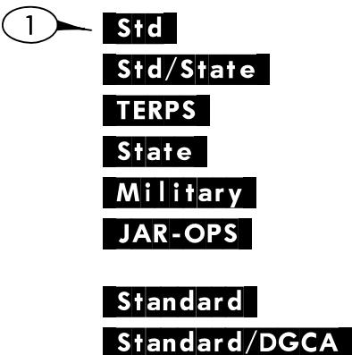

**TERPS** – Minimums are based on TERPS change 20 or later. U.S. OPSPEC requirement for non-CDFA penalty applies. No comparison has been done to any other landing minimums criteria.

**State** – Minimums are shown as supplied by the State (unknown rules and tables). State minimums may be supplemented (e.g. for ALS out condition) by visibilities based on ICAO Doc 9365 but not below the State supplied minimums. No comparison has been done to any other landing minimums criteria.

**Military** – Minimums are shown as supplied by a State Military. No comparison has been done to any other landing minimums criteria.

**JAR-OPS** – Minimums are based on tables and rules from JAR-OPS 1. No comparison has been done to any other landing minimums criteria.

**No label** indicates that the landing minimums are **not** yet converted to the new Jeppesen Standard AOM and are still based on ECOMS rules and tables (refer to <a href="https://www.jeppesen.com/aom">www.jeppesen.com/aom</a>).

A **Standard** or **Standard/DGCA** label indicates that the minimums are based on EASA AIR OPS, EU-OPS/CAR-OPS or Indian CAR, but are **not** yet converted to the new Jeppesen Standard AOM. During conversion to the new Standard AOM the new **Std/State** label and the new layout will be applied, the visibilities will remain unchanged. No comparison has been done to any other landing minimums criteria.

2 — Indicates that the published Circle-To-Land minimums are based on TERPS 8260.3B change 21 or later version. Expanded circling approach areas apply. For expanded circling approach area radii refer to AIR TRAFFIC CONTROL — United States — Rules and Procedures. The "C" is also depicted for circling minimums outside of the United States if applicable.

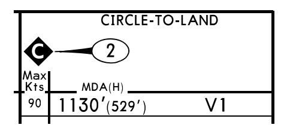

| 3 — | Aircraft approach categories.    |
|-----|----------------------------------|
| U   | All Clair applicacii calegories. |

| 4 — | <b>TERPS</b> | maximum       | circling  | speeds  |
|-----|--------------|---------------|-----------|---------|
| _   |              | IIIaxiiiiuiii | CITCIIIIG | SDEEUS. |

5 — ICAO maximum circling speeds.

Note: Known deviations from the TERPS or ICAO maximum circling speeds will be shown. For countries that do not supply maximum circling speeds, aircraft approach categories will be shown.

6 — For Circle-To-Land only approaches, both the aircraft approach categories and the maximum circling speeds are shown just prior to the circling minimums.

7 — Decision Altitude (Height) label, Decision Altitude and Decision Height for Precision approach and APV operations. A charted DA(H) on Non-precision approaches which are converted to the new AOM Standard (State label) indicates that the DA(H) is published by the State, and only in this case a height loss might be incorporated by the State.

Note: A charted "DA(H)" on older Non-precision approaches with "Standard" minimums will be replaced by "DA/MDA(H)". On those charts a height loss is <u>not</u> incorporated, neither in charted DA(H) nor in the charted DA/MDA(H).

8 — Minimum Descent Altitude (Height) label, Minimum Descent Altitude and Minimum Descent Height for Non-precision approach operations. The MDA(H) is shown for non-CDFA minimums or if the State has supplied an MDA(H) on the procedure source.

DA/MDA(H) label is shown, when either Decision Altitude (Height) or Minimum Descent Altitude (Height) can be used on Non-precision approaches depending on operational approval. This label is normally associated with CDFA minimums.

Note: Jeppesen charted DA/MDA(H) values do not include a height loss adjustment. Pilots have to check their operator's policy for the application of add-ons.

10 — Radio Altimeter height, associated with CAT II precision approaches. In some cases a specific Radio Altitude is supplied by the State as part of CAT III State minimums.

11 — Nautical or Statute mile VIS are depicted in whole and fractions of a mile. No units label is shown. A specified visibility of "V3/4" means "3/4 mile", "V2 1/2" means "2 1/2 miles".

12 — Equivalent Runway Visual Range (RVR) values associated with nautical/statute mile VIS represent readings in hundreds of feet, "R40" means RVR 4000ft. Equivalent RVR values are shown when supplied or authorized by the State, applicable to a specific approach procedure.

13 — Visibilities in meters are labeled with an "m" while values in kilometers are labeled with a "km". There are only RVR values shown, except if a VIS is provided by the State. An RVR is labeled "R", a VIS value is labeled "V". An "R/V" label indicates that the charted value is either RVR or VIS.

 3
 4
 5
 6

 Max Kts
 Max Kts
 Max Kts
 Max Kts

 A
 90
 100
 A 100

 B
 120
 135
 B 135

 C
 140
 180
 C 180

 D
 165
 205
 D 205

DA(H) **720'**(100')

8 MDA(H) **720'**(339')

9) DA/MDA(H)**720'**(251')

> 10 RA 97' DA(H) 720'(100')

> > (11) V3/4

12 R40 or V3/4

R550m V800m R/V1200m

- 14 The particular condition is **Not Authorized**. If necessary it will be abbreviated by "NA".
- NOT AUTHORIZED
  NA

15 — The particular condition does **not apply**.

- 15) NOT APPLICABLE
- 16 Indicates that a ceiling is required as part of the overall landing minimums. Ceilings are shown as a height above ground level in feet or meters depending on the unit used for reporting.
- 16 CEILING REQUIRED
- 17 When required, ceilings are depicted prior to the associated visibility. Ceiling is always shown in smaller size in front of the RVR or VIS.
- 17) 1000'-V2

|                                                                          |                                                                                                               |                             |                  |                                       |                | (23)                |          |
|--------------------------------------------------------------------------|---------------------------------------------------------------------------------------------------------------|-----------------------------|------------------|---------------------------------------|----------------|---------------------|----------|
| Si                                                                       | State STRAIGHT-IN LANDING                                                                                     |                             |                  |                                       | CIRCLE-TO-LAND | 3                   |          |
|                                                                          | ILS (                                                                                                         |                             | (18)LOC (GS out) |                                       |                | DAY                 |          |
| A: <b>245</b> '(230') DA(H) BC: <b>265</b> '(250') D: <b>285</b> '(270') |                                                                                                               | CDFA 25                     |                  | (22) Not authorized                   |                |                     |          |
|                                                                          | DA(H) BC: 20                                                                                                  | (250 ) <b>5 '</b> (270') | ■ DA/MDA(H)      |                                       |                | South of airport    |          |
| 7                                                                        |                                                                                                               |                             | ■ DA/MDA(H)      | · · · · · · · · · · · · · · · · · · · | Max Kts     | 24                  |          |
| <u> </u>                                                                 | 19 ) FULL                                                                                                     | ALS out                     |                  | ALS out                               | Kts_           | MDA(H)              | <b>↓</b> |
| Α                                                                        |                                                                                                               |                             | R900m            | R1500m                                | 100            | 100 (*** ) 11000111 |          |
| В                                                                        | R600m                                                                                                         | R1000m                      | R1000m           | KIJOOIII                              | 135            | 520′(505′) V1600m   | NA       |
| С                                                                        |                                                                                                               |                             | KIOOOIII         | R1800m                                | 180            | 620′(605′) V2400m   | ] ''^ [  |
| D                                                                        | R650m                                                                                                         | R1200m                      | R1400m           | R2000m                                | 205            | 720′(705′) V3600m   |          |
| 1 V 2 C                                                               | NAV DA(H) in lieu of MDA(H) depends on operator policy.  Circling heights based on rwy 24 thresh elev of 15'. |                             |                  |                                       |                |                     |          |

- 18 Type of approach is indicated when multiple types are shown in minimums box.
- 19 Known conditions or requirements that affect the minimums are shown above the visibilities.
- 20 Notes that only apply to the charted minimums are shown within the minimums box.
- 21 Label for straight-in minimums. The straight-in runway number is only shown if more runways are affected, for example if the State supplies side-step landing minimums.
- 22 Notes that apply to a given set of minimums are shown above the affected values.
- 23 The set of minimums applicable when a circling maneuver is required are labeled as such.
- 24 The MDA(H) label for circle-to-land minimum descent altitudes and the associated height is shown at the top of the column.
- 25 CDFA indicates that the minimums require the use of CDFA flight technique.

A charted "non-CDFA" indicates that the approach does not meet the CDFA criteria. Where the State regulation ("Std/State" label) requires an add-on, the 200m for CAT A & B and 400m for CAT C & D are incorporated into the charted visibility values.

ICAO DOC 9365 **does not** require the add-on, therefore the visibilities in minimums boxes with the "Std" label are charted as provided in Table 6-3 (refer to AIR TRAFFIC CONTROL — Aerodrome Operating Minimums JEPPESEN).

#### Labels used in conjunction with landing visibility values

15 NOV 19

R — An "R" label indicates that the associated value is an RVR.

When the State Authority has supplied landing visibilities, and has indicated that the value supplied is an RVR, the "R" label is applied.

Since all straight-in visibility values in ICAO Doc 9365 are in the form of an RVR, all values depicted when the State Authority has not supplied visibilities will be labeled with an "R". This does not depend on the availability of RVR transmissometer. How these values are used is dependent on each individual operator's regulations.

V — A "V" label indicates that the associated value is a metric or nautical/statute mile meteorological VIS. For straight-in procedures only VIS that have been supplied by the State Authority will be labeled with a "V". Circling visibilities are always VIS and therefore labeled with a "V".

R/V — An "R/V" label indicates that the associated value can be either an RVR or met VIS depending on what is reported by ATC. Only RVR/VIS values that have been supplied by the State Authority will be labeled with an "R/V".

C — A "C" label indicates that the associated value is a converted meteorological visibility (CMV). A CMV is equivalent to an RVR and is derived from the meteorological visibility which is reported by ATC. Only CMV values that have been supplied by the State Authority will be labeled with a "C".

#### **Guide for Visibility Label Usage**

| Charted Visibility Label | Reported by ATC | Probable Pilot action (Note 1)                                                                                                                             |
|-----------------------------|-----------------|------------------------------------------------------------------------------------------------------------------------------------------------------------|
| R                           | RVR             | Reported RVR is compared directly to the R or C value on the chart.                                                                                        |
| or <b>C</b>              | Met VIS         | Reported met VIS is converted into CMV and then compared to the R or C value on the chart. (Note 2)                                                        |
| С                           | RVR             | RVR in ft needs to be converted to sm, then compared directly to the V value on the chart.  A metric RVR is compared directly to the V value on the chart. |
|                             | Met VIS         | Reported met VIS is compared directly to the V value on the chart.                                                                                         |
| DA/                         | RVR             | Reported RVR is compared directly to the R value on the chart.                                                                                             |
| R/V                         | Met VIS         | Reported met VIS is compared directly to the V value on the chart.                                                                                         |

Note 1: Refer to AIR TRAFFIC CONTROL — Aerodrome Operating Minimums JEPPESEN for conversion factors depending on available approach and runway lights during day and night.

Note 2: An operator must ensure that a conversion of a reported met VIS to RVR/CMV is not used for take-off, for calculating any other required RVR minimum less than 800m, or when a reported RVR is

Conversion of met VIS to RVR may depend on individual operator's regulations.

#### Depiction of Landing Minimums based on ECOMS tables and rules

Refer to www.jeppesen.com/aom

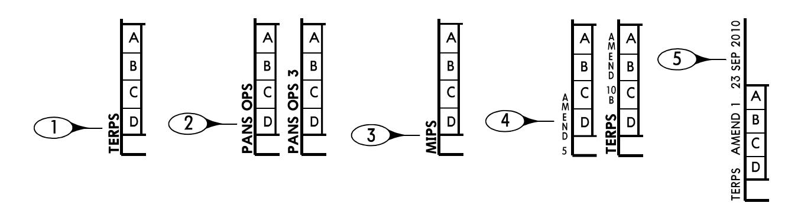

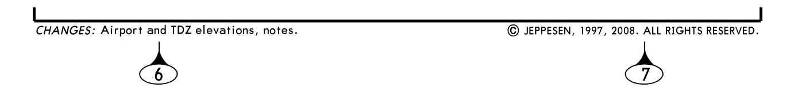

#### **END OF APPROACH CHART LEGEND**

#### **CHART LEGEND - EASA AIR OPS AERODROME OPERATING MINIMUMS (AOM)**

**Publication of minimums does not constitute authority for their use by all operators. Each individual operator must obtain appropriate approval for their use.**

### **1. GENERAL**

The inverted **"Standard"** label in the upper left corner of the minimums box indicates that the minimums are based on EASA AIR OPS and State Minimums, if provided. They are not compared against other concepts like ECOMS. For a detailed excerpt of EASA AIR OPS minimums refer to Jeppesen ATC-Chapter "AERODROME OPERATING MINIMUMS - EASA AIR OPERATIONS".

Jeppesen charted minimums are not below any State-provided minimums. RVR/CMV/VIS values are shown in measuring units as reported by the governing agency.

AOM for take-off and landing are either shown on Jeppesen instrument approach or aerodrome charts or on a separate minimums listing.

Landing minimums will be shown as RVR, as provided within the EASA tables.

A Visibility, prefixed "VIS", will only be charted if a VIS value is published as State minimum.

A Converted Meteorological Visibility, prefixed "CMV", will only be charted if a CMV value is published as State minimum.

Take-off minimums are shown as RVR, or without prefix if they are either RVR or VIS.

A Visibility, prefixed "VIS", will only be charted for take-off if a VIS value is published as State minimum.

Circling minimums without prefix are always visibilities.

For separate minimums listings (like 10-9S pages) RVR, CMV and VIS are abbreviated as "R", "C" and "V".

*NOTE: Most of the samples in this document are intended to illustrate only the relevant information of the related paragraph. Other sections (like circling minimums) within the samples are intentionally left blank.*

### **2. TAKE-OFF MINIMUMS**

Low visibility take-off operations below a visibility of 800m require that the **operator** verifies that Low Visibility Procedures (LVP) or equivalent procedures have been established and are in force.

Jeppesen charts the lowest possible take-off minimums (including LVTO) because the LVP information is not always published in the AIP.

Only if there is a clear statement within the AIP that LVP are not available for the specific airport, the takeoff minimum will be charted as RVR 550m VIS 800m (or higher State value).

The multiple RVR requirement means, that the required RVR value must be achieved for all of the relevant RVR reporting points (touchdown zone, mid and rollout end of runway), except for the initial part, which can be determined by pilot assessment. Approved operators may reduce their take-off minimums to RVR 75m with an approved lateral guidance system and if the runway is protected for CAT III landing operations and equivalent facilities are available.

Jeppesen charts a take-off RVR of 75m only if the runway is approved for CAT IIIB operations with RVR 75m.

Night operations always require runway end lights. This is not indicated in the take-off minimums box.

#### **Sample of Take-off Minimums**

| Sta  | indard                     |                          | TAKE     | -OFF                              |                                    |                                |
|------|----------------------------|--------------------------|----------|-----------------------------------|------------------------------------|--------------------------------|
|      | Low Visibility Take-off    |                          |          |                                   |                                    |                                |
|      | HIRL, CL & relevant RVR | RL, CL & relevant RVR    | RL & CL  | Day: RL & RCLM Night: RL or CL | Day: RL or RCLM Night: RL or CL | Adequate vis ref (Day only) |
| ABUD | TDZ, MID, RO RVR 125m   | TDZ, MID, RO RVR 150m | RVR 200m | RVR 300m                          | 400m                               | 500m                           |

#### **3. CIRCLING MINIMUMS**

Circling minimums are only charted if a circling OCA(H) or MDA(H) is provided by the procedure source. Otherwise, the circling box is removed. If circling is not authorized by the procedure source, it will be noted in the Briefing Strip header. Where straight-in minimums are higher than circling minimums (DH/MDH or RVR/VIS), a note is added to remind the pilot that the higher straight-in minimums have to be used.

**172 INTRODUCTION** 25 AUG 17

#### **CHART LEGEND - EASA AIR OPS AERODROME OPERATING MINIMUMS (AOM)** q\$i

#### **Sample of Circling Minimums**

|            | CIRCLE-TO-LA | AND   |
|------------|--------------|-------|
| Max Kts | MDA(H)       | vis   |
| 100        | 750' (667')  | 1500m |
| 135        | 750' (667')  | 1600m |
| 180        | 850' (767')  | 2400m |
| 205        | 850' (767')  | 3600m |

### **4. NON-PRECISION APPROACH MINIMUMS AND CHART PROFILE VIEW**

According to the EASA AIR OPS requirements for Commercial Air Transport Operations (Part CAT), all non-precision approaches shall be flown using the continuous descent final approach (CDFA) technique with decision altitude (height), and the missed approach shall be executed when reaching the DA(H) or the missed approach point (MAP), whichever occurs first. The lateral part of the missed approach procedure must be flown via the MAP unless stated otherwise in the procedure.

Jeppesen criteria for charting of CDFA or non-CDFA minimums are based on **AMC1 CAT.OP.MPA.115** Approach flight technique – aeroplanes.

Normally, only CDFA minimums are shown. They are identified by the use of a **DA/MDA(H)** label. **Jeppesen does not apply an add-on when publishing a DA/MDA(H) for a CDFA non-precision approach, because this depends on operator specific factors.**

The CDFA condition will always be identified by the term 'CDFA" above the DA/MDA(H) label.

Non-CDFA minimums are shown in exceptional cases and identified by an MDA(H) label. The MDA(H) label is also charted if the State explicitly publishes an MDA(H) on procedure source instead of an OCA(H). The non-CDFA condition will always be identified by the term 'non-CDFA" above the MDA(H) label.

#### **Sample of Non-precision Minimums (CDFA)**

| CD            | DME DFA 170'(391') |
|---------------|--------------------------|
|               | ALS out                  |
| B RVR I I OOm | RVR 1500m                |
| C RVR1100M    | RVR 1800m                |

**Sample of Non-precision Minimums (CDFA+non-CDFA)**

| VOR DME CDFA DA/MDA(H) 470'(391') |           | IN LANDING RWY 09L VOR non-CDFA MDA(H) 470'(391') |           |
|-----------------------------------------|-----------|------------------------------------------------------------|-----------|
|                                         | ALS out   |                                                            | ALS out   |
| mm1/00                                  | RVR 1500m | RVR 1300m                                                  | RVR 2000m |
| RVR 1100m                               | RVR 1800m | RVR 1500m                                                  | RVR 2200m |

The profile depiction will be modified to show the continuous descent track on final approach. Sourcepublished minimum altitudes will be shown as segment minimum altitudes in the profile (grey shaded box). These minimum altitudes are typically provided for obstacle clearance and must not be violated to remain clear of obstacles or terrain.

If not published by the procedure source, a table depicting distance vs altitude or DME vs altitude information will be calculated by Jeppesen and shown above the profile view.

The missed approach pull-up arrow is shown at the point where the decision height is reached. There is no level segment depicted prior to the MAP, the MAP symbol is shown at the same position as published by the procedure source.

#### **CHART LEGEND - EASA AIR OPS AERODROME OPERATING MINIMUMS (AOM)** q\$i

#### **CDFA depiction (profile view)**

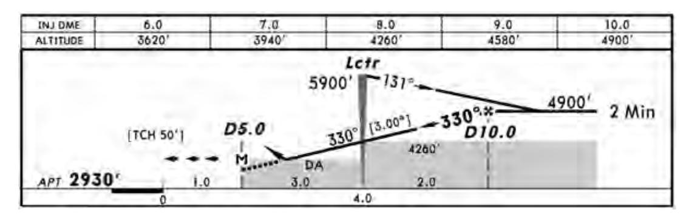

In exceptional cases it may be necessary to include both, CDFA and non-CDFA flight path. In this case, a level segment is shown prior to the missed approach point and the pull-up arrow is shown at the MAP to depict the non-CDFA procedure.

#### **CDFA and non-CDFA depiction (profile view)**

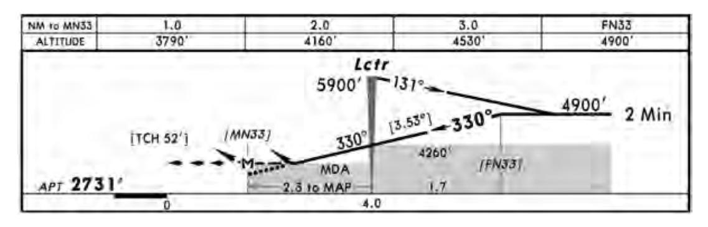

#### **5. CAT I PRECISION AND APV APPROACH MINIMUMS**

An RVR of less than 750m may be used:

- a. for CAT I operations to runways with FALS and TDZ and CL, **or**
- b. for CAT I operations to runways with FALS but without TDZ and/or CL when using an approved head-up guidance landing system (HUDLS) or an equivalent approved system, **or**
- c. for CAT I operations to runways with FALS but without TDZ and/or CL when conducting a coupled or flight-director-flown approach to decision height, **or**

d. for APV operations to runways with FALS and TDZ and CL when using an approved head-up display (HUD).

*NOTE: A conversion of reported meteorological visibility to CMV should not be used for any RVR minimum less than 800m. In this case a minimum VIS of 800m applies for the procedure. A charted "RVR XXXm" (any RVR below 800m) have to be understood as "RVR XXXm or VIS 800m".*

The European States publish more and more LPV (SBAS CAT I) procedures. To clearly differentiate between the CAT I and APV operations, the terms "LPV CAT I" and "LPV" are used in the minimums box.

**Sample of CAT I Minimums (FALS + TDZ + CL)**

|          | ILS DA(H) <b>529'</b> (200') |           |
|----------|---------------------------------|-----------|
| FULL     | TDZ or CL out                   | ALS out   |
| RVR 550m | n RVR 550m ■                    | RVR 1200m |

**174 INTRODUCTION** 25 AUG 17

#### **CHART LEGEND - EASA AIR OPS AERODROME OPERATING MINIMUMS (AOM)** q\$i

The note "W/o HUD/AP/FD: RVR 750m" indicates that the use of HUD **or** autopilot **or** flight director is required if TDZ or CL are not available. Otherwise the RVR is 750m.

**Sample of CATIMinimums (FALS, no TDZ and/or no CL)**

| Standard |                                                                                                                                                                                                                                                                                                                                                                                                                                                                                                                                                                                                                                                                                                                                                                                                                                                                                                                                                                                                                                                                                                                                                                                                                                                                                                                                                                                                                                                                                                                                                                                                                                                                                                                                                                                                                                                                                                                                                                                                                                                                                                                               | AIGHT-IN LANDING RWY 26 LPV CAT I |  |
|----------|-------------------------------------------------------------------------------------------------------------------------------------------------------------------------------------------------------------------------------------------------------------------------------------------------------------------------------------------------------------------------------------------------------------------------------------------------------------------------------------------------------------------------------------------------------------------------------------------------------------------------------------------------------------------------------------------------------------------------------------------------------------------------------------------------------------------------------------------------------------------------------------------------------------------------------------------------------------------------------------------------------------------------------------------------------------------------------------------------------------------------------------------------------------------------------------------------------------------------------------------------------------------------------------------------------------------------------------------------------------------------------------------------------------------------------------------------------------------------------------------------------------------------------------------------------------------------------------------------------------------------------------------------------------------------------------------------------------------------------------------------------------------------------------------------------------------------------------------------------------------------------------------------------------------------------------------------------------------------------------------------------------------------------------------------------------------------------------------------------------------------------|--------------------------------------|--|
|          | DAIH: 52                                                                                                                                                                                                                                                                                                                                                                                                                                                                                                                                                                                                                                                                                                                                                                                                                                                                                                                                                                                                                                                                                                                                                                                                                                                                                                                                                                                                                                                                                                                                                                                                                                                                                                                                                                                                                                                                                                                                                                                                                                                                                                                      | 9'(200')                             |  |
|          | FULL                                                                                                                                                                                                                                                                                                                                                                                                                                                                                                                                                                                                                                                                                                                                                                                                                                                                                                                                                                                                                                                                                                                                                                                                                                                                                                                                                                                                                                                                                                                                                                                                                                                                                                                                                                                                                                                                                                                                                                                                                                                                                                                          | ALS out                              |  |
| A        |                                                                                                                                                                                                                                                                                                                                                                                                                                                                                                                                                                                                                                                                                                                                                                                                                                                                                                                                                                                                                                                                                                                                                                                                                                                                                                                                                                                                                                                                                                                                                                                                                                                                                                                                                                                                                                                                                                                                                                                                                                                                                                                               |                                      |  |
| В        | Service de la constante de la constante de la constante de la constante de la constante de la constante de la constante de la constante de la constante de la constante de la constante de la constante de la constante de la constante de la constante de la constante de la constante de la constante de la constante de la constante de la constante de la constante de la constante de la constante de la constante de la constante de la constante de la constante de la constante de la constante de la constante de la constante de la constante de la constante de la constante de la constante de la constante de la constante de la constante de la constante de la constante de la constante de la constante de la constante de la constante de la constante de la constante de la constante de la constante de la constante de la constante de la constante de la constante de la constante de la constante de la constante de la constante de la constante de la constante de la constante de la constante de la constante de la constante de la constante de la constante de la constante de la constante de la constante de la constante de la constante de la constante de la constante de la constante de la constante de la constante de la constante de la constante de la constante de la constante de la constante de la constante de la constante de la constante de la constante de la constante de la constante de la constante de la constante de la constante de la constante de la constante de la constante de la constante de la constante de la constante de la constante de la constante de la constante de la constante de la constante de la constante de la constante de la constante de la constante de la constante de la constante de la constante de la constante de la constante de la constante de la constante de la constante de la constante de la constante de la constante de la constante de la constante de la constante de la constante de la constante de la constante de la constante de la constante de la constante de la constante de la constante de la constante de la | DOT VICEOUS                          |  |
| C        | RVR 550m                                                                                                                                                                                                                                                                                                                                                                                                                                                                                                                                                                                                                                                                                                                                                                                                                                                                                                                                                                                                                                                                                                                                                                                                                                                                                                                                                                                                                                                                                                                                                                                                                                                                                                                                                                                                                                                                                                                                                                                                                                                                                                                      | RVR 1200m                            |  |
| D        |                                                                                                                                                                                                                                                                                                                                                                                                                                                                                                                                                                                                                                                                                                                                                                                                                                                                                                                                                                                                                                                                                                                                                                                                                                                                                                                                                                                                                                                                                                                                                                                                                                                                                                                                                                                                                                                                                                                                                                                                                                                                                                                               |                                      |  |

The note "W/o HUD/AP/FD: RVR 750m" indicates that the use of HUD **or** autopilot **or** flight director is required for the charted RVR. Otherwise the RVR is 750m.

**Sample of CAT I Minimums (IALS)**

| Standard | STRAIGH  | T-IN LANDING RWY 26 S |
|----------|----------|--------------------------|
|          | DA(H) 52 | 9'(200')                 |
|          | FULL     | ALS out                  |
| A        |          |                          |
| В        | in Sava  | WW 4554                  |
| c        | RVR 750m | RVR 1200m                |
| 0        |          |                          |

**Sample of APV Minimums (FALS + TDZ + CL)**

| ALS out   |
|-----------|
|           |
| RVR 1300m |
| 5         |

#### **CHART LEGEND - EASA AIR OPS AERODROME OPERATING MINIMUMS (AOM)** q\$i

The RVR is 750m. The RVR could only be reduced to 550m if TDZ **and** CL are operational **and** a HUD is used.

**Sample of APV Minimums (FALS, no TDZ and/or no CL)**

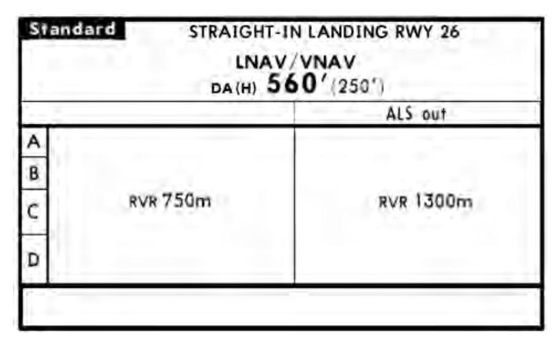

#### **6. LOWER THAN STANDARD CAT I MINIMUMS**

Operators must be approved by their authority to conduct lower than standard CAT I operations. For approved operators, tailored charts will be created on customer request only.

#### **7. CAT II PRECISION APPROACH MINIMUMS**

Minimums are applicable to EASA AIR OPS approved operators as well as to FAR 121 operators and those applying U.S. Operations Specifications (Ops Specs).

The minimum RVR is 300m.

EASA operators: For category D it is required to conduct an autoland. Otherwise, the minimum RVR is 350m; however, this value is not charted on Standard Jeppesen charts.

For US operators: Autoland or HUD to touchdown are required.

#### **Sample of CAT II Minimums**

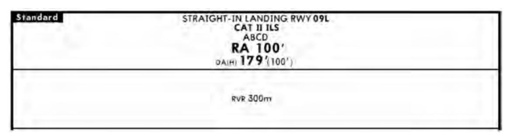

**176 INTRODUCTION** 25 AUG 17

#### **CHART LEGEND - EASA AIR OPS AERODROME OPERATING MINIMUMS (AOM)** q\$i

#### **8. OTHER THAN STANDARD CAT II PRECISION APPROACH MINIMUMS**

Other Than Standard CAT II minimums will only be published if the procedure is approved for it by the aerodrome's Civil Aviation Authority. Charting is similar to standard CAT II minimums. An RVR of 400m or below can only be used if CL are available.

#### **Sample of other than Standard CAT II Minimums (FALS + CL)**

| Standard | OTS CA  | ANDING RWY 14 AT II ILS BCD ( 98' 60'(100') |  |
|----------|---------|---------------------------------------------|--|
|          |         | CL out                                      |  |
| R        | VR 350m | RVR 450m                                    |  |
|          |         |                                             |  |

**Sample of other than Standard CAT II Minimums (FALS, no CL)**

| STRAIGHT-IN LANDING RWY 12 |         |  |
|----------------------------|---------|--|
| OTS CAT II ILS             |         |  |
|                            |         |  |
| DA(H) 1293'(100')          |         |  |
|                            |         |  |
| PVP 450m                   |         |  |
| KVR 43000                  |         |  |
|                            | RA 112' |  |

### **9. CAT III PRECISION APPROACH MINIMUMS**

Only CAT IIIA minimums are charted on Standard charts within the EASA AIR OPS application area. The DH 50' value is charted based on customer input and does not necessarily mean that the pilot has to use this value as decision height. There is no State within Europe publishing a *specific* DH value for CAT IIIA operations as State required minimum.

RVR 200m, as the minimum RVR for CAT IIIA operations according to EASA Air OPS, is charted unless a higher value is required by the State of the aerodrome.

Pilots have to check the Flight Operations Manual (or similar documents) for their specific approvals.

#### **10. AERODROME MINIMUMS LISTING**

On customer request, the EASA AIR OPS minimums may be made available on a minimums listing page. The listings are indexed as 10-9S/10-9S1, 20-9S/20- 9S1, etc.

TERPS change 20 was harmonized with the EASA minimum tables for CAT I, APV and NPA (CAT C and D aircraft only). Those procedures with the TERPS label are therefore EASA AIR OPS compliant and a 10-9S page is normally not required.

#### **CHART LEGEND - EASA AIR OPS AERODROME OPERATING MINIMUMS (AOM)** q\$i

#### **Sample of 10-9S chart**

| EDCM/AHE                           |                               |                                           | 3 JAN 17 (10-                           | PESEN 95                       | KAMENZ, EUROP                                |                                         |  |  |  |
|------------------------------------|-------------------------------|-------------------------------------------|-----------------------------------------|-----------------------------------|----------------------------------------------|-----------------------------------------|--|--|--|
| STRAI                              | GHT-IN RV                     | YY                                        | A                                       | В                                 | C                                            | D                                       |  |  |  |
| 29L                                |                               | ILS FULL CL out <b>0</b> ALS out | 5087'(223') R550m R550m R1200m | 8550m R550m R550m R1200m | \$5087'(223') \$550m \$550m \$1200m | 5087'(223') R550m R550m R1200m |  |  |  |
|                                    |                               | LOC                                       | NOT APPLICABLE                       |                                   |                                              |                                         |  |  |  |
|                                    | 0,5                           | ALS out                                   | 5510'(646') R1500m R1500m         | \$510'(646') R1500m R1500m  | 5510'(646') R2300m R2400m              | 5510'(646') R2300m R2400m         |  |  |  |
|                                    |                               | VOR ALS our                            | 5510'(646') R2500m R3200m         | 5510'(646') R2500m R3200m   | \$510'(646') R2700m R3400m             | 5510'(646') R2700m R3400m         |  |  |  |
| 29R                                | 8.1                           | RNAV (VNAV)                            | 5910'(948') R1500m R1500m         | 5810'(948') R1500m R1500m   | 5810'(948') R2400m R2400m              | 5810'(948') R2400m R2400m         |  |  |  |
| RNAV (LNAV)                        |                               | 5810'(948') R3800m R4500m           | 5810'(948') R3800m R4500m         | 5810'(948') R4000m R4700m   | 5810'(948') R4000m R4700m              |                                         |  |  |  |
|                                    | HUD/AP/F                      | D: R750m                                  | 1                                       | (ASSOCIA                          | 1 11/00/11                                   | T. Bayout                               |  |  |  |
| CIRCL                              | E-TO-LAND                     | 0                                         | 100 KT                                  | 135 KT                            | 180 KT                                       | 205 KT                                  |  |  |  |
| Not authorized North of airport |                               | 5800'(880') V1500m Đ                   | 5870'(950') V1600m <b>0</b>          | 6380'(1460') V2400m 0          | 6380'(1460' V3600m 6                      |                                         |  |  |  |
| or h                               |                               | iums of p                                 | receding straig                         | ght-in approach                   |                                              |                                         |  |  |  |
| IANE                               | OI I                          | Low Ve                                    | s(6))) Y Take-off                       |                                   | T                                            |                                         |  |  |  |
|                                    | D INI, O, & Invant. RVX | RL, CL &                                  |                                         | Day #1 6 ROM Night RL or Ci    | Day: ML or MCLW Night Ricar CL            | Apequate yet re (Day unity)          |  |  |  |
|                                    | 1. MID. RO                    | TDZ, MID. R R i 50m                    | R200m                                   | R300m                             | 400m                                         | 500m                                    |  |  |  |

#### **11. DEPICTION OF EASA AIR OPS AOM IN CASE OF EXISTING STATE MINIMUMS**

If State minimums are officially published, the depiction of AOM may differ from the standard depiction where all values are expressed as RVR or VIS.

- a. If RVR and VIS are charted together, the RVR value is compulsory. If no RVR is reported, the reported VIS has to be used without conversion.
- b. No prefix is charted if RVR and VIS is identical. The reported RVR is compulsory. If no RVR is reported, the reported VIS has to be used without conversion.

- c. If only VIS is charted, the reported VIS has to be used without conversion.
- d. If CMV is charted, the pilot converts a reported VIS and compare this value against the charted CMV.

#### **AERONAUTICAL INFORMATION NAVDATA DATABASE AND CHARTS**

#### PROVIDED FOR USERS OF JEPPESEN NAVDATA SERVICES

#### **PREFACE**

The purpose in providing the information contained in these pages is to highlight the major differences between Jeppesen's NavData database and Jeppesen's Enroute, Area, SID, DP, STAR, Approach, and Airport Charts.

Airways, departure procedures, arrival procedures, instrument approach procedures, and other aeronautical information is designed and created by more than 220 countries around the world. The information created by them is designed according to ICAO PANS OPS in most countries and according to the United States Standard for Terminal Instrument Procedures (TERPs) for the U.S. and many of the other countries.

The basic design for most aeronautical information contained in instrument procedures has been created for the analog world. The art of entering data into an aeronautical database is one that balances the intent of the original procedure designer and the requirements of FMS and GPS systems that require airborne databases.

All of the illustrations in this paper are from Jeppesen's library and are copyrighted by Jeppesen. The paper will highlight differences that will be found in the charts and databases produced by all the suppliers.

Virtually all the aeronautical databases are loaded according to the specifications in the Aeronautical Radio, Incorporated (ARINC) 424 standard "Navigation Databases." While the ARINC 424 specification covers a large percentage of the aeronautical requirements, it is impossible to write a specification that covers every combination of factors used to design and fly instrument procedures. Many of the differences between charts and databases are because there can be no standard implemented to have the information in both places depicted the same. There are some cases where it is desirable not to have the information the same because of the different type of media where the information is displayed.

Any attempt to detail the many minor differences, which may arise under isolated cases, would unduly complicate this overview. Therefore, the information provided is an overview only, and only major differences are included.

There are many different types of avionics equipment utilizing the Jeppesen NavData database. The same database information may be presented differently on different types of airborne equipment. In addition, some equipment may be limited to specific types of database information, omitting other database information. Pilots should check their Operating Handbooks for details of operation and information presentation. A major factor in "apparent" differences between database and charts may be due to the avionics equipment utilized. As avionics equipment evolves, the newer systems will be more compatible with charts, however the older systems will still continue with apparent differences.

Due to the continuing evolution caused by aeronautical information changes affecting both database and charting, items described herein are subject to change on a continual basis. This document may be revised for significant changes to help ensure interested database users are made aware of major changes.

A brief Glossary/Abbreviations of terms used is provided at the end of this document.

## **Nav2001 AERONAUTICAL INFORMATION NAVDATA DATABASE AND CHARTS DIFFERENCES BETWEEN JEPPESEN DATABASE AND CHARTS**

#### **1. EFFECTIVE DATES**

22 JUN 01

#### **AERONAUTICAL INFORMATION CUT-OFF DATES**

Because of the required time it takes to physically get the database updated, extracted, produced, delivered, and loaded into FMS/GPS systems, the database cut-off dates (when aeronautical information can no longer be included in the next update) are often earlier for databases than for charts. This may cause information on charts to be more current than the information in databases.

The ICAO Aeronautical Information Regulation and Control (AIRAC) governs the 28-day cycle between effective dates of aeronautical information. These are the same effective dates used for aeronautical databases. Because governments may use slightly different cycles, there are differences between charts and databases. Charts typically use 7-day and 14-day cycles for terminal charts and 28-day and 56-day cycles for enroute and area charts.

#### **2. GENERAL DIFFERENCES**

#### **GENERAL - CHARTED INFORMATION NOT PROVIDED IN THE JEPPESEN NAVDATA DATABASE**

Not all the information that is included on the charts is included in the airborne database. The following is a general listing of some of those items. More specific items are included in individual entries throughout this document.

Altimetry:

QNH/QFE information Alternate altimeter setting sources Intersection formations (radials, bearings, DME) Terrain and Obstacles Airport Operating Minimums Landing, take-off and alternate minimums Airport taxiways and ramps Some types of special use airspace and controlled airspace

#### **AERONAUTICAL INFORMATION NAVDATA DATABASE AND CHARTS**

#### 2. GENERAL DIFFERENCES (Cont)

#### **MAGNETIC COURSES, DISTANCES**

Because of different magnetic models used in airborne systems, a magnetic course read on the airborne system may differ from the charted magnetic course. Avionics computed distances may disagree with charted distances. Differences may appear on airways on Enroute Charts, and on flight procedures included on SID, DP, STAR, Approach, and Airport charts. In addition, when the database requires a specific course to be flown from "A" to "B", the differences in magnetic variation or VOR station declination may result in a "jog" between the two fixes in lieu of a direct track.

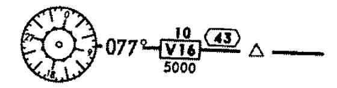

#### REFERENCE DATUM

Not all States (countries) have complied with the ICAO Annex that specifies the use of the WGS-84 reference datum. Differences in reference datums can cause significant "accuracy bias" in the navigation guidance provided by avionics systems. A listing of the States that have published their coordinates in WGS-84 can be found on Jeppesen's web site at www.jeppesen.com/onlinepubs/wgs-84.phtml.

#### 3. NAVAIDS

**COMPLETENESS** - Because of the duplication of identifiers and other factors, not all charted navaids are included in the database.

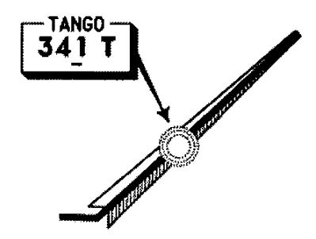

#### NDB AND LOCATOR IDENTIFIERS

As an example of the differences between the display from one avionics system to another, some avionics systems will display the Foley NDB as "FPY":

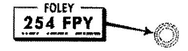

Some avionics systems include a suffix "NB" after the NDB identifiers and will display the Foley NDB as "FPYNB". For NDBs and locators with duplicate Morse code identifiers that are located within the same State (country), they may only be available using the airport identifier for access.

#### **AERONAUTICAL INFORMATION NAVDATA DATABASE AND CHARTS**

#### **3. NAVAIDS (Cont)**

#### **LOCATOR IDENTIFIERS**

22 JUN 01

Most locators in the United States have unique five-letter names, but most international locators have names that do not have five letters.

Some systems may display U.S. locators as "CASSE".

Some systems may display U.S. locators as "AP".

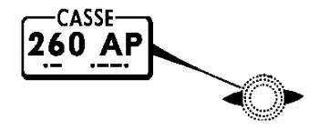

#### **DUPLICATE NAVAID IDENTIFIERS**

There are numerous duplicates in the database. Refer to your avionics handbook for the proper procedure to access navaids when duplicate identifiers are involved.

Not all navaids in the database are accessible by their identifier. Some navaids, for reasons such as duplication within terminal areas or lack of complete information about the navaid, are in the waypoint file and are accessible by their name or abbreviated name.

#### **4. WAYPOINTS**

#### **WAYPOINT DATABASE IDENTIFIERS**

"Database identifiers" refers to identifiers used only in avionics systems utilizing databases. The identifiers are not for use in flight plans or ATC communications; however, they are also included in computer flight planning systems. They may be designated by the State (country) as "Computer Navigation Fixes" (CNFs), or designated by Jeppesen. To facilitate the use of airborne avionics systems, the identifiers are being added to Jeppesen's charts. Both the CNFs created by States and the Jeppesen-created database identifiers are enclosed within square brackets and in italics.

- Jeppesen's ultimate goal is to include all database identifiers for all waypoints/fixes on the charts.
- Enroute charts include the five-character identifier for unnamed reporting points, DME fixes, mileage breaks, and for any reporting point with a name that has more than five characters.
- SID, DP and STAR charts are being modified to include all identifiers.

#### **AERONAUTICAL INFORMATION NAVDATA DATABASE AND CHARTS**

# 4. WAYPOINTS (Cont) WAYPOINT DATABASE IDENTIFIERS (Cont)

#### · Approach Charts

VNAV descent angle information derived from the Jeppesen NavData database is being added to approach charts. Identifiers are shown for the Final Approach Fix (FAF), Missed Approach Point (MAP), and the missed approach termination point.

State-named Computer Navigation Fixes (CNFs) are shown on all applicable charts.

GPS (GNSS) type approach charts include all database identifiers.

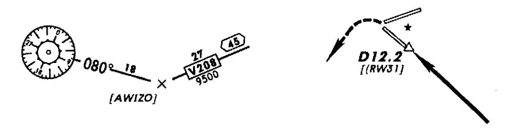

#### COMMON WAYPOINT NAME FOR A SINGLE LOCATION

Government authorities may give a name to a waypoint at a given location, but not use the name at the same location on other procedures in the same area. The Jeppesen NavData database uses the same name for all multiple procedure applications. Charting is limited to the procedure/s where the name is used by the authorities.

#### FLY-OVER versus FLY-BY FIXES/WAYPOINTS

In most cases, pilots should anticipate and lead a turn to the next leg. The database indicates when the fix must be crossed (flown-over) before the turn is commenced. The fix is coded as fly-over when the requirement is inferred or is specified by the governing authority. Fixes are charted as fly-over fixes only when specified by the governing authority.

Fly-over fixes have a circle around the fix/waypoint symbol. No special charting is used for fly-by fixes.

ULOGO and ROTGO Are fly-by waypoints.

RW03 and LESOV

Are fly-over waypoints.

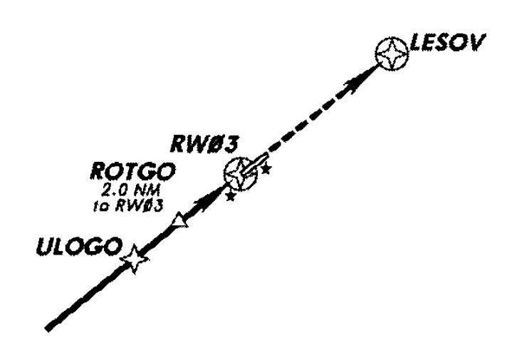

#### **AERONAUTICAL INFORMATION NAVDATA DATABASE AND CHARTS**

#### 5. AIRWAYS

#### **ATS ROUTES**

Airways identified as ATC routes by States (countries) cannot be uniquely identified. They are not included in the Jeppesen NavData database.

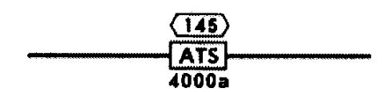

#### **DESIGNATORS**

Jeppesen NavData database airway designators are followed by a code indicating ATC services (such as A for Advisory, F for Flight Information) when such a code is specified by the State (country). Not all airborne systems display the ATC services suffix.

#### **ALTITUDES**

Minimum Enroute Altitudes (MEAs), Minimum Obstacle Clearance Altitudes (MOCAs), Off Route Obstacle Clearance Altitudes (OROCAs), Maximum Authorized Altitudes (MAAs), Minimum Crossing Altitudes (MCAs), Minimum Reception Altitudes (MRAs), and Route Minimum Route Off-Route Altitudes (Route MORAs) - - These minimum altitudes for airways are not displayed in most avionics systems.

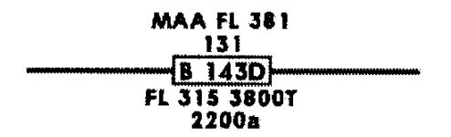

#### **CHANGEOVER POINTS**

Changeover points (other than mid-point between navaids) are on charts but are not included in the Jeppesen NavData database.

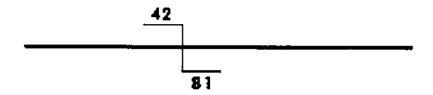

#### **AERONAUTICAL INFORMATION NAVDATA DATABASE AND CHARTS**

#### **6. ARRIVALS AND DEPARTURES**

#### **PROCEDURES NOT IN THE DATABASE**

Jeppesen publishes some officially designated departure procedures that include only text on IFR airport charts beneath the take-off minimums. They may be labeled "Departure Procedure", "IFR Departure Procedure", or "Obstacle DP". Most of these are U.S. and Canadian procedures, although there is a scattering of them throughout the world. Any waypoint/fix mentioned in the text is in the Jeppesen NavData database. However, these text-only departure procedures are not in the database.

|              | TAKE-OFF & OBSTACLE DEPARTURE PROCEDURE |      |        |  |  |  |  |
|--------------|-----------------------------------------|------|--------|--|--|--|--|
|              | Rwy                                     | , 17 | Rwy 35 |  |  |  |  |
|              | Adequate Vis Ref                        | STD  |        |  |  |  |  |
| 1 & 2 Eng | 1/4                                     | 1    | NA     |  |  |  |  |
| 3 & 4 Eng | 4   · · · ·                             | 1/2  | TVA    |  |  |  |  |

Some States publish narrative descriptions of their arrivals, and depict them on their enroute charts. They are unnamed, not identified as arrival routes, and are not included in the Jeppesen NavData database. Some States publish "DME or GPS Arrivals", and because they are otherwise unnamed, they are not included in the database.

#### **PROCEDURE TITLES**

Procedure identifiers for routes such as STARs, DPs and SIDs are in airborne databases but are limited to not more than six alpha/numeric characters. The database generally uses the charted computer code (shown enclosed within parentheses on the chart) for the procedure title, as

CHART: DATABASE Cyote Four Departure(CYOTE.CYOTE4) becomes CYOTE4.

When no computer code is assigned, the name is truncated to not more than six characters. The database procedure identifier is created according to the ARINC 424 specifications.

Database procedure identifiers are charted in most cases. They are the same as the assigned computer code (charted within parentheses) or are being added [enclosed within square brackets]. Do not confuse the bracketed database identifier with the official procedure name (which will be used by ATC) or the official computer code (which is used in flight plan filing).

#### **400-FOOT CLIMBS**

Virtually all departures in the database include a climb to 400 feet above the airport prior to turning because of requirements in State regulations and recommendations. The 400-foot climb is not depicted on most charts. When States specify a height other than 400 feet, it will be in the Jeppesen NavData database.

#### **AERONAUTICAL INFORMATION NAVDATA DATABASE AND CHARTS**

#### 6. ARRIVALS AND DEPARTURES (Cont)

#### TAKE-OFF MINIMUMS AND CLIMB GRADIENTS

The take-off minimums and climb gradients that are depicted on the charts are not included in the database.

This SID requires a ceiling and visibility of 1200-3 and a climb gradient of 410'/NM to 5000'.

| Gnd speed-Kts | 75  | 100 | 150  | 200  | 250  | 300  |
|---------------|-----|-----|------|------|------|------|
| 410' per NM   | 513 | 683 | 1025 | 1367 | 1708 | 2050 |

#### "EXPECT" and "CONDITIONAL" INSTRUCTIONS

Altitudes depicted on charts as "Expect" instructions, as "Expect to cross at 11,000" are not included in the Jeppesen NavData database. When "Conditional" statements such as "Straight ahead to ABC 8 DME or 600', whichever is later", are included on the charts, only one condition can be included in the database.

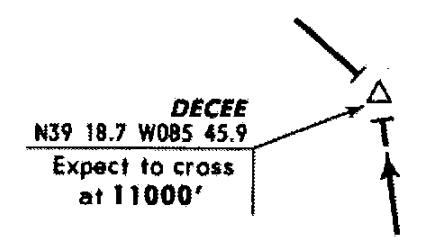

#### **ALTITUDES**

Databases include charted crossing altitudes at waypoints/fixes. Charted Minimum Enroute Altitudes (MEAs) and Minimum Obstacle Clearance Altitudes (MOCAs) are not included. The 5,000-foot altitude at RIANO is included in the database. The MEAs between SURVE and the two VORs are not included.

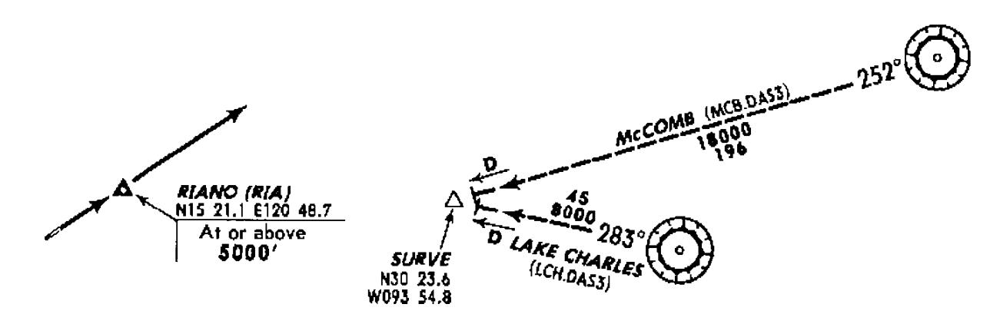

#### STAR OVERLAPPING SEGMENTS

STARs normally terminate at a fix where the approach begins or at a fix where radar vectoring will begin. When STAR termination points extend beyond the beginning of the approach, some avionics equipment may display a route discontinuity at the end of the STAR and the first approach fix.

#### **AERONAUTICAL INFORMATION NAVDATA DATABASE AND CHARTS**

#### **7. APPROACH PROCEDURE (TITLES and OMITTED PROCEDURES)**

ICAO PANS OPS approach procedure titles are officially labeled with the navaid(s) used for the approach and are different than approach procedure titles labeled according to the TERPs criteria, which are labeled only with navaids required for the final approach segment. Because of the limited number of characters that are available for the procedure title, the name displayed on the avionics equipment may not be the same as the official name shown on the approach chart.

The Jeppesen NavData database, in accordance with ARINC 424 specifications, codes the approach procedure according to procedure type and runway number. "Similar" type approaches to the same runway may be combined under one procedure title, as ILS Rwy 16 and NDB VOR ILS Rwy 16 may read as ILS Rwy 16. The actual avionics readout for the procedure title varies from manufacturer to manufacturer.

Some avionics systems cannot display VOR and VOR DME (or NDB and NDB DME) approaches to the same runway, and the approach displayed will usually be the one associated with DME.

#### Currently:

Generally, most Cat I, II, and III ILS approaches to the same runway are the same basic procedure, and the Cat I procedure is in the database. However, in isolated cases, the Cat I and Cat II/III missed approach procedures are different, and only the Cat I missed approach will be in the database.

Additionally, there may be ILS and Converging ILS approaches to the same runway. While the converging ILS approaches are not currently in the database, they may be at some later date.

Some States are using the phonetic alphabet to indicate more than one "same type, same runway" approach, such as ILS Z Rwy 23 and ILS Y Rwy 23. The phonetic alphabet starts are the end of the alphabet to ensure there is no possibility of conflict with circling only approaches, such as VOR A.

In isolated cases, procedures are intentionally omitted from the database. This occurs primarily when navaid/waypoint coordinates provided by the authorities in an undeveloped area are inaccurate, and no resolution can be obtained. Additionally, the ARINC 424 specifications governing navigation databases may occasionally prohibit the inclusion of an approach procedure.

#### **AERONAUTICAL INFORMATION NAVDATA DATABASE AND CHARTS**

#### **8. APPROACH PROCEDURES (PLAN VIEW)**

#### **INITIAL APPROACH FIX (IAF), INTERMEDIATE FIX (IF), FINAL APPROACH FIX (FAF) DESIGNATIONS**

These designations for the type of fix for operational use are included on approach charts within parentheses when specified by the State, but are not displayed on most avionics systems.

ARINC 424 and TSO C-129 specifications require the inclusion of GPS approach transitions originating from IAFs. Authorities do not always standardize the assignment of IAFs, resulting in some cases of approach transitions being included in the database that do not originate from officially designed IAFs

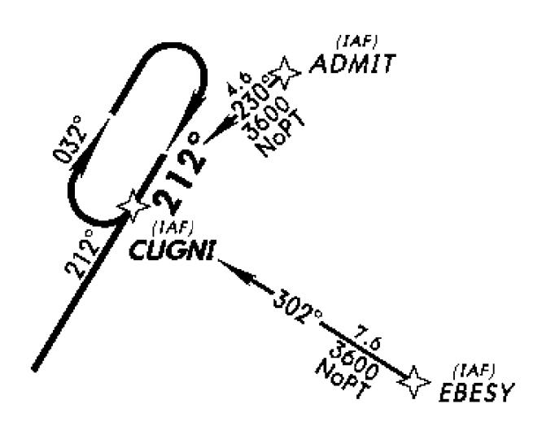

#### **BASE TURN (TEARDROP) APPROACHES**

Depending upon the divergence between outbound and inbound tracks on the base turn (teardrop turn), the turn rate of the aircraft, the intercept angle in the database, and the wind may cause an aircraft to undershoot the inbound track when rolling out of the turn, thus affecting the intercept angle to the final approach. This may result in intercepting the final approach course either before or after the Final Approach Fix (FAF).

#### **ROUTES BY AIRCRAFT CATEGORIES**

Some procedures are designed with a set of flight tracks for Category A & B aircraft, and with a different set of flight tracks for Category C & D. In such cases, the database generally includes only the flight tracks for Category C & D.

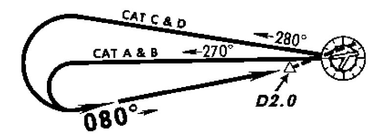

22 JUN 01

#### **Nav2001**

#### **AERONAUTICAL INFORMATION NAVDATA DATABASE AND CHARTS**

#### **8. APPROACH PROCEDURES (PLAN VIEW) (Cont)**

#### **DME and ALONG TRACK DISTANCES**

Database identifiers are assigned to many unnamed DME fixes. The Jeppesen identifier is charted on GPS/GNSS type approaches and charted on any type approach when specified as a computer navigation fix (CNF). Unnamed Along Track Distances (ATDs) are charted as accumulative distances to the MAP.

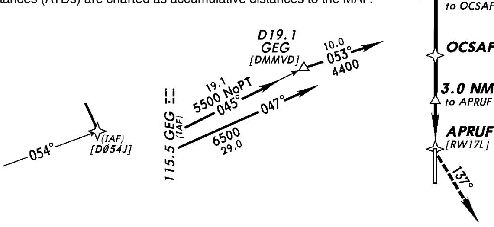

#### **APPROACH TRANSITION TO LOCALIZER**

For DME arc approach transitions with lead-in radials, the fix at the transition "termination point" beyond the lead in radial is dropped by many avionics systems.

West bound on the 22 DME arc, the leg after the 171° lead-in radial may not be displayed in all avionics equipment.

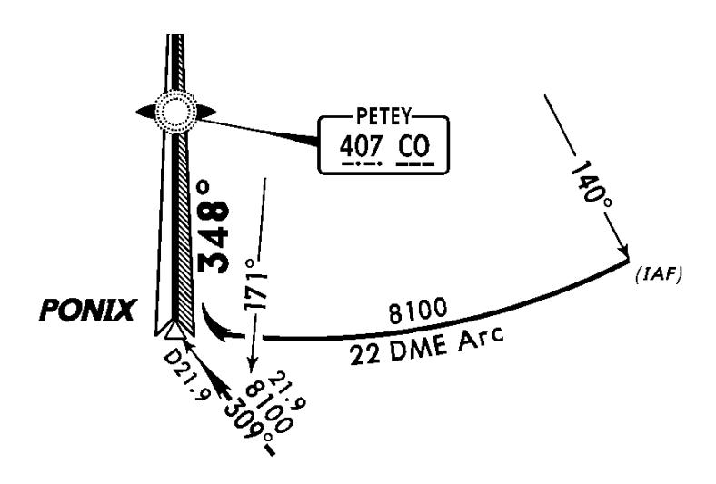

#### **AERONAUTICAL INFORMATION NAVDATA DATABASE AND CHARTS**

#### **9. APPROACH PROCEDURES (PROFILE)**

#### **VERTICAL DESCENT ANGLES**

Vertical descent angles for most \*straight-in non-precision landings are included in the database and published on charts with the following exceptions:

- 1) When precision and non-precision approaches are combined on the same chart, or
- 2) Some procedures based on PANS OPS criteria with descent gradients published in percentage or in feet per NM/meters per kilometer. However, these values are being converted into angles and are being charted.

\*Descent angles for circle-to-land only approaches are currently not in the database and are not charted.

In the United States, many non-precision approaches have descent angles provided by the FAA and are depicted on the approach charts. For many of the U.S. procedures, and in other countries, the descent angles are calculated based on the altitudes and distances provided by the State authorities. These descent angles are being added to Jeppesen's charts.

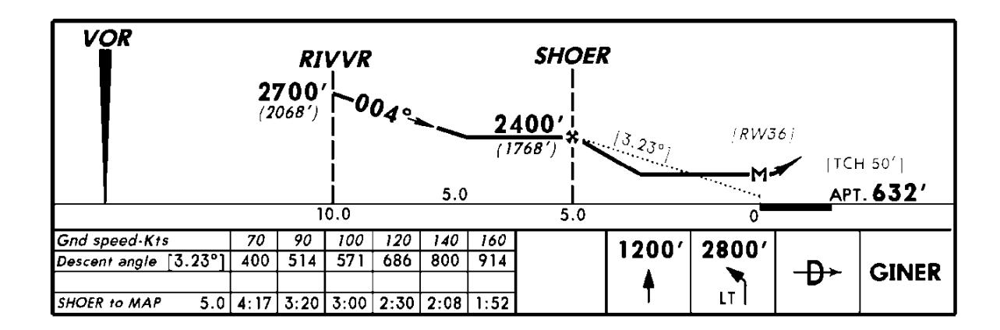

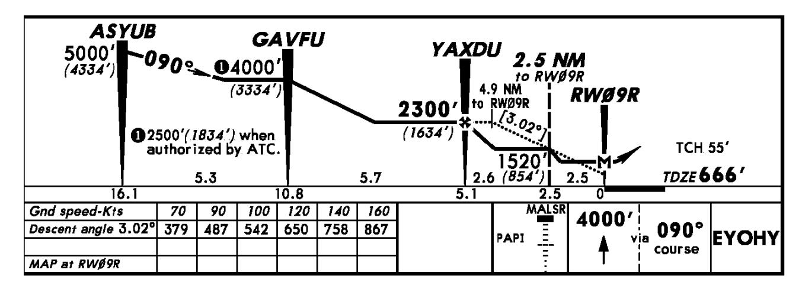

The descent angle accuracy may be affected by temperature. When the outside air temperature is lower than standard, the actual descent angle will be lower. Check your avionics equipment manuals since some compensate for nonstandard temperatures.

#### **AERONAUTICAL INFORMATION NAVDATA DATABASE AND CHARTS**

#### 9. APPROACH PROCEDURES (PROFILE) (Cont)

#### **DATABASE IDENTIFIERS**

For approach charts where the descent angle is published, all database identifiers from the Final Approach Fix (FAF) to the missed approach termination point are charted in both the plan and profile views. When an FAF is not specified, the NavData database Sensor Final Approach Fix (FAF) is included in the database and is charted.

#### FINAL APPROACH CAPTURE FIX (FACF)

Databases include (when no suitable fix is specified in source) a FACF for localizer based approaches and those based on VOR DME, VORTAC, or NDB and DME. In most cases, it is the fix identified as the intermediate fix. The FACF is charted only when specified by the State.

#### **GPS/GNSS SENSOR FAF**

The Jeppesen NavData database includes a sensor final approach fix when the approach was not originally designed with an FAF, and they are charted on "GPS/GNSS type" approaches.

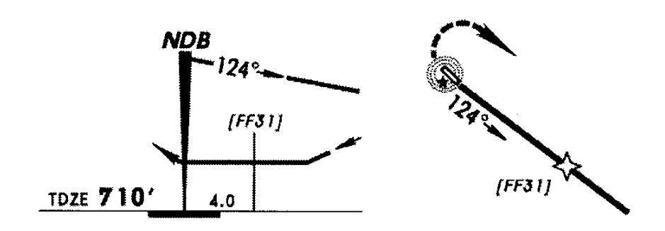

#### FINAL APPROACH FIX (FAF), ILS and LOCALIZER APPROACHES

There may be several types of fixes charted at the same FAF location - locator, waypoint, intersection, DME fix, OM, or perhaps an NDB instead of a locator. Since many airborne navigation systems with databases don't store locators and NDBs as navaids, a four- or five-character identifier will be used for the FAF on ILS and localizer approaches. The four- or five-character identifier assigned to the FAF location is contained in the waypoint file of the Jeppesen NavData database.

If there is a named intersection or waypoint on the centerline of the localizer at the FAF, the name of the fix will be used for the FAF location.

The FAF must be on the localizer centerline or the avionics system will fly a course that is not straight. Frequently, OMs and LOMs are not positioned exactly on the localizer centerline, and a database fix is created to put the aircraft on a straight course.

When the LOM is on the centerline and there also is a named intersection or waypoint on the centerline, the name of the intersection or waypoint will be used for the FAF. For CHUPP LOM/Intersection, the database identifier is "CHUPP" because there is an intersection or waypoint on the centerline of the localizer at the FAF.

#### **AERONAUTICAL INFORMATION NAVDATA DATABASE AND CHARTS**

#### **9. APPROACH PROCEDURES (PROFILE) (Cont) FINAL APPROACH FIX (FAF), ILS and LOCALIZER APPROACHES (Cont)**

When the ILS or localizer procedure is being flown from the database, the four- or five-character name or identifier such as CHUPP, FF04, or FF04R, etc. will be displayed as the FAF.

22 JUN 01

If the LOM is not on the localizer centerline, an identifier such as FF04L may be the identifier for the computed "on centerline" final approach fix for runway 04L. If there is only an outer marker at the FAF, the FAF identifier may be OM04L.

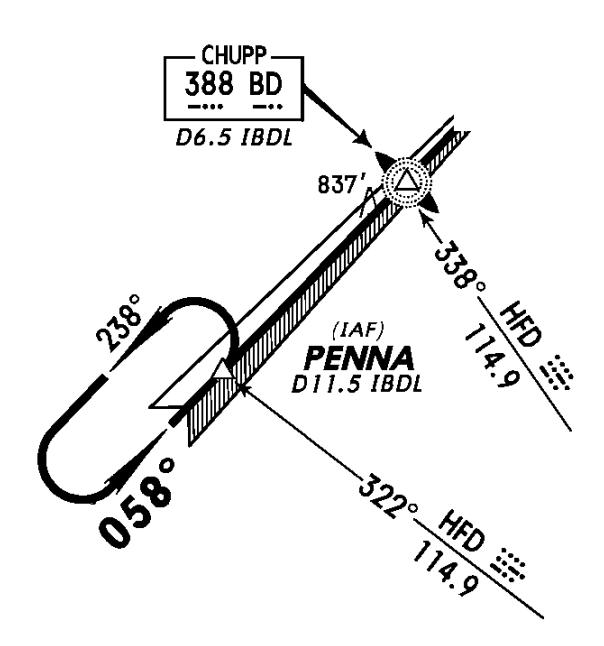

When there is no intersection or waypoint at the FAF such as at the MONRY LOM, the database identifier will be

"OM09" if the LOM is on the centerline, and

"FF09" if the LOM is not on the centerline.

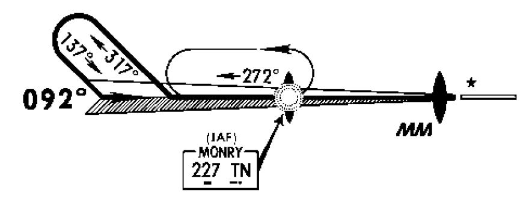

In some systems, to access the locator on most ILS and localizer approaches, the Morse code identifier can be used.

In the United States, virtually all locators have a five-letter unique name/identifier so the location can usually be accessed in some systems by the navaid Morse code identifier or the fiveletter name. In some systems, the locator is accessed by the name or by adding the letters "NB" to the Morse code identifier.

22 JUN 01

#### **Nav2001**

#### **AERONAUTICAL INFORMATION NAVDATA DATABASE AND CHARTS**

#### **9. APPROACH PROCEDURES (PROFILE) (Cont)**

#### **NAMED and UN-NAMED STEPDOWN FIXES, FINAL APPROACH FIX (FAF) to MISSED APPROACH POINT (MAP)**

Named and un-named stepdown fixes between the FAF and MAP are currently not included in the databases, but will be added in the future. They are often DME fixes, and in those cases, can be identified by DME. The distance to go to the MAP may be labeled on some GPS/GNSS type charts and VOR DME RNAV charts. Proper identification of these displayed fixes is necessary to clear all stepdown fix crossing altitudes.

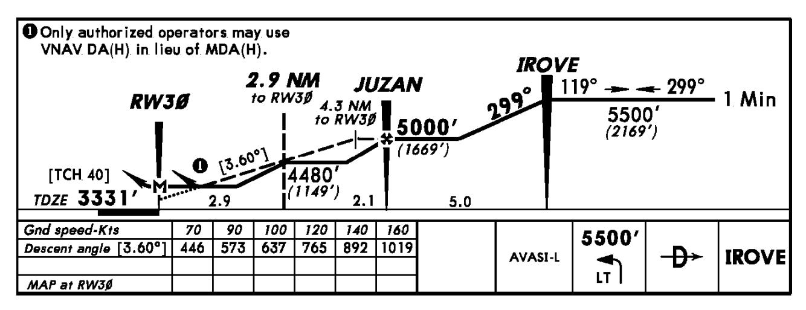

#### **ILS AND RUNWAY ALIGNMENT**

Differences in government specified values for localizer and airport variation may cause apparent non-alignment of the localizer and the runway. These differences are gradually being resolved, and whenever possible the airport variation is used for the localizer variation.

#### **10. APPROACH PROCEDURES (MISSED APPROACH)**

#### **MISSED APPROACH POINT (MAP)**

For non-precision approaches, when the MAP is other than a navaid, there will be a database MAP waypoint with a unique identifier. If the MAP is a waypoint and is at or within 0.14 NM of the threshold the MAP identifier will be the runway number, as "RW04" for Rwy 4 threshold. If the MAP is not at the runway, there will either be an official name for the MAP, or an identifier is provided. GPS/GNSS type approaches, and charts with descent angles, include the database identifier of the MAP.

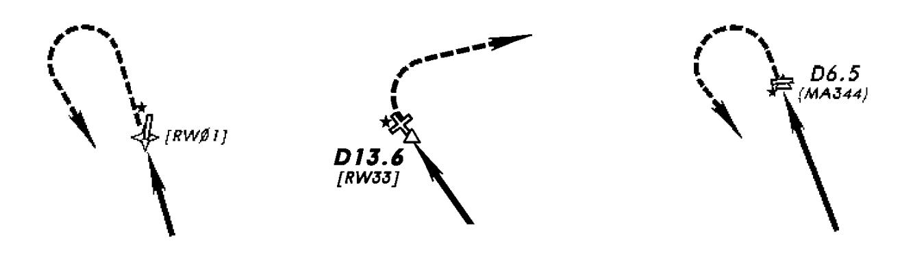

#### **Nav2001 AERONAUTICAL INFORMATION NAVDATA DATABASE AND CHARTS**

#### **10. APPROACH PROCEDURES (MISSED APPROACH) (Cont)**

#### **400-FOOT CLIMBS**

22 JUN 01

The database includes a climb to 400 feet above the airport prior to turning on a missed approach. This climb is not part of the official procedure, but does comply with State regulations and policies. This specific climb to 400 feet is not included on charts. The missed approach text supplied by the State authority is charted.

#### **MISSED APPROACH PROCEDURE**

The routes/paths that comprise a missed approach are not always displayed in some avionics systems that use databases. Additionally, some avionics systems that include missed approach procedures don't always implement a full set of path terminators so many legs will not be included in the airborne database. **Refer to the charted missed approach procedure when executing a missed approach.**

#### **11. ROUTES ON CHARTS BUT NOT IN DATABASES**

The routes in approach procedures, SIDs (DPs), and STARs are coded into the database using computer codes called path terminators which are defined in the ARINC 424 Navigation Database Specification. A path terminator 1) Defines the path through the air, and 2) Defines the way the leg (or route) is terminated. Not all avionics systems have implemented the full set of path terminators specified in the ARINC 424 document.

Because of the incomplete set of path terminators in some avionics systems, pilots need to ensure their avionics systems will take them on the routes depicted on the charts. If the avionics systems don't have all the routes, or don't have the means to display them, it is the pilot's responsibility to fly the routes depicted on the charts.

#### **FINAL COCKPIT AUTHORITY, CHARTS OR DATABASE**

There are differences between information displayed on your airborne avionics navigation system and the information shown on Jeppesen charts. The charts, supplemented by NOT-AMs, are the final authority.

#### **AERONAUTICAL INFORMATION NAVDATA DATABASE AND CHARTS**

#### **GLOSSARY/ABBREVIATIONS**

**AIRAC -** Aeronautical Information Regulation and Control. Designates the revision cycle specified by ICAO, normally 28 days.

**ARINC -** Aeronautical Radio, Inc

**ATD -** Along Track Distance, as "3 NM to RW24".

**ATS Route -** Officially designated route. No designator assigned.

**CNF -** Computer Navigation Fix

**DATABASE IDENTIFIER -** Avionics system use only, not for flight plans or ATC communications. Identifies a waypoint or fix.

**DP -** Departure Procedure

**FAA -** Federal Aviation Administration

**FACF -** Final Approach Capture Fix. Database includes (usually as an intermediate fix) when no suitable fix is specified in source.

**FAF -** Final Approach Fix

**FLY-BY FIX -** Waypoint allows use of turn anticipation to avoid overshoot of the next flight segment.

**FLY-OVER FIX -** Waypoint precludes any turn until the fix is over flown and is followed by an intercept maneuver of the next flight segment.

**FMS -** Flight Management System

**GNSS -** Global Navigation Satellite System

**GPS -** Global Positioning System

**GPS/GNSS SENSOR FAF -** Database fix that changes sensitivity of the Course Deviation Indicator (CDI) on final approach.

**GPS/GNSS TYPE APPROACHES -** Any approach that can be flown with GPS/GNSS as the only source of navigation.

**ICAO -** International Civil Aviation Organization

**IAF -** Initial Approach Fix

**IF -** Intermediate Approach Fix

#### **Nav2001 AERONAUTICAL INFORMATION NAVDATA DATABASE AND CHARTS**

#### **GLOSSARY/ABBREVIATIONS (Cont)**

**LOM -** Locator Outer Marker

22 JUN 01

**MAP -** Missed Approach Point

**MAA -** Maximum Authorized Altitude

**MCA -** Minimum Crossing Altitude

**MOCA -** Minimum Obstacle Crossing Altitude

**MORA -** Minimum Off-Route Altitude

**MRA -** Minimum Reception Altitude

**NavData -** Jeppesen Navigation Data

**OBSTACLE DEPARTURE -** An instrument departure procedure established to avoid obstacles.

**PANS OPS -** Procedures for Air Navigation Services - Aircraft Operations (ICAO)

**QFE -** Height above airport or runway, local station pressure.

**QNH -** Altitude above MSL, local station pressure

**SENSOR FINAL APPROACH FIX (FF) -** Included in database and on charts when no FAF is specified for the approach.

**SID -** Standard Instrument Departure

**STAR -** Standard Terminal Arrival Procedure

**TERPs -** United States Standard for Terminal Instrument Procedures

**VNAV -** Vertical Navigation

**VERTICAL DESCENT ANGLE -** May be established by Jeppesen or specified by the State (country). Charted on Jeppesen approach charts along with database identifiers and rates of descent

**WGS-84 -** World Geodetic System of 1984

**END**

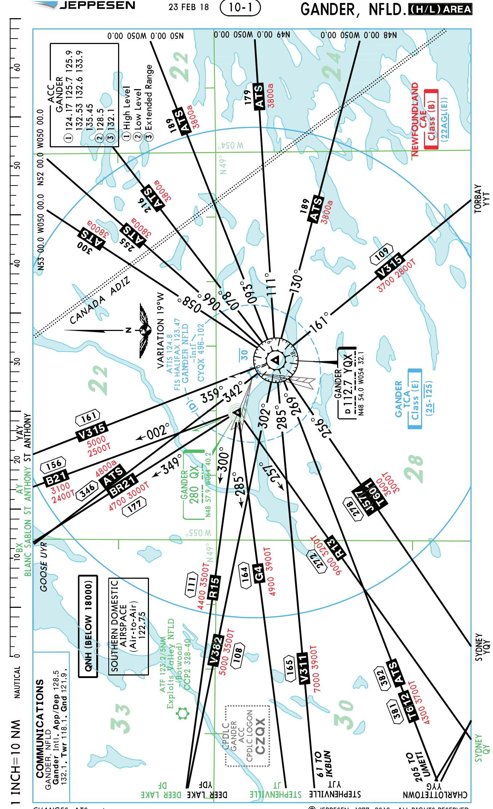

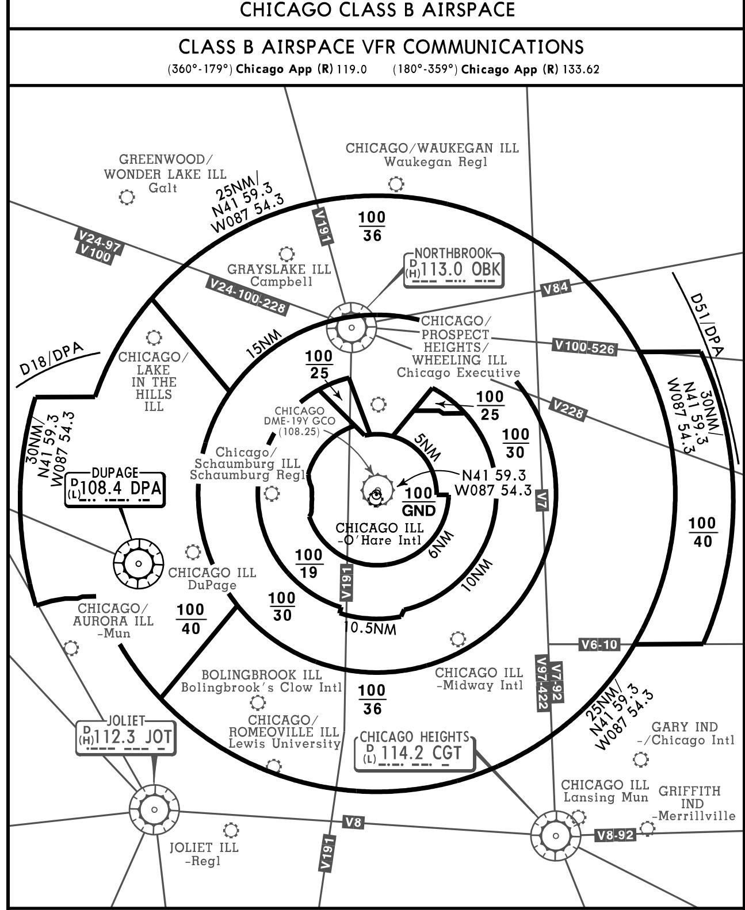

FOR OPERATING RULES AND PILOT AND EQUIPMENT REQUIREMENTS
SEE FAR 91.131, 91.117 AND 91.215

#### FLIGHT PROCEDURES

IFR Flights-Aircraft operating within the Class B airspace are required to operate in accordance with current IFR procedures.

VFR Flights-

- a. Arriving aircraft should contact Chicago Approach Control on the specified frequencies. Although arriving aircraft may be operating beneath the floor of the Class B airspace on initial contact, communications should be established with Approach Control for sequencing and spacing purposes.
- b. Aircraft departing Chicago O'Hare Intl are requested to advise the ground controller the intended altitude and route of flight to depart the Class B airspace. Aircraft departing from other than the primary airports whose route of flight would penetrate the Class B Airspace should give this information to ATC on the appropriate frequencies.
- c. Aircraft desiring to transit the Class B Airspace must obtain an ATC clearance to enter the Class B Airspace and will be handled on a ATC workload permitting basis.

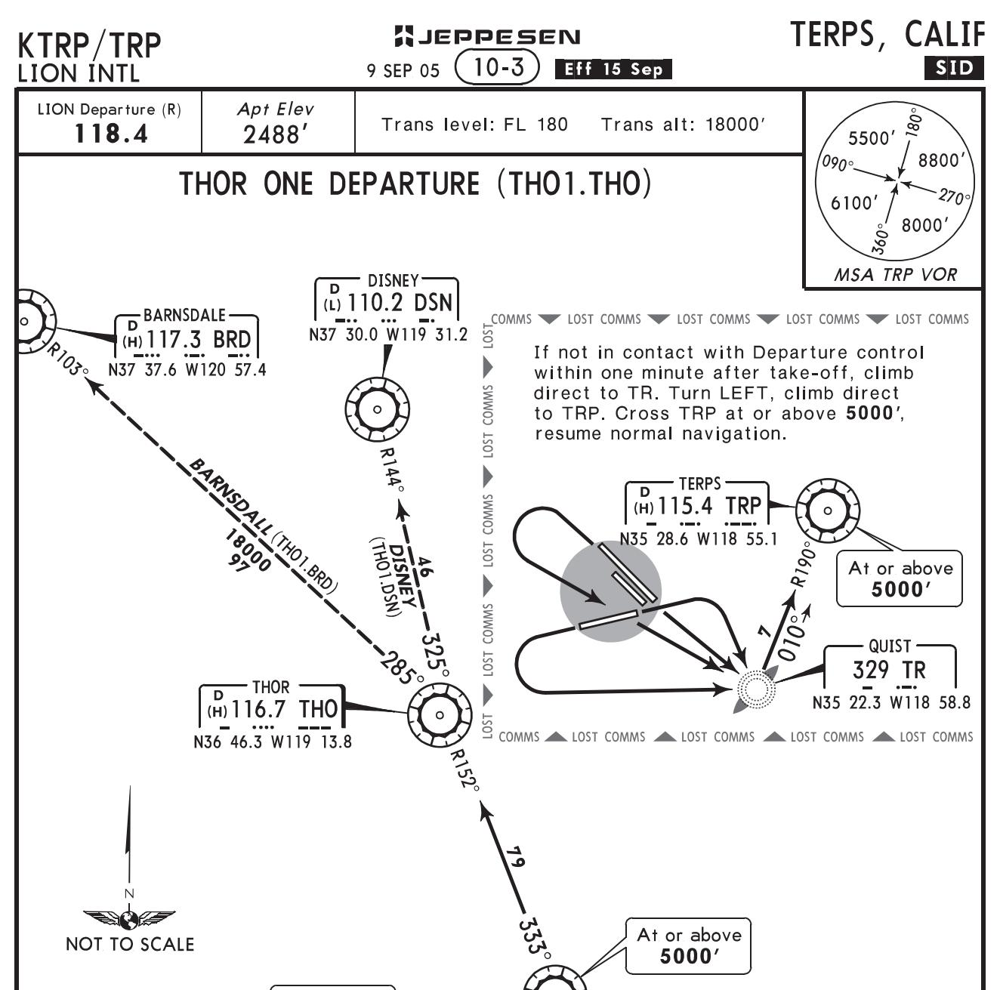

At or above 3500'

At 3000'

At 3000'

At 3000'

At 3000'

At 3000'

At 3000'

At 3000'

At 3000'

This SID requires a minimum climb gradient of 260' per NM to 5000'.

Direct distance from Lion Intl to: TRP **8 NM** 

| Gnd speed-KT | 75  | 100 | 150 | 200 | 250  | 300  |
|--------------|-----|-----|-----|-----|------|------|
| 260' per NM  | 325 | 433 | 650 | 867 | 1083 | 1300 |

| RWY   | INITIAL CLIMB                                                                                           |
|-------|---------------------------------------------------------------------------------------------------------|
| 6     | Climb on runway heading, at <b>3000</b> ' turn RIGHT to a 120° heading for vector to TRP R-170.         |
| 12L/R | Climb on runway heading for vector to TRP R-170.                                                        |
| 24    | Climb on runway heading for vector to TRP R-170.                                                        |
| 30L/R | Climb on runway heading, at or above <b>3500</b> ' turn LEFT to a 220° heading for vector to TRP R-170. |

#### ROUTING

Via TRP R-170 to TRP, then via TRP R-333 and THO R-152 to THO. Then via transition or assigned route.

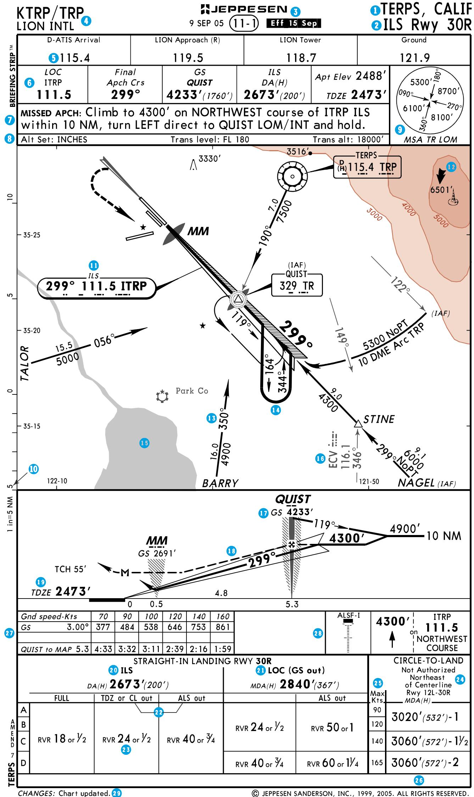

TERPS, CALIF **XJEPPESEN** KTRP/TRP 12-1) Eff 15 Sep RNAV (GPS) Rwy 30R 9 SEP 05 LION INTL D-ATIS Arrival LION Approach (R) LION Tower Ground 119.5 115.4 118.7 121.9 (CONDITIONAL) DA(H) WAAS Final Minimum Alt Apt Elev 2488' 5500' 🖗 Apch Crs Ch 21500 **BAYSR** 309° 4100′(1627′) W-16A **2723'**(250') TDZE **2473 ∤**8800 ′090° MISSED APCH: Climb to 4100' then climbing LEFT turn to 4600' 6100' <u>direct LAKER.</u> Alt Set: INCHES Trans level: FL 180
1. GPS or RNP-0.3 required. 2. DME/DME RNP-0.3 not authorized. Trans alt: 18000 MSA SURFR - 35-30 3516' √3330, 10 **SURFR** WAAS. **BAYSR** Ch 21500 W-16A - 35-20 LAKER Park Co **PARKS** 122-10 122-00 121-50 **LAKER** 1 LNAV only 1 in=5 NM **BAYSR** 4600' **SURFR** 1.2 NM to SURFR 4100 TCH 56' TDZE **2473**′ ≠0.7 0.5 5.0 3.8 10.0 Gnd speed-Kts 90 100 120 140 160 4100' 4600' Glide Path Angle 3.00° 743 <del>-D</del>≻ **LAKER** LT MAP to SURFR STRAIGHT-IN LANDING 30R CIRCLE-TO-LAND **LPV** LNAV/VNAV **LNAV** Not Authorized Northeast of MDA(H) 2880'(407') DA(H) **2723'**(250') DA(H) **3023'**(550') Centerline Rwy 12L-30R **2880**′(*392*′)-1 В 120 2940′(452′)-1 2 RVR 40 or 3/4 RVR 60 or 11/4 RVR 50 or 1 RVR 24 or  $\frac{1}{2}$ 140 3040′(552′)-2 D

CHANGES: Chart updated.

TERPS, CALIF **NEPPESEN** KTRP/TRP Eff 15 Sep VOR or GPS Rwy 24 9 SEP 05 LION INTL Ground 121.9 LION Approach (R) 119.5 D-ATIS Arrival LION Tower 115.4 118.7 SRIEFING STRIP TM VOR Final Minimum Alt MDA(H) Apt Elev 2488 5500' Las 6100', TRP **VOR** (CONDITIONAL) Apch Crs 234° 115.4 5100'(2640') 2940'(480') **TDZE 2460** % 8000° MISSED APCH: Climb to 5500' then direct TRP VOR and hold. Alt Set: INCHES Trans level: FL 180 Trans alt: 18000 MSA TRP VOR (IAF) [D333J] 10 D10.0 [D054J] △ 30 5100 3377 - 35-30 3516 \_\_\_\_\_\_\_\_\_\_\_\_\_\_\_\_\_\_\_\_\_\_\_\_\_\_\_\_\_\_\_\_\_\_\_\_\_ LAGOON VOR 054° 6501' 068° (IAF) 27.4TERPS 6000 (H) 115.4 TRP D4.0 3.9 NM to MAP **D7.9** [RW24] 6500 28 30 TALOR (IAF) [D127J] 35-20 122-00 **VOGT VOR** 121-50 VOR 1 in=5 NM D4.0 0540 <u>5500'</u>10 NM D7.9 D6.3 234° \* 5100′ 3040' TDZE 2460' 1.6 2.3 4.0 7.9 Gnd speed-Kts 90 100 120 140 160 5500′ REIL **TRP** Ð≻ MAP at D7.9 or VASI 115.4 7.9 6:46 5:16 4:44 3:57 3:23 2:58 VOR to MAP STRAIGHT-IN LANDING RWY 24 CIRCLE-TO-LAND Not. Authorized Northeast of MDA(H) **2940'** (480') MDA(H) **3040'**(580') Centerline Rwy 12L-30R With D4.0 Without D4.0 Max MDA(H) 90 3040′(552′) - 1 1 1 В 120 AM END C 11/4 3060′(*572′*) - 1½  $1\frac{1}{2}$ 140 D 1 3/4 3060′(572′) -2  $1\frac{1}{2}$ 165 **TERPS** 

TERPS, CALIF RADAR-1

LION INTL

ASR Rwys 6, 12L, 24, 30R

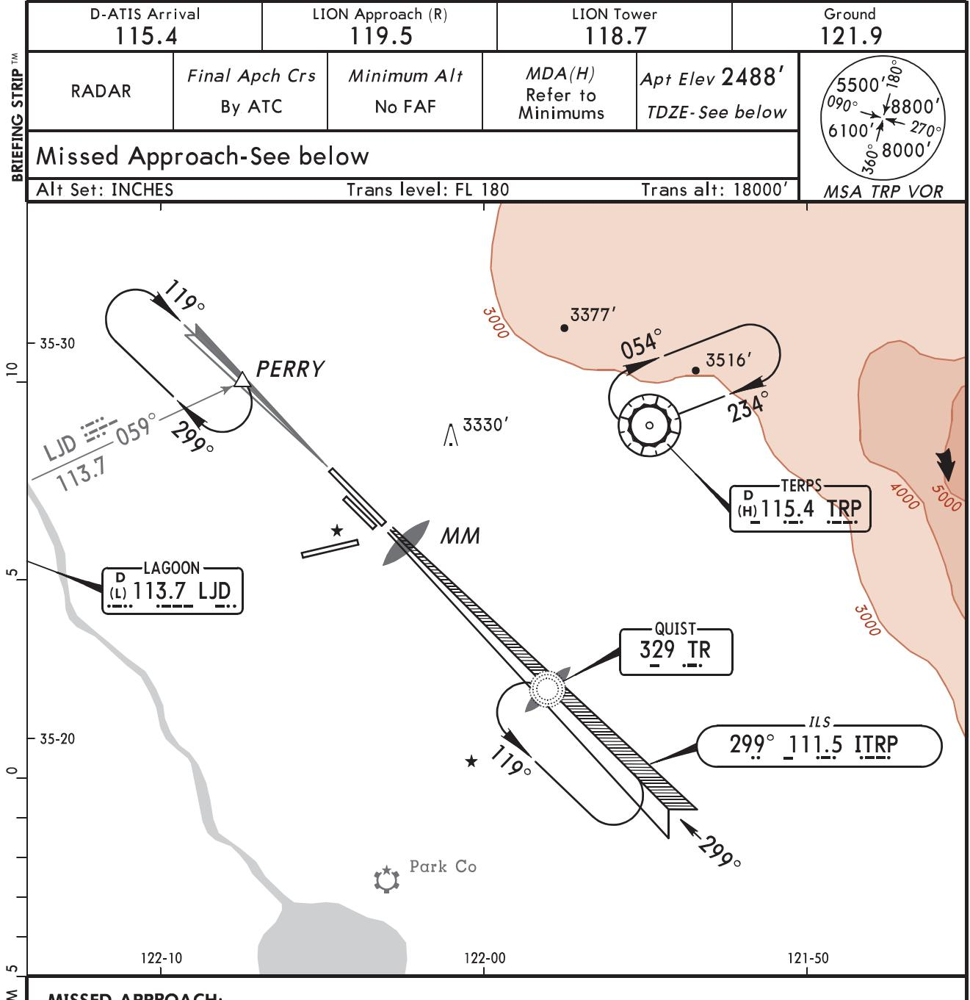

MISSED APPROACH:

Runway 6: Climb to 5500' direct TRP VOR and hold.

Runway 12L: Climb to 5000' direct TR LOM and hold.

Runway 24: Climbing RIGHT turn to 6000' to LJD VOR inbound via R-059.

Runway 30R: Climb to 5000' on NORTHWEST course ITRP LOC to PERRY INT and hold.

| RWY 6               | RWY 12L            | RWY 24             | RWY 30R            |  |  |  |
|---------------------|--------------------|--------------------|--------------------|--|--|--|
| TDZE <b>2441</b> ′  | TDZE <b>2488</b> ' | TDZE <b>2460</b> ' | TDZE <b>2473</b> ' |  |  |  |
| STRAIGHT-IN LANDING |                    |                    |                    |  |  |  |

|              | STRAIGHT-IN LANDING |                            |                               |                               |                              |                    |           | CIRCLE-TO-LAND                                  |
|--------------|---------------------|----------------------------|-------------------------------|-------------------------------|------------------------------|--------------------|-----------|-------------------------------------------------|
|              |                     | ASR 6                      | ASR 12L                       | ASR 24                        | ASR :                        | 30R                |           | Not Authorized Northeast                     |
|              |                     | мDA(H) <b>2820′</b> (379′) | <b>2940′</b> (452′)           | MDA(H) <b>2940'</b> (480') | мDA(H) <b>28</b> 6           |                    | Max       | of Centerline Rwy 12L-30R                    |
|              | Щ.                  | RAIL out  ALS out          |                               |                               |                              | ALS out            | Kts.      | MDA(H)                                          |
| A M E  | A B              | 1                          | r∨r 50 or 1                   | 1                             | R∨R <b>24</b> or ½        | R∨R <b>5</b> 0     | 90 120 | 3020′(532′) - 1                                 |
| N D 15 | С                   |                            | RVR <b>60</b> or <b>1</b> 1/4 | 1 1/4                         | or / 2                       | or I               | 140       | 3060 <i>′</i> ( <i>572′</i> )- 11/ 2 |
| :RPS         | _                   | 1 1/4                      | 11/2                          | 1 1/2                         | R∨R <b>50</b> or <b>1</b> | RVR 60 or 1 1/4 | 165       | 3060′(572′)-2                                   |
| œ            |                     |                            |                               |                               |                              |                    |           |                                                 |

ZURICH, SWITZERLAND JEPPESEN LSZH/ZRH ILS or LOC Rwy 14 9 NOV 18 (11-1) ZURICH ZURICH Tower D-ATIS Arrival ZURICH Arrival (APP/R) ZURICH Final (APP/R) by ATC 118.005 125.730 135.230 118.1 120.230 121.905 125.330 ILS LOC GS Apt Elev 1417' RA 187' DA(H) STRIP Apch Crs **D4.0 IKL** IKL 170 135° 111.75 **2670′**(1268′) 1602 (200') Rwy 1402' 5700 4500 100° MISSED APCH: Initial climb clearance 4000'. Climb STRAIGHT AHEAD. At 4500 D5.1 IKL past the station, turn LEFT (MAX 210 KT) onto 360° to intercept 9200 R-232 ZUE inbound. At D7.8 ZUE continue climb to 7000'. Proceed to ZUE ค VOR. Cross ZUE VOR at MIM 6000' and intercept R-095 ZUE to AMIKI. MSA KLO VOR Rwy Elev: 50 hPa Trans level: By ATC Alt Set: hPa Trans alt: 7000 47-50 Acft type must be MISSED APCH FIX RILAX 2 5900 within 17 NM reported at first ZURICH EAST MAX 230 KT 3212 D 110.05 ZUE MAX FL 240 radio contact. 2770' MHA 7000 MAX FL 240 D15.5 TRA 3207 20 7000 EDUMI 04.4 TRA 7000' AMIKI D9.0 ZUE 275 3 Arrival only 2081 TRASADINGEN-114.3 TRA 2402 15 2000 0 5000' ZURICH EAST 5.6 ZH701 D10.0 TRA (IF) 110.05 ZUE 2000 47-40 2304' D12.9 JKL 6000 **3**7000 2560'2000 \1590' 2228 ILS DME D10.0 PRIAND GÌPÓL /13/1.75 AKI OSNEM D8.2 IKL 4000 D32.0/ R-259 ZUE 9.0 054.9 7000 2000 078 2214 2000 1.1 2282 68 1992 2000 2000 **D7.8 ZUE** D4.0 IKL 2218′ 258 2268 2235 At or below 2000 2179' MHA 7000 2000 4000 2000 D1.4 2012 MAX FL 240 MAX 230 KT 2960'/ IKL P114.85 KLO 2012' NOT TO SCALE 1963 2212' CAUTION: 2094 Do not mistake 2507D5 3051' 2073 08-20 2000 2000 for ZURICH. Λ (A) 2609 Dubendorf ĬKĹ 3000 08-30 08-10 08-50 LOC IKL DME 8.0 7.0 6.0 5.0 4.0 3.0 2.0 (GS out) ALTITUDE 3940 3620 3300 2990 2670 2350 2030 in=7.5 NM **D4.0** IKL 4000' 1350 GS 2670 **D1.4** IKL LOC 2670 **OSNEM** D8.2\_IKL M TCH 53' 2490' DA 4.2 2.6 Rwy 1402'  $-1.\overline{2}$ Gnd speed-Kts 70 100 120 HIALS-II 90 140 160 D5.1 ILS GS or IKL 478 372 531 637 743 849 LOC Descent Angle 3.00° MAP at D1.4 IKL Standard STRAIGHT-IN LANDING RWY 14 **ILS** RA 187' LOC (GS out) **CDFA** DA(H) 1602'(200' DA/MDA(H) 1950'(548') ALS out FULL TDZ or CL out ALS out RVR1500m В RVR 550m RVR 550m 1 OPS RVR1200m С RVR 1800m RVR 2400m **PANS** D ■ W/o HUD/AP/FD: RVR 750m

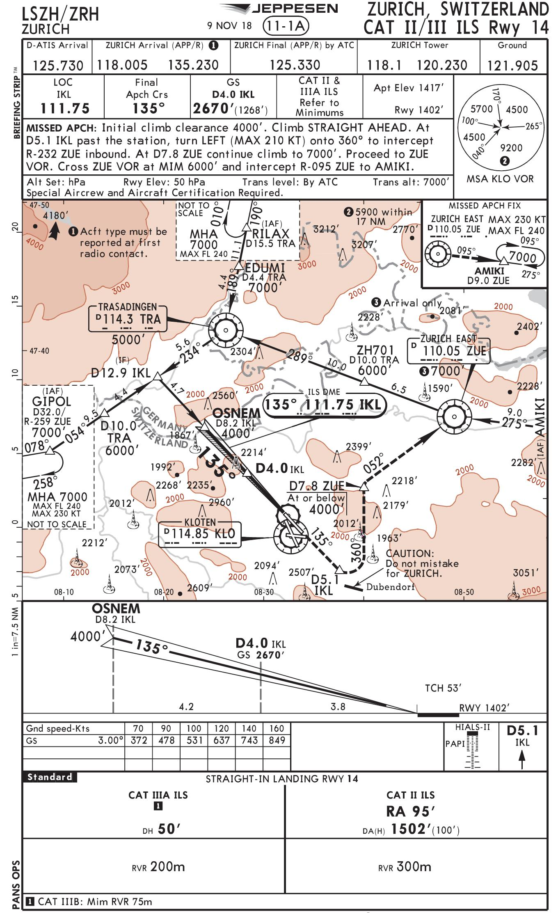

#### 9 SEP 05

#### **MALERPESEN**

#### APPROACH CHARTS

- 1 Charts indexed alphabetically by city name within each state
- 2 Approach procedure identification
- 3 Effective date
- 4 Airport identifier and airport name
- 5 Arrival communication frequencies in order of use
- 6 Approach briefing information, including navaid, Final Approach Course, FAF altitude, lowest DA or MDA, and Airport Elevation
- Missed Approach instructions
- 8 Approach procedure notes
- Minimums safe altitudes (MSA)
- Entire plan view drawn to scale
- Primary approach navaid
- 11 Highest reference point within the plan view shown with arrow
- Approach transistions
- 14 Procedure turn fully depicted
- 15 Rivers and water body features
- 16 Intersection formation including navaid morse code identifier
- Glide slope altitude
- 18 Nonprecision profile track
- 19 Touchdown zone elevation (TDZE)
- Decision altitude (DA) and height above touchdown
- Localizer (Glide Slope Out) minimums
- Columns for inoperative component conditions
- Visibilities in runway visual range (RVR) and/or miles
- 24 Circle-to-land minimums
- 25 Maximum speeds for circling maneuvers
- Circling MDA with height above airport and visibilities
- Missed approach time table / rate of descent on glide slope
- Missed approach ICONs, provides approach lighting and initial instructions
- 29 Changes made to the chart since the last issue.
- 30 Database identifiers

#### 9 SEP 05

# AIRPORT CHART

- 31 Airport identifier
- 32 Coordinates of the airport reference point (ARP)
- 33 Departure communications frequencies in order of use
- 34 VOT frequency
- 35 Magnetic variation at the airport
- 36 Airport notes including right traffic pattern information
- 37 Latitude/longitude grid
- 38 Airport reference point (ARP) location
- 39 Runway threshold elevations
- 40 Taxiway designators
- 41 Arresting gear
- 42 Airport diagram scale
- 43 Runway lighting
- UNASI threshold crossing height (TCH) shown for low threshold crossing heights
- 45 Runway grooving
- 46 Distance beyond displaced threshold
- 47 Runway restrictions
- 48 Take-off minimums
- 49 Alternate minimums
- 50 Obstacle departure procedures

## AIRPORT QUALIFICATION and FAMILIARIZATION SERVICE

51 Chart meet FAR 121.445 crew qualification

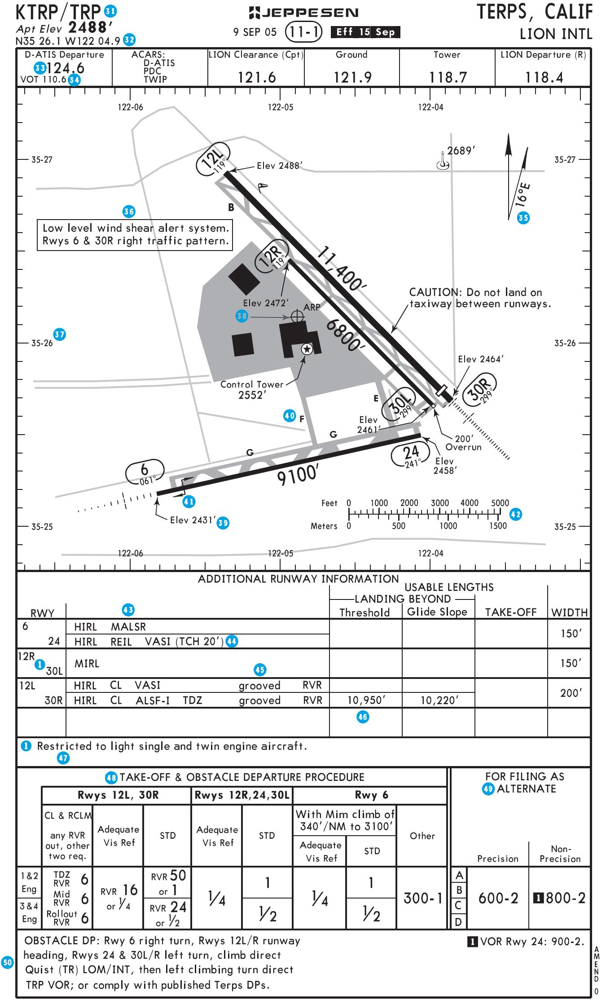

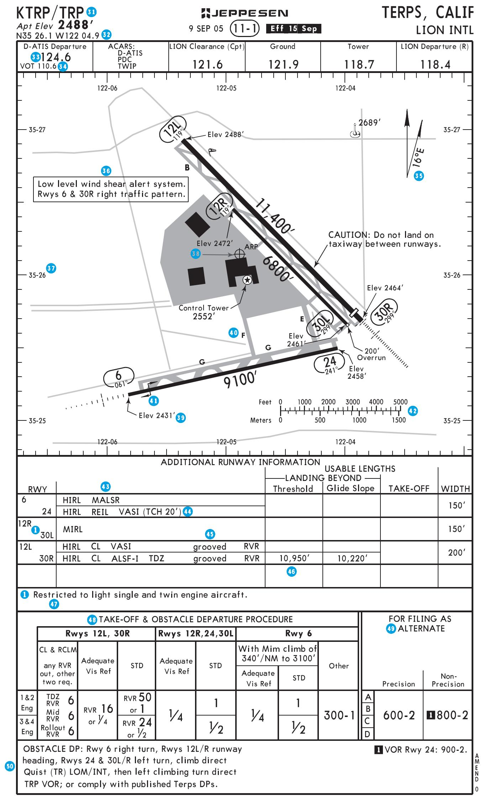

#### LESS THAN RVR 1200 TO 600

For Low Visibility Procedures See 10-9G

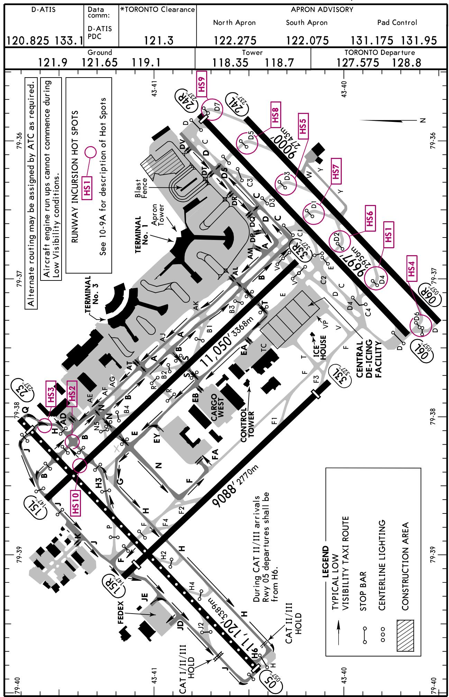

TORONTO, ONT LOW VISIBILITY TAXI CHART RWY 06L. DEPART RWY 06L

© JEPPESEN, 2006, 2019. ALL RIGHTS RESERVED.

LAND RWY 06L, DEPART RWY 06L LESS THAN RVR TO 600 1200 For Low Visibility Procedures See 10-9G D-ATIS TORONTO Clearance APRON ADVISORY Data comm: North Apron South Apron Pad Control D-ATIS PDC 120.825 133. 121.3 122.275 122.075 131.175 131.95 TORONTO Departure Ground 121.9 121.65 119.1 118.35 118.7 127.575 128.8 43-40 Alternate routing may be assigned by ATC as required Aircraft engine run ups cannot commence during Low Visibility conditions. beyond the alternating green and yellow centerline lights to ensure the aircraft is clear of the runway and the ILS sensitive area. Aircraft exiting at the end of Runway 06L on the centerline lighted Taxiway D must proceed HS6 TERMINAL No. 1 TERMINA CENTRAL DE-ICING FACILITY See 10-9A for description of Hot Spots VISIBILITY TAXI ROUTE CENTERLINE LIGHTING RUNWAY INCURSION HOT SPOTS CONSTRUCTION AREA TYPICAL LOW STOP BAR U1085.001 43-40

LAND RWY 06L, DEPART RWY 33R

# LESS THAN RVR TO 600 1200 For Low Visibility Procedures See 10-9G D-ATIS TORONTO Clearance APRON ADVISORY Data comm: North Apron South Apron Pad Control D-ATIS PDC 120.825 133. 121.3 122.275 122.075 131.175 131.95 TORONTO Departure Ground 121.9 121.65 119.1 118.35 118.7 127.575 128.8 43-40 Alternate routing may be assigned by ATC as required Aircraft engine run ups cannot commence during Low Visibility conditions. beyond the alternating green and yellow centerline lights to ensure the aircraft is clear of the runway and the ILS sensitive area. Aircraft exiting at the end of Runway 06L on the centerline lighted Taxiway D must proceed HS6 TERMINAL No. 1 TERMINA DE-ICING FACILITY CONTROL See 10-9A for description of Hot Spots VISIBILITY TAXI ROUTE CENTERLINE LIGHTING RUNWAY INCURSION HOT SPOTS CONSTRUCTION AREA TYPICAL LOW STOP BAR 000 1408 CC 101 1 1 9H 43-40

# PAJN/JNU JUNEAU INTL

7 SEP 18 (19-01)

#### AIRPORT QUALIFICATION

JUNEAU, ALASKA

- 1. Airport Qualification: Mountainous Terrain Apt El
- 2. Circling to Land Is Not Authorized North of the Runway
- 3. High Landing Minimums
- 4. Low-level Windshear Alert System (LLWAS)

Apt Elev 25'

7 NM Northwest Juneau

N58 21.3 W134 34.7

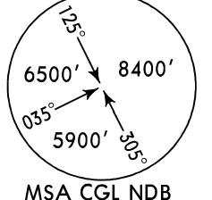

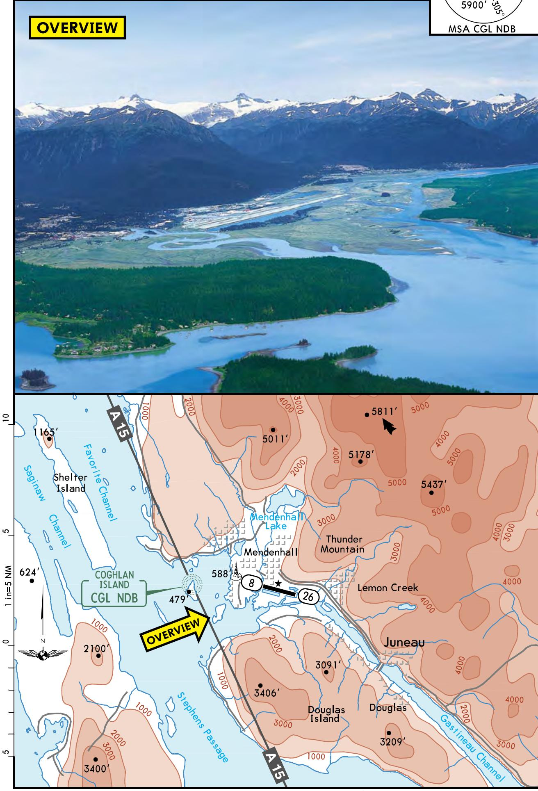

Public

#### AIRPORT QUALIFICATION

JUNEAU, ALASKA

Longest Rwy (LDA): Rwy 8/26 - 8457' (2578m) Time Conv (Std): UTC -9

# OVERVIEW

Juneau International Airport is located in the Panhandle of southeastern Alaska. The airport is in a low marshy basin at the north end of Gastineau Channel. Terrain sharply rises from this basin, within a half mile northeast of the airport. Douglas Island is across the channel to the south and terrain rises to 3406 feet MSL within 4 NM. In the northeast quadrant, terrain rises above 5000 feet MSL within 7 NM.

Caution: Expect extensive VFR traffic from May through September. Many aircraft are not transponder equipped and will note be displayed on TCAS.

Caution: Extensive helicopter activity occurs within 5 NM of the airport, and over Gastineau Channel from April 15th through October 1st.

Caution: Moderate to severe turbulence may occur in the immediate vicinity of the airport.

Wildlife and birds are present on and in the airport vicinity.

Paragliding exists in the vicinity of Thunder Mountain (3 NM to the north), and over Gastineau Channel near downtown. This activity occurs from April 15th through October 1st, at or below 6000 feet MSL.

#### **WEATHER**

Seasonal data represents average monthly values

#### Remarks:

Fog occurs throughout the year. In winter, strong northerly winds often approach 100 mph through the Gastineau Channel. This is normally associated with clear weather and occurs about twice a month, often for several days at a time.

|                     | Dec-Feb             | Mar-May            | Jun-Aug                             | Sep-Nov          |
|---------------------|---------------------|--------------------|-------------------------------------|------------------|
| • Precip Amount  | 4.2 in 107 mm    | 3.2 in 81 mm    | 4.1 in 104 mm                    | 6.8 in 173 mm |
| Snowfall            | 23.3 in 59 cm    | 6 in 15 cm      |                                     | 5 in 13 cm    |
| Other Precip     |                     |                    | <pre>&lt; 1 day Thunderstorms</pre> |                  |
| IMC                 | 12%                 | 4%                 | 2%                                  | 6%               |
| Prevailing Winds | ESE-13 kts          | ESE-12 kts         | 2 N-7 kts                           | ESE-13 kts       |
| Low Temp         | 21°F -6°C        | <b>32°F</b> 0°C | 47°F 8°C                         | 36°F 2°C      |
| High Temp        | <b>32</b> °F 0°C | 47°F 8°C        | 63°F 17°C                        | 47°F 8°C      |

- Annual precipitation totals 55.2 in (140 cm).
- 2 Winds are from the east-southeast in June.

# PAJN/JNU JUNEAU INTL

JUNEAU, ALASKA Rwy 8

- 1. Airport Qualification: Mountainous Terrain
- 2. Circling to Land Is Not Authorized North of the Runway
- 3. High Landing Minimums
- 4. Low-level Windshear Alert System (LLWAS)

Apt Elev 25'

7 NM Northwest Juneau

N58 21.3 W134 34.7

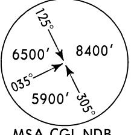

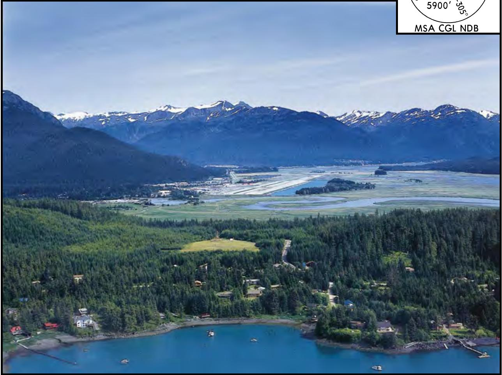

#### **RUNWAY 8**

This runway uses a right-hand traffic pattern.

Visual vertical guidance is provided by VASI  $(3.5^{\circ})$  on the left side of the runway. The VASI is offset  $13^{\circ}$  right of the centerline and is not visible on runway centerline. VASI is unusable beyond  $6^{\circ}$  left of the centerline.

A seaplane landing area parallels this runway immediately to the south.

This runway has a displaced threshold resulting in a usable landing length of 8457 feet (2578m). The last 400 feet (122m) is not available for landing distance computations.

The Obstacle Departure Procedure for this runway uses the JUNEAU Departure, and the lowest takeoff minimums require a minimum climb gradient. See JUNEAU Departure for details.

# PAJN/JNU JUNEAU INTL

7 SEP 18 (19-04)

JUNEAU, ALASKA RWY 26

- 1. Airport Qualification: Mountainous Terrain
- 2. Circling to Land Is Not Authorized North of the Runway
- 3. High Landing Minimums
- 4. Low-level Windshear Alert System (LLWAS)

Apt Elev 25'

7 NM Northwest Juneau

N58 21.3 W134 34.7

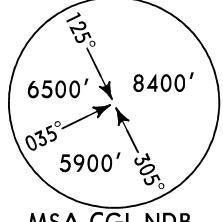

Note: The perspective presented by this picture does not represent what is seen during normal landing procedures.

#### **RUNWAY 26**

There are no straight-in instrument approach procedures to this runway.

Visual vertical guidance is provided by PAPI  $(3.5^{\circ})$  on the left side of the runway. The PAPI is usable only within 2 NM.

A seaplane landing area parallels this runway immediately to the south.

This runway has a displaced threshold resulting in a usable landing length of 8457 feet (2578m). The last 400 feet (122m) is not available for landing distance computations.

The Obstacle Departure Procedure for this runway uses the JUNEAU Departure, and the lowest takeoff minimums require a minimum climb gradient. See JUNEAU Departure for details.

These charts are for training purposes only and are not to be used for flight.

> AAMEDU 129